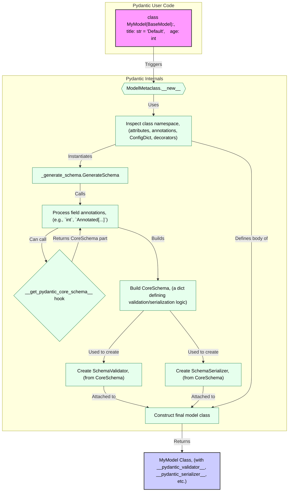
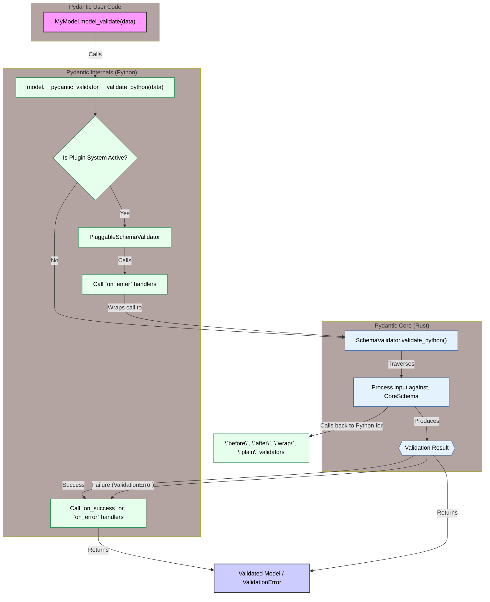
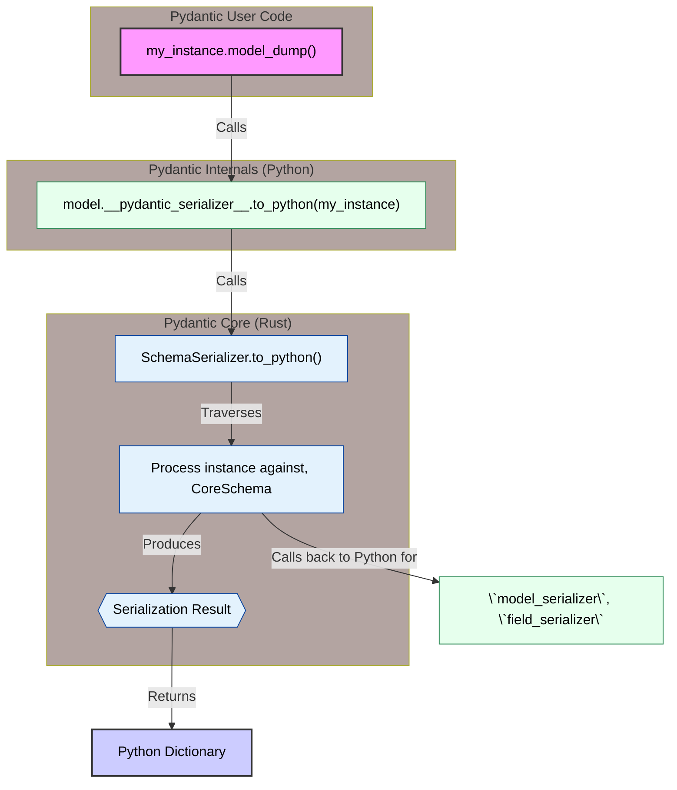
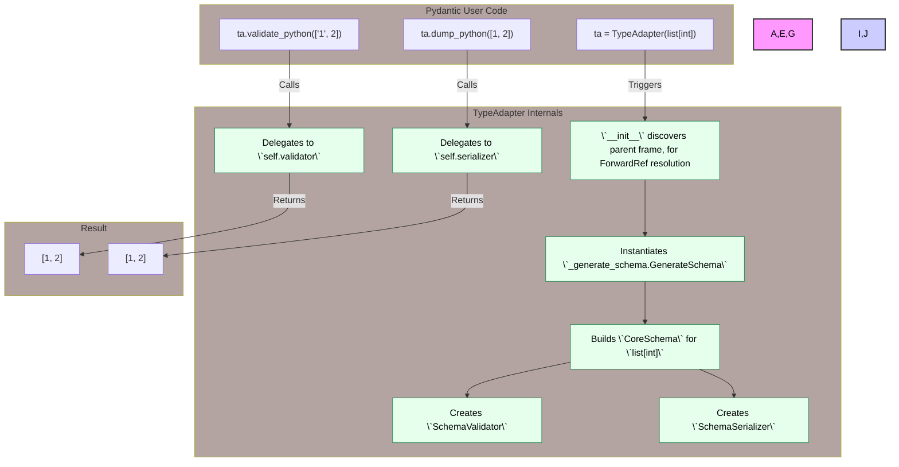
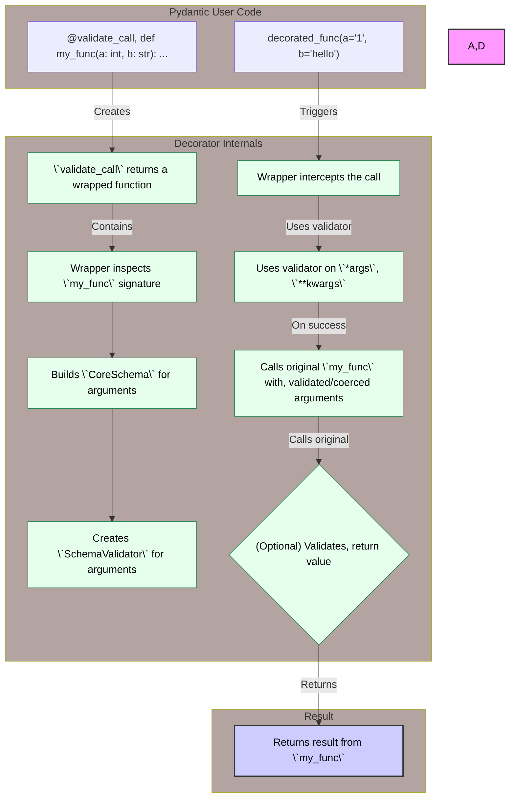
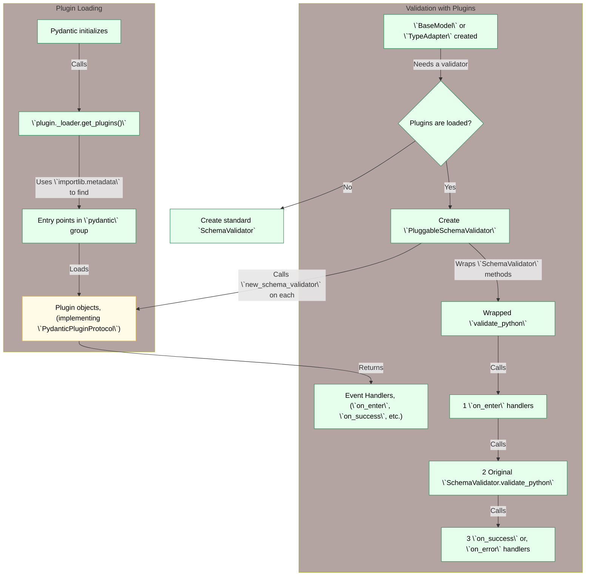

Here is a comprehensive set of technical diagrams depicting how Pydantic works internally, with accompanying notes.

### 1. `BaseModel` Creation Lifecycle

This diagram illustrates the process that occurs when a class inheriting from `BaseModel` is defined. The `ModelMetaclass` intercepts the class creation, inspects its definition, builds a `pydantic-core` schema, and attaches the necessary validation and serialization machinery to the final class.

**Notes:**

*   **`ModelMetaclass`**: This is the powerhouse behind `BaseModel`. When you define a class that inherits from `BaseModel`, its `__new__` method is executed.
*   **Namespace Inspection**: The metaclass scans the class definition for field annotations, default values, `ConfigDict`, and decorators like `@field_validator`.
*   **`GenerateSchema`**: This internal class is responsible for converting Python type annotations into a `pydantic-core` schema. It recursively processes types.
*   **`__get_pydantic_core_schema__`**: This is the primary hook for customizing schema generation. Pydantic calls this on types and annotations (like `Annotated[int, Gt(0)]`) to build up the final `CoreSchema`.
*   **`CoreSchema`**: This is a dictionary that declaratively defines all validation and serialization logic. It's the blueprint passed to `pydantic-core`.
*   **`SchemaValidator`/`SchemaSerializer`**: These are the workhorses from the `pydantic-core` Rust library. They are compiled from the `CoreSchema` and perform the actual high-performance validation and serialization. They get attached to the model class as `__pydantic_validator__` and `__pydantic_serializer__`.

---

### 2. Core Validation Workflow

This diagram shows the sequence of events when you validate data, for example by instantiating a model or calling `model_validate`. It highlights how `pydantic-core` is the engine and how functional validators are integrated.

**Notes:**

*   **Entry Point**: Validation starts with methods like `model_validate()` or `TypeAdapter.validate_python()`.
*   **`__pydantic_validator__`**: This attribute on the model holds the `SchemaValidator` instance.
*   **`PluggableSchemaValidator`**: If any plugins are registered, this wrapper is used to invoke plugin event handlers (`on_enter`, `on_success`, `on_error`) around the core validation logic.
*   **`SchemaValidator` (pydantic-core)**: The high-performance validation engine written in Rust. It takes the input data and the `CoreSchema` built during model creation.
*   **Callback Validators**: The `CoreSchema` can contain references to Python functions for custom logic (e.g., from `@field_validator`). `pydantic-core` calls back into the Python world to execute these functions at the appropriate step (`before`, `after`, etc.).
*   **Result**: The process returns a validated model instance on success or raises a `ValidationError` on failure.

---

### 3. Core Serialization Workflow

This diagram outlines how a model instance is converted into a dictionary, which is the basis for `model_dump()` and `model_dump_json()`.

**Notes:**

*   **Entry Point**: Serialization starts with `model_dump()` or `model_dump_json()`.
*   **`__pydantic_serializer__`**: This attribute holds the `SchemaSerializer` instance, created from the same `CoreSchema` as the validator.
*   **`SchemaSerializer` (pydantic-core)**: This Rust component traverses the model instance's attributes.
*   **Callback Serializers**: If `@field_serializer` or `@model_serializer` were used, the `CoreSchema` contains references to these functions. `pydantic-core` calls them to customize the output for specific fields or the entire model.
*   **Result**: The process returns a Python dictionary. `model_dump_json()` then serializes this dictionary to a JSON string.

---

### 4. Schema Generation Process

This diagram provides an overview of how Pydantic generates both its internal `CoreSchema` and the public-facing JSON Schema.

```mermaid
graph TD
    subgraph AA["Schema Generation Flow"]
        A["Type Annotation, (e.g., \`int\`, \`BaseModel\`, \`Annotated\`)"] -- "Processed by" --> B["_generate_schema.GenerateSchema"]
        B -- "Calls" --> C{"__get_pydantic_core_schema__ hook"}
        C -- "Returns parts of" --> D["CoreSchema, (internal representation)"]

        D -- "Used by" --> E["\`SchemaValidator\` &, \`SchemaSerializer\`"]

        D -- "Input for" --> F["json_schema.GenerateJsonSchema"]
        F -- "Traverses CoreSchema and calls" --> G["\`int_schema\`, \`model_schema\`, etc."]
        G -- "Can be customized by" --> H{"__get_pydantic_json_schema__ hook"}
        H -- "Returns parts of" --> I["JSON Schema, (public representation)"]
        I -- "Returned by" --> J["\`MyModel.model_json_schema()\`"]
    end

    %% Styling
    classDef internal fill:#e6ffed,stroke:#2E8B57,stroke-width:1px,color:#000
    class B,C,D,F,G,H,I internal
    classDef core fill:#e3f2fd,stroke:#0d47a1,stroke-width:1px,color:#000
    class E core
    classDef user fill:#fff0f0,stroke:#c0392b,stroke-width:1px,color:#000
    class A,J user
    style AA fill:#b3a4a1
```

**Notes:**

*   **Two Schemas**: Pydantic uses two distinct schema representations. The `CoreSchema` is an internal, detailed blueprint for `pydantic-core`. The JSON Schema is for external tools and documentation.
*   **CoreSchema First**: The `CoreSchema` is always generated first from the Python type annotations. This is the source of truth for validation and serialization.
*   **`__get_pydantic_core_schema__`**: This is the hook for types to define how they should be validated. Pydantic uses this to build the `CoreSchema`.
*   **JSON Schema Second**: The `GenerateJsonSchema` class takes a completed `CoreSchema` as input and translates it into a standard JSON Schema dictionary.
*   **`__get_pydantic_json_schema__`**: This hook allows for customization of the final JSON Schema output, acting as an override layer on top of the default translation logic.

---

### 5. `TypeAdapter` Workflow

The `TypeAdapter` is a tool for applying Pydantic's validation and serialization to arbitrary types, not just `BaseModel` subclasses. This diagram shows its initialization and usage.

**Notes:**

*   **Purpose**: `TypeAdapter` acts as a lightweight, single-type version of a `BaseModel`.
*   **Initialization**: When created, it performs the same schema generation process as a `BaseModel` but for a single, specified type. It determines its context to resolve forward references.
*   **Delegation**: Its `validate_python` and `dump_python` methods are thin wrappers that delegate directly to its internal `SchemaValidator` and `SchemaSerializer` instances.

---

### 6. `@validate_call` Decorator

This diagram explains how the `@validate_call` decorator works to add runtime type validation to function calls.

**Notes:**

*   **Decoration Time**: When the function is decorated, `@validate_call` creates a wrapper. This wrapper inspects the function's signature and builds a `CoreSchema` specifically for its arguments. A `SchemaValidator` is then created from this schema.
*   **Call Time**: When the decorated function is called, the wrapper intercepts the arguments.
*   **Validation**: It uses its internal `SchemaValidator` to validate and coerce the arguments. This is effectively like using a `TypeAdapter` on the function's signature.
*   **Execution**: If validation succeeds, the original function is called with the now-validated arguments.
*   **Return Validation**: If configured, the return value is also validated.

---

### 7. Plugin System

This diagram shows how third-party plugins can hook into Pydantic's validation lifecycle.

**Notes:**

*   **Discovery**: Plugins are discovered at runtime using Python's standard `entry_points` mechanism. Pydantic looks for plugins registered under the `pydantic` group.
*   **`PydanticPluginProtocol`**: A valid plugin is an object that implements the `new_schema_validator` method.
*   **`PluggableSchemaValidator`**: When plugins are detected, this wrapper class is used instead of the raw `SchemaValidator`.
*   **Hooks**: `PluggableSchemaValidator` calls the `new_schema_validator` method on each loaded plugin. The plugin can return a set of handler methods for different validation events (`on_enter`, `on_success`, `on_error`, `on_exception`).
*   **Execution Flow**: The `PluggableSchemaValidator`'s validation methods are wrappers that execute the registered plugin handlers before and after calling the actual `pydantic-core` validation logic. This allows plugins to monitor, instrument, or even alter the validation process.
