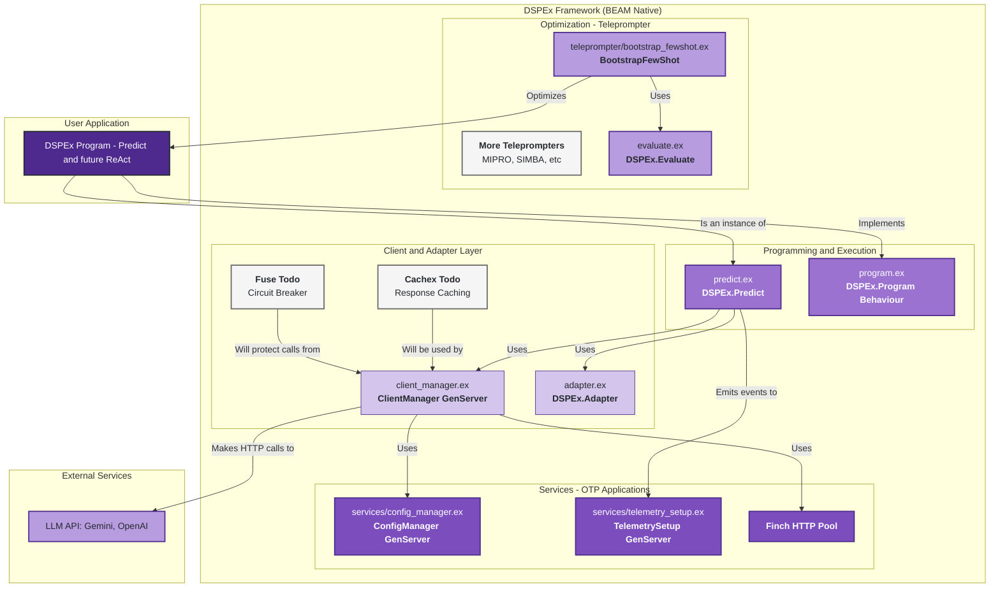
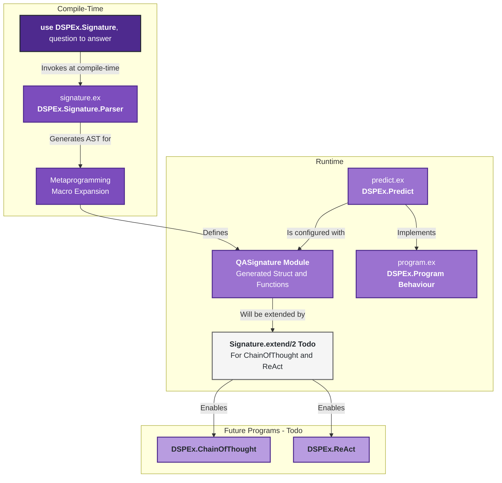
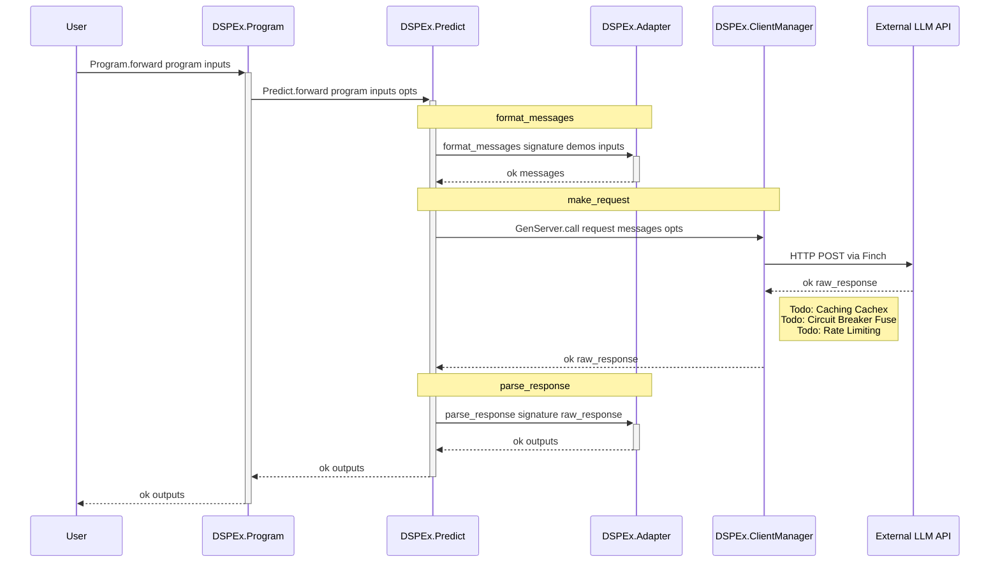
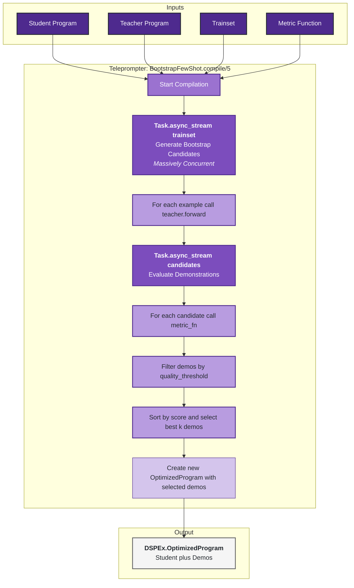

Excellent. This is a perfect use case for architectural diagrams, as they can visually codify the current state and make the path forward much clearer. I will create a new set of diagrams based on my understanding of your DSPEx implementation, using the file structure and `README` you've provided.

I will explicitly highlight the "Todo" or "Planned" components based on your roadmap and the natural evolution from the Python version. I'll use color-coding in the diagrams for clarity:
*   **Green:** Implemented and working.
*   **Yellow:** Partially implemented or foundational work is done, but needs enhancement.
*   **Red/Orange:** Planned but not yet implemented (Todos).

---

### 1 High-Level Conceptual Architecture of DSPEx

This diagram shows the main layers of your Elixir implementation, highlighting the central role of OTP services and the BEAM's concurrency model.

**Architectural Insights & Todos:**

*   **Foundation First:** You've correctly built on a solid foundation of OTP services. `ConfigManager` and `TelemetrySetup` are robust, BEAM-native replacements for Python's global settings and ad-hoc logging.
*   **GenServer is Key:** Your `ClientManager` is the heart of the execution layer. It's the stateful process that will manage connections, configuration, and resilience.
*   **Todo: Enhance ClientManager:** The current `ClientManager` is functional but is the designated place for significant resilience upgrades.
    *   **Caching:** Integrate `Cachex` to implement response caching, which is critical for reducing costs and latency during optimization. This is a direct parallel to `dspy.Cache`.
    *   **Circuit Breaker:** Integrate `Fuse` to protect against failing LLM API endpoints. This is a major advantage over the basic retry logic in Python's `litellm`.
    *   **Rate Limiting:** A GenServer is the perfect place to manage rate limits and implement exponential backoff strategies per-provider.
*   **Todo: Expand Teleprompters:** `BootstrapFewShot` is a great start. The next step is to implement more advanced optimizers like `MIPRO` or `SIMBA`, which will further test the concurrency and resilience of your evaluation engine.

---

### 2 Core Primitives: The Signature and Program

This diagram shows how you've used Elixir's metaprogramming capabilities to create a robust and compile-time-safe contract system.

**Architectural Insights & Todos:**

*   **Compile-Time Safety:** This is a huge advantage. Using a macro (`use DSPEx.Signature`) to parse the signature string at compile time catches errors early, unlike Python's runtime approach.
*   **Behavior-Driven Design:** `DSPEx.Program` provides a clean, consistent interface for all executable modules, which will be essential for composing them later.
*   **Todo: Signature Extension:** As your `CLAUDE.md` file correctly identifies, implementing a `DSPEx.Signature.extend/2` function is a critical next step. This is necessary for building more complex modules like `ChainOfThought`, which programmatically add a `reasoning` field to a base signature.
*   **Todo: Advanced Program Types:** Once signature extension is complete, you can implement `ChainOfThought`, `ReAct`, and other composite modules from the DSPy paper. These are built by composing `DSPEx.Predict` modules, not by creating entirely new primitives.

---

### 3 The Execution Flow: `Program.forward/3`

This sequence diagram details the runtime flow of a prediction, emphasizing the interaction between your GenServers and the core logic.

**Architectural Insights & Todos:**

*   **Clear Stages:** The flow is cleanly divided into `format` -> `request` -> `parse`. This separation is fundamental to DSPy's design and you've captured it well.
*   **Centralized Client Logic:** The `ClientManager` GenServer is the perfect place to encapsulate all external communication logic. It acts as a resilient gateway to the outside world.
*   **Asynchronous by Nature:** Although shown as a synchronous call for simplicity, `GenServer.call` is an asynchronous message-passing operation under the hood, making the system inherently non-blocking.
*   **Todo: Comprehensive Resilience in `ClientManager`:**
    *   **Caching:** Before making the HTTP call, the `ClientManager` should check a cache like `Cachex`.
    *   **Circuit Breaker:** The call to `Req.post` should be wrapped in a `Fuse` circuit breaker to prevent hammering a failing service.
    *   **Rate Limiting:** The `ClientManager` can maintain state on recent call timestamps to enforce rate limits before making a request.

---

### 4 The Optimization Flow: `BootstrapFewShot.compile/5`

This diagram illustrates how your teleprompter leverages BEAM's concurrency for efficient optimization.

**Architectural Insights & Todos:**

*   **BEAM Superpower:** Using `Task.async_stream` is the ideal way to implement this. It will dramatically outperform Python's threading model for I/O-bound tasks like hitting an LLM API. You've correctly identified and implemented this key advantage.
*   **Stateless Workers:** Each task spawned by `async_stream` is a lightweight, isolated BEAM process, making the entire operation highly fault-tolerant. A single failed API call won't crash the optimization run.
*   **The `OptimizedProgram` Struct:** Your `dspex/optimized_program.ex` is the correct functional approach to "compiling" a program. Instead of mutating the student program, you create a new, immutable struct that wraps the original program and its learned demonstrations.
*   **Todo: Advanced Optimization Strategies:**
    *   The current `BootstrapFewShot` is a great first step. The roadmap should include more complex optimizers like `MIPRO` or `SIMBA` from the DSPy paper, which involve iterative optimization loops. These will further benefit from Elixir's concurrency and state management capabilities.
    *   **Distributed Evaluation:** The `README` mentions this as a future goal. The `Task.async_stream` model can be extended to a multi-node setup using `Node.spawn_link` or a higher-level abstraction, making this a natural evolution for DSPEx.
