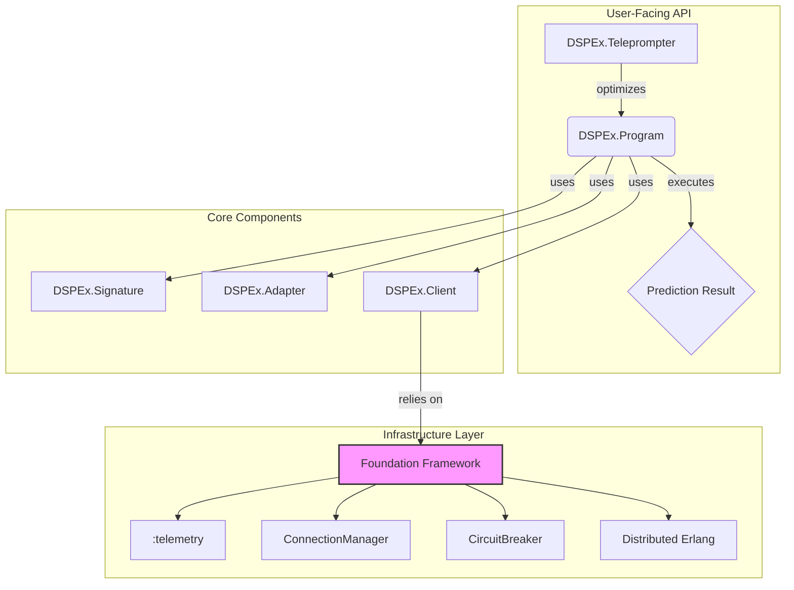
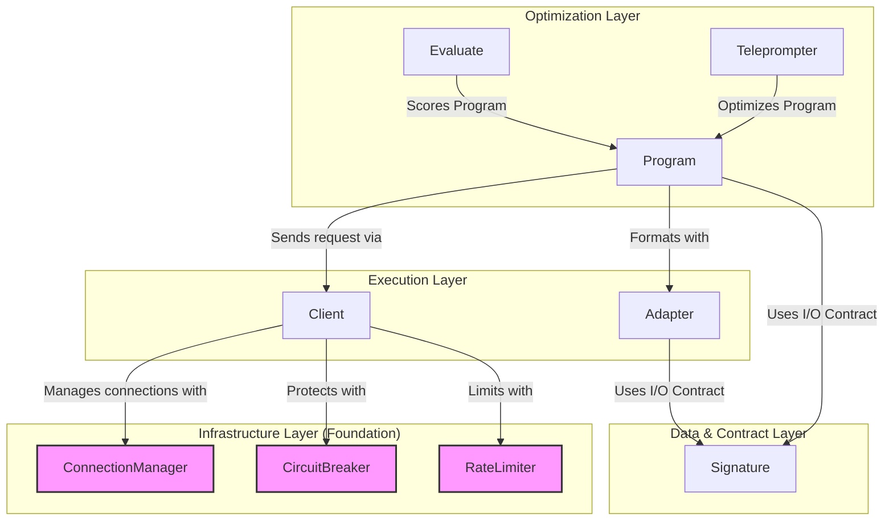
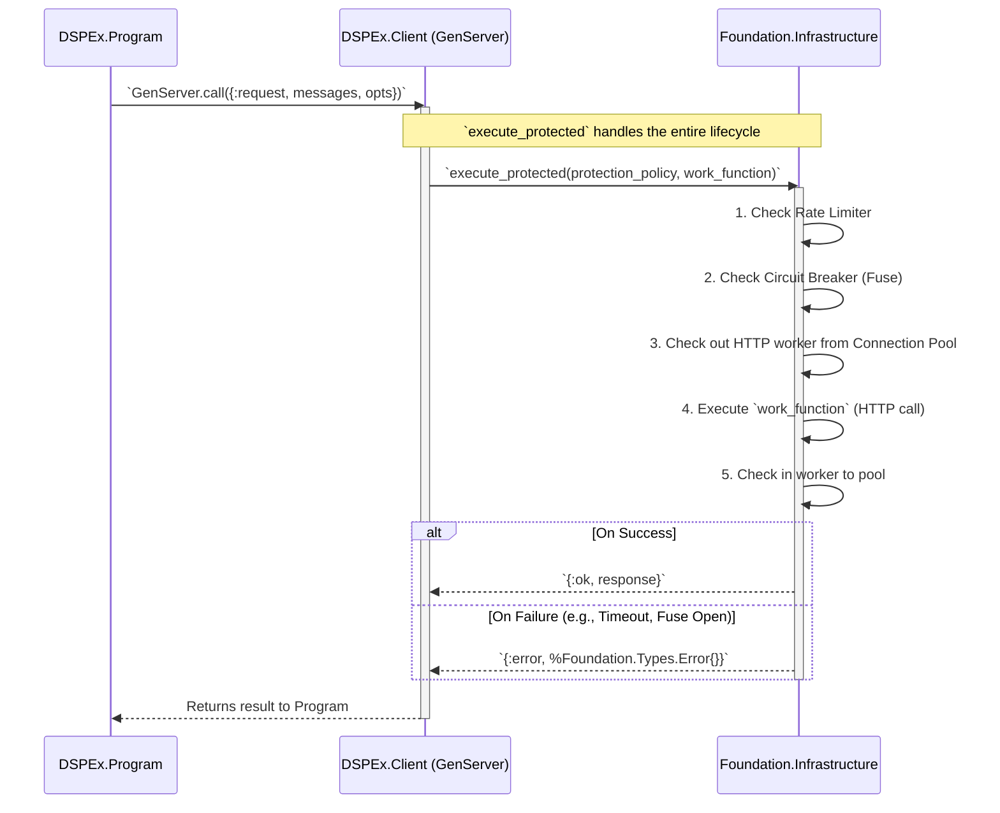

Of course. I have read and synthesized the provided documents: the aspirational `README.md`, the tactical `NEXT_STEPS.md`, the strategic `FOUNDATION2_EXEC_SUMM_VISION.md`, and the current state of the codebase in `lib/repomix-output.xml`. I also have the original DSPy source code for reference.

The key insight is that DSPEx's vision for a robust, concurrent AI framework is perfectly enabled by Foundation 2.0's vision for a resilient, distributed application framework. The `NEXT_STEPS.md` plan correctly identifies the path forward: solidify the core components by deeply integrating with Foundation, and then build the advanced optimization features on that solid base.

Here is the comprehensive series of documents that synthesizes this vision, plan, and technical strategy.

```
==== README.md ====
# DSPEx - Declarative Self-improving Elixir

**A BEAM-Native AI Program Optimization Framework, Powered by Foundation**

DSPEx is a sophisticated Elixir port of [DSPy](https://github.com/stanfordnlp/dspy), reimagined for the BEAM virtual machine. It is a **compiler** that uses data and metrics to systematically optimize Language Model (LLM) programs, transforming the art of "prompt engineering" into a scientific, repeatable discipline.

By leveraging the [Foundation](https://hex.pm/packages/foundation) framework, DSPEx is architected from the ground up for massive concurrency, fault tolerance, and distributed execution, offering capabilities that are fundamentally beyond the reach of its Python counterpart.

## Core Vision: Scientific Prompt Optimization

The core problem with building LLM applications is achieving consistent, high-quality output. This often devolves into a manual and unscientific process of "prompt tweaking." DSPEx solves this by treating prompts, few-shot examples, and model parameters as artifacts to be **systematically optimized**, not just strings to be tweaked. It uses a validation dataset and a metric to find the best-performing combination of these elements for a given task.

## The BEAM + Foundation Advantage

DSPEx is not just a port; it's a strategic leveraging of the BEAM's unique strengths for AI workloads, made possible by the Foundation framework.

### 1. Massively Concurrent & Resilient Evaluation
The optimization process requires evaluating a program against thousands of validation examples. DSPEx uses a `Foundation.ConnectionManager` pool of workers, orchestrated by `Task.async_stream`, to handle tens of thousands of concurrent API calls. This is not thread-based concurrency; it's millions of lightweight BEAM processes, offering superior I/O throughput and fault isolation.

```elixir
# If one of these 10,000 evaluations fails due to a network error,
# its process crashes without affecting the other 9,999.
# Foundation's CircuitBreaker will automatically trip for the failing provider.
scores = DSPEx.Evaluate.run(my_program, dev_set, &MyMetric.calculate/2, max_concurrency: 10_000)
```

### 2. Distributed Optimization Across a Cluster
Leveraging Foundation 2.0's distributed application capabilities, DSPEx can scale optimization jobs across a cluster of BEAM nodes with minimal code changes. This enables optimization at a scale impossible for single-machine Python frameworks.

```elixir
# Distribute an optimization job across a 1000-node cluster
DSPEx.Evaluate.run_distributed(program, large_dataset, metric,
                               nodes: Foundation.ServiceRegistry.list_nodes(:my_app))
```

### 3. Production-Grade Observability and Control
Every LLM call is an isolated, supervised process instrumented with `:telemetry`. Foundation's `CircuitBreaker` and `RateLimiter` primitives provide out-of-the-box resilience against failing or overloaded external services.

## Architecture: A Layered Approach on Foundation

DSPEx is built as a series of clean, composable layers, with Foundation providing the resilient infrastructure at the base.



## Implementation Status & Roadmap

DSPEx is under active development, following a phased, test-driven approach.

### **Phase 1: Foundation & Core Components (In Progress)**
*   ✅ `DSPEx.Signature`: Compile-time safe I/O contracts.
*   ✅ `DSPEx.Example`: Core data structures.
*   🚧 `DSPEx.Client`: GenServer-based resilient HTTP client using Foundation's `ConnectionManager` and `CircuitBreaker`.
*   🚧 `DSPEx.Adapter`: Protocol for translating signatures to LLM-specific formats.
*   🚧 `DSPEx.Program`: Core `Predict` and `ChainOfThought` execution logic.
*   ⬜ `DSPEx.Evaluate`: Massively concurrent evaluation engine.

### **Phase 2: Optimization Engine**
*   ⬜ `DSPEx.Teleprompter.BootstrapFewShot`: The first and most critical optimization algorithm.
*   ⬜ Advanced Programs (`ReAct`, `MultiChainComparison`).

### **Phase 3: Distributed-First Enterprise Features**
*   ⬜ Distributed optimization across BEAM clusters via Foundation.
*   ⬜ Phoenix LiveView dashboard for monitoring optimization jobs.
*   ⬜ Advanced cost and performance tracking.

## Getting Started (Target API)

```elixir
# 1. Add `dspex` and `foundation` to mix.exs
def deps do
  [
    {:dspex, "~> 0.1.0"},
    {:foundation, "~> 0.1.4"}
  ]
end

# 2. Define a signature for your task
defmodule QASignature do
  use DSPEx.Signature, "question, context -> answer"
end

# 3. Configure a client for your LLM provider
# This sets up connection pools and circuit breakers via Foundation.
client = DSPEx.Client.OpenAI.new(api_key: "...")

# 4. Create a program
program = %DSPEx.Predict{
  signature: QASignature,
  client: client
}

# 5. Run a prediction
{:ok, prediction} = DSPEx.Program.forward(program, %{question: "What is Elixir?", context: "..."})

# 6. Evaluate its performance on a development set
dev_set = [...] # List of DSPEx.Example
metric = fn gold, pred -> if gold.answer == pred.answer, do: 1.0, else: 0.0 end
score = DSPEx.Evaluate.run(program, dev_set, metric)

# 7. Optimize the program with a Teleprompter
# This will find the best few-shot examples from your trainset
{:ok, optimized_program} = DSPEx.Teleprompter.BootstrapFewShot.compile(
  student: program,
  trainset: train_set
)
```

## Contributing

DSPEx is a community-driven project aiming to establish Elixir and the BEAM as a first-class platform for AI engineering. Please see `DEVELOPMENT_PLAN.md` for the detailed roadmap. Contributions are welcome!

---

**Acknowledgments**: This project stands on the shoulders of giants: the original **Stanford DSPy team** for their groundbreaking research, and the **Elixir/Erlang community** for building the robust, concurrent, and distributed runtime that makes this ambitious vision a reality.

==== ARCHITECTURE.md ====
# DSPEx System Architecture

This document provides a deep dive into the technical architecture of DSPEx. It outlines the core components, their responsibilities, and how they interact, with a special focus on the integration with the `Foundation` framework to achieve resilience and scalability.

## Guiding Principles

1.  **Immutability and Composition:** Programs are primarily stateless structs that can be composed. State is managed explicitly in processes (`GenServer`) only where necessary (e.g., in clients and optimizers).
2.  **Concurrency by Default:** The framework is designed to leverage the BEAM's lightweight processes for massive concurrency, especially in evaluation and optimization.
3.  **Resilience through Supervision:** Components that manage state or external resources (like API clients) are supervised processes. Failures are isolated and handled by OTP principles.
4.  **Clarity through Layers:** The architecture is a strict dependency graph, preventing circular dependencies and ensuring a clear flow of data and control.

## High-Level Component Diagram



---

## Component Deep Dive

### 1. `DSPEx.Signature` (Compile-Time Contract)
The `Signature` is the foundation of a DSPEx program. It's a compile-time macro that defines the inputs and outputs of a task.

-   **Implementation:** `use DSPEx.Signature, "input1, context -> output1, reasoning"`
-   **Responsibilities:**
    -   Parses the signature string at **compile time**.
    -   Generates a struct with the specified fields.
    -   Generates `@type t` specifications for full Dialyzer support.
    -   Generates functions (`input_fields/0`, `output_fields/0`) for introspection.
    -   Extracts the `@moduledoc` to use as the base instruction for the LLM.
-   **BEAM Advantage:** This compile-time approach catches errors in I/O contracts before the code is even deployed, unlike Python's runtime parsing.

### 2. `DSPEx.Adapter` (Protocol Translation)
The `Adapter` is a stateless behaviour responsible for translating between a DSPEx `Signature` and an LLM provider's specific message format (e.g., OpenAI's ChatML).

-   **Implementation:** A module implementing the `@behaviour DSPEx.Adapter`.
-   **Core Callbacks:**
    -   `format(signature, inputs, demos) -> {:ok, messages}`: Takes high-level data and creates the provider-specific message list.
    -   `parse(signature, response) -> {:ok, outputs}`: Takes a raw LLM response and extracts the structured output fields defined in the signature.
-   **Decoupling:** This layer decouples the program's logic from the specifics of how a prompt is constructed, allowing a single DSPEx program to be used with different models or prompting strategies just by swapping the adapter.

### 3. `DSPEx.Client` (Resilient API Communication)
The `Client` is a supervised `GenServer` that manages all communication with a specific LLM provider. This is a critical point of integration with the `Foundation` library.

-   **Implementation:** A `GenServer` started and supervised by the main application.
-   **Responsibilities:**
    -   On `init`, it uses `Foundation.ConnectionManager` to start a supervised pool of HTTP workers (e.g., using `Finch`).
    -   On `init`, it configures `Foundation.CircuitBreaker` and `Foundation.RateLimiter` for the specific API endpoint.
    -   The `request/2` function is a `GenServer.call` that wraps the actual HTTP request inside `Foundation.Infrastructure.execute_protected/3`.
-   **Resilience:** This architecture ensures that:
    -   Transient network errors in one request don't affect others.
    -   Repeated failures will trip the circuit breaker, preventing the application from hammering a failing service.
    -   API rate limits are respected automatically.
    -   Connection pooling is handled efficiently.

### 4. `DSPEx.Program` (Execution and Composition)
A `Program` is a struct that implements the `DSPEx.Program` behaviour. It represents a single, executable step in an AI pipeline.

-   **Core `Program`s:**
    -   **`DSPEx.Predict`**: The simplest program. It takes a signature and executes a single LLM call. It is a plain struct, making it lightweight and easy to compose.
    -   **`DSPEx.ChainOfThought`**: A compositional program. It wraps another program (like `Predict`), but modifies its signature to include a `reasoning` step.
-   **Behaviour:** The `@behaviour DSPEx.Program` defines a single callback: `forward(program, inputs)`.
-   **Execution Flow:**
    1.  `Program.forward/2` is called.
    2.  It uses its `Adapter` to `format` the inputs and any demos into messages.
    3.  It calls `Client.request/2` to send the messages to the LLM.
    4.  It uses its `Adapter` to `parse` the response back into structured outputs.
    5.  It returns a `%DSPEx.Prediction{}` struct.

### 5. `DSPEx.Evaluate` (Concurrent Evaluation)
The `Evaluate` engine is responsible for scoring a `Program`'s performance on a dataset. It is the key to the "self-improving" aspect of DSPEx and is designed for massive concurrency.

-   **Implementation:** A function `run(program, dataset, metric_fn, opts)`.
-   **Concurrency Model:** It maps over the dataset using `Task.async_stream/3`, with `max_concurrency` controlling the parallelism.
    -   Each call to `Program.forward/2` runs in its own lightweight BEAM process.
    -   This isolates failures: one bad API call or malformed response only crashes one process.
    -   The main evaluation process collects results and calculates the average score.
-   **BEAM Advantage:** This model can easily saturate an API's rate limit with tens of thousands of concurrent requests from a single machine, a feat that is much harder to achieve with thread-based concurrency in other languages.

### 6. `DSPEx.Teleprompter` (Optimization)
A `Teleprompter` is an algorithm that optimizes a `Program`. It uses the `Evaluate` engine to test different program configurations.

-   **Implementation:** A `GenServer` to manage the state of a long-running optimization process.
-   **Example: `BootstrapFewShot`**
    1.  It takes a `student` program (to be optimized) and a `teacher` program (a more powerful/expensive model).
    2.  It runs the `teacher` over the `trainset` to generate high-quality examples (candidate demonstrations).
    3.  It uses a metric to filter for the best of these generated examples.
    4.  It "compiles" a new version of the `student` program with these high-quality examples included in its `demos` list.
-   **Stateful Process:** The `GenServer` model is ideal here, as optimization is an iterative, stateful, and often long-running task.

==== DEVELOPMENT_PLAN.md ====
# DSPEx: Phased Development Plan

This document outlines the strategic, phased development plan for DSPEx, aligning the project's vision with an actionable roadmap. It synthesizes the goals from the README with the critical analysis from `NEXT_STEPS.md` and the opportunities presented by the Foundation framework.

## Guiding Strategy

The core strategy is to build a robust, resilient foundation first, and then layer advanced features on top. This de-risks the project and ensures that each new feature is built on solid ground. The integration with the Foundation library is the central pillar of this strategy.

---

## Phase 1A: Foundation & Core Components (Weeks 1-2)

**Objective:** Solidify the absolute core of DSPEx, replacing placeholder implementations with production-grade, Foundation-backed components. This phase delivers a functional, non-optimizing prediction pipeline.

#### **Critical Tasks:**
1.  **Implement Resilient `DSPEx.Client`:**
    -   [ ] Refactor `DSPEx.Client` to be a supervised `GenServer`.
    -   [ ] Integrate `Foundation.ConnectionManager` to manage a `Finch` HTTP worker pool.
    -   [ ] Integrate `Foundation.CircuitBreaker` and `RateLimiter` for API calls.
    -   [ ] Implement multi-provider support (OpenAI, Anthropic, Gemini) as separate client modules or configurations.
    -   *Location: `lib/dspex/client/`*

2.  **Define and Implement `DSPEx.Program` Behaviour:**
    -   [ ] Create the `@behaviour DSPEx.Program` with a `forward/2` callback.
    -   [ ] Ensure `DSPEx.Predict` correctly implements this behaviour.
    -   [ ] Implement the basic `DSPEx.ChainOfThought` compositional program.
    -   *Location: `lib/dspex/program.ex`, `lib/dspex/predict.ex`*

3.  **Enhance `DSPEx.Adapter` Layer:**
    -   [ ] Create the `@behaviour DSPEx.Adapter` with `format/3` and `parse/2`.
    -   [ ] Implement a robust `DSPEx.Adapter.Chat` module for standard chat formats.
    -   [ ] Add comprehensive error handling for parsing failures.
    -   *Location: `lib/dspex/adapter/`*

4.  **Documentation and Reality Sync:**
    -   [ ] Update the main `README.md` to reflect that Phase 1 is "In Progress".
    -   [ ] Ensure all code has full `@moduledoc`, `@doc`, and `@spec` coverage.

#### **Success Criteria:**
-   An end-to-end call to `DSPEx.Predict.forward/2` successfully returns a parsed LLM response.
-   API calls are managed by a supervised process pool with functioning circuit breakers.
-   All 126+ foundational tests are passing with >95% code coverage.
-   Zero Dialyzer warnings.

---

## Phase 1B: The Evaluation Engine (Weeks 3-4)

**Objective:** Implement the concurrent evaluation engine. This is the first step toward making DSPEx a "self-improving" framework, as it provides the mechanism to score program performance.

#### **Critical Tasks:**
1.  **Implement `DSPEx.Evaluate`:**
    -   [ ] Create the `DSPEx.Evaluate.run/4` function.
    -   [ ] Use `Task.async_stream` to achieve massive concurrency.
    -   [ ] Ensure individual evaluation failures are isolated and do not crash the main run.
    -   [ ] Add basic metrics aggregation (average score, success rate).
    -   *Location: `lib/dspex/evaluate.ex`*

2.  **Build Out Test Infrastructure:**
    -   [ ] Create a `MockClient` that can be used in tests to simulate LLM responses without making real API calls.
    -   [ ] Add property-based tests (`PropCheck`) for the evaluation engine to handle edge cases.
    -   [ ] Add performance benchmarks to validate concurrency claims.

#### **Success Criteria:**
-   `DSPEx.Evaluate.run/4` can evaluate a program against a dataset of 1,000+ examples.
-   The evaluation is demonstrably concurrent and fault-tolerant.
-   Performance benchmarks are established.

---

## Phase 2: The Optimization Engine (Weeks 5-8)

**Objective:** Implement the core optimization algorithms ("Teleprompters") that fulfill the central promise of DSPEx.

#### **Major Components:**
1.  **Implement `DSPEx.Teleprompter.BootstrapFewShot`:**
    -   [ ] Implement the teleprompter as a `GenServer` for stateful optimization.
    -   [ ] Create the teacher/student training pipeline.
    -   [ ] Use `DSPEx.Evaluate` to find and filter high-quality demonstrations from the `trainset`.
    -   [ ] The `compile/3` function should return an optimized `student` program.
    -   *Location: `lib/dspex/teleprompter/`*

2.  **Advanced Program Types:**
    -   [ ] Implement `DSPEx.ReAct` for basic agentic workflows.
    -   [ ] Implement `DSPEx.MultiChainComparison` for self-consistency optimizations.
    -   *Location: `lib/dspex/programs/`*

#### **Success Criteria:**
-   The `BootstrapFewShot` teleprompter can take a zero-shot program and demonstrably improve its evaluation score by adding few-shot examples.
-   The framework can successfully optimize a multi-stage `ChainOfThought` program.

---

## Phase 3: Distributed-First & Enterprise Features (Weeks 9-12+)

**Objective:** Leverage the full power of the BEAM and Foundation to provide capabilities unique to DSPEx.

#### **Revolutionary Features:**
1.  **Distributed Evaluation & Optimization:**
    -   [ ] Create a `DSPEx.Evaluate.run_distributed/4` function.
    -   [ ] Use Foundation's `ServiceRegistry` and distributed task primitives to spread evaluation jobs across a BEAM cluster.
    -   [ ] Benchmark performance on a 100+ node cluster.

2.  **Production Observability:**
    -   [ ] Create a Phoenix LiveView dashboard for monitoring the progress and results of long-running optimization jobs in real-time.
    -   [ ] Add detailed cost estimation based on `:telemetry` events for token usage.

3.  **Advanced Teleprompters:**
    -   [ ] Implement a signature-optimizing teleprompter (analogous to `SignatureOptimizer`).

#### **Success Criteria:**
-   An optimization job can be seamlessly distributed across multiple nodes, resulting in a near-linear speedup.
-   A user can monitor a running optimization job from a web dashboard.

==== FOUNDATION_INTEGRATION.md ====
# Foundation Integration: The Resilient Engine of DSPEx

The core design philosophy of DSPEx is to delegate infrastructure concerns to a specialized framework, allowing DSPEx to focus exclusively on the logic of AI program optimization. The [Foundation](https://hex.pm/packages/foundation) framework is this resilient engine. This document details the strategic and technical integration between DSPEx and Foundation.

## Why Foundation?

DSPEx's core operations involve thousands of concurrent, long-running, and potentially fallible network requests. Managing this complexity is a significant engineering challenge. Foundation provides production-grade, BEAM-native solutions for exactly these problems.

| DSPEx Requirement                  | Foundation Solution                               | Advantage over Python DSPy                                                                                              |
| ---------------------------------- | ------------------------------------------------- | ----------------------------------------------------------------------------------------------------------------------- |
| **Concurrent API Calls**           | `Foundation.ConnectionManager` + `Finch`          | True I/O-bound parallelism with lightweight processes, not limited by GIL or OS thread counts. Superior throughput. |
| **Resilience to API Failures**     | `Foundation.CircuitBreaker` (`Fuse`)              | Automatic, per-provider fault detection. Prevents cascading failures. No need for manual retry logic in every call.   |
| **API Rate Limiting**              | `Foundation.RateLimiter` (`Hammer`)               | Centralized, BEAM-native rate limiting that respects provider limits without complex external dependencies.         |
| **Deep Observability**             | First-class `:telemetry` integration              | Built-in, standardized events for every critical operation (request, parse, evaluate) without third-party agents.   |
| **Large-Scale Distributed workloads** | Partisan-based clustering (Foundation 2.0)        | Natively scale optimization and evaluation jobs across 1000+ nodes, a capability simply not present in Python DSPy.  |
| **Configuration Management**       | `Foundation.Config`                               | Centralized, dynamic configuration for all components, including LLM providers and API keys.                          |

## Technical Integration Points

### 1. The `DSPEx.Client` Architecture

The `DSPEx.Client` is the primary point of integration. It is not a simple HTTP wrapper; it is a `GenServer` that orchestrates Foundation's infrastructure components.

**Initialization (`init/1`):**
When a client for a provider (e.g., `DSPEx.Client.OpenAI`) is started, it performs the following setup:

1.  **Connection Pool:** It calls `Foundation.Infrastructure.ConnectionManager.start_pool/2` to create a supervised pool of `Finch` workers. This pool is named and registered for later use.
2.  **Protection Policy:** It calls `Foundation.Infrastructure.configure_protection/2` to define a resilience policy for the API endpoint. This policy includes:
    *   **Circuit Breaker:** e.g., "trip after 5 consecutive failures, recover after 30 seconds."
    *   **Rate Limiter:** e.g., "allow 3,000 requests per minute."

**Request Flow (`request/2`):**

A call to `DSPEx.Program.forward/2` triggers the following resilient request flow:



This architecture means the `DSPEx.Program` logic is completely shielded from the complexities of network resilience. It deals with a simple, consistent API that returns either `{:ok, result}` or a structured `{:error, reason}`.

### 2. Distributed Evaluation with `run_distributed`

Foundation 2.0's vision for large-scale distributed applications will directly power DSPEx's most significant unique feature.

The planned `DSPEx.Evaluate.run_distributed/4` function will:
1.  Use `Foundation.ServiceRegistry.list_nodes/1` to discover all available worker nodes in the cluster.
2.  Partition the evaluation dataset among these nodes.
3.  Use a distributed task supervisor (provided by Foundation) to execute evaluation batches on the remote nodes.
4.  The results will be streamed back to the orchestrating node for final aggregation.

This will enable prompt optimization on datasets orders of magnitude larger than what is feasible with single-node Python frameworks, unlocking new possibilities for finding robust, generalizable AI programs.

## Conclusion

The integration with Foundation is not an implementation detail; it is a core strategic decision that defines DSPEx. It provides a massive head-start by delivering production-grade resilience, concurrency, and scalability, allowing the DSPEx project to build a truly next-generation AI optimization framework on the BEAM.

==== API_REFERENCE.md ====
# DSPEx API Reference

This document provides a reference for the primary public modules in DSPEx. It describes their purpose, key functions, and data structures, reflecting the target architecture.

---

### `DSPEx.Signature`

The `DSPEx.Signature` module provides a compile-time macro for defining the input/output contract of an AI program.

```elixir
defmodule MySignature do
  @moduledoc "A description of the task, used as instructions for the LLM."
  use DSPEx.Signature, "question, context -> answer, reasoning"
end
```

**Generated Functions:**

-   `MySignature.new(map()) :: %MySignature{}`: Creates a new struct instance from a map.
-   `MySignature.input_fields() :: [:question, :context]`: Returns the list of input fields.
-   `MySignature.output_fields() :: [:answer, :reasoning]`: Returns the list of output fields.
-   `MySignature.instructions() :: String.t()`: Returns the content of `@moduledoc`.

---

### `DSPEx.Example`

The `DSPEx.Example` struct represents a single data point, containing both inputs and expected outputs (labels).

**Struct:**

```elixir
%DSPEx.Example{
  inputs: %{question: "What is OTP?", context: "Open Telecom Platform..."},
  outputs: %{answer: "A set of libraries for building scalable systems."}
}
```

**Key Functions:**
-   `DSPEx.Example.new(inputs, outputs) :: %DSPEx.Example{}`: Creates a new example.

---

### `DSPEx.Program`

This is the behaviour for all executable DSPEx modules.

-   `@callback forward(program, inputs :: map()) :: {:ok, %DSPEx.Prediction{}} | {:error, any()}`

#### `DSPEx.Predict`
The most basic program for single-turn predictions.

**Struct:**
```elixir
%DSPEx.Predict{
  signature: module(),
  client: pid(),
  adapter: module(),
  demos: list(%DSPEx.Example{})
}
```

**Key Functions:**
-   `DSPEx.Predict.forward(program, inputs) :: {:ok, %DSPEx.Prediction{}}`: Executes a single LLM call based on the program's configuration.

#### `DSPEx.ChainOfThought`
A compositional program that injects a reasoning step.

**Struct:**
```elixir
%DSPEx.ChainOfThought{
  program: %DSPEx.Predict{} # An internally managed Predict program
}
```

**Key Functions:**
-   `DSPEx.ChainOfThought.new(signature, client)`: Creates a new Chain of Thought program. It internally creates a new signature `... -> reasoning, ...` and configures a `Predict` module to use it.
-   `DSPEx.ChainOfThought.forward(program, inputs)`: Executes the internal program.

---

### `DSPEx.Client`

A `GenServer`-based module for communicating with LLM providers.

**Key Functions:**
-   `DSPEx.Client.OpenAI.start_link(opts)`: Starts a supervised client for the OpenAI provider. `opts` include API keys and configuration for Foundation's connection pool and circuit breaker.
-   `DSPEx.Client.OpenAI.new(opts)`: A convenience function that returns a configured client PID.
-   `DSPEx.Client.request(client_pid, messages, opts) :: {:ok, api_response} | {:error, reason}`: Makes a resilient API call. This is typically used internally by `Program` modules.

---

### `DSPEx.Evaluate`

The engine for evaluating program performance.

**Key Functions:**
-   `DSPEx.Evaluate.run(program, dataset, metric_fn, opts \\ []) :: {:ok, float()} | {:error, any()}`
    -   `program`: The `DSPEx.Program` to evaluate.
    -   `dataset`: A list of `%DSPEx.Example{}` structs.
    -   `metric_fn`: A 2-arity function `(gold_example, prediction) -> float()` that returns a score.
    -   `opts`: Keyword list of options, including:
        -   `:max_concurrency` (integer, default: 100): The number of concurrent evaluation processes to run.

---

### `DSPEx.Teleprompter`

The behaviour for optimization algorithms.

-   `@callback compile(student, opts :: keyword()) :: {:ok, optimized_program} | {:error, any()}`

#### `DSPEx.Teleprompter.BootstrapFewShot`
The primary teleprompter for finding effective few-shot demonstrations.

**Key Functions:**
-   `DSPEx.Teleprompter.BootstrapFewShot.compile(student, opts) :: {:ok, optimized_program}`
    -   `student`: The program to be optimized.
    -   `opts`: Keyword list of options, including:
        -   `:teacher` (optional, `%DSPEx.Program{}`): A more powerful program to generate candidate demos. Defaults to the student.
        -   `:trainset` (required, `list(%DSPEx.Example{})`): The dataset to source demonstrations from.
        -   `:metric_fn` (required, `function/2`): The metric to score and filter demonstrations.
```