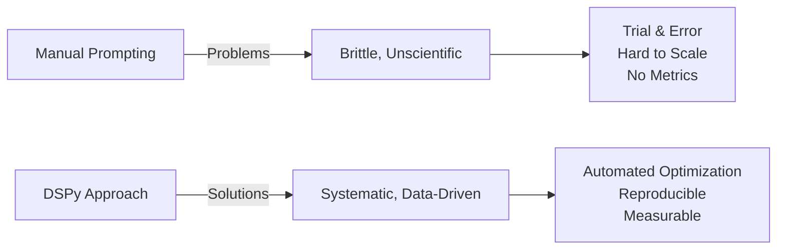
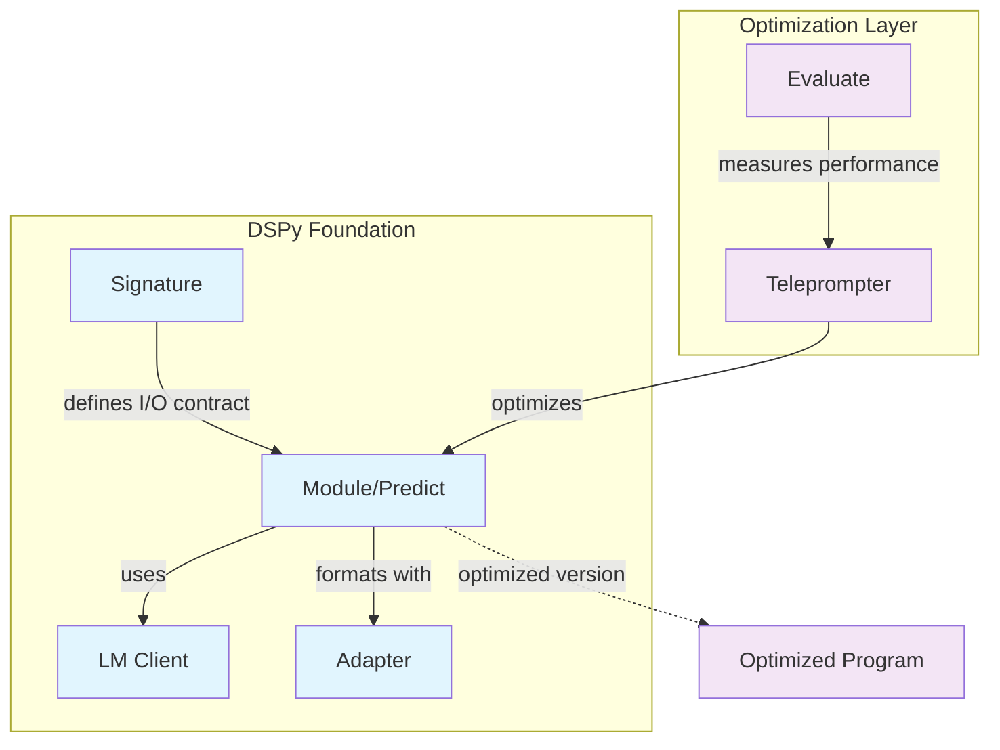
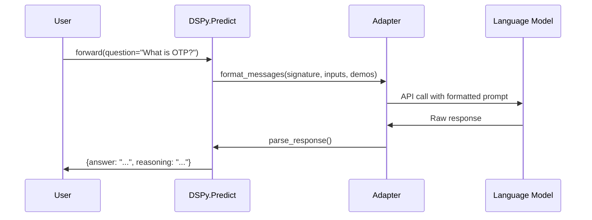
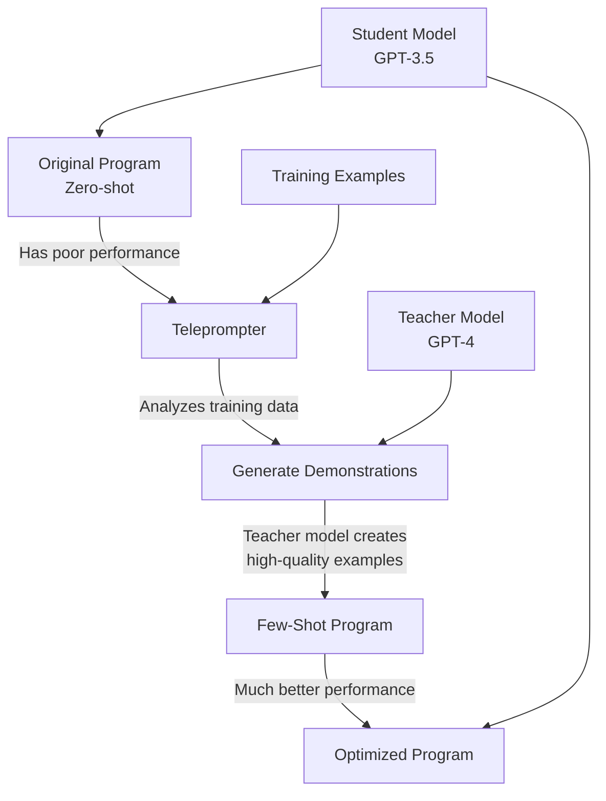
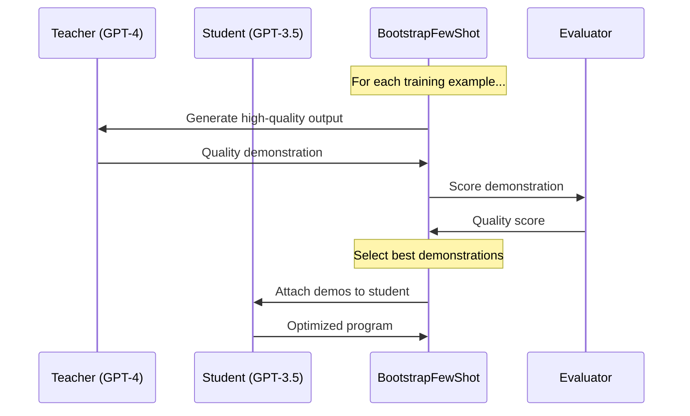
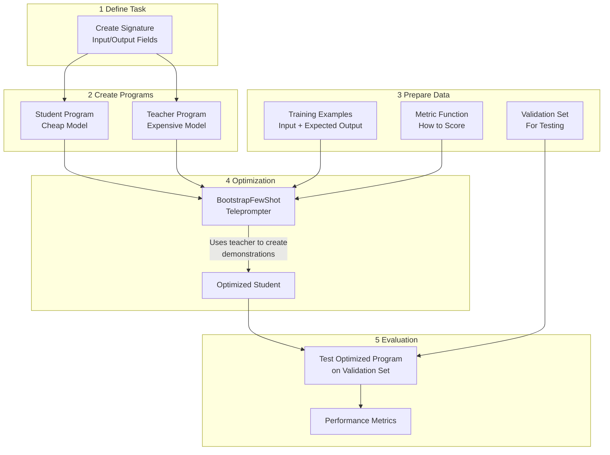
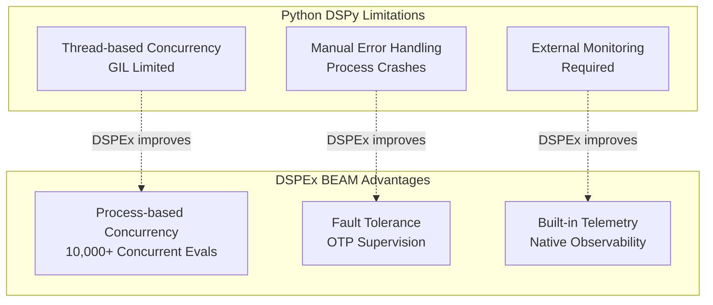

# DSPy Compact Tutorial: Understanding for DSPEx Development

## Overview: What is DSPy?

DSPy is a **compiler for Language Model programs**, not just a prompting framework. It treats prompts as optimizable artifacts and automatically discovers the best prompting strategies through data-driven optimization.



## Core DSPy Architecture



**DSPEx Translation**: Your Elixir port follows this exact architecture with BEAM-native implementations:
- `DSPEx.Signature` ↔ `dspy.Signature`
- `DSPEx.Predict` ↔ `dspy.Predict`
- `DSPEx.Evaluate` ↔ `dspy.Evaluate`
- `DSPEx.Teleprompter` ↔ `dspy.teleprompt`

## 1. Signatures: The Foundation

Signatures define the input/output contract for your program:

```python
# Python DSPy
class QASignature(dspy.Signature):
    """Answer questions with detailed reasoning"""
    question = dspy.InputField()
    context = dspy.InputField()
    answer = dspy.OutputField()
    reasoning = dspy.OutputField()
```

```elixir
# Your DSPEx equivalent
defmodule QASignature do
  @moduledoc "Answer questions with detailed reasoning"
  use DSPEx.Signature, "question, context -> answer, reasoning"
end
```

**Key Insight**: DSPy signatures are more than schemas - they're **optimization targets**. The teleprompter can modify instructions and field descriptions to improve performance.

## 2. Programs: Executable Units



```python
# Python DSPy
predictor = dspy.Predict(QASignature)
result = predictor(question="What is OTP?", context="...")
```

```elixir
# Your DSPEx equivalent  
program = DSPEx.Predict.new(QASignature, :gemini)
{:ok, result} = DSPEx.Program.forward(program, %{question: "What is OTP?", context: "..."})
```

## 3. The Magic: Few-Shot Learning

DSPy's power comes from **automatic few-shot optimization**:



**Before Optimization:**
```
Question: What is machine learning?
Answer: [Poor, generic response]
```

**After BootstrapFewShot:**
```
Question: What is supervised learning?
Answer: Supervised learning uses labeled training data to learn mappings from inputs to outputs...

Question: What is unsupervised learning?  
Answer: Unsupervised learning finds patterns in data without labeled examples...

Question: What is machine learning?
Answer: [Much better, contextual response following the pattern]
```

## 4. Evaluation: The Feedback Loop


```python
# Python DSPy
def accuracy_metric(example, prediction):
    return example.answer.lower() == prediction.answer.lower()

evaluate = dspy.Evaluate(devset=test_examples, metric=accuracy_metric)
score = evaluate(my_program)
```

```elixir
# Your DSPEx equivalent
metric_fn = fn example, prediction ->
  expected = DSPEx.Example.get(example, :answer) |> String.downcase()
  actual = Map.get(prediction, :answer) |> String.downcase()
  if expected == actual, do: 1.0, else: 0.0
end

{:ok, result} = DSPEx.Evaluate.run(program, examples, metric_fn)
```

## 5. Teleprompters: The Optimizers

The most important teleprompter is **BootstrapFewShot**:



```python
# Python DSPy workflow
teacher = dspy.Predict(QASignature, lm=dspy.OpenAI(model="gpt-4"))
student = dspy.Predict(QASignature, lm=dspy.OpenAI(model="gpt-3.5-turbo"))

teleprompter = dspy.BootstrapFewShot(metric=accuracy_metric)
optimized_student = teleprompter.compile(student, teacher=teacher, trainset=train_examples)
```

```elixir
# Your DSPEx equivalent
teacher = DSPEx.Predict.new(QASignature, :openai_gpt4)
student = DSPEx.Predict.new(QASignature, :gemini_flash)

{:ok, optimized_student} = DSPEx.Teleprompter.BootstrapFewShot.compile(
  student, teacher, train_examples, metric_fn
)
```

## 6. Complete DSPy Workflow



## 7. DSPEx Advantages: BEAM-Native Benefits

Your Elixir port provides significant architectural advantages:



**Concrete Performance Example:**
```elixir
# DSPEx can handle massive concurrent evaluation
DSPEx.Evaluate.run(program, 10_000_examples, metric_fn, 
                   max_concurrency: 1000)  # 1000 concurrent processes!

# Python DSPy limited by threads/GIL
# Much slower, more memory intensive
```

## 8. Key Takeaways for DSPEx Development

1. **Signatures are Optimization Targets**: Not just type definitions, but contracts that teleprompters can modify

2. **Demonstrations are Everything**: The core value is automatic few-shot learning through bootstrapping

3. **Evaluation Drives Optimization**: Metrics provide the feedback signal for improvement

4. **Concurrency is Critical**: Evaluation is I/O bound - BEAM's process model is perfect

5. **Fault Tolerance Matters**: Long-running optimization jobs need resilience

## 9. Implementation Priority Map

Based on your current DSPEx status, focus on:

```mermaid
graph TD
    subgraph Current["✅ Already Implemented"]
        A[Signatures & Programs]
        B[Basic Prediction]
        C[Concurrent Evaluation]
        D[BootstrapFewShot]
    end
    
    subgraph Next["🔄 Next Phase"]
        E[ChainOfThought Programs]
        F[Multiple Teleprompters]
        G[Advanced Adapters]
    end
    
    subgraph Future["🚀 BEAM-Specific"]
        H[Distributed Optimization]
        I[Hot Code Upgrades]
        J[Advanced Supervision]
    end
    
    A --> E
    B --> F
    C --> H
    D --> F
```



Your DSPEx implementation is already capturing the **core DSPy value proposition** while leveraging BEAM's unique strengths for superior concurrency and fault tolerance. The foundation is solid for advanced features that Python DSPy cannot easily achieve.
