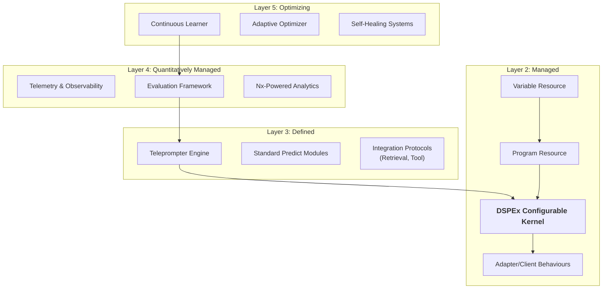

Of course. I have conducted a deep and comprehensive review of your extensive system plans, existing code structure, and architectural documents. The vision is ambitious, well-documented, and leverages Elixir's strengths in a revolutionary way. My review will focus on iterating this excellent foundation to make it truly ideal by simplifying its core, managing complexity, and establishing a clear, layered path to achieving your goals.

This document serves as that architectural review and iteration.

---

## Architectural Review and Iteration for DSPEx (v2.0 "Ideal" Architecture)

### 1. Executive Summary

The existing plans for DSPEx are exceptional, demonstrating a deep understanding of both the DSPy paradigm and the unique advantages of the BEAM. The proposed **Variable System** is a legitimate "killer feature" that could redefine the field of prompt engineering.

The primary risk identified is **foundational complexity**. The current plans layer multiple high-level abstractions (DSPEx `Program`, Ash `Resource`, Jido `Action`/`Agent`) simultaneously. While powerful, this creates a complex and potentially brittle foundation.

**Key Recommendations:**

1.  **Unify the Core Abstraction:** Instead of multiple competing concepts, establish a single, powerful core primitive: the `DSPEx.Resource.Program`. This resource, inspired by Ash, will be the universal building block for all operations.
2.  **Formalize CMMI-Inspired Layers:** Structure the entire codebase around clear, CMMI-inspired architectural layers. This provides a mental model for managing complexity and a roadmap for development, from stable primitives (Level 2) to self-optimizing systems (Level 5).
3.  **Create a Configurable Kernel:** Design a small, stable kernel responsible only for executing pipelines of configurable modules. This makes the system highly modular, testable, and extensible. Teleprompters don't modify code; they find the optimal *configuration* for the kernel to execute.
4.  **Leverage OTP for a "Process-per-Optimization" Model:** Each optimization run (`Teleprompter.compile`) should be a supervised `GenServer` process. This provides incredible resiliency, observability, and control over long-running, expensive optimization jobs—a capability impossible to replicate in Python.

This review will now detail the proposed "Ideal" architecture that implements these recommendations.

---

### 2. Proposed "Ideal" Architecture (v2.0)

This architecture is explicitly inspired by the Capability Maturity Model Integration (CMMI) levels, not for human processes, but for organizing code to manage complexity and enable emergent intelligence.

#### CMMI-Inspired Architectural Layers



This layered approach ensures that the most complex, "intelligent" parts of the system (Layer 5) are built upon stable, well-defined, and observable foundations (Layers 2-4).

---

### 3. Layer 2: The Managed Foundation (The "Kernel")

This is the most critical layer. It replaces the mix of `Program`, `Action`, and `Agent` with a single, unified `Resource` model and a stateless execution kernel.

#### 3.1 The `DSPEx.Resource.Program`

This becomes the central, universal abstraction. It's a declarative Ash resource that *describes* a program but doesn't *contain* the execution logic itself.

```elixir
# lib/dspex/resources/program.ex
defmodule DSPEx.Resource.Program do
  @moduledoc """
  The universal, declarative resource for all DSPEx programs.
  This resource defines the 'what', not the 'how'.
  """
  use Ash.Resource,
    domain: DSPEx.Domain,
    data_layer: AshPostgres.DataLayer

  attributes do
    uuid_primary_key :id
    attribute :name, :string, allow_nil?: false

    # Defines the pipeline of modules to execute.
    # This is a list of atoms referencing registered modules.
    attribute :pipeline, {:array, :atom}, allow_nil?: false,
      default: [:predict]

    # The configuration for all variables in the pipeline.
    # This is what gets optimized.
    attribute :configuration, :map, default: %{}
  end

  relationships do
    # A program is defined by a variable space.
    belongs_to :variable_space, DSPEx.Resource.VariableSpace

    # A program has many optimization runs.
    has_many :optimization_runs, DSPEx.Resource.OptimizationRun
  end

  actions do
    defaults [:create, :read, :update, :destroy]

    action :execute, :map do
      argument :inputs, :map, allow_nil?: false
      argument :overrides, :map, default: %{} # Runtime config overrides
      run DSPEx.Kernel.Actions.ExecuteProgram
    end

    action :optimize, :optimization_run do
      argument :teleprompter, :atom, allow_nil?: false,
        constraints: [one_of: [:simba, :beacon, :mipro]]
      argument :training_data, {:array, :map}, allow_nil?: false
      run DSPEx.Optimization.Actions.StartOptimizationRun
    end
  end

  calculations do
    calculate :current_performance, :float, ElixirML.Calculations.CurrentPerformance
  end
end
```

#### 3.2 The `DSPEx.Kernel`

The Kernel is a small, stateless module responsible for one thing: executing a `Program` resource's pipeline with its configuration. It has no logic of its own; it only dispatches to the correct modules.

```elixir
# lib/dspex/kernel.ex
defmodule DSPEx.Kernel do
  @moduledoc "The stateless execution kernel for DSPEx programs."

  def execute(%DSPEx.Resource.Program{} = program_resource, inputs, overrides \\ %{}) do
    # Merge runtime overrides with stored configuration
    final_config = Map.merge(program_resource.configuration, overrides)

    # Build the execution context
    initial_context = %{
      inputs: inputs,
      outputs: %{},
      config: final_config,
      history: [],
      status: :ok
    }

    # Execute the pipeline
    Enum.reduce_while(program_resource.pipeline, initial_context, &execute_stage/2)
  end

  defp execute_stage(module_name, context) do
    # Look up the module implementation
    # This could be a registry lookup
    module = Module.concat(DSPEx.Predict, Atom.to_string(module_name))

    case module.execute(context) do
      {:ok, new_context} ->
        {:cont, new_context}
      {:error, _} = error ->
        {:halt, error}
    end
  end
end
```

This design is profoundly simple yet powerful. The `Program` is just data. The `Kernel` is a simple `reduce`. The intelligence lives in the modules and the optimization of the `configuration` map.

---

### 4. Layer 3: The Defined Process (Standard Modules)

This layer contains the standard library of pluggable modules that the Kernel can execute. They are all stateless and receive the full context.

#### 4.1 `DSPEx.Predict.ChainOfThought` Module

```elixir
# lib/dspex/predict/chain_of_thought.ex
defmodule DSPEx.Predict.ChainOfThought do
  @moduledoc "A standard, pluggable CoT module."

  def execute(context) do
    # 1. Get configuration for this specific module
    config = Map.get(context.config, :chain_of_thought, %{})
    provider = Map.get(config, :provider, :openai)
    temp = Map.get(config, :temperature, 0.5)
    
    # 2. Build the CoT prompt
    prompt = build_prompt(context.inputs, config)

    # 3. Call the LLM
    case DSPEx.Client.request(prompt, provider: provider, temperature: temp) do
      {:ok, response} ->
        # 4. Parse the output and update context
        {:ok, parsed} = parse_response(response.content)
        updated_context =
          context
          |> Map.put(:outputs, Map.merge(context.outputs, parsed))
          |> update_history("ChainOfThought", parsed)
        {:ok, updated_context}
      {:error, _} = error ->
        error
    end
  end

  # ... private helper functions ...
end
```

This pattern is repeated for `Predict`, `ReAct`, `Tool`, `Retrieve`, etc. Each is a self-contained unit of logic that operates on a context map.

---

### 5. Layer 5: The Optimizing Process (Self-Improvement)

This is where the magic happens. Teleprompters are now `GenServer`s that manage long-running optimization jobs. They don't modify programs; they find the best `configuration` map for a `Program` resource.

#### 5.1 `DSPEx.Optimization.Runner` (The Teleprompter `GenServer`)

```elixir
# lib/dspex/optimization/runner.ex
defmodule DSPEx.Optimization.Runner do
  @moduledoc "A GenServer that manages a single, long-running optimization job."
  use GenServer

  # Client API
  def start_link(program_id, teleprompter, training_data) do
    GenServer.start_link(__MODULE__, {program_id, teleprompter, training_data})
  end

  def get_status(pid), do: GenServer.call(pid, :status)
  def get_best_config(pid), do: GenServer.call(pid, :best_config)
  def pause(pid), do: GenServer.cast(pid, :pause)
  def resume(pid), do: GenServer.cast(pid, :resume)

  # Server Implementation
  def init({program_id, teleprompter, training_data}) do
    # Load the program and its variable space from Ash
    program = DSPEx.API.get_program!(program_id, load: [:variable_space])

    state = %{
      program_id: program_id,
      variable_space: program.variable_space,
      teleprompter: teleprompter,
      training_data: training_data,
      status: :running,
      iterations: 0,
      best_config: %{},
      best_score: -1.0,
      # Supervisor for evaluation tasks
      task_supervisor: start_task_supervisor()
    }

    # Start the optimization loop
    send(self(), :run_iteration)

    {:ok, state}
  end

  def handle_info(:run_iteration, %{status: :running} = state) do
    # 1. Generate candidate configurations using the teleprompter strategy
    candidate_configs = state.teleprompter.generate_candidates(state)

    # 2. Evaluate candidates in parallel under our supervisor
    evaluate_candidates(state.task_supervisor, candidate_configs, state)

    # The evaluation results will arrive as messages
    {:noreply, %{state | status: :evaluating}}
  end

  def handle_info({:evaluation_result, config, score}, state) do
    # 3. Process the result and update the best configuration
    new_state = process_result(state, config, score)

    # 4. Check for convergence or max iterations
    if should_continue?(new_state) do
      send(self(), :run_iteration)
      {:noreply, new_state}
    else
      # 5. Optimization finished. Update the Program resource in the DB.
      final_state = %{new_state | status: :completed}
      DSPEx.API.update_program(final_state.program_id, %{
        configuration: final_state.best_config
      })
      {:stop, :normal, final_state}
    end
  end

  # ... other callbacks for pause, resume, status, etc. ...
end
```

**Revolutionary Benefits of this OTP-based approach:**
*   **Resilience:** If an LLM call for a single evaluation crashes, it only kills its own lightweight task. The main `Runner` `GenServer` is unaffected and can decide to retry or discard that candidate. The optimization job survives.
*   **Observability:** You can connect to a running optimization process (`GenServer.call(pid, :status)`) to get real-time progress, best score so far, etc.
*   **Control:** You can pause, resume, or gracefully stop long-running, expensive optimizations.
*   **Distribution:** This model scales naturally to a distributed setup. The `Runner` can spawn evaluation tasks on other BEAM nodes with no code changes.

---

### 6. Revised Implementation Plan

This new architecture simplifies the path to the end vision.

**Phase 1: Build the Managed Foundation (Layer 2)**
1.  **Implement Core Resources:** Define `DSPEx.Resource.Program` and `DSPEx.Resource.VariableSpace` using Ash.
2.  **Build the Kernel:** Create the stateless `DSPEx.Kernel` execution module.
3.  **Define Core Behaviours:** Formalize `DSPEx.Client` and `DSPEx.Adapter` behaviours.
4.  **Create Basic Modules:** Implement stateless `Predict` and `ChainOfThought` modules that work with the Kernel.
    *   *Goal: A program can be defined and executed, but not yet optimized.*

**Phase 2: Build the Defined & Managed Layers (Layers 3 & 4)**
1.  **Implement Evaluation Framework:** Create the `DSPEx.Evaluate` system for scoring configurations.
2.  **Implement Teleprompter `GenServer`:** Build the `DSPEx.Optimization.Runner` `GenServer`.
3.  **Implement SIMBA Strategy:** Port the SIMBA logic to generate candidate configurations for the `Runner`.
4.  **Integrate Telemetry:** Add telemetry hooks throughout the Kernel and Runner.
    *   *Goal: A program can be successfully optimized using a long-running, observable process.*

**Phase 3: Build the Optimizing Layer & Ecosystem (Layer 5+)**
1.  **Implement More Optimizers:** Add BEACON, MIPRO, etc., as new strategies for the `Runner`.
2.  **Implement the "Continuous Learner":** A process that analyzes evaluation results to improve optimization strategies over time.
3.  **Integrate Retrieval & Tools:** Add `Retrieve` and `Tool` as new pluggable module types for the Kernel.
4.  **Build High-Level Frameworks (Optional):** Once the core is stable, a Jido or custom high-level framework can be built *on top* to provide an alternative, more agent-like interface.

This revised plan builds a solid, simple, and powerful core first, then layers on the advanced intelligence and framework integrations. This reduces risk and delivers value incrementally.
