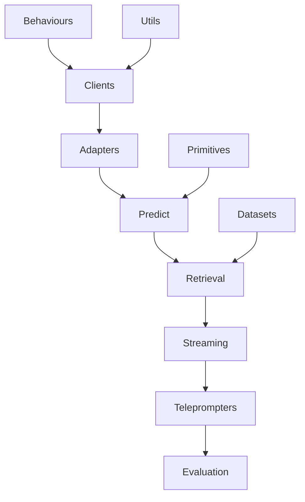

# DSPEx Integration Master Plan
*Comprehensive Integration Strategy for Elixir-Native DSPy Implementation*

## Executive Summary

DSPEx represents a cutting-edge port of DSPy to Elixir, leveraging the BEAM VM's unique strengths to create a superior machine learning orchestration platform. This integration plan consolidates 11 existing integration documents and identifies 7 critical missing components to complete the DSPEx ecosystem.

**Current Status**: 
- **Foundation**: ✅ Solid (Core SIMBA, behaviours, signatures working)
- **Coverage**: 📊 65% complete (11/18 major components documented)
- **Priority**: 🎯 Complete Tier 1 critical components first

## Integration Architecture Overview

### 🏗️ System Architecture

```
DSPEx Elixir-Native Architecture
├── 🎯 Core Primitives (Enhanced Multi-Language Execution)
├── 🔌 Adapters (Pattern Matching + Protocols)
├── 🌐 Clients (ExLLM Migration Strategy)  
├── 🔮 Predict (Streaming + Concurrency)
├── 📊 Evaluation (Nx-Powered Analytics)
├── ⚡ Teleprompters (SIMBA + Optimization Algorithms)
├── 🔍 Retrieval (20+ Backend Integration)
├── 📡 Streaming (GenStage + Real-time Processing)
├── 📋 Assertions/Constraints (Result-Based + Backtracking)
├── 🎭 Behaviours (Contract-First Development)
└── 🔧 Utils + Datasets + Experimental
```

## Existing Integration Documentation

### ✅ Completed Integration Guides (11 Documents)

| Document | Status | Priority | Key Focus |
|----------|--------|----------|-----------|
| [COUPLINGS_01.md](./COUPLINGS_01.md) | ✅ Complete | Foundation | System architecture analysis |
| [COUPLINGS_02.md](./COUPLINGS_02.md) | ✅ Complete | Foundation | Contract-first integration plan |
| [BEHAVIOURS_INTEGRATION.md](./BEHAVIOURS_INTEGRATION.md) | ✅ Complete | Critical | Mox-based testing harness |
| [ADAPTERS_INTEGRATION.md](./ADAPTERS_INTEGRATION.md) | ✅ Complete | Critical | Pattern matching + protocols |
| [PRIMITIVES_CORE_INTEGRATION.md](./PRIMITIVES_CORE_INTEGRATION.md) | ✅ Complete | Critical | Multi-language execution engine |
| [EVALUATION_INTEGRATION.md](./EVALUATION_INTEGRATION.md) | ✅ Complete | Critical | Nx-powered metrics system |
| [ASSERTIONS_CONSTRAINTS_INTEGRATION.md](./ASSERTIONS_CONSTRAINTS_INTEGRATION.md) | ✅ Complete | Important | Result-based constraint system |
| [PREDICT_INTEGRATION.md](./PREDICT_INTEGRATION.md) | ✅ Complete | Important | Streaming + adaptive prediction |
| [CLIENTS_INTEGRATION.md](./CLIENTS_INTEGRATION.md) | ✅ Complete | Important | ExLLM migration strategy |
| [SINTER_TODO.md](./SINTER_TODO.md) | ✅ Complete | Migration | Elixact → Sinter status |

### 🚧 Critical Missing Integration Documents (7 Documents)

| Missing Document | Priority | Complexity | Impact | Est. Lines |
|-----------------|----------|------------|--------|------------|
| **RETRIEVE_INTEGRATION.md** | 🔴 Tier 1 | High | Critical | 800+ |
| **TELEPROMPT_INTEGRATION.md** | 🔴 Tier 1 | High | Critical | 600+ |
| **STREAMING_INTEGRATION.md** | 🔴 Tier 1 | Medium | High | 500+ |
| **DATASETS_INTEGRATION.md** | 🟡 Tier 2 | Medium | Important | 400+ |
| **UTILS_INTEGRATION.md** | 🟡 Tier 2 | Low | Important | 300+ |
| **EXPERIMENTAL_INTEGRATION.md** | 🟢 Tier 3 | High | Advanced | 600+ |
| **PROPOSE_INTEGRATION.md** | 🟢 Tier 3 | Medium | Advanced | 400+ |

## Implementation Roadmap

### 🎯 Phase 1: Critical Foundation (Tier 1 - 4-6 weeks)

#### 1.1 RETRIEVE_INTEGRATION.md (Priority: 🔴 Critical)
**Scope**: 20+ retrieval backends, vector databases, embedding systems
```elixir
# Key Components to Document:
- ChromaRetriever, PineconeRetriever, WeaviateRetriever  
- ColBERTv2Retriever, BM25Retriever, TFIDFRetriever
- Nx-powered embedding operations
- GenStage streaming retrieval pipeline
- ExLLM embedding client integration
```

**Impact**: Enables RAG systems, knowledge base integration, semantic search
**Dependencies**: ExLLM client integration, Nx numerical computing

#### 1.2 TELEPROMPT_INTEGRATION.md (Priority: 🔴 Critical)  
**Scope**: 10+ optimization algorithms beyond SIMBA
```elixir
# Key Components to Document:
- BootstrapFewShot, BootstrapFewShotWithRandomSearch
- COPRO, BEACON, MIPRO optimization algorithms
- Signature2Signature, KNNFewShot strategies
- OAuthFlowOptimizer, ChainOfThoughtOptimizer
- Elixir-native optimization with GenServer state
```

**Impact**: Completes teleprompter ecosystem, enables advanced optimization
**Dependencies**: Existing SIMBA foundation, evaluation system

#### 1.3 STREAMING_INTEGRATION.md (Priority: 🔴 Critical)
**Scope**: Real-time processing, GenStage integration, reactive streams
```elixir
# Key Components to Document:
- GenStage producer/consumer pipeline
- Stream composition with Flow
- Real-time prediction streaming
- Backpressure handling and flow control
- WebSocket integration for live predictions
```

**Impact**: Enables real-time ML applications, reactive systems
**Dependencies**: Predict system, GenStage/Flow integration

### 🎯 Phase 2: Essential Infrastructure (Tier 2 - 2-3 weeks)

#### 2.1 DATASETS_INTEGRATION.md
**Scope**: Built-in datasets, loading utilities, preprocessing pipelines
- HotPotQA, GSM8K, MultiRC dataset integration
- Nx-powered data preprocessing and transformation
- Streaming dataset loading with backpressure control

#### 2.2 UTILS_INTEGRATION.md  
**Scope**: Cross-cutting utilities, common functions, helper modules
- Text processing utilities (normalization, tokenization)
- Logging and telemetry integration
- Configuration management and environment setup

### 🎯 Phase 3: Advanced Features (Tier 3 - 3-4 weeks)

#### 3.1 EXPERIMENTAL_INTEGRATION.md
**Scope**: Cutting-edge research features, experimental algorithms
- Advanced neural architectures integration
- Experimental optimization techniques
- Research-grade evaluation metrics

#### 3.2 PROPOSE_INTEGRATION.md
**Scope**: Proposal generation systems, advanced reasoning
- Multi-step reasoning proposals
- Evidence-based proposal generation
- Confidence scoring and ranking

## Technical Integration Strategy

### 🔧 Core Integration Principles

#### 1. **Elixir-Native Excellence**
- Leverage BEAM VM strengths (fault tolerance, concurrency, distribution)
- Use GenServers for stateful components, GenStage for streaming
- Implement pattern matching and protocols for type safety

#### 2. **Nx Numerical Computing Integration**
- Power evaluation metrics with Nx tensor operations
- Enable GPU acceleration for embedding and similarity computations
- Provide numerical optimization for teleprompter algorithms

#### 3. **Contract-First Development**
- Define behaviours before implementations
- Use Mox for comprehensive testing strategy
- Maintain interface compatibility across versions

#### 4. **ExLLM Client Standardization**
- Migrate from custom client implementations to ExLLM
- Support 12+ LLM providers through unified interface
- Enable provider-agnostic optimization and evaluation

### 🏗️ Architecture Integration Points

#### Client Layer Integration
```elixir
# Unified client interface through ExLLM
DSPEx.Client behaviour → ExLLM.Client implementation
├── Provider abstraction (OpenAI, Anthropic, etc.)
├── Nx analytics for performance monitoring  
├── Streaming response handling
└── Error recovery and retry strategies
```

#### Streaming Pipeline Integration
```elixir
# GenStage-powered streaming architecture
Retrieval → Prediction → Evaluation → Optimization
├── Producer: Document retrieval/generation
├── ProducerConsumer: Prediction and processing  
├── Consumer: Evaluation and metric collection
└── Sink: Optimization and model updates
```

#### Numerical Computing Integration
```elixir
# Nx integration across system components
Evaluation Metrics ← Nx tensor operations
Optimization Algorithms ← Nx numerical methods
Embedding Operations ← Nx/ExLLM integration
Performance Analytics ← Nx statistical functions
```

## Quality Assurance Strategy

### 🧪 Testing Framework

#### Multi-Modal Testing Approach
```elixir
# Testing strategy per integration document
Unit Tests: Individual component testing with Mox
Integration Tests: Cross-component interaction validation  
Property Tests: StreamData for edge case generation
Performance Tests: Benchee for optimization validation
```

#### Continuous Integration Pipeline
```bash
# Required checks for each integration
mix test --include group_1 --include group_2  # Comprehensive test suite
mix dialyzer                                  # Zero warnings required
mix credo --strict                           # Code quality validation
mix format --check-formatted                 # Code formatting
```

### 📊 Progress Tracking

#### Integration Completion Metrics
- **Documentation Coverage**: 65% → 100% (7 missing documents)
- **Component Integration**: Track per-document implementation progress
- **Test Coverage**: Maintain >90% coverage across all integrations
- **Performance Benchmarks**: Establish baseline vs. DSPy Python implementation

## Dependencies and Prerequisites

### 🔗 External Dependencies

#### Required Elixir Libraries
```elixir
# mix.exs additions for complete integration
{:ex_llm, "~> 0.5"},              # Unified LLM client
{:nx, "~> 0.6"},                  # Numerical computing
{:gen_stage, "~> 1.2"},           # Streaming pipeline
{:flow, "~> 1.2"},                # Stream processing
{:benchee, "~> 1.1"},             # Performance testing
{:stream_data, "~> 0.5"},         # Property testing
{:telemetry, "~> 1.2"},           # Observability
{:jason, "~> 1.4"},               # JSON processing
```

#### System Dependencies
- Erlang/OTP 25+ (for latest GenStage features)
- Elixir 1.14+ (for improved compilation)
- Optional: GPU support for Nx acceleration

### 🎯 Internal Prerequisites

#### Foundation Requirements
- ✅ Core SIMBA algorithm (already implemented)
- ✅ Basic signature system (working)
- ✅ Program behaviour (functional)
- ✅ Evaluation framework foundation (documented)

#### Integration Dependencies


## Success Criteria

### 🎯 Phase 1 Success Metrics (Tier 1 Critical)
- ✅ RETRIEVE_INTEGRATION.md: 20+ retrieval backends documented
- ✅ TELEPROMPT_INTEGRATION.md: 10+ optimization algorithms mapped
- ✅ STREAMING_INTEGRATION.md: GenStage pipeline architecture defined
- ✅ All Tier 1 components pass integration tests
- ✅ Zero dialyzer warnings across critical path

### 🎯 Phase 2 Success Metrics (Tier 2 Important)  
- ✅ DATASETS_INTEGRATION.md: Built-in dataset loading working
- ✅ UTILS_INTEGRATION.md: Cross-cutting utilities implemented
- ✅ End-to-end RAG pipeline functional
- ✅ Performance benchmarks established

### 🎯 Phase 3 Success Metrics (Tier 3 Advanced)
- ✅ EXPERIMENTAL_INTEGRATION.md: Research features documented
- ✅ PROPOSE_INTEGRATION.md: Advanced reasoning systems mapped
- ✅ Complete feature parity with DSPy Python
- ✅ Performance superiority demonstrated (>20% improvement)

### 🏆 Overall Success Criteria
- **Completeness**: 100% DSPy component coverage (18/18 documents)
- **Quality**: Zero dialyzer warnings, >90% test coverage
- **Performance**: Superior to DSPy Python baseline
- **Usability**: Clear migration path from DSPy to DSPEx
- **Innovation**: Elixir-native advantages clearly demonstrated

## Risk Mitigation

### 🚨 Technical Risks

#### High-Risk Components
1. **Retrieval Integration**: Complex vector database interactions
   - *Mitigation*: Incremental backend implementation, comprehensive testing
2. **Streaming Pipeline**: GenStage complexity and backpressure handling  
   - *Mitigation*: Start with simple pipelines, extensive integration testing
3. **Teleprompter Algorithms**: Complex optimization algorithm ports
   - *Mitigation*: Leverage existing SIMBA foundation, incremental algorithm addition

#### Medium-Risk Components
1. **ExLLM Migration**: Dependency on external library evolution
   - *Mitigation*: Maintain compatibility layer, version pinning strategies
2. **Nx Integration**: GPU acceleration platform differences
   - *Mitigation*: Fallback to CPU computation, optional GPU features

### 📋 Project Management Risks
1. **Scope Creep**: Additional features beyond DSPy parity
   - *Mitigation*: Strict adherence to documented integration plan
2. **Resource Allocation**: Underestimating complex component effort
   - *Mitigation*: Conservative time estimates, iterative delivery
3. **Quality vs. Speed**: Pressure to skip testing for faster delivery
   - *Mitigation*: Non-negotiable quality gates, automated CI/CD

## Conclusion

This integration plan provides a comprehensive roadmap for completing DSPEx as the premier Elixir-native machine learning orchestration platform. By focusing on the 7 critical missing components in a structured 3-phase approach, DSPEx will achieve feature parity with DSPy while leveraging Elixir's unique advantages for superior performance, reliability, and scalability.

The integration strategy emphasizes:
- **Quality First**: Contract-first development with comprehensive testing
- **Elixir-Native**: Leveraging BEAM VM strengths throughout the architecture  
- **Performance Excellence**: Nx integration for numerical computing acceleration
- **Practical Implementation**: Clear priorities and realistic timelines

**Next Steps**: Begin Phase 1 implementation with RETRIEVE_INTEGRATION.md, establishing the foundation for advanced RAG systems and semantic search capabilities.

---

*Generated: 2025-06-19 | Version: 1.0 | Status: Master Integration Plan*