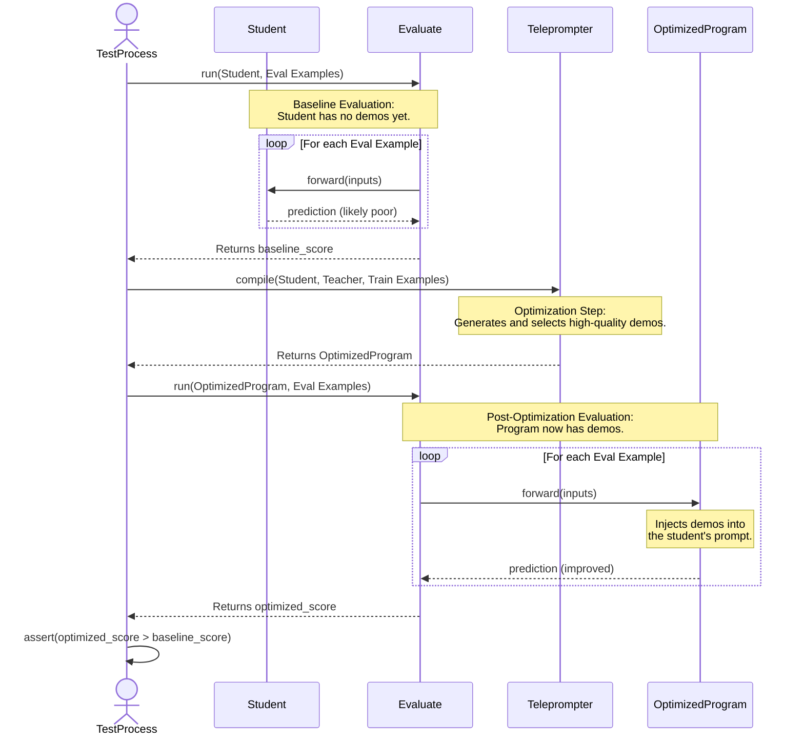
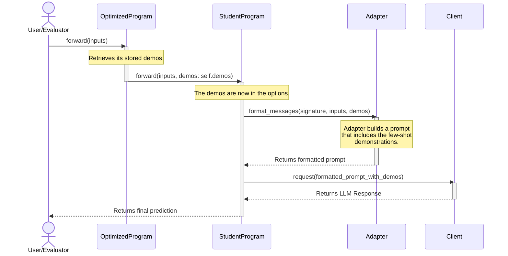

This is a full write-up on the internals of the test file `integration/full_optimization_workflow_test.exs` and the underlying DSPEx code it is testing.

### High-Level Objective of the Test Suite

The `full_optimization_workflow_test.exs` suite serves as a comprehensive, end-to-end integration test for the entire DSPEx optimization pipeline. Its primary purpose is to validate that all core components of the library—Signatures, Programs, Evaluation, and Teleprompters—work together correctly to achieve a measurable improvement in a program's performance.

This is a critical test for "SIMBA readiness," indicating that it validates the exact workflow that a larger system (presumably SIMBA) will rely on for automated program optimization. It tests not just the "happy path" but also more complex scenarios like Chain-of-Thought (CoT) reasoning and error recovery.

---

### Key DSPEx Components Tested

To understand the test, one must first understand the core components of the `DSPEx` library that are being orchestrated.

1.  **`DSPEx.Signature`**: This is the schema or interface definition for a language model interaction. It's created using a `use DSPEx.Signature, "input -> output"` macro, which declaratively defines the input and output fields. It's the contract that a program must adhere to.

2.  **`DSPEx.Example`**: A data structure that holds a single data point, typically containing both inputs and expected outputs (labels). It's used for training and evaluation datasets. `Example.with_inputs/2` is used to designate which fields are inputs, with the rest being treated as labels.

3.  **`DSPEx.Predict`**: This is a fundamental implementation of the `DSPEx.Program` behavior. It takes a `Signature` and a client (e.g., `:gemini`) to create a "program" that can make predictions. It uses an adapter to format the inputs into a prompt and parse the LLM's response back into the signature's output fields.

4.  **`DSPEx.Evaluate`**: This is the evaluation engine. It takes a program, a dataset of `Example` structs, and a metric function. It runs the program on each example's inputs, compares the program's prediction to the example's labels using the metric function, and calculates an aggregate score and detailed statistics. It uses `Task.async_stream` for concurrent evaluation.

5.  **`DSPEx.Teleprompter.BootstrapFewShot`**: This is the core optimization engine being tested. Its `compile/5` function implements the Bootstrap Few-Shot algorithm:
    *   It takes a "student" program (to be optimized) and a "teacher" program (a more powerful model).
    *   It runs the **teacher** program on a `trainset` of examples to generate high-quality, "gold-standard" demonstrations.
    *   It evaluates these generated demonstrations using the provided `metric_fn` to assign a quality score to each.
    *   It filters and selects the highest-quality demonstrations.
    *   It returns a new, optimized program.

6.  **`DSPEx.OptimizedProgram`**: This is a wrapper struct that represents the output of a teleprompter. It contains the original student program along with the list of high-quality `demos` (demonstration examples) that were selected during optimization. When this optimized program is executed, it passes these demos to the underlying program to improve its performance, typically by including them in the prompt as few-shot examples.

7.  **`DSPEx.MockClientManager`**: A crucial component for testing. It provides a mock implementation of the LLM client interface. The tests use `setup_qa_mocks()` helper functions to call `MockClientManager.set_mock_responses/2`, pre-programming the "LLM" with deterministic answers. This ensures that tests are fast, repeatable, and don't depend on live API keys or network conditions.

---

### Detailed Test Walkthrough: Complete Question Answering Workflow

The most important test is `test "defines signature, creates program, evaluates, and optimizes with measurable improvement"`. It validates the entire pipeline from start to finish.

#### Test Internals (The "How")

1.  **Step 1: Define Signature**
    ```elixir
    defmodule QAWorkflowSignature do
      use DSPEx.Signature, "question -> answer"
    end
    ```
    This sets the contract for the entire workflow. All programs and examples will be expected to have a `:question` input and an `:answer` output.

2.  **Step 2: Create Programs**
    ```elixir
    teacher = DSPEx.Predict.new(QAWorkflowSignature, :gemini, model: "gemini-pro")
    student = DSPEx.Predict.new(QAWorkflowSignature, :gemini, model: "gemini-1.5-flash")
    ```
    Two programs are created. The `teacher` is intended to be a more powerful model that generates high-quality answers. The `student` is a faster/cheaper model that we want to optimize.

3.  **Step 3: Prepare Datasets**
    ```elixir
    training_examples = create_qa_training_examples()
    evaluation_examples = create_qa_evaluation_examples()
    ```
    The test sets up two distinct datasets:
    *   `training_examples`: Used by the teleprompter to generate high-quality demonstrations.
    *   `evaluation_examples`: A hold-out set used to measure the performance of the student program *before* and *after* optimization to verify improvement.

4.  **Step 4: Configure Mocks**
    ```elixir
    setup_qa_mocks()
    ```
    This helper function is critical. It calls `DSPEx.MockClientManager.set_mock_responses/2` to provide a list of predefined string answers. When `DSPEx.Predict` internally calls the client, the `MockClientManager` intercepts the call and returns one of these canned responses instead of making a real API call. This makes the test deterministic.

5.  **Step 5: Baseline Evaluation**
    ```elixir
    metric_fn = create_qa_accuracy_metric()
    {:ok, baseline_result} = DSPEx.Evaluate.run(student, evaluation_examples, metric_fn)
    ```
    The un-optimized `student` program is evaluated on the `evaluation_examples`. The `metric_fn` in the test is very lenient for mock testing; it checks if the prediction has a non-empty `:answer` field. The resulting `baseline_result.score` serves as the performance benchmark to beat.

6.  **Step 6: Optimization**
    ```elixir
    {:ok, optimized_program} =
      DSPEx.Teleprompter.BootstrapFewShot.compile(
        student,
        teacher,
        training_examples,
        metric_fn,
        ...
      )
    ```
    This is the core of the test. The `BootstrapFewShot.compile` function is called.
    *   **Internally**: It iterates through `training_examples`, sending each question to the `teacher` program.
    *   The `teacher` (backed by the mock client) "predicts" an answer.
    *   The teleprompter creates a new `Example` (a demo) from the teacher's prediction.
    *   It then uses the `metric_fn` to score the quality of this generated demo.
    *   After processing all training examples, it filters for high-quality demos and returns an `OptimizedProgram` struct containing the original `student` and the best `demos`.

7.  **Step 7: Post-Optimization Evaluation**
    ```elixir
    {:ok, optimized_result} =
      DSPEx.Evaluate.run(optimized_program, evaluation_examples, metric_fn)
    ```
    The newly created `optimized_program` is evaluated against the **same** `evaluation_examples`. When `DSPEx.Program.forward` is called on `optimized_program`, it injects the stored `demos` into the prompt sent by the underlying `student` program. The mock client then provides a (presumably better) response because the prompt now contains few-shot examples.

8.  **Step 8: Verify Improvement**
    ```elixir
    improvement = optimized_score - baseline_score
    assert improvement >= @improvement_threshold
    ```
    This is the final assertion. The test calculates the difference between the optimized score and the baseline score and asserts that the improvement meets or exceeds a defined threshold (0.0 in this mock test, meaning no degradation is allowed).

### Other Workflow Tests

*   **Chain of Thought (CoT) Workflow**: This test uses a signature like `"question -> reasoning, answer"`. The metric function rewards both a correct answer and the presence of a reasoning step. The test validates that the teleprompter can generate and select demos that include this reasoning, thereby teaching the student program to "think step-by-step."

*   **Multi-Step Reasoning Workflow**: This test demonstrates program composition. It defines three separate signatures (`DecompositionSignature`, `StepExecutionSignature`, `SynthesisSignature`) and chains their corresponding programs together. It validates that the output of one program can serve as the input for the next, completing a complex task.

*   **Error Recovery Workflows**: These tests validate the system's robustness. They use mock configurations that simulate API failures or malformed responses. The tests assert that the evaluation and optimization processes can continue gracefully (e.g., by skipping failed examples) and still produce a valid, albeit potentially smaller, set of demonstrations.

### Code Internals Being Tested

This test suite touches almost every major public-facing module in `DSPEx`.

*   **`DSPEx.Signature` (`dspex/signature.ex`)**: The test relies on the `use DSPEx.Signature` macro to correctly parse the signature string, define the struct, and generate `input_fields/0` and `output_fields/0` functions.
*   **`DSPEx.Predict` (`dspex/predict.ex`)**: The test validates that `Predict.new/3` correctly creates a program struct and that its `forward/3` implementation correctly orchestrates the pipeline:
    1.  Validates inputs against the signature.
    2.  Calls the adapter to format a prompt.
    3.  Calls the client to get a response.
    4.  Calls the adapter to parse the response into the output fields.
*   **`DSPEx.Evaluate` (`dspex/evaluate.ex`)**: The test confirms that `run/4` correctly:
    1.  Validates its inputs (program, examples, metric).
    2.  Uses `Task.async_stream` to execute `DSPEx.Program.forward` on all examples concurrently.
    3.  Applies the `metric_fn` to each result.
    4.  Aggregates the scores and statistics (total, successful, failed, throughput) into a final, valid `evaluation_result` struct.
*   **`DSPEx.Teleprompter.BootstrapFewShot` (`dspex/teleprompter/bootstrap_fewshot.ex`)**: The test directly validates the `compile/5` function's logic, ensuring it correctly uses the teacher, trainset, and metric to produce an `OptimizedProgram`.
*   **`DSPEx.OptimizedProgram` (`dspex/optimized_program.ex`)**: The test verifies that this wrapper is created correctly and that its `forward/3` implementation successfully injects the stored `demos` into the underlying program's execution, leading to the measured performance improvement.

In summary, `full_optimization_workflow_test.exs` is not just testing individual functions but the **synergy between all major components** of the DSPEx library, proving that they can be composed to achieve the library's primary goal: automated program optimization.


Of course. Here is a series of detailed Mermaid diagrams illustrating the internals of the `full_optimization_workflow_test.exs` test and the application code it is testing.

### Diagram 1: Test Setup and Components

This diagram provides a static overview of all the actors, data structures, and mock components involved in the `full_optimization_workflow_test.exs` before the main execution flow begins.

```mermaid
graph TD
    TEST_TITLE["full_optimization_workflow_test.exs"]
    PROG_TITLE["Programs"]
    DATA_TITLE["Datasets"]
    LOGIC_TITLE["Core&nbsp;Logic"]
    MOCK_TITLE["Mocks"]

    subgraph Test_Setup [" "]
        direction LR
        TEST_TITLE
        T_PROCESS[Test Process]
    end

    subgraph Programs [" "]
        PROG_TITLE
        TEACHER["Teacher Program (Predict)<br/>Model: gemini-pro"]
        STUDENT["Student Program (Predict)<br/>Model: gemini-1.5-flash"]
    end

    subgraph Datasets [" "]
        direction TB
        DATA_TITLE
        TRAIN_EXAMPLES["Training Examples<br/>(DSPEx.Example)"]
        EVAL_EXAMPLES["Evaluation Examples<br/>(DSPEx.Example)"]
    end

    subgraph Core_Logic [" "]
        LOGIC_TITLE
        EVALUATE[DSPEx.Evaluate]
        TELEPROMPTER[DSPEx.Teleprompter.BootstrapFewShot]
    end

    subgraph Mocks [" "]
        MOCK_TITLE
        MOCK_CLIENT["MockClientManager<br/>(Pre-programmed responses)"]
    end

    T_PROCESS -->|creates| TEACHER
    T_PROCESS -->|creates| STUDENT
    T_PROCESS -->|defines| TRAIN_EXAMPLES
    T_PROCESS -->|defines| EVAL_EXAMPLES

    T_PROCESS -->|calls| EVALUATE
    T_PROCESS -->|calls| TELEPROMPTER

    TEACHER -.->|uses| MOCK_CLIENT
    STUDENT -.->|uses| MOCK_CLIENT

    %% Elixir Theme - Purple/Violet color scheme
    style TEST_TITLE fill:#663399,stroke:#4a0080,stroke-width:3px,color:#fff
    style PROG_TITLE fill:#663399,stroke:#4a0080,stroke-width:3px,color:#fff
    style DATA_TITLE fill:#663399,stroke:#4a0080,stroke-width:3px,color:#fff
    style LOGIC_TITLE fill:#663399,stroke:#4a0080,stroke-width:3px,color:#fff
    style MOCK_TITLE fill:#663399,stroke:#4a0080,stroke-width:3px,color:#fff
    
    style T_PROCESS fill:#9966cc,stroke:#663399,stroke-width:2px,color:#fff
    style TEACHER fill:#b399d9,stroke:#8b66b3,stroke-width:2px,color:#000
    style STUDENT fill:#b399d9,stroke:#8b66b3,stroke-width:2px,color:#000
    style TRAIN_EXAMPLES fill:#d9ccf2,stroke:#b399d9,stroke-width:2px,color:#000
    style EVAL_EXAMPLES fill:#d9ccf2,stroke:#b399d9,stroke-width:2px,color:#000
    style EVALUATE fill:#cc99e6,stroke:#9966cc,stroke-width:2px,color:#000
    style TELEPROMPTER fill:#cc99e6,stroke:#9966cc,stroke-width:2px,color:#000
    style MOCK_CLIENT fill:#e6ccf2,stroke:#cc99e6,stroke-width:2px,color:#000
```



**Diagram Explanation:**
*   The **Test Process** is the orchestrator. It creates the `Teacher` and `Student` programs, which are instances of `DSPEx.Predict`.
*   It defines two distinct datasets: `Training Examples` for the optimization process and `Evaluation Examples` for measuring performance.
*   The core logic modules, `DSPEx.Evaluate` and `DSPEx.Teleprompter`, are called by the test to perform their respective functions.
*   Crucially, both the `Teacher` and `Student` programs are configured to use the `MockClientManager`, ensuring that no real API calls are made and that the test is deterministic and fast.

---

### Diagram 2: End-to-End Test Execution Flow

This sequence diagram illustrates the dynamic, step-by-step execution flow of the main test case, showing how the components interact over time to achieve and verify the optimization.



**Diagram Explanation:**
1.  **Baseline Evaluation**: The test first evaluates the initial `Student` program. The `Student` has no few-shot examples (`demos`), so its performance is expected to be suboptimal. The result is the `baseline_score`.
2.  **Optimization**: The test then calls the `Teleprompter.compile` function. This is where the core optimization happens. It uses the `Teacher` program to create high-quality demonstrations and returns a new `OptimizedProgram`.
3.  **Post-Optimization Evaluation**: The new `OptimizedProgram` is evaluated on the exact same dataset. This time, the program has access to the demonstrations, which are used to construct a better prompt, leading to an improved prediction.
4.  **Assertion**: The final step is to assert that the `optimized_score` is greater than the `baseline_score`, proving the workflow was successful.

---

### Diagram 3: App Internals - `DSPEx.Evaluate.run`

This diagram shows the internal mechanics of the `DSPEx.Evaluate.run/4` function, which is called twice in the test. It highlights the concurrent processing of examples.

```mermaid
flowchart TD
    EVAL_TITLE["DSPEx.Evaluate.run"]
    CONCURRENT_TITLE["Concurrent&nbsp;Processing&nbsp;(for&nbsp;each&nbsp;example)"]

    subgraph Evaluate_Run [" "]
        EVAL_TITLE
        A["Start: run(program, examples, metric_fn)"] --> B{Validate Inputs}
        B -->|OK| C[Start Timer & Telemetry]
        C --> D["Task.async_stream(examples)"]
        D --> E[Collect Results: scores & errors]
        E --> F[Stop Timer & Telemetry]
        F --> G["Aggregate Stats<br/>(avg score, success rate, throughput)"]
        G --> H[Return evaluation_result]
    end

    subgraph Concurrent_Processing [" "]
        CONCURRENT_TITLE
        D1["Program.forward(example.inputs)"] --> D2[Get Prediction]
        D2 --> D3["metric_fn(example, prediction)"]
        D3 --> D4[Get Score]
    end

    %% Elixir Theme - Purple/Violet color scheme
    style EVAL_TITLE fill:#663399,stroke:#4a0080,stroke-width:3px,color:#fff
    style CONCURRENT_TITLE fill:#663399,stroke:#4a0080,stroke-width:3px,color:#fff
    
    style A fill:#9966cc,stroke:#663399,stroke-width:2px,color:#fff
    style B fill:#b399d9,stroke:#8b66b3,stroke-width:2px,color:#000
    style C fill:#cc99e6,stroke:#9966cc,stroke-width:2px,color:#000
    style D fill:#d9ccf2,stroke:#b399d9,stroke-width:2px,color:#000
    style E fill:#cc99e6,stroke:#9966cc,stroke-width:2px,color:#000
    style F fill:#cc99e6,stroke:#9966cc,stroke-width:2px,color:#000
    style G fill:#b399d9,stroke:#8b66b3,stroke-width:2px,color:#000
    style H fill:#9966cc,stroke:#663399,stroke-width:2px,color:#fff
    
    style D1 fill:#e6ccf2,stroke:#cc99e6,stroke-width:2px,color:#000
    style D2 fill:#e6ccf2,stroke:#cc99e6,stroke-width:2px,color:#000
    style D3 fill:#e6ccf2,stroke:#cc99e6,stroke-width:2px,color:#000
    style D4 fill:#e6ccf2,stroke:#cc99e6,stroke-width:2px,color:#000
```



**Diagram Explanation:**
*   The `Evaluate.run` function first validates its arguments.
*   The core of its operation is `Task.async_stream`, which takes the list of `examples` and processes them concurrently, up to a specified `max_concurrency` limit.
*   For each example, it calls the `program.forward` function to get a `prediction`.
*   It then invokes the user-provided `metric_fn` to compare the `prediction` with the example's expected outputs, yielding a numeric `score`.
*   After all tasks are complete, it collects all the scores and errors, aggregates them into the final statistics (average score, success rate, etc.), and returns the final result.

---

### Diagram 4: App Internals - `DSPEx.Teleprompter.BootstrapFewShot.compile`

This flowchart details the multi-stage optimization process inside the `BootstrapFewShot.compile` function.

```mermaid
flowchart TD
    BOOTSTRAP_TITLE["DSPEx.Teleprompter.BootstrapFewShot.compile"]

    subgraph Bootstrap_Compile [" "]
        BOOTSTRAP_TITLE
        A["Start: student, teacher, trainset, metric_fn"] --> B["Stage 1: Generate Bootstrap Demos"]
        B --> C["Task.async_stream(trainset)"]
        C --> D{For each example}
        D --> E["teacher.forward(example.inputs)"]
        E --> F["Create Bootstrap Candidate (Example)"]
        F --> D
        D --> G["Stage 2: Evaluate Demonstrations"]
        G --> H["Task.async_stream(candidates)"]
        H --> I{For each candidate demo}
        I --> J["metric_fn(demo, demo.outputs)"]
        J --> K[Get Quality Score]
        K --> L[Attach score to demo]
        L --> I
        I --> M["Stage 3: Select Best Demos"]
        M --> N["Filter by quality_threshold"]
        N --> O["Sort by score (desc)"]
        O --> P["Take top N demos"]
        P --> Q["End: Return OptimizedProgram<br/>(student + selected_demos)"]
    end

    %% Elixir Theme - Purple/Violet color scheme
    style BOOTSTRAP_TITLE fill:#663399,stroke:#4a0080,stroke-width:3px,color:#fff
    
    style A fill:#9966cc,stroke:#663399,stroke-width:2px,color:#fff
    style B fill:#b399d9,stroke:#8b66b3,stroke-width:2px,color:#000
    style C fill:#cc99e6,stroke:#9966cc,stroke-width:2px,color:#000
    style D fill:#d9ccf2,stroke:#b399d9,stroke-width:2px,color:#000
    style E fill:#e6ccf2,stroke:#cc99e6,stroke-width:2px,color:#000
    style F fill:#e6ccf2,stroke:#cc99e6,stroke-width:2px,color:#000
    style G fill:#b399d9,stroke:#8b66b3,stroke-width:2px,color:#000
    style H fill:#cc99e6,stroke:#9966cc,stroke-width:2px,color:#000
    style I fill:#d9ccf2,stroke:#b399d9,stroke-width:2px,color:#000
    style J fill:#e6ccf2,stroke:#cc99e6,stroke-width:2px,color:#000
    style K fill:#e6ccf2,stroke:#cc99e6,stroke-width:2px,color:#000
    style L fill:#e6ccf2,stroke:#cc99e6,stroke-width:2px,color:#000
    style M fill:#b399d9,stroke:#8b66b3,stroke-width:2px,color:#000
    style N fill:#cc99e6,stroke:#9966cc,stroke-width:2px,color:#000
    style O fill:#cc99e6,stroke:#9966cc,stroke-width:2px,color:#000
    style P fill:#cc99e6,stroke:#9966cc,stroke-width:2px,color:#000
    style Q fill:#9966cc,stroke:#663399,stroke-width:2px,color:#fff
```



**Diagram Explanation:**
1.  **Stage 1: Generate Demos**: The teleprompter iterates over the `trainset` and uses the powerful `teacher` program to generate high-quality outputs for each input. Each input/output pair is saved as a "bootstrap candidate" `Example`.
2.  **Stage 2: Evaluate Demos**: Each of these candidate demonstrations is then evaluated *against itself* using the `metric_fn`. This step is crucial for assigning a `quality_score` to each demonstration generated by the teacher.
3.  **Stage 3: Select Best Demos**: The scored demonstrations are first filtered, keeping only those that meet the `quality_threshold`. They are then sorted by their score, and the top `N` are selected.
4.  **Output**: Finally, a new `DSPEx.OptimizedProgram` is created, which wraps the original `student` program and includes the list of `selected_demos`.

---

### Diagram 5: App Internals - `OptimizedProgram.forward` Execution

This final diagram shows what happens when the `OptimizedProgram` (the output of the teleprompter) is executed. It explains how the few-shot demonstrations improve the student's performance.



**Diagram Explanation:**
*   When `forward` is called on the `OptimizedProgram`, its primary job is to delegate the call to the underlying `StudentProgram`.
*   **The key step**: It injects its stored `demos` into the `opts` keyword list passed to the student's `forward` function.
*   The `StudentProgram` (an instance of `DSPEx.Predict`) passes these inputs and demos to the `Adapter`.
*   The `Adapter` is responsible for constructing the final prompt. It now has access to the few-shot `demos` and includes them in the prompt sent to the LLM via the `Client`.
*   This enriched, example-laden prompt guides the LLM to produce a higher-quality, more structured response, thus realizing the performance improvement measured by the test.
