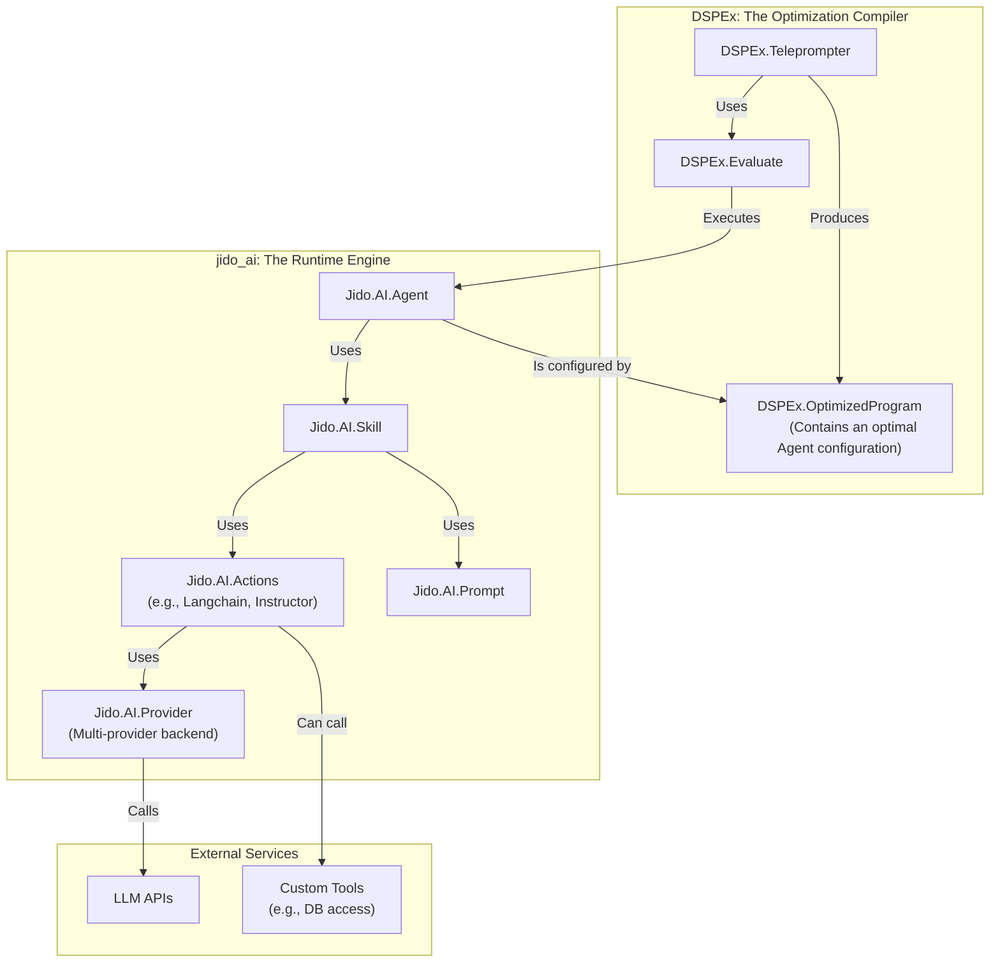

Of course. Let's conduct a fit analysis for `jido_ai` proper, assuming the `jido_action` and `jido_signal` components are or will be separated out. This analysis will focus on how `jido_ai`'s core functionalities—its provider abstractions, prompt management, and agent/skill model—can integrate with and enhance the DSPEx vision.

### Executive Summary

**`jido_ai` is an excellent and highly synergistic fit for DSPEx.** It is not a competing framework but rather a powerful, feature-rich **LLM runtime engine** that DSPEx currently has a simplified, less robust version of.

*   **Direct Replacement for Core Components**: `jido_ai`'s `Provider`, `Model`, and `Keyring` modules are a production-ready, superior replacement for DSPEx's `Client` and `ClientManager`. Adopting them would immediately provide DSPEx with a more stable, configurable, and extensible multi-provider backend.
*   **Powerful Abstractions**: `jido_ai`'s `Prompt` and `Instructor`-based actions offer a far more sophisticated way to handle structured I/O and prompt engineering than DSPEx's simple `Signature` macro.
*   **Complementary Roles**: The integration creates a powerful separation of concerns:
    *   **`jido_ai` becomes the Runtime Engine**: It handles the operational complexity of interacting with LLMs (API calls, key management, prompt rendering, tool use).
    *   **`DSPEx` becomes the Optimization Compiler**: It orchestrates the `jido_ai` runtime, using `Evaluate` and `Teleprompter` to find the optimal configurations (prompts, tools, models) for a given task.

This integration would allow DSPEx to focus on its core mission—**program optimization**—by offloading the complex details of LLM interaction to a specialized, robust library.

---

### Conceptual Alignment: DSPEx vs. `jido_ai`

| DSPEx Concept | `jido_ai` Equivalent | Synergy / Improvement |
| :--- | :--- | :--- |
| `DSPEx.Client` / `ClientManager` | `Jido.AI.Provider`, `Model`, `Keyring` | `jido_ai` provides a more complete, multi-provider abstraction with superior configuration and key management. |
| `DSPEx.Signature` | `Jido.AI.Prompt` + `Instructor` Schemas | `jido_ai` offers a richer, more expressive way to define I/O contracts, including templating, versioning, and complex structured output. |
| `DSPEx.Program` | `Jido.AI.Agent` | A `Jido.AI.Agent` is a more advanced, stateful implementation of an executable program. A `DSPEx.Program` can be seen as a wrapper that *configures and calls* an Agent. |
| `DSPEx.Adapter` | Provider-specific logic within `jido_ai` | The translation logic is encapsulated within each provider adapter, making it more modular and extensible. |
| Tools (e.g., `Arithmetic.Add`) | `Jido.AI.Actions.*` (and `Jido.Action`) | `jido_ai` has a clear concept of an `Agent` using `tools`. This aligns perfectly with DSPy's `ReAct` patterns. |
| `DSPEx.Teleprompter` | *No direct equivalent* | This is DSPEx's unique value. The teleprompter would *optimize* the configuration of a `Jido.AI.Agent` (e.g., its prompt template or toolset). |
| `DSPEx.Evaluate` | *No direct equivalent* | The `Evaluate` module would be used by the `Teleprompter` to score the performance of different `Jido.AI.Agent` configurations. |

---

### Proposed Integration Strategy

The integration can be planned in two major phases: first, replacing the client backend, and second, adopting the higher-level agent model.

#### Phase 1: Unifying the Client and Provider Layer

This is the most immediate and impactful integration. DSPEx would delegate all LLM API communication to `jido_ai`.

**Before: Current DSPEx Structure**

```elixir
# lib/dspex/predict.ex
defmodule DSPEx.Predict do
  # ...
  def forward(program, inputs, opts) do
    # ...
    # Uses its own internal DSPEx.Client to make HTTP calls
    DSPEx.Client.request(program.client, messages, opts)
    # ...
  end
end
```

**After: Proposed Integration with `jido_ai`**

```elixir
# lib/dspex/predict.ex (Refactored)
defmodule DSPEx.Predict do
  # ...
  def forward(program, inputs, opts) do
    # 1. The program is now configured with a Jido.AI.Model struct
    #    This struct contains all provider info (API key, URL, etc.)
    model = program.model # e.g., %Jido.AI.Model{provider: :anthropic, ...}

    # 2. The prompt is now a Jido.AI.Prompt struct
    prompt = Jido.AI.Prompt.new(:user, "What is 2+2?")

    # 3. All LLM calls are delegated to a Jido.AI.Action
    #    This action encapsulates all the provider-specific logic.
    #    DSPEx no longer manages HTTP clients or API keys directly.
    Jido.Exec.run(Jido.AI.Actions.Langchain, %{
      model: model,
      prompt: prompt,
      tools: program.tools
    })
  end
end
```

**Benefits of Phase 1:**

1.  **Robustness:** Immediately replaces DSPEx's simple client with `jido_ai`'s production-ready, multi-provider system.
2.  **Configuration:** Centralizes all provider and API key management in `Jido.AI.Keyring`, removing fragile environment variable logic from DSPEx.
3.  **Extensibility:** DSPEx automatically gains support for any new provider added to `jido_ai` (OpenRouter, Cloudflare, etc.) without any changes to its own codebase.

#### Phase 2: Adopting the Agent Model for Execution

This phase reframes the relationship between DSPEx's `Program` and `jido_ai`'s `Agent`. A DSPEx `Program` becomes a declarative configuration *for* a `Jido.AI.Agent`.

**Before: `DSPEx.Program` is the executor.**

```elixir
# A DSPEx Program directly contains the logic to execute a prediction.
program = %DSPEx.Predict{signature: MySignature, client: :openai}
DSPEx.Program.forward(program, %{question: "What is 2+2?"})
```

**After: `DSPEx.Program` configures a `Jido.AI.Agent`, which is the executor.**

```elixir
# The DSPEx.Program now holds the *configuration* for an agent.
program_config = %{
  prompt_template: "You are a math genius. Solve: <%= @message %>",
  tools: [Jido.Actions.Arithmetic.Add],
  model: {:anthropic, model: "claude-3-haiku-20240307"}
}

# The `forward` call now starts/configures a Jido.AI.Agent and calls it.
def DSPEx.Program.forward(program_config, inputs) do
  # 1. Start a Jido.AI.Agent with the program's configuration
  {:ok, agent_pid} = Jido.AI.Agent.start_link(
    ai: [
      model: program_config.model,
      prompt: program_config.prompt_template,
      tools: program_config.tools
    ]
  )

  # 2. Use the agent to get the response
  Jido.AI.Agent.tool_response(agent_pid, inputs.message)
end
```

**The Role of the `Teleprompter` in this New World:**

The `DSPEx.Teleprompter`'s job becomes much clearer and more powerful. Instead of optimizing a simple `Predict` module, it optimizes the *configuration* of a full `Jido.AI.Agent`.

*   `BootstrapFewShot` would generate high-quality `demos`.
*   `SIMBA` would find the optimal combination of:
    *   The `prompt_template` string.
    *   The list of `tools` to provide to the agent.
    *   The `model` configuration (e.g., finding that GPT-4 is better for instruction generation while Gemini is better for evaluation).

The output of the teleprompter would be an `OptimizedProgram` containing the best `program_config` found.

### Final Proposed Architecture

This diagram illustrates the clear separation of concerns, with DSPEx acting as the "compiler" and `jido_ai` acting as the "runtime."



### Strategic Recommendation

1.  **Embrace `jido_ai` as the core runtime engine.** The code quality, feature set, and architectural patterns in `jido_ai` are more mature and robust for LLM interaction than what DSPEx currently has.
2.  **Execute a Two-Phase Integration:**
    *   **Phase 1 (Immediate Priority):** Replace `DSPEx.Client` and `DSPEx.ClientManager` with `jido_ai`'s provider stack (`Provider`, `Model`, `Keyring`). This is a low-risk, high-reward change that immediately improves the stability and capability of DSPEx's backend.
    *   **Phase 2 (Strategic Refactor):** Redefine `DSPEx.Program` as a configuration wrapper for a `Jido.AI.Agent`. This will align the two libraries perfectly, allowing DSPEx to focus purely on optimizing the behavior of the powerful, generic `jido_ai` agent.
3.  **Clarify the "Action" concept.** `jido_ai` uses the term "Action" for its high-level integrations (e.g., `Langchain.ToolResponse`), while the `jido_action` library defines a more fundamental, generic behavior. The integration should standardize on the `jido_action` behavior for all tools, and the `Jido.AI.Actions` modules should be refactored to implement this behavior.

By adopting this strategy, DSPEx can leapfrog its own development roadmap, inherit a production-grade runtime, and focus on delivering its unique value proposition: **the automated, concurrent, and fault-tolerant optimization of AI programs on the BEAM.**
