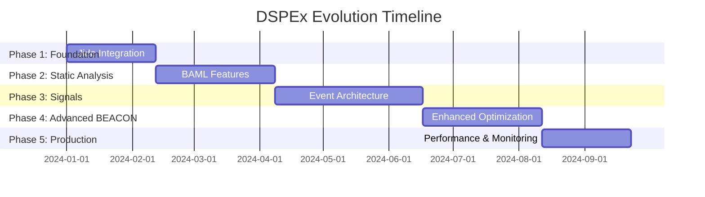

# DSPEx Evolution Plan: State-of-the-Art AI Program Optimization Framework

Based on the codebase analysis and integration proposals, here's a comprehensive plan to transform DSPEx into a state-of-the-art framework by integrating Jido's core capabilities with BAML-inspired enhancements.

## Executive Summary

DSPEx currently implements DSPy concepts well but can be elevated to state-of-the-art by:
1. **Adopting Jido's robust execution foundation** (replacing custom execution with battle-tested patterns)
2. **Adding BAML-inspired static analysis** for compile-time safety
3. **Leveraging Jido's signal system** for decoupled, observable optimization workflows
4. **Enhancing BEACON** with the new architecture (since DSPy devs specifically requested this!)

This creates a uniquely powerful framework: **DSPy's optimization intelligence + Jido's BEAM-native robustness + BAML's compile-time safety**.

## Phase 1: Foundation Migration (4-6 weeks)

### 1.1 Replace DSPEx.Program with Jido.Action

**Current State:**
```elixir
# DSPEx.Predict implements DSPEx.Program behavior
defmodule DSPEx.Predict do
  use DSPEx.Program
  def forward(program, inputs, opts), do: # custom logic
end
```

**Target State:**
```elixir
# DSPEx programs become specialized Jido Actions
defmodule DSPEx.Actions.Predict do
  use Jido.Action,
    name: "llm_predict",
    description: "Execute LLM prediction with signature validation",
    schema: [
      signature: [type: :atom, required: true],
      inputs: [type: :map, required: true],
      demos: [type: :list, default: []]
    ]

  @impl Jido.Action
  def run(%{signature: sig, inputs: inputs, demos: demos}, context) do
    # Existing DSPEx.Predict logic here, but now with:
    # - Built-in retries, timeouts, telemetry from Jido.Action
    # - Proper error handling patterns
    # - Standardized context passing
  end
end
```

**Migration Strategy:**
- Keep existing `DSPEx.Predict.forward/3` as a compatibility wrapper
- Gradually migrate internals to use `Jido.Exec.run/4`
- Maintain backward compatibility during transition

### 1.2 Enhance Execution with Jido.Exec

**Benefits Gained:**
- **Robust timeouts**: Critical for BEACON's concurrent optimization
- **Automatic retries**: Handle LLM API flakiness gracefully  
- **Async execution**: Enable parallel evaluation in teleprompters
- **Built-in telemetry**: Rich observability out of the box

```elixir
# Before: Custom execution logic
{:ok, result} = DSPEx.Predict.forward(program, inputs)

# After: Robust execution with Jido
{:ok, result} = Jido.Exec.run(
  DSPEx.Actions.Predict,
  %{signature: QASignature, inputs: inputs},
  %{client: :openai},
  timeout: 30_000,
  max_retries: 3
)
```

## Phase 2: BAML-Inspired Static Analysis (6-8 weeks)

### 2.1 Enhanced Signature Macro with IR Generation

**Current Signature:**
```elixir
defmodule QASignature do
  use DSPEx.Signature, "question -> answer"
end
```

**Enhanced Signature with Static IR:**
```elixir
defmodule QASignature do
  use DSPEx.Signature, "question -> answer"
  
  # Auto-generated by macro:
  def __static_ir__ do
    %DSPEx.IR.Signature{
      name: __MODULE__,
      input_fields: [:question],
      output_fields: [:answer],
      instructions: @moduledoc,
      constraints: %{
        question: %{type: :string, required: true},
        answer: %{type: :string, required: true}
      }
    }
  end
end
```

### 2.2 Compile-Time Validation System

**New Mix Tasks:**
```bash
# Validate all signatures and their relationships
mix dspex.validate

# Check compatibility between programs
mix dspex.check --program MyProgram --dataset validation.jsonl

# Generate static analysis report
mix dspex.analyze --output report.html
```

**Validation Capabilities:**
- **Schema consistency**: Ensure input/output contracts match between chained programs
- **Signature compatibility**: Validate that program compositions are type-safe
- **Demo validation**: Check that provided examples match signature schemas
- **Optimization feasibility**: Analyze if teleprompter configurations are valid

### 2.3 IDE Integration

Generate rich metadata for better developer experience:
```elixir
# Auto-completion support
@spec validate_inputs(QASignature.input_type()) :: :ok | {:error, term()}

# Hover information
@doc """
Signature: question -> answer
Inputs: #{QASignature.__static_ir__().input_fields |> Enum.join(", ")}
Outputs: #{QASignature.__static_ir__().output_fields |> Enum.join(", ")}
"""
```

## Phase 3: Signal-Driven Architecture (8-10 weeks)

### 3.1 Event-Driven Teleprompter Workflows

**Current BEACON (synchronous):**
```elixir
def compile(student, teacher, trainset, metric_fn, opts) do
  # Blocking optimization process
  {:ok, demo_candidates} <- bootstrap_demonstrations(...)
  {:ok, instruction_candidates} <- generate_instruction_candidates(...)
  {:ok, optimization_result} <- run_bayesian_optimization(...)
end
```

**Enhanced BEACON (event-driven):**
```elixir
def compile(student, teacher, trainset, metric_fn, opts) do
  correlation_id = generate_correlation_id()
  
  # Start async optimization via signals
  :ok = Jido.Signal.emit(%Jido.Signal{
    type: "dspex.beacon.optimization.start",
    data: %{
      student: student,
      teacher: teacher,
      trainset: trainset,
      correlation_id: correlation_id
    }
  })
  
  # Return handle for tracking progress
  {:ok, %{correlation_id: correlation_id, status: :started}}
end
```

### 3.2 Real-Time Optimization Monitoring

**Signal-Based Progress Tracking:**
```elixir
# Teleprompter emits progress signals
def handle_optimization_trial(trial_data, state) do
  Jido.Signal.emit(%Jido.Signal{
    type: "dspex.beacon.trial.complete",
    data: %{
      trial_number: trial_data.number,
      score: trial_data.score,
      best_score_so_far: state.best_score,
      correlation_id: state.correlation_id
    }
  })
  
  {:ok, updated_state}
end
```

**LiveView Dashboard:**
```elixir
defmodule DSPExWeb.OptimizationLive do
  use Phoenix.LiveView
  
  def mount(_params, _session, socket) do
    # Subscribe to optimization events
    Jido.Signal.subscribe("dspex.beacon.*")
    {:ok, assign(socket, trials: [], status: :idle)}
  end
  
  def handle_info({:signal, %{type: "dspex.beacon.trial.complete"} = signal}, socket) do
    trial = signal.data
    trials = [trial | socket.assigns.trials]
    {:noreply, assign(socket, trials: trials)}
  end
end
```

### 3.3 Distributed Optimization

**Multi-Node BEACON:**
```elixir
# Coordinator node
def distribute_optimization(config) do
  available_nodes = [node() | Node.list()]
  
  chunks = chunk_work(config.trainset, length(available_nodes))
  
  Enum.each(Enum.zip(chunks, available_nodes), fn {chunk, node} ->
    Jido.Signal.emit(%Jido.Signal{
      type: "dspex.beacon.worker.start",
      data: %{chunk: chunk, node: node},
      jido_dispatch: {:node, target: node}
    })
  end)
end

# Worker nodes
def handle_signal(%{type: "dspex.beacon.worker.start"} = signal) do
  # Process chunk locally and emit results
  results = process_chunk(signal.data.chunk)
  
  Jido.Signal.emit(%Jido.Signal{
    type: "dspex.beacon.worker.complete",
    data: results
  })
end
```

## Phase 4: Advanced BEACON Enhancements (6-8 weeks)

### 4.1 Enhanced Bayesian Optimization

**Current Implementation:**
- Basic Gaussian Process approximation
- Simple acquisition functions
- Limited to instruction/demo combinations

**Enhanced Implementation:**
```elixir
defmodule DSPEx.Teleprompter.BEACON.Enhanced do
  # Multi-objective optimization
  def optimize_multi_objective(objectives, constraints) do
    # Optimize for accuracy, latency, and cost simultaneously
    pareto_front = find_pareto_optimal_solutions(objectives)
    {:ok, pareto_front}
  end
  
  # Advanced acquisition functions
  def acquisition_function(:expected_improvement_per_second, candidate, model) do
    ei = expected_improvement(candidate, model)
    estimated_time = estimate_execution_time(candidate)
    ei / estimated_time
  end
  
  # Adaptive search space
  def adapt_search_space(current_results, iteration) do
    # Dynamically adjust parameter ranges based on results
    promising_regions = identify_promising_regions(current_results)
    refine_search_space(promising_regions)
  end
end
```

### 4.2 Advanced Instruction Generation

**LLM-Powered Instruction Evolution:**
```elixir
defmodule DSPEx.InstructionEvolution do
  def evolve_instruction(base_instruction, performance_data) do
    evolution_prompt = """
    The current instruction achieved #{performance_data.score} accuracy.
    
    Current instruction: "#{base_instruction}"
    
    Common failure cases:
    #{format_failure_cases(performance_data.failures)}
    
    Generate an improved instruction that addresses these issues:
    """
    
    Jido.Exec.run(
      DSPEx.Actions.Predict,
      %{signature: InstructionEvolutionSignature, inputs: %{prompt: evolution_prompt}},
      %{client: :openai, temperature: 0.7}
    )
  end
end
```

### 4.3 Adaptive Demonstration Selection

**Smart Demo Curation:**
```elixir
defmodule DSPEx.DemonstrationCurator do
  def curate_demonstrations(candidates, target_signature, diversity_weight \\ 0.3) do
    # Use embedding similarity for diversity
    embeddings = generate_embeddings(candidates)
    
    # Select diverse, high-quality examples
    selected = optimize_demo_set(
      candidates,
      embeddings,
      quality_scores: score_demonstrations(candidates),
      diversity_weight: diversity_weight,
      max_demos: 4
    )
    
    {:ok, selected}
  end
  
  defp optimize_demo_set(candidates, embeddings, opts) do
    # Genetic algorithm for optimal demo selection
    population = initialize_population(candidates, opts[:max_demos])
    
    Enum.reduce(1..50, population, fn _generation, pop ->
      evolve_population(pop, embeddings, opts)
    end)
    |> select_best_individual()
  end
end
```

## Phase 5: Production Features (4-6 weeks)

### 5.1 Performance Optimization

**Concurrent Evaluation Engine:**
```elixir
defmodule DSPEx.Evaluate.Concurrent do
  def evaluate_candidates(candidates, test_set, opts \\ []) do
    max_concurrency = opts[:max_concurrency] || System.schedulers_online() * 2
    
    candidates
    |> Task.async_stream(
      fn candidate ->
        # Each evaluation runs in isolation
        evaluate_single_candidate(candidate, test_set)
      end,
      max_concurrency: max_concurrency,
      timeout: opts[:timeout] || 300_000,
      on_timeout: :kill_task
    )
    |> Enum.to_list()
  end
end
```

**Caching and Memoization:**
```elixir
defmodule DSPEx.Cache do
  # Cache LLM responses for identical inputs
  def cached_predict(signature, inputs, client_opts) do
    cache_key = :crypto.hash(:sha256, :erlang.term_to_binary({signature, inputs, client_opts}))
    
    case get_cache(cache_key) do
      {:ok, result} -> {:ok, result}
      :miss -> 
        case DSPEx.Predict.forward(signature, inputs, client_opts) do
          {:ok, result} = success ->
            put_cache(cache_key, result)
            success
          error -> error
        end
    end
  end
end
```

### 5.2 Production Monitoring

**Comprehensive Metrics:**
```elixir
defmodule DSPEx.Metrics do
  def setup_telemetry() do
    events = [
      [:dspex, :optimization, :start],
      [:dspex, :optimization, :complete],
      [:dspex, :prediction, :latency],
      [:dspex, :prediction, :cost],
      [:dspex, :prediction, :accuracy]
    ]
    
    :telemetry.attach_many("dspex-metrics", events, &handle_event/4, %{})
  end
  
  def handle_event([:dspex, :optimization, :complete], measurements, metadata, _config) do
    # Export to Prometheus, DataDog, etc.
    :prometheus_counter.inc(:dspex_optimizations_total, [], 1)
    :prometheus_histogram.observe(:dspex_optimization_duration, [], measurements.duration)
  end
end
```

## Implementation Timeline

**Total Duration: 28-38 weeks (~7-9 months)**



## Success Metrics

**Technical Metrics:**
- **Optimization Speed**: 50% faster BEACON convergence through concurrency
- **Reliability**: 99.9% uptime for long-running optimizations
- **Accuracy**: Match or exceed DSPy benchmarks on standard datasets
- **Developer Experience**: <5 minutes from signature to optimized program

**Strategic Metrics:**
- **Adoption**: Become the go-to Elixir framework for LLM program optimization
- **Ecosystem**: 10+ community-contributed skills and teleprompters
- **Performance**: Best-in-class results on DSPy benchmark suite
- **Recognition**: Acknowledged by DSPy team as premier alternative implementation

## Risk Mitigation

**Technical Risks:**
- **Breaking Changes**: Maintain compatibility layers during migration
- **Performance Regression**: Comprehensive benchmarking at each phase
- **Complexity**: Start with minimal viable integration, iterate

**Strategic Risks:**
- **Scope Creep**: Strict phase boundaries with clear deliverables
- **Community Adoption**: Early preview releases for feedback
- **Maintenance Burden**: Automated testing and CI/CD from day one

This plan transforms DSPEx from a solid DSPy implementation into a state-of-the-art, uniquely Elixir-native AI optimization framework that combines the best of DSPy, Jido, and BAML while adding innovations that leverage the BEAM's unique strengths.
