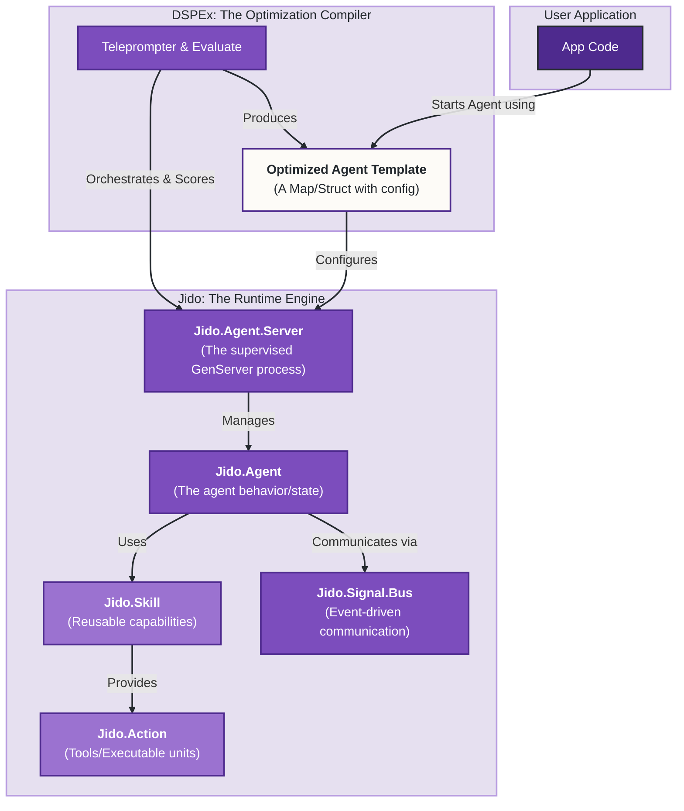

Excellent. This is a fantastic evolution of the request. By providing the full `jido` codebase, we can now conduct a comprehensive analysis of how its core architectural patterns—specifically the `Agent`, `Skill`, and `Action` models—fit into the `DSPEx` vision.

The key assumption is that `jido_action` and `jido_signal` are core components of the `jido` framework, not separate entities to be optionally included. This gives us a complete picture of `jido`'s intended architecture.

### Executive Summary

**The `jido` framework is a perfect architectural fit for DSPEx, but not as a peer; it's a vastly superior *replacement* for DSPEx's current runtime and execution model.** The relationship is not one of integration, but of **adoption**. DSPEx's core value proposition—its `Teleprompter` and `Evaluate` modules—can be re-platformed on top of `jido` to create an AI engineering framework that is far more robust, scalable, and BEAM-native than what DSPEx could achieve on its own.

*   **`Jido.Agent` is the next-generation `DSPEx.Program`:** It provides a stateful, supervised, process-based execution model that is fundamentally more powerful and resilient than DSPEx's current stateless, functional `Program`.
*   **`Jido.Skill` + `Jido.Action` are the next-generation `DSPEx.Signature` + Tools:** This combination provides a more modular and composable way to define an agent's capabilities and I/O contracts, moving beyond a simple input/output string.
*   **`Jido.Signal` is the missing nervous system:** It provides the event-driven communication layer that DSPEx currently lacks, enabling complex, decoupled, and observable workflows.

By adopting `jido`, DSPEx can stop reinventing foundational runtime components (like a client manager or a program executor) and focus on its core mission: **the meta-level optimization of these powerful, pre-existing `jido` agents.**

---

### Conceptual Alignment: The Evolution from DSPEx to Jido

This table maps the existing DSPEx concepts to their more advanced counterparts in the `jido` framework.

| DSPEx Concept (The "What") | `jido` Equivalent (The "How", but better) | Synergy / Improvement |
| :--- | :--- | :--- |
| `DSPEx.Program` | `Jido.Agent` + `Jido.Agent.Server` | A stateful, supervised, process-oriented entity that can manage its own lifecycle, state, and child processes. A massive upgrade in capability. |
| `DSPEx.Signature` + Tools | `Jido.Skill` + `Jido.Action` | `Skills` bundle a set of `Actions` (tools) and the logic (routing) to use them. This is a much more structured and powerful way to define an agent's capabilities than a simple signature. |
| `DSPEx.Predict.forward/3` | `Jido.Agent.Server.call/3` + `Jido.Runner` | `jido` provides a complete, robust runtime (`Jido.Agent.Server.Runtime`) with a message queue, FSM, and pluggable execution strategies (`Jido.Runner`), eliminating the need for custom execution logic in DSPEx. |
| `DSPEx.ClientManager` | The `jido_ai` provider adapters + `Jido.Exec` | `jido` has a more mature LLM runtime with `Jido.Exec` providing retries/timeouts, and the `jido_ai` actions abstracting away the client details entirely. |
| Telemetry Events | `Jido.Signal` + `Jido.Signal.Bus` | Replaces simple telemetry with a complete, routable, and persistent event bus, enabling true event-driven architectures and superior observability. |
| `DSPEx.Example` | Data within a `Jido.Signal` | Signals carry structured data payloads, serving the same purpose as Examples but within a formal, event-driven communication protocol. |
| **`DSPEx.Teleprompter` & `Evaluate`**| **No Direct Equivalent** | **This is the core value proposition of DSPEx.** These modules become the "compiler" that optimizes the configuration of a `Jido.Agent`. |

---

### Proposed Integration Strategy: Re-platforming DSPEx on Jido

The most effective strategy is to treat `jido` as the foundational runtime and refactor DSPEx to be the optimization layer *for* `jido` agents.

#### Step 1: Redefine the "Program"

A DSPEx `Program` would no longer be an executable module itself. Instead, it becomes a **declarative configuration for a `Jido.Agent`**.

**Before: DSPEx Program is an executor**
```elixir
# A Predict program holds the logic for an LLM call.
program = %DSPEx.Predict{signature: MySignature, client: :openai}
DSPEx.Program.forward(program, %{question: "What is 2+2?"})
```

**After: DSPEx Program is an agent *template***
```elixir
# A "DSPEx Program" is now just a map describing a Jido Agent's configuration.
# This map is the "genome" that the Teleprompter will optimize.
program_template = %{
  agent: Jido.AI.Agent, # The base agent module
  skills: [Jido.Skills.Arithmetic], # The capabilities of this agent
  initial_state: %{
    # The agent's "personality" or core prompt template
    prompt: "You are a math expert. You must use tools. Solve: <%= @message %>"
  }
}

# The `forward` call is now a helper that starts a temporary Jido agent and runs it.
def DSPEx.Program.forward(program_template, inputs) do
  # 1. Start a Jido Agent using the template's configuration
  #    Give it a unique ID for this execution.
  agent_opts = [
    id: Jido.Util.generate_id(),
    agent: program_template.agent,
    skills: program_template.skills,
    initial_state: program_template.initial_state
  ]
  {:ok, agent_pid} = Jido.Agent.Server.start_link(agent_opts)

  # 2. Call the agent with the inputs
  result = Jido.Agent.Server.call(agent_pid, Jido.Signal.new!(type: "jido.ai.tool.response", data: %{message: inputs.question}))

  # 3. Stop the temporary agent
  Jido.Agent.Server.stop(agent_pid)

  result
end
```

#### Step 2: The New Role of the Teleprompter

The `DSPEx.Teleprompter` becomes immensely more powerful. Its goal is to find the optimal `program_template` map.

The `BootstrapFewShot` or `SIMBA` teleprompters would no longer just be finding good "demos". They would be optimizing the entire agent configuration:

-   **Which `Skills` should be loaded?** (e.g., Does adding the `Jido.Skills.Arithmetic` skill improve performance on math problems?)
-   **What is the optimal `prompt` template in the `initial_state`?**
-   **Which `tools` (Actions) within a skill should be exposed?**
-   **(Future) Which LLM `model` should the agent use?**

The output of `DSPEx.Teleprompter.compile/5` would be the *best performing `program_template` map*.

#### Architectural Diagram: The New DSPEx-Jido Relationship

This diagram illustrates the clear separation of concerns in the proposed architecture.



**Workflow:**
1.  A developer defines a task. The **DSPEx Teleprompter** (`A`) runs an optimization loop.
2.  In each loop, it generates a candidate **Agent Template** (`B`).
3.  It starts a temporary **`Jido.Agent.Server`** (`C`) using this template.
4.  The **`DSPEx.Evaluate`** module runs a validation set against this temporary agent, scoring its performance.
5.  After many iterations, the Teleprompter identifies the best-performing Agent Template (`B`).
6.  The **User Application** (`H`) can now take this optimized template and use it to start long-running, production-ready `Jido.Agent` instances.

### Benefits of this Integration

1.  **True Modularity and Composability**: `Jido.Skill` is a superior abstraction to `DSPEx.Signature`. A DSPEx program can be composed of multiple skills (e.g., an `ArithmeticSkill` and a `FileIOSkill`), each bringing its own validated actions and configuration.
2.  **Stateful, Long-Running Programs**: DSPEx programs become first-class OTP processes via `Jido.Agent.Server`. This enables them to handle long-running tasks, maintain state safely, and be supervised, which is impossible with the current stateless `Program.forward` model.
3.  **Advanced Tool Use**: `jido`'s agent architecture, with its instruction queue and action execution, is a natural fit for complex tool-use patterns like ReAct. DSPEx can leverage this directly instead of building it from scratch.
4.  **Superior Observability**: By adopting `Jido.Signal`, DSPEx moves beyond simple telemetry to a full-fledged event-driven architecture. Every step of an optimization or execution can be a signal on a bus, allowing for real-time dashboards, debugging, and event sourcing.
5.  **Focus on Core Competency**: This integration allows DSPEx to shed the burden of building a robust runtime and focus entirely on its unique value proposition: the **optimization algorithms** within the `Teleprompter`s. It becomes a pure "compiler" for the `jido` "runtime."

### Strategic Recommendation

1.  **Embrace Jido as the Target Runtime:** Position DSPEx as the "compiler" and "optimizer" for the `jido` agent framework. This is a powerful and unique value proposition in the AI engineering space.
2.  **Deprecate DSPEx Runtime Components:** Plan a migration path to deprecate `DSPEx.Client`, `DSPEx.ClientManager`, and the execution logic within `DSPEx.Predict` in favor of using `Jido.AI` and `Jido.Exec`.
3.  **Refactor `DSPEx.Program`:** The concept of a `DSPEx.Program` should be refactored to represent a *configuration* or *template* for a `Jido.Agent`, not an executable entity itself.
4.  **Adapt Teleprompters:** The core work will be in adapting the `Teleprompter` modules (`BootstrapFewShot`, `SIMBA`) to generate and evaluate `Jido.Agent` configurations instead of simple few-shot demo lists.

This integration would create a framework that is unmatched in the Elixir ecosystem, combining the state-of-the-art in LLM program optimization (from DSPy) with the state-of-the-art in building robust, concurrent, and distributed systems (from the BEAM, via Jido). It's a natural and powerful evolution.
