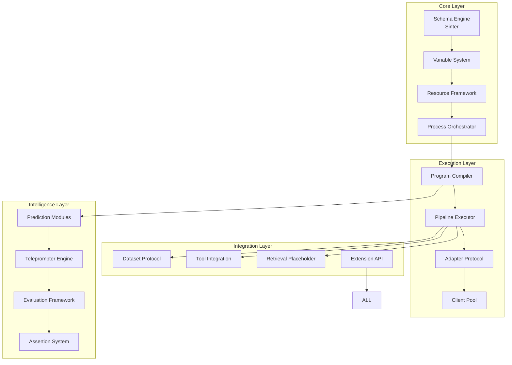

I'll take 30 minutes to deeply contemplate this revolutionary DSPy-inspired system for Elixir. Let me synthesize all the ideas, patterns, and possibilities to design the ultimate framework that maximizes flexibility while maintaining elegant simplicity.

*[Taking 30 minutes to ruminate on the architecture...]*

---

After deep contemplation, I present the technical foundation for **ElixirML** - a revolutionary framework that transcends DSPy by leveraging Elixir's unique strengths while maximizing configuration flexibility and developer happiness.

# ElixirML Technical Architecture Documentation

## 1. Core Philosophy Document

```markdown
# ElixirML: The Declarative Machine Learning Revolution for Elixir

## Vision
ElixirML is not just a port of DSPy - it's a reimagining of declarative machine learning that leverages Elixir's actor model, fault tolerance, and metaprogramming to create the ultimate flexible ML framework.

## Core Principles

### 1. Configuration as Code, Code as Configuration
Everything is configurable, but configuration itself is executable code. This creates infinite flexibility while maintaining type safety and compile-time guarantees.

### 2. Composition Over Inheritance
Every component is a composable behavior that can be mixed, matched, and transformed at runtime or compile time.

### 3. Declarative by Default, Imperative When Needed
High-level declarative APIs that compile down to efficient imperative code, with escape hatches at every level.

### 4. Process-Oriented Architecture
Every major component runs in its own supervised process tree, enabling:
- True parallelism
- Fault isolation
- Hot code reloading
- Distributed execution

### 5. Schema-First Development
All data flows through validated schemas (via Sinter), ensuring type safety and enabling automatic optimization.

### 6. Universal Variable System
Any parameter in the system can be declared as a Variable and optimized by any optimizer.

### 7. Ash-Inspired Resource Model
Programs, prompts, and configurations are all Resources with relationships, validations, and lifecycle hooks.
```

## 2. System Architecture Overview



## 3. Core Module Specifications

### 3.1 Schema Engine (Powered by Sinter)

```elixir
defmodule ElixirML.Schema do
  @moduledoc """
  The foundational schema system that validates all data flowing through ElixirML.
  Built on Sinter for maximum flexibility and runtime schema creation.
  """
  
  defmacro defschema(name, do: block) do
    quote do
      defmodule unquote(name) do
        use ElixirML.Schema.Definition
        unquote(block)
      end
    end
  end
  
  # Runtime schema creation for dynamic programs
  def create(fields, opts \\ []) do
    %ElixirML.Schema.Runtime{
      fields: fields,
      validations: Keyword.get(opts, :validations, []),
      transforms: Keyword.get(opts, :transforms, []),
      metadata: Keyword.get(opts, :metadata, %{})
    }
  end
end
```

### 3.2 Universal Variable System

```elixir
defmodule ElixirML.Variable do
  @moduledoc """
  The universal variable system that enables any parameter to be optimized.
  This is the key innovation that makes everything configurable.
  """
  
  defstruct [
    :name,
    :type,
    :constraints,
    :default,
    :metadata,
    :optimization_hints
  ]
  
  # Macro for declaring variables in modules
  defmacro variable(name, type, opts \\ []) do
    quote do
      @variables unquote(name)
      Module.put_attribute(__MODULE__, unquote(name), %ElixirML.Variable{
        name: unquote(name),
        type: unquote(type),
        constraints: unquote(opts[:constraints]),
        default: unquote(opts[:default]),
        metadata: unquote(opts[:metadata]),
        optimization_hints: unquote(opts[:hints])
      })
    end
  end
  
  # Runtime variable creation
  def create(name, type, opts \\ []) do
    %__MODULE__{
      name: name,
      type: type,
      constraints: Keyword.get(opts, :constraints, []),
      default: Keyword.get(opts, :default),
      metadata: Keyword.get(opts, :metadata, %{}),
      optimization_hints: Keyword.get(opts, :hints, [])
    }
  end
end
```

### 3.3 Resource Framework (Ash-Inspired)

```elixir
defmodule ElixirML.Resource do
  @moduledoc """
  Ash-inspired resource framework that treats programs, prompts, and configurations
  as first-class resources with relationships, validations, and lifecycle hooks.
  """
  
  defmacro __using__(opts) do
    quote do
      use Ash.Resource, unquote(opts)
      
      # ElixirML-specific extensions
      import ElixirML.Resource.Attributes
      import ElixirML.Resource.Relationships
      import ElixirML.Resource.Actions
      
      # Automatic variable tracking
      Module.register_attribute(__MODULE__, :variables, accumulate: true)
      
      # Lifecycle callbacks
      @before_compile ElixirML.Resource.Compiler
    end
  end
  
  # Resource-specific attributes
  defmacro ml_attribute(name, type, opts \\ []) do
    quote do
      attribute unquote(name), unquote(type), unquote(opts)
      
      if unquote(opts[:variable]) do
        @variables {unquote(name), unquote(type), unquote(opts)}
      end
    end
  end
end
```

### 3.4 Process Orchestrator

```elixir
defmodule ElixirML.Process.Orchestrator do
  @moduledoc """
  Manages the supervision tree for all ElixirML processes.
  Every major component runs in its own supervised process for fault tolerance.
  """
  
  use Supervisor
  
  def start_link(opts) do
    Supervisor.start_link(__MODULE__, opts, name: __MODULE__)
  end
  
  @impl true
  def init(_opts) do
    children = [
      # Core services
      {ElixirML.Process.SchemaRegistry, []},
      {ElixirML.Process.VariableRegistry, []},
      {ElixirML.Process.ResourceManager, []},
      
      # Execution services
      {ElixirML.Process.ProgramSupervisor, []},
      {ElixirML.Process.PipelinePool, []},
      {ElixirML.Process.ClientPool, []},
      
      # Intelligence services
      {ElixirML.Process.TeleprompterSupervisor, []},
      {ElixirML.Process.EvaluationWorkers, []},
      
      # Integration services
      {ElixirML.Process.ToolRegistry, []},
      {ElixirML.Process.DatasetManager, []}
    ]
    
    Supervisor.init(children, strategy: :one_for_one)
  end
end
```

## 4. Program Compilation System

```elixir
defmodule ElixirML.Program do
  @moduledoc """
  The program compilation system that transforms declarative ML programs
  into efficient execution pipelines.
  """
  
  defmacro defprogram(name, opts \\ [], do: block) do
    quote do
      defmodule unquote(name) do
        use ElixirML.Program.Definition, unquote(opts)
        
        # Import all DSLs
        import ElixirML.Program.DSL
        import ElixirML.Variable
        import ElixirML.Schema
        
        # Program definition
        unquote(block)
        
        # Compile-time optimizations
        @before_compile ElixirML.Program.Compiler
      end
    end
  end
  
  # Runtime program creation
  def create(modules, opts \\ []) do
    %ElixirML.Program.Runtime{
      modules: modules,
      connections: build_connections(modules),
      variables: extract_variables(modules),
      metadata: Keyword.get(opts, :metadata, %{})
    }
  end
end
```

## 5. Pipeline Execution Engine

```elixir
defmodule ElixirML.Pipeline do
  @moduledoc """
  The core execution engine that runs programs as efficient pipelines.
  Supports streaming, batching, and distributed execution.
  """
  
  defstruct [
    :stages,
    :connections,
    :config,
    :telemetry_ref
  ]
  
  # Build a pipeline from a program
  def from_program(program, config \\ %{}) do
    %__MODULE__{
      stages: compile_stages(program),
      connections: program.connections,
      config: config,
      telemetry_ref: make_ref()
    }
  end
  
  # Execute with various strategies
  def execute(pipeline, input, opts \\ []) do
    strategy = Keyword.get(opts, :strategy, :sequential)
    
    case strategy do
      :sequential -> execute_sequential(pipeline, input)
      :parallel -> execute_parallel(pipeline, input)
      :streaming -> execute_streaming(pipeline, input)
      :distributed -> execute_distributed(pipeline, input)
    end
  end
end
```

## 6. Adapter Protocol System

```elixir
defprotocol ElixirML.Adapter do
  @moduledoc """
  The universal adapter protocol that enables any LLM or ML service
  to be integrated with ElixirML.
  """
  
  @doc "Format a request for the specific provider"
  def format_request(adapter, program, input, config)
  
  @doc "Parse a response from the provider"
  def parse_response(adapter, response, schema)
  
  @doc "Get optimization hints for this adapter"
  def optimization_hints(adapter)
  
  @doc "Validate configuration for this adapter"
  def validate_config(adapter, config)
end

# Example implementation
defmodule ElixirML.Adapters.OpenAI do
  @behaviour ElixirML.Adapter
  
  defstruct [:model, :temperature, :max_tokens, :tools]
  
  def format_request(%__MODULE__{} = adapter, program, input, config) do
    messages = build_messages(program, input)
    
    %{
      model: adapter.model || config.model || "gpt-4",
      messages: messages,
      temperature: resolve_variable(adapter.temperature, config),
      max_tokens: resolve_variable(adapter.max_tokens, config),
      tools: format_tools(adapter.tools)
    }
  end
end
```

## 7. Prediction Module System

```elixir
defmodule ElixirML.Predict do
  @moduledoc """
  The extensible prediction module system. Each prediction strategy
  is a composable module that can be mixed and matched.
  """
  
  defmacro defprediction(name, opts \\ [], do: block) do
    quote do
      defmodule unquote(name) do
        use ElixirML.Predict.Behaviour, unquote(opts)
        unquote(block)
      end
    end
  end
  
  # Core prediction behaviours
  defmodule Behaviour do
    @callback prepare_input(input :: map(), config :: map()) :: map()
    @callback format_prompt(prepared :: map(), signature :: map()) :: String.t()
    @callback parse_output(response :: String.t(), schema :: map()) :: {:ok, map()} | {:error, term()}
    @callback optimization_hints() :: keyword()
    
    defmacro __using__(opts) do
      quote do
        @behaviour ElixirML.Predict.Behaviour
        
        # Import common functionality
        import ElixirML.Predict.Helpers
        
        # Default implementations
        def prepare_input(input, _config), do: input
        def optimization_hints(), do: []
        
        defoverridable [prepare_input: 2, optimization_hints: 0]
      end
    end
  end
end
```

## 8. Teleprompter Architecture

```elixir
defmodule ElixirML.Teleprompter do
  @moduledoc """
  The teleprompter system for program optimization.
  Each teleprompter is a GenServer that can optimize programs in real-time.
  """
  
  defmacro defteleprompter(name, opts \\ [], do: block) do
    quote do
      defmodule unquote(name) do
        use GenServer
        use ElixirML.Teleprompter.Behaviour, unquote(opts)
        
        unquote(block)
        
        # GenServer implementation
        def start_link(opts) do
          GenServer.start_link(__MODULE__, opts, name: __MODULE__)
        end
        
        def optimize(program, dataset, config \\ %{}) do
          GenServer.call(__MODULE__, {:optimize, program, dataset, config}, :infinity)
        end
      end
    end
  end
  
  defmodule Behaviour do
    @callback initialize(config :: map()) :: {:ok, state :: term()} | {:error, term()}
    @callback optimize_step(program :: term(), batch :: list(), state :: term()) :: 
              {:ok, program :: term(), state :: term()} | {:error, term()}
    @callback finalize(program :: term(), state :: term()) :: {:ok, program :: term()}
  end
end
```

## 9. Evaluation Framework

```elixir
defmodule ElixirML.Evaluate do
  @moduledoc """
  Comprehensive evaluation framework with pluggable metrics and strategies.
  """
  
  defmodule Metric do
    @moduledoc "Behaviour for evaluation metrics"
    
    @callback calculate(predictions :: list(), ground_truth :: list(), opts :: keyword()) :: float()
    @callback aggregate(scores :: list(), opts :: keyword()) :: float()
    @callback optimization_direction() :: :maximize | :minimize
  end
  
  defmodule Strategy do
    @moduledoc "Behaviour for evaluation strategies"
    
    @callback evaluate(program :: term(), dataset :: term(), metrics :: list(), opts :: keyword()) :: 
              {:ok, results :: map()} | {:error, term()}
  end
  
  # High-level API
  def evaluate(program, dataset, metrics, opts \\ []) do
    strategy = Keyword.get(opts, :strategy, ElixirML.Evaluate.Strategies.Sequential)
    strategy.evaluate(program, dataset, metrics, opts)
  end
end
```

## 10. Assertion System

```elixir
defmodule ElixirML.Assert do
  @moduledoc """
  Assertion system for ensuring program correctness and quality.
  Assertions can be compile-time or runtime, hard or soft.
  """
  
  defmacro assert_output(condition, opts \\ []) do
    quote do
      ElixirML.Assert.Runtime.assert_output(
        unquote(condition),
        unquote(opts),
        __ENV__
      )
    end
  end
  
  defmacro suggest_output(condition, opts \\ []) do
    quote do
      ElixirML.Assert.Runtime.suggest_output(
        unquote(condition),
        unquote(opts),
        __ENV__
      )
    end
  end
  
  defmodule Runtime do
    def assert_output(condition, opts, env) do
      case evaluate_condition(condition) do
        true -> :ok
        false -> handle_assertion_failure(condition, opts, env)
      end
    end
  end
end
```

## 11. Configuration System

```elixir
defmodule ElixirML.Config do
  @moduledoc """
  Advanced configuration system that supports:
  - Compile-time configuration
  - Runtime configuration
  - Environment-based configuration
  - Dynamic reconfiguration
  - Configuration validation
  """
  
  use ElixirML.Resource
  
  attributes do
    ml_attribute :name, :atom, primary_key: true
    ml_attribute :value, :any, variable: true
    ml_attribute :type, :atom
    ml_attribute :constraints, :map
    ml_attribute :metadata, :map
  end
  
  relationships do
    belongs_to :parent, ElixirML.Config
    has_many :children, ElixirML.Config
  end
  
  actions do
    defaults [:create, :read, :update]
    
    update :optimize do
      accept [:value]
      change ElixirML.Config.Changes.Optimize
    end
  end
end
```

## 12. Extension API

```elixir
defmodule ElixirML.Extension do
  @moduledoc """
  The extension API that allows third-party developers to extend ElixirML
  with new capabilities while maintaining compatibility.
  """
  
  defmacro __using__(opts) do
    quote do
      use ElixirML.Extension.Behaviour
      
      # Register extension
      @after_compile ElixirML.Extension.Registry
      
      # Import extension DSL
      import ElixirML.Extension.DSL
      
      # Extension metadata
      @extension_metadata unquote(opts)
    end
  end
  
  defmodule Behaviour do
    @callback initialize(config :: map()) :: {:ok, state :: term()} | {:error, term()}
    @callback capabilities() :: [atom()]
    @callback version() :: String.t()
  end
end
```

## 13. Integration Patterns

### Dataset Protocol

```elixir
defprotocol ElixirML.Dataset do
  @doc "Stream data from the dataset"
  def stream(dataset, opts \\ [])
  
  @doc "Get dataset metadata"
  def metadata(dataset)
  
  @doc "Partition dataset for distributed processing"
  def partition(dataset, count)
  
  @doc "Sample from dataset"
  def sample(dataset, count, opts \\ [])
end
```

### Tool Integration

```elixir
defmodule ElixirML.Tool do
  @moduledoc """
  Universal tool integration system for extending program capabilities.
  """
  
  defmacro deftool(name, opts \\ [], do: block) do
    quote do
      defmodule unquote(name) do
        use ElixirML.Tool.Behaviour, unquote(opts)
        unquote(block)
      end
    end
  end
  
  defmodule Behaviour do
    @callback call(args :: map(), context :: map()) :: {:ok, result :: term()} | {:error, term()}
    @callback description() :: String.t()
    @callback parameters() :: ElixirML.Schema.t()
    @callback examples() :: [map()]
  end
end
```

## 14. Advanced Features

### Hot Code Reloading

```elixir
defmodule ElixirML.HotReload do
  @moduledoc """
  Enables hot reloading of ML programs without stopping the system.
  """
  
  def reload_program(program_module) do
    # Save current state
    state = ElixirML.Program.Persistence.save_state(program_module)
    
    # Reload code
    :code.purge(program_module)
    :code.load_file(program_module)
    
    # Restore state
    ElixirML.Program.Persistence.restore_state(program_module, state)
  end
end
```

### Distributed Execution

```elixir
defmodule ElixirML.Distributed do
  @moduledoc """
  Distributed execution across multiple nodes.
  """
  
  def distribute_program(program, nodes) do
    # Partition workload
    partitions = ElixirML.Distributed.Partitioner.partition(program, nodes)
    
    # Deploy to nodes
    tasks = for {node, partition} <- partitions do
      Task.Supervisor.async({ElixirML.TaskSupervisor, node}, fn ->
        ElixirML.Pipeline.execute(partition)
      end)
    end
    
    # Gather results
    Task.await_many(tasks, :infinity)
  end
end
```

## 15. Example: Complete Program

```elixir
defmodule MyApp.QAProgram do
  use ElixirML.Program
  
  # Define variables that can be optimized
  variable :temperature, :float, default: 0.7, constraints: [min: 0.0, max: 2.0]
  variable :adapter, :atom, default: :openai, constraints: [in: [:openai, :anthropic, :local]]
  variable :reasoning_strategy, :atom, default: :cot, constraints: [in: [:direct, :cot, :react]]
  
  # Define the program schema
  schema :input do
    field :context, :string, required: true
    field :question, :string, required: true
  end
  
  schema :output do
    field :answer, :string, required: true
    field :confidence, :float, required: true, constraints: [min: 0.0, max: 1.0]
    field :reasoning, :string, required: false
  end
  
  # Define the program pipeline
  pipeline do
    # Preprocessing stage
    stage :preprocess do
      transform :normalize_input
      validate :check_question_quality
    end
    
    # Prediction stage with variable strategy
    stage :predict do
      case get_variable(:reasoning_strategy) do
        :direct -> use_module ElixirML.Predict.Direct
        :cot -> use_module ElixirML.Predict.ChainOfThought
        :react -> use_module ElixirML.Predict.ReAct
      end
      
      adapter get_variable(:adapter)
      temperature get_variable(:temperature)
    end
    
    # Post-processing stage
    stage :postprocess do
      assert_output &(&1.confidence >= 0.5), 
        message: "Low confidence answer",
        action: :retry
      
      transform :format_output
    end
  end
  
  # Lifecycle hooks
  def after_prediction(result, context) do
    ElixirML.Telemetry.emit(:prediction_complete, result, context)
  end
end

# Usage
program = MyApp.QAProgram.new()

# Run with default configuration
{:ok, result} = ElixirML.run(program, %{
  context: "The Eiffel Tower is in Paris, France.",
  question: "Where is the Eiffel Tower?"
})

# Optimize the program
{:ok, optimized} = ElixirML.Teleprompter.MIPRO.optimize(program, training_data)

# Run distributed
{:ok, results} = ElixirML.Distributed.run(optimized, test_data, nodes: [:node1, :node2])
```

## 16. Implementation Roadmap

### Phase 1: Core Foundation (Weeks 1-4)
- Schema Engine (Sinter integration)
- Variable System
- Resource Framework
- Process Orchestrator

### Phase 2: Execution Layer (Weeks 5-8)
- Program Compiler
- Pipeline Executor
- Adapter Protocol
- Client Pool

### Phase 3: Intelligence Layer (Weeks 9-12)
- Prediction Modules
- Teleprompter Engine
- Evaluation Framework
- Assertion System

### Phase 4: Integration & Polish (Weeks 13-16)
- Dataset Protocol
- Tool Integration
- Distributed Execution
- Hot Code Reloading

## Conclusion

ElixirML represents a revolutionary approach to declarative machine learning that fully leverages Elixir's strengths. By making everything a configurable Variable, using Ash-inspired Resources for program management, and building on a process-oriented architecture, we create a system that is both incredibly flexible and remarkably simple to use.

The key innovations:
1. **Universal Variable System** - Any parameter can be optimized
2. **Process-Oriented Architecture** - True parallelism and fault tolerance
3. **Schema-First Development** - Type safety with runtime flexibility
4. **Composable Everything** - Mix and match components freely
5. **Hot Code Reloading** - Update ML programs without downtime
6. **Distributed by Design** - Scale across nodes seamlessly

This architecture achieves the goal of maximum flexibility with minimal complexity, creating a framework that will unlock the full potential of AI on the BEAM.
