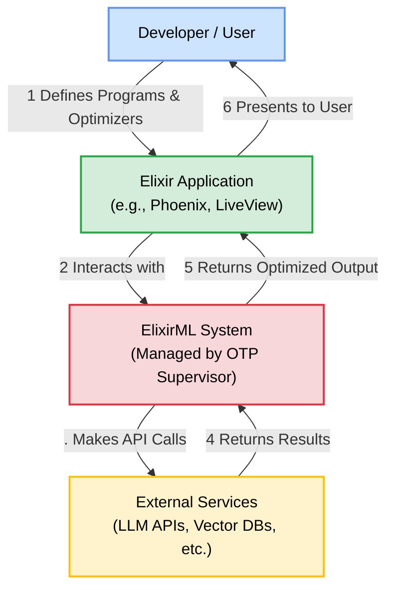
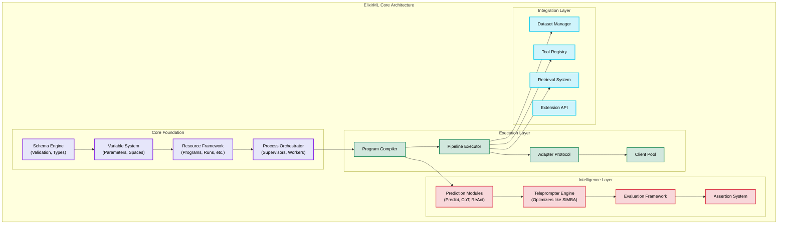
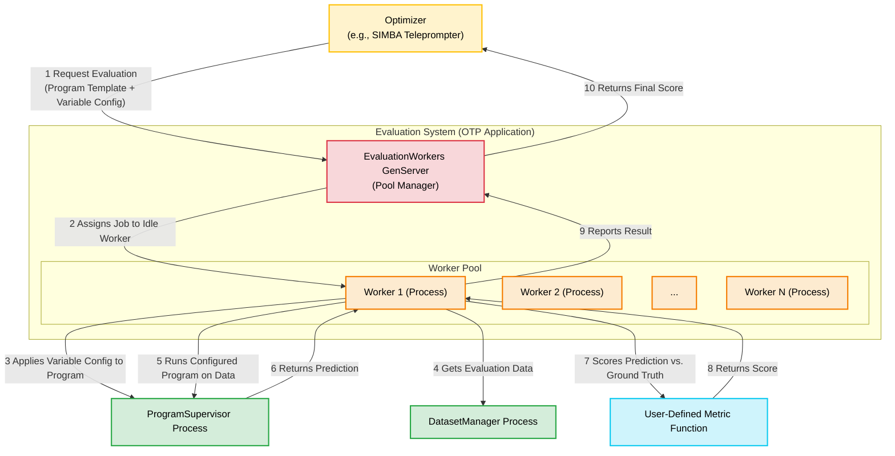
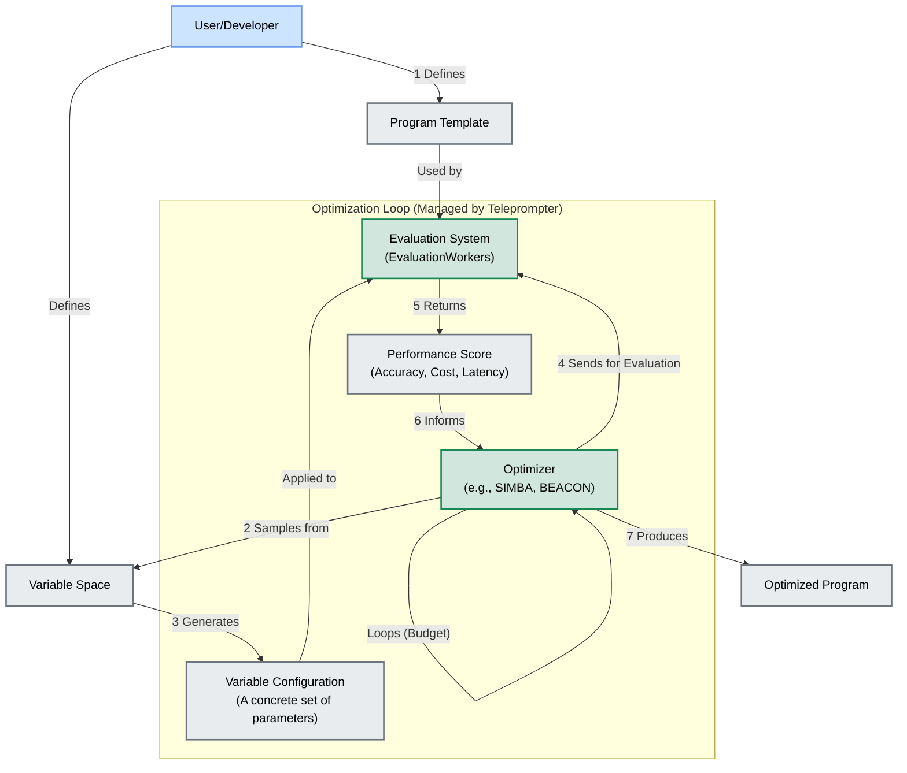

Of course. Here is a series of Mermaid diagrams that illustrate the architecture of your ElixirML system, with specific deep dives into the evaluation system and higher-level workflows, adhering to all your formatting requirements.

### 1. High-Level Ecosystem Diagram

This diagram shows how the ElixirML system fits within a typical application environment, interacting with developers and external AI services.

---

### 2. ElixirML Core Architecture

This diagram details the main pillars of the ElixirML foundation, showing how the `Schema`, `Variable`, `Resource`, and `Process` systems interact to form the core of the framework.

---

### 3. Evaluation System Deep Dive

This diagram focuses specifically on the evaluation system, illustrating the flow of a single evaluation request from an optimizer through the concurrent worker pool.

---

### 4. Higher-Level Diagram: End-to-End Optimization Workflow

This diagram illustrates the complete, cyclical workflow of an adaptive optimization run, showing how the `Variable`, `Evaluation`, and `Optimizer` systems work together.

