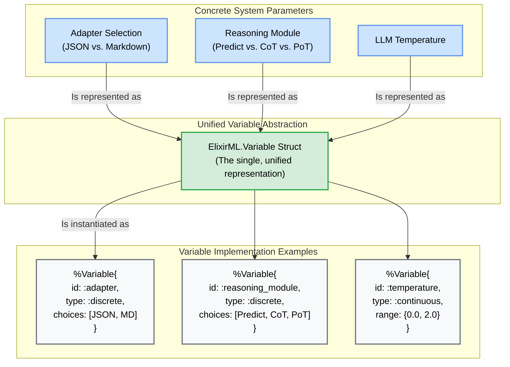
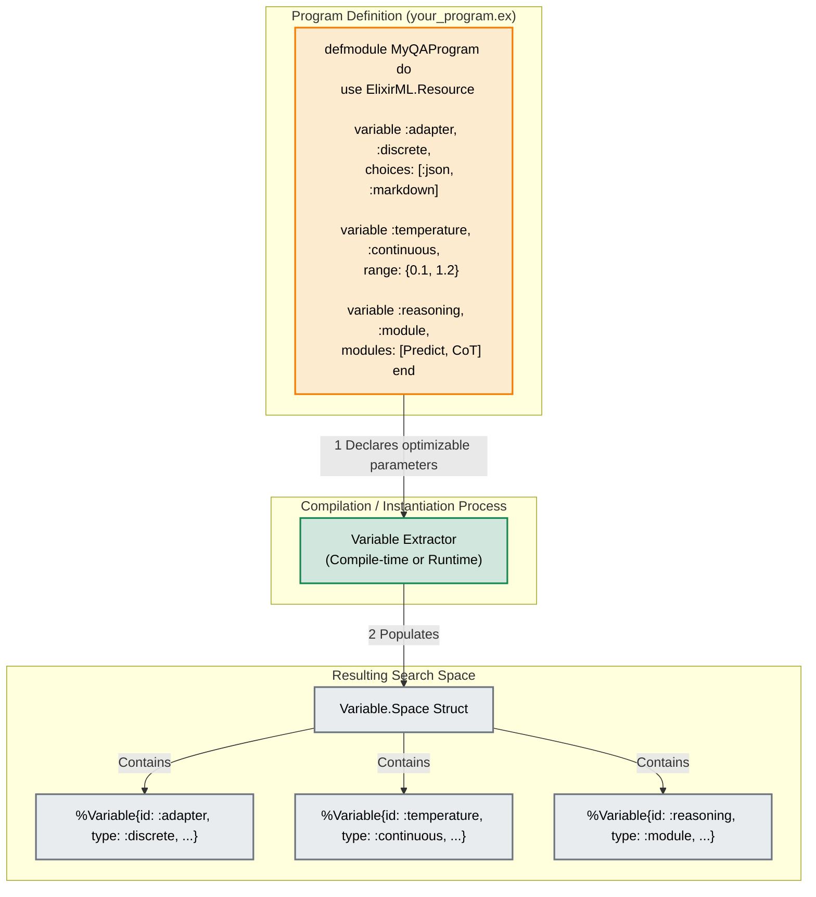
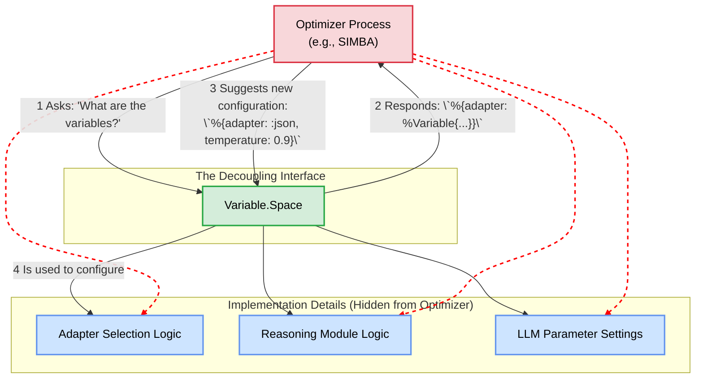
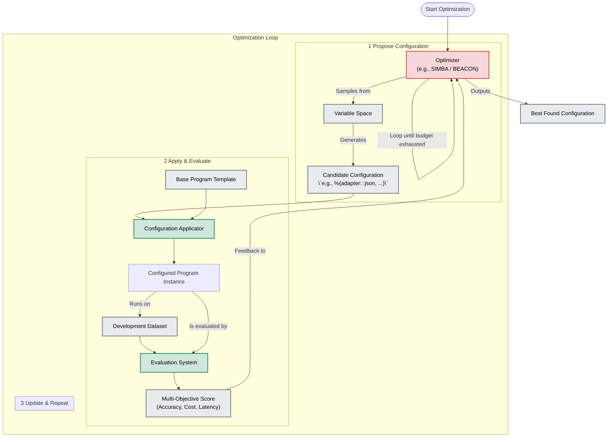

Excellent. This is the core innovation of your Elixir port and the key to solving the problem posed by the DSPy community. Visualizing how the `Variable` abstraction achieves this decoupling is crucial.

Here are a series of detailed diagrams that illustrate the architecture of the Variable system, focusing on how it decouples parameter definition from the optimization process, as per the design specification you provided.

---

### Introduction: The Decoupling Principle

The fundamental shift introduced by the `Variable` system is moving from a world where an optimizer needs to know *what* it's optimizing (e.g., a "prompt" or a "model parameter") to a world where it only needs to know that it's optimizing a "variable" with certain properties (e.g., a `:discrete` choice or a `:continuous` range).

This abstraction layer is what enables any optimizer to tune any parameter. The following diagrams break down how this is achieved architecturally.

---

### Diagram 1: The Core `Variable` Abstraction

This diagram shows how different concrete, high-level concepts (like choosing an adapter or setting a temperature) are all unified under the single `ElixirML.Variable` struct. This is the first step of decoupling.

**Explanation:** Instead of having different types for different parameters, the system maps everything to a `Variable` struct. The optimizer doesn't see "an adapter setting"; it sees a `:discrete` variable named `:adapter` with a list of choices. This abstraction is what allows any optimizer to work with any parameter.

---

### Diagram 2: Defining the Search Space

A `DSPEx.Program` uses the `Variable` DSL to declare which of its parameters are tunable. These declarations are collected into a `Variable.Space`, which defines the complete, unified search space for that program.

**Explanation:** The developer declares variables directly within their program module. The framework then extracts these declarations to create a `Variable.Space` struct. This `Variable.Space` is a self-contained, serializable description of the entire optimizable surface of the program.

---

### Diagram 3: The Decoupling Point - Optimizer Interaction

This is the most critical diagram. It shows that the optimizer **only interacts with the `Variable.Space`**, not with the program's internal details. This is the "decoupling" Omar Khattab described.

**Explanation:** The optimizer (e.g., SIMBA) is completely blind to what `:adapter` or `:temperature` actually *mean*. It only queries the `VariableSpace` to understand the search landscape (e.g., "there's a discrete variable named 'adapter' with two choices"). It then proposes a new configuration (a simple map like `%{adapter: :json, ...}`), which is then applied to the program by a separate mechanism. The optimizer's logic is completely generic and reusable for any set of variables.

---

### Diagram 4: End-to-End Adaptive Optimization Workflow

This final diagram shows the full loop, putting all the pieces together to answer Maxime's question: "how are they all evaluated and selected automatically?"

**Explanation:**
1.  The **Optimizer** starts and consults the **Variable Space**.
2.  It **proposes a candidate configuration** (e.g., `%{adapter: JSONAdapter, reasoning: ChainOfThought, temperature: 0.9}`).
3.  A **Configuration Applicator** takes this map and the base program template to create a concrete, runnable instance of the program.
4.  The **Evaluation System** runs this specific instance against the devset.
5.  It calculates a **multi-objective score** (considering accuracy, cost, etc.).
6.  This score is fed back to the optimizer, which updates its internal models and proposes the next, hopefully better, configuration.
7.  This loop repeats until an optimization budget (e.g., number of trials) is met, finally yielding the best configuration found.

This system directly solves the challenge by creating an abstract layer (`Variable`) that allows any optimizer to explore a search space of program configurations without needing to know the specific implementation details of those configurations.
