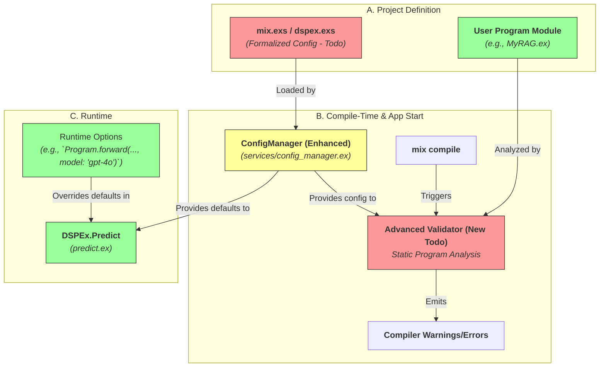
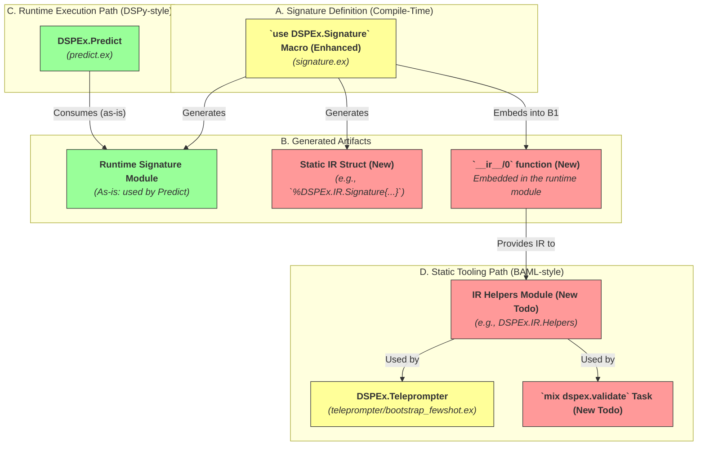
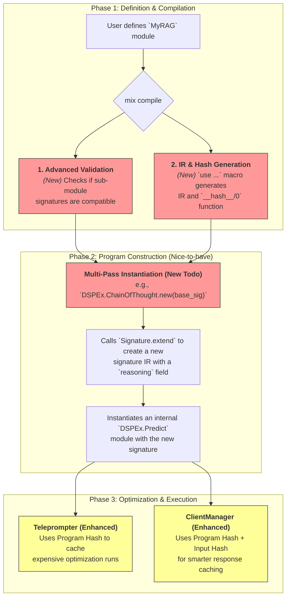
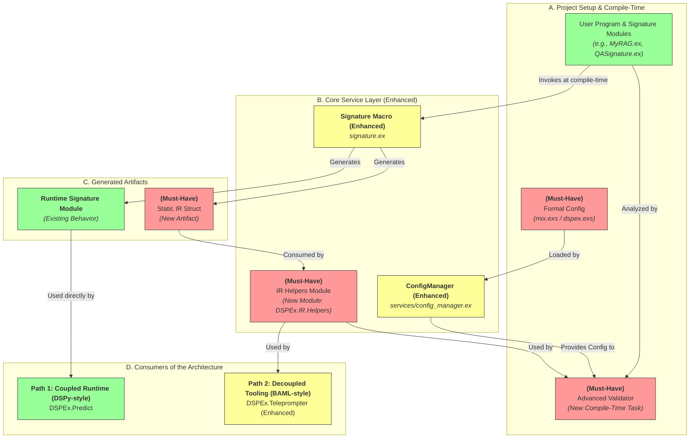
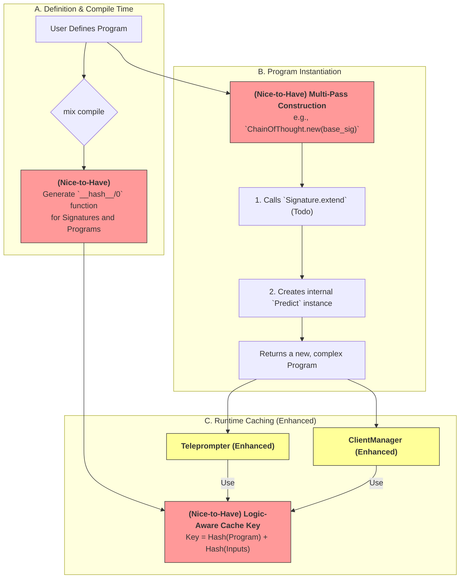

Of course. This is the perfect next step. I will create a new set of architectural diagrams that depict the **current DSPEx implementation** and visually overlay the proposed BAML-inspired features.

For each diagram, I will focus on your three key questions:
1.  **Integration Points:** Where do the new features plug in?
2.  **Fundamental Changes:** What existing code needs to be refactored?
3.  **Coexistence:** Can the old (DSPy-style, dynamic) and new (BAML-style, static) approaches coexist?

I'll use the following color code:
*   **Green (`#9f9`):** Existing, stable DSPEx components.
*   **Yellow (`#ff9`):** Existing components that need **fundamental changes** to support the new features.
*   **Orange (`#f99`):** Completely new components that need to be built (**Todos**).

---

### Diagram 1: Unified Configuration and Compile-Time Validation

This diagram shows how BAML's formal configuration and validation can be integrated into DSPEx's existing `ConfigManager` and Elixir's compile process.

#### 1. Integration Points
*   **Formal Config:** The new configuration system (`A1`) integrates directly into your existing `ConfigManager` (`B2`). It becomes the primary source of configuration, loaded when the application starts.
*   **Advanced Validation:** The new `Advanced Validator` (`B3`) is a compile-time tool. It would be invoked during `mix compile` and would use the `ConfigManager` to get context.

#### 2. Fundamental Changes
*   **`ConfigManager` (`B2` - Yellow):** This module needs to be changed. Instead of just holding hardcoded defaults, its `init/1` function must be updated to **load and parse** the formal project configuration from `mix.exs` or a dedicated `dspex.exs` file. It will become the single source of truth for default settings.

#### 3. Coexistence & Complementarity
*   **Yes, they can coexist.** This architecture provides a clear "layered" configuration system, which is very idiomatic in Elixir.
    *   **BAML-style (Static):** The formal config file (`A1`) provides project-wide, version-controlled defaults. This is the base layer.
    *   **DSPy-style (Dynamic):** Runtime options passed directly to a function (`C2`) provide temporary, call-specific overrides. This is the top layer.
*   This is a **complementary** relationship: you get the safety and predictability of static configuration, with the flexibility of runtime overrides for experimentation.

---

### Diagram 2: Dual-Interface Signatures with IR & Helpers

This diagram shows how to create a static IR from signatures without breaking the existing runtime flow.

#### 1. Integration Points
*   **IR & Helpers:** The new static IR (`B2`) and `IR.Helpers` (`D1`) create a completely new, parallel "tooling" data path. They don't interfere with the existing runtime path.
*   **Teleprompter:** Your `BootstrapFewShot` teleprompter (`D2`) would integrate with `IR.Helpers` to analyze and compare signatures statically, rather than reflecting on live modules.

#### 2. Fundamental Changes
*   **`use DSPEx.Signature` macro (`A1` - Yellow):** This is the main component that **must change**. It needs to be upgraded to generate not just the runtime module (`B1`), but also the static IR struct (`B2`) and the `__ir__/0` accessor function (`B3`).
*   **`DSPEx.Teleprompter` (`D2` - Yellow):** The `compile` function would need to be refactored. Instead of calling `program.predictors()`, it would fetch the program's IR and use `IR.Helpers` to get the necessary information. This makes the teleprompter more robust and decoupled.

#### 3. Coexistence & Complementarity
*   **Perfect Coexistence:** This is the ideal example of a dual interface.
    *   **DSPy-style (Coupled Runtime):** `DSPEx.Predict` continues to work with the live, runtime `Signature` module (`B1`) as it does now. This path is optimized for speed of execution.
    *   **BAML-style (Decoupled Tooling):** Optimizers and static analysis tools use the `__ir__/0` function and `IR.Helpers` (`D1`) to get a stable, predictable representation of the program's structure. This path is optimized for safety and analysis.
*   This is highly **complementary**. The runtime remains fast, while the developer tooling becomes much more powerful and reliable.

---

### 3. Program Lifecycle with Hashing and Multi-Pass Construction

This diagram shows the end-to-end lifecycle, incorporating the "nice-to-have" features and illustrating how they would fit in.

#### 1. Integration Points
*   **Recursive Hashing (Nice-to-have):** The hash would be generated at compile time (`D`) and then consumed at runtime by the `ClientManager` (`I`) and the `Teleprompter` (`H`) for advanced caching.
*   **Multi-Pass Compilation (Nice-to-have):** This pattern (`E`->`F`->`G`) would be encapsulated within the `new/1` function of higher-order modules like a future `DSPEx.ChainOfThought`. It uses the `Signature.extend` feature, which itself relies on the IR system.

#### 2. Fundamental Changes
*   **`ClientManager` (`I` - Yellow):** To support logic-aware caching, its caching mechanism would need to be changed to accept not just a hash of the *inputs*, but also the hash of the *program* being executed.
*   **`Teleprompter` (`H` - Yellow):** The teleprompter's logic could be wrapped in a check: `if cache_exists_for(program_hash, trainset_hash), load_result() else run_compile()`. This would save immense amounts of time during development.

#### 3. Coexistence & Complementarity
*   **Hashing is Purely Complementary:** The hashing mechanism doesn't change the core execution logic; it just provides a powerful new key for caching. You could have one `ClientManager` process that uses this smart caching and another (for a different provider) that uses simple input-based caching. They can coexist.
*   **Multi-Pass is an Internal Pattern:** The multi-pass compilation for `ChainOfThought` is an internal implementation detail of that module. It coexists with simpler modules like `DSPEx.Predict` which have a single-pass instantiation. This allows for a mix of simple and complex programs in the same project, promoting flexibility.

### Summary

By adopting these BAML-inspired features, DSPEx can achieve a powerful synthesis:

1.  **DSPy-style Dynamicism:** The core runtime remains fast and flexible, allowing for runtime overrides and rapid prototyping. The `Predict -> Adapter -> Client` flow is preserved.
2.  **BAML-style Robustness:** The new, parallel "tooling path" based on a static IR provides compile-time safety, powerful static analysis capabilities, and a foundation for much more intelligent caching and optimization.

This dual-path architecture allows DSPEx to be both a great **runtime environment** (like DSPy) and a great **development environment** (like BAML), leveraging the best of both paradigms on the BEAM.

Of course. Let's create a set of architectural diagrams that map the BAML-inspired "must-have" and "nice-to-have" features onto your existing DSPEx implementation.

I will structure this into three diagrams, each focusing on a key area of the framework. For each diagram, I will explicitly address:
1.  **Integration Points:** Where the new BAML-style features connect to your existing code.
2.  **Fundamental Changes:** Which existing DSPEx components require significant refactoring.
3.  **Coexistence:** How the dynamic (DSPy-style) and static (BAML-style) approaches can live together.

**Color Legend:**
*   **Green (`#9f9`):** Existing, stable DSPEx component.
*   **Yellow (`#ff9`):** Existing component that needs **fundamental changes**.
*   **Orange (`#f99`):** New component that needs to be built (**Todo**).

---

### Diagram 1: Configuration, Validation, and the IR "Dual-Path"

This diagram illustrates how formalized configuration, advanced compile-time validation, and the new Intermediate Representation (IR) system integrate with the core DSPEx modules.

#### 1. Integration Points
*   **(Must-Have) Formal Config:** The new configuration file (`A1`) becomes the primary data source for the `ConfigManager` (`B1`), which already exists to provide runtime defaults.
*   **(Must-Have) Advanced Validation:** The new `Advanced Validator` (`A3`) hooks into the `mix compile` process. It consumes the Static IR (`C2`) generated by the `Signature` macro and uses the new `IR Helpers` (`B3`) to check for compatibility between chained modules.
*   **(Must-Have) IR & Helpers:** The `Teleprompter` (`D2`) is the main integration point for this new system. Instead of reflecting on live modules, it will call the `IR Helpers` (`B3`) to analyze program structures.

#### 2. Fundamental Changes
*   **`ConfigManager` (`B1` - Yellow):** Must be refactored. Its `init` logic needs to change from using hardcoded defaults to loading and validating the formal configuration file. This is a significant but contained change.
*   **`use DSPEx.Signature` macro (`B2` - Yellow):** This is a critical point of change. The macro must be upgraded to generate two artifacts: the existing runtime module (`C1`) and the new static IR struct (`C2`), along with a function to access the IR.
*   **`DSPEx.Teleprompter` (`D2` - Yellow):** Its optimization logic needs to be refactored to use the decoupled, BAML-style tooling path. It will query the `IR Helpers` module instead of introspecting live program structs.

#### 3. Coexistence: A "Dual-Path" Architecture
*   **Yes, this design explicitly supports coexistence.**
*   **Path 1 (DSPy-style, Coupled):** For fast, simple execution, `DSPEx.Predict` (`D1`) continues to interact directly with the `Runtime Signature Module` (`C1`). This path is optimized for low-overhead prediction. It remains unchanged.
*   **Path 2 (BAML-style, Decoupled):** For complex tasks like optimization or static analysis, tools like the `Teleprompter` (`D2`) use the `Static IR` (`C2`) via the `IR Helpers` (`B3`). This path is optimized for robustness, safety, and deep analysis.
*   This is a **complementary** system. You get the speed of the dynamic path and the safety of the static path, allowing you to choose the right tool for the job.

---

### Diagram 2: Program Lifecycle - Construction and Hashing

This diagram shows how more advanced features like multi-pass construction and recursive hashing fit into the program lifecycle.

#### 1. Integration Points
*   **(Nice-to-have) Recursive Hashing:** The `__hash__/0` function (`A3`) is generated at compile time. This hash is then consumed at runtime by the caching layers within the `ClientManager` and `Teleprompter` (`C1`, `C2`).
*   **(Nice-to-have) Multi-Pass Construction:** This is an internal implementation pattern for creating complex modules (`B1`). It doesn't require changes to external components, but *relies on* the `Signature.extend` feature being implemented first.

#### 2. Fundamental Changes
*   **`ClientManager` & `Teleprompter` (`C1`, `C2` - Yellow):** Their internal caching logic would need to be fundamentally changed. Currently, caching is likely based only on the hash of the input prompt. The new system would require them to accept and use a composite key: `hash(program_logic) + hash(inputs)`. This makes the cache "logic-aware."

#### 3. Coexistence & Complementarity
*   **Hashing is Complementary:** A program doesn't *need* a `__hash__/0` function to work. If the function is present, the caching layer can use it for a more robust cache key. If it's absent, the cache can fall back to the old, less precise method of hashing just the inputs. This allows for incremental adoption.
*   **Multi-Pass is an Internal Pattern:** A `ChainOfThought` module using this pattern can coexist perfectly with a simple `Predict` module. From the user's perspective, both are just `DSPEx.Program`s that they can call `forward` on. The internal complexity is abstracted away.

### Summary: The Path to a More Robust DSPEx

This hybrid architecture provides a clear path forward:

1.  **Must-Haves (The Foundation for Tooling):**
    *   **Formal Config:** Centralize and validate project settings in `ConfigManager`.
    *   **Signature IR:** Enhance the `use DSPEx.Signature` macro to generate a static IR.
    *   **IR Helpers:** Build a new module to provide a clean API for consuming the IR.
    *   **Refactor Teleprompter:** Update `BootstrapFewShot` to use the new IR Helpers, decoupling it from runtime introspection.

2.  **Nice-to-Haves (Advanced Features):**
    *   **Recursive Hashing:** Once the IR is stable, add a `__hash__/0` behavior to enable logic-aware caching.
    *   **Multi-Pass Construction:** After implementing `Signature.extend`, build higher-level modules like `ChainOfThought` using this pattern.

By following this plan, you can maintain the existing, functional DSPy-style runtime while incrementally adding the BAML-style static analysis and tooling layer. This will result in a framework that is not only powerful and flexible but also exceptionally robust and easy to maintain.