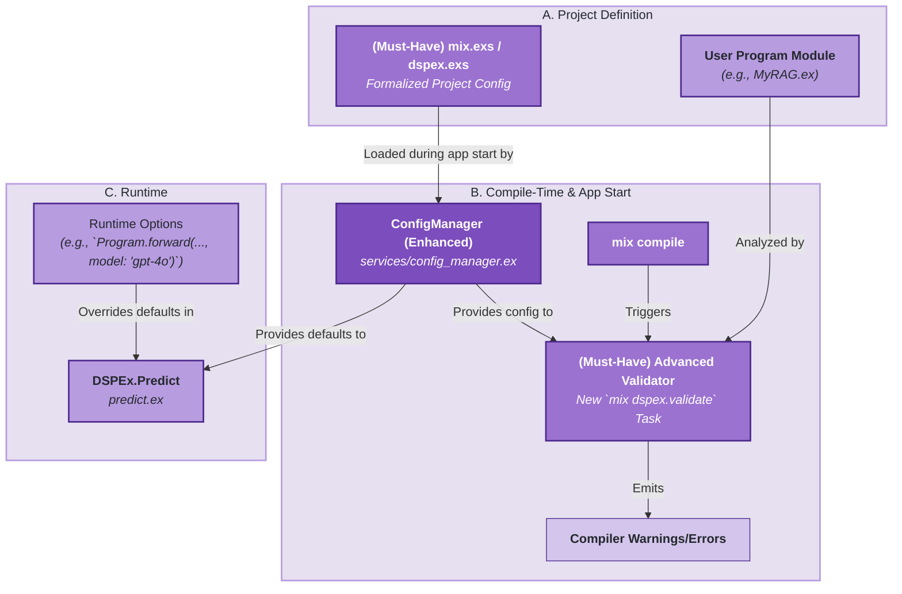
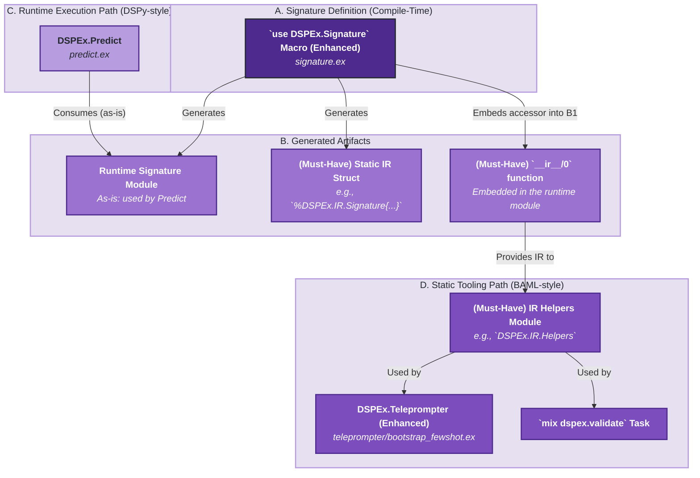
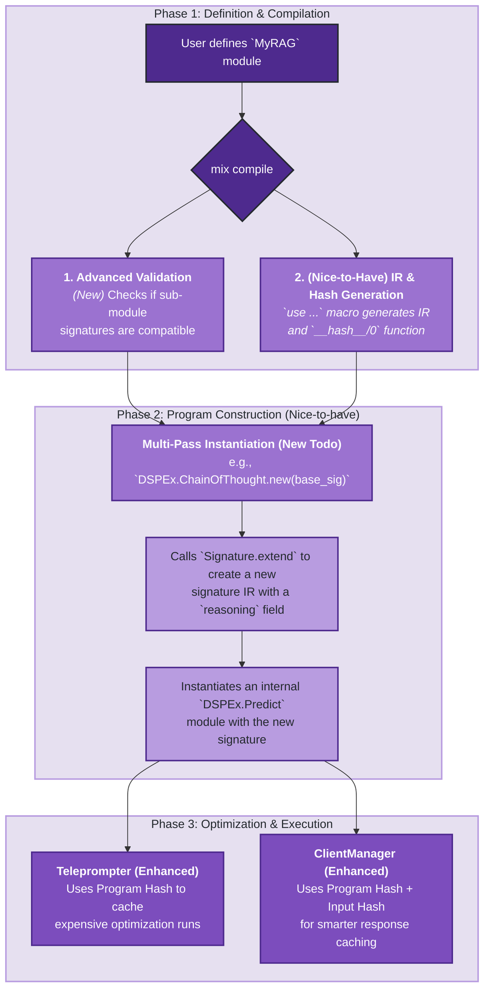

Of course. This is a fascinating and highly valuable direction for DSPEx. By incorporating the static analysis, compile-time safety, and robust tooling philosophy of BAML, you can create a framework that is not only powerful and flexible (like DSPy) but also exceptionally safe, predictable, and maintainable—a perfect fit for the BEAM.

Here is a detailed feasibility study on integrating BAML's core concepts into DSPEx.

---

### **Executive Summary: A Feasible and Powerful Evolution**

**Yes, it is entirely feasible to refactor DSPEx to incorporate the best of BAML.** The proposed path involves creating a "dual-path" architecture where the existing dynamic, DSPy-style runtime coexists perfectly with a new, static, BAML-style tooling and validation layer. This is not a rewrite but a strategic enhancement.

*   **The Core Idea:** Enhance the compile-time capabilities of DSPEx, primarily through the `use DSPEx.Signature` macro, to generate a static **Intermediate Representation (IR)** alongside the existing runtime code. This IR becomes the source of truth for a new suite of BAML-inspired tools.
*   **Major Changes:** The most significant refactoring will be in `DSPEx.Signature` and the `DSPEx.Teleprompter`. Other components like `ConfigManager` and `ClientManager` will need enhancements to their `init` and caching logic, respectively.
*   **Coexistence:** The design explicitly allows both paradigms to coexist. The runtime path remains fast and flexible for execution, while the static path provides robustness and advanced tooling for development and optimization. This is a complementary, not conflicting, relationship.

---

### **1. Identifying the "Best of BAML" for DSPEx**

Based on the analysis of BAML's architecture, the most valuable features to incorporate are:

#### **Must-Haves (The Foundation for Robustness)**
1.  **Formalized Configuration:** A single, version-controllable file (`mix.exs` or a dedicated `dspex.exs`) that defines project-wide defaults for clients, models, and other settings. This replaces hardcoded defaults in modules.
2.  **Static Intermediate Representation (IR):** At compile time, generate a static, serializable struct that represents the entire program's structure (signatures, fields, relationships). This is the key enabler for all other features.
3.  **Advanced Compile-Time Validation:** A `mix` task (e.g., `mix dspex.validate`) that uses the IR to check for logical errors *before* running the code, such as checking for signature compatibility between chained `Predict` modules.

#### **Nice-to-Haves (Advanced Features Built on the IR)**
4.  **Recursive Hashing for Logic-Aware Caching:** Generate a deterministic hash for each program based on its structure and the hash of its dependencies. This allows caching layers to know when the *logic* has changed, not just the inputs.
5.  **Multi-Pass Program Construction:** A pattern for programmatically creating complex modules (like `ChainOfThought`) by extending simpler signatures at runtime, but based on the static IR.

---

### **2. The Core Challenge & The "Dual-Path" Solution**

*   **The Challenge:** DSPy is fundamentally dynamic and runtime-centric. BAML is static and compile-time-centric. A naive merge could lead to a clunky, overly restrictive system.
*   **The Solution:** A **"Dual-Path Architecture"** that leverages the strengths of both paradigms without compromising either.

    *   **Path 1: The Coupled Runtime Path (DSPy-style)**
        *   **How it works:** `DSPEx.Predict` and the core execution flow remain unchanged. They continue to work with live, compiled Elixir modules for maximum performance and low overhead.
        *   **Purpose:** Fast execution and rapid prototyping.
        *   **Status:** **Already implemented in DSPEx.**

    *   **Path 2: The Decoupled Tooling Path (BAML-style)**
        *   **How it works:** A new, parallel data path based on the static IR. Tools like the `Teleprompter`, validators, and optimizers will use helper functions to query the stable IR instead of reflecting on live, runtime modules.
        *   **Purpose:** Safety, introspection, advanced caching, and robust tooling.
        *   **Status:** **To be built.**

This dual-path approach is the key to a successful integration, allowing DSPEx to be both a great runtime environment and a great development environment.

---

### **3. Architectural Diagrams & Implementation Plan**

Here are three diagrams showing how the new BAML-inspired features can be integrated into the existing DSPEx codebase.

**Color Legend:**
*   **Green (`#9f9`):** Existing, stable DSPEx component.
*   **Yellow (`#ff9`):** Existing component that needs **fundamental changes**.
*   **Orange (`#f99`):** New component that needs to be built (**Todo**).

---

#### **Diagram 1: Unified Configuration and Compile-Time Validation**

This diagram shows how BAML's formal configuration and validation can be integrated into DSPEx's existing `ConfigManager` and Elixir's compile process.

1.  **Integration Points:**
    *   **Formal Config (`A1`):** A new, formalized configuration in `mix.exs` or `dspex.exs` will be the primary data source for `ConfigManager`.
    *   **Advanced Validator (`B3`):** This new `Mix.Task` will be the main entry point for static analysis, using the IR and `ConfigManager` for context.

2.  **Fundamental Changes:**
    *   **`ConfigManager` (`B2` - Yellow):** This is a key change. Its `init/1` function must be refactored to **load and parse** the formal project configuration (`A1`) instead of relying on hardcoded defaults. It becomes the single source of truth for default settings.

3.  **Coexistence & Complementarity:**
    *   **Yes, they coexist perfectly.** This creates a standard Elixir configuration layering system:
        *   **BAML-style (Static Layer):** The formal config file (`A1`) provides project-wide, version-controlled defaults.
        *   **DSPy-style (Dynamic Layer):** Runtime options passed to a function (`C2`) provide temporary, call-specific overrides.
    *   This is highly **complementary**: you get the safety of static configuration with the flexibility of runtime overrides for experimentation.

---

#### **Diagram 2: Dual-Interface Signatures with IR & Helpers**

This diagram shows how to create a static IR from signatures without breaking the existing runtime flow, forming the core of the "dual-path" architecture.

1.  **Integration Points:**
    *   **IR & Helpers (`B2`, `D1`):** The new static IR and `IR.Helpers` module create a completely new, parallel "tooling" data path that doesn't interfere with the existing runtime path.
    *   **Teleprompter (`D2`):** `BootstrapFewShot` and future optimizers will integrate with `IR.Helpers` to analyze and compare signatures statically, rather than reflecting on live modules.

2.  **Fundamental Changes:**
    *   **`use DSPEx.Signature` macro (`A1` - Yellow):** This is the **most critical change**. The macro must be upgraded to generate not just the runtime module (`B1`), but also the static IR struct (`B2`) and an accessor function (`__ir__/0`) to retrieve it (`B3`).
    *   **`DSPEx.Teleprompter` (`D2` - Yellow):** Its `compile` function must be refactored. Instead of introspecting live program structs (e.g., `program.predictors()`), it will fetch the program's IR and use `IR.Helpers` to get the necessary information. This makes the teleprompter more robust and decoupled.

3.  **Coexistence & Complementarity:**
    *   **Perfect Coexistence.** This is the ideal example of the dual-path architecture.
        *   **DSPy-style (Runtime):** `DSPEx.Predict` continues to work with the live `Signature` module (`B1`) as it does now. This path is optimized for speed of execution.
        *   **BAML-style (Tooling):** Optimizers and static analysis tools use the `__ir__/0` function and `IR.Helpers` (`D1`) to get a stable, predictable representation of the program's structure. This path is optimized for safety and analysis.

---

#### **Diagram 3: Program Lifecycle with Hashing and Multi-Pass Construction**

This diagram shows the end-to-end lifecycle, incorporating the "nice-to-have" features.

1.  **Integration Points:**
    *   **Recursive Hashing (`D`):** The hash would be generated at compile time and consumed at runtime by `ClientManager` (`I`) and `Teleprompter` (`H`) for advanced, logic-aware caching.
    *   **Multi-Pass Construction (`E`->`F`->`G`):** This powerful pattern would be encapsulated within the `new/1` function of higher-order modules (like a future `DSPEx.ChainOfThought`). It relies on the `Signature.extend` feature, which itself uses the IR system.

2.  **Fundamental Changes:**
    *   **`ClientManager` (`I` - Yellow):** Its caching mechanism must be changed to accept a composite key: the hash of the *program* being executed plus the hash of the *inputs*.
    *   **`Teleprompter` (`H` - Yellow):** The `compile` function could be wrapped in a check: `if cache_exists_for(program_hash, trainset_hash), load_result() else run_compile()`. This would save immense amounts of time during development.

3.  **Coexistence & Complementarity:**
    *   **Hashing is Purely Complementary:** It doesn't change the core execution logic; it just provides a powerful new key for caching. Programs without a hash can fall back to simpler caching.
    *   **Multi-Pass is an Internal Pattern:** A complex module like `ChainOfThought` can coexist perfectly with a simple `DSPEx.Predict` module. The internal complexity is abstracted from the user.

---

### **Summary and Roadmap**

By adopting these BAML-inspired features, DSPEx can achieve a powerful synthesis, becoming a framework that is both a great **runtime environment** (like DSPy) and a great **development environment** (like BAML).

**Recommended Roadmap:**

1.  **Phase 1: Build the Foundation (Must-Haves)**
    *   Refactor `ConfigManager` to load a formal project configuration.
    *   Enhance the `use DSPEx.Signature` macro to generate a static IR and an `__ir__/0` accessor.
    *   Create the `DSPEx.IR.Helpers` module to provide a clean API for consuming the IR.
    *   Refactor `DSPEx.Teleprompter` to use the new IR-based tooling path.
    *   Create the `mix dspex.validate` task for static analysis.

2.  **Phase 2: Add Advanced Capabilities (Nice-to-Haves)**
    *   Implement the recursive hashing logic in the `Signature` macro and `IR.Helpers`.
    *   Upgrade the caching layers in `ClientManager` and `Teleprompter` to be "logic-aware" using the new hashes.
    *   Implement `DSPEx.Signature.extend/2` and build the first multi-pass program, such as `DSPEx.ChainOfThought`.

This staged approach ensures that you maintain a working, functional system at every step while incrementally adding layers of robustness, safety, and powerful tooling that will set DSPEx apart.
