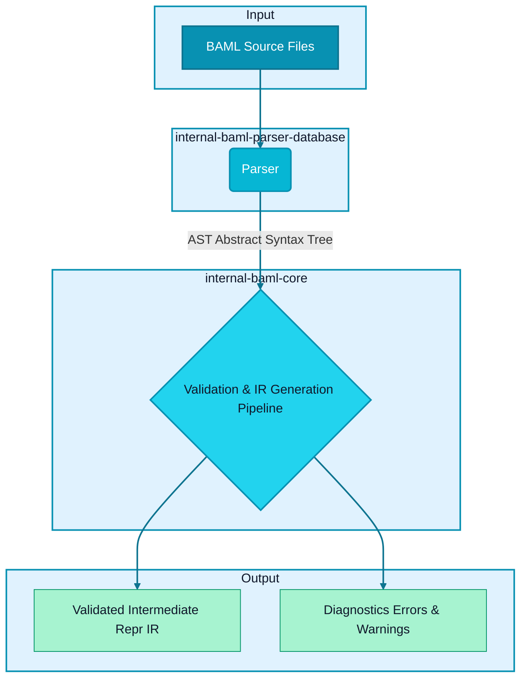
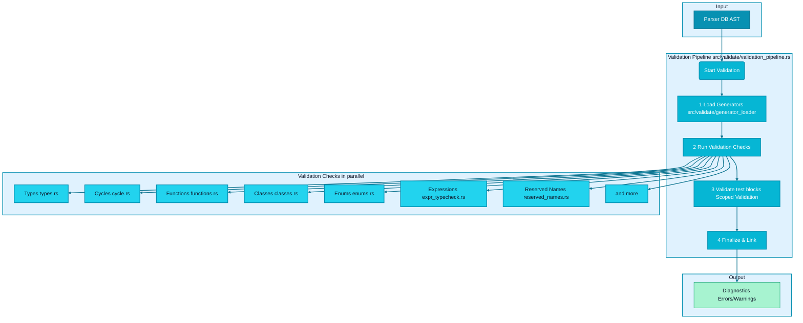
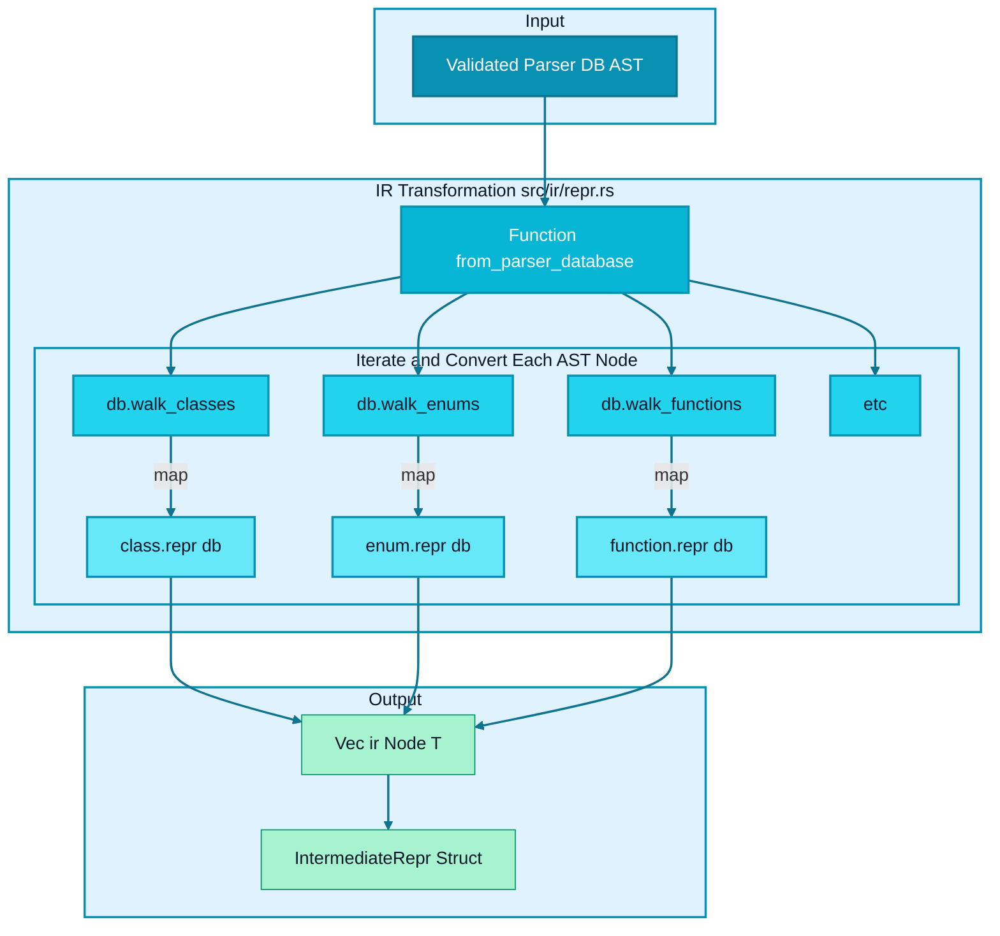
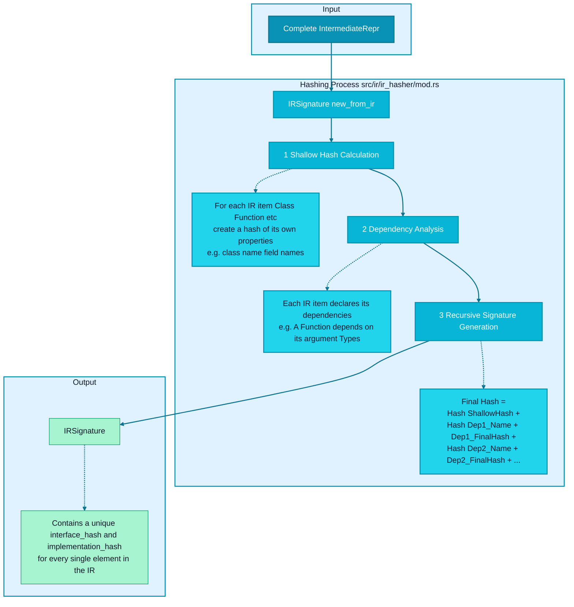
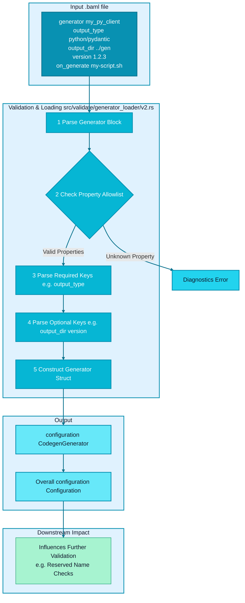
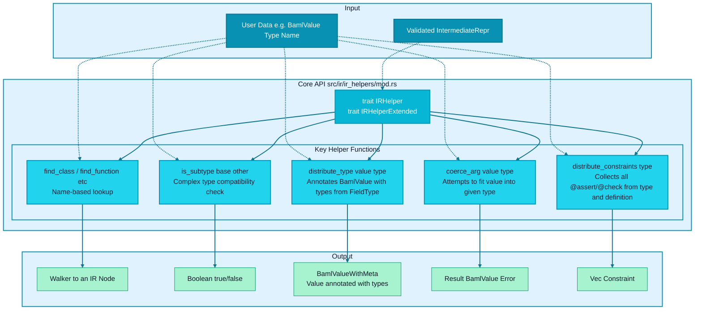
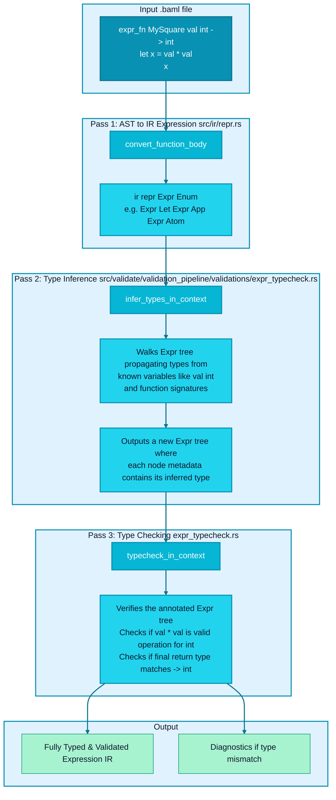
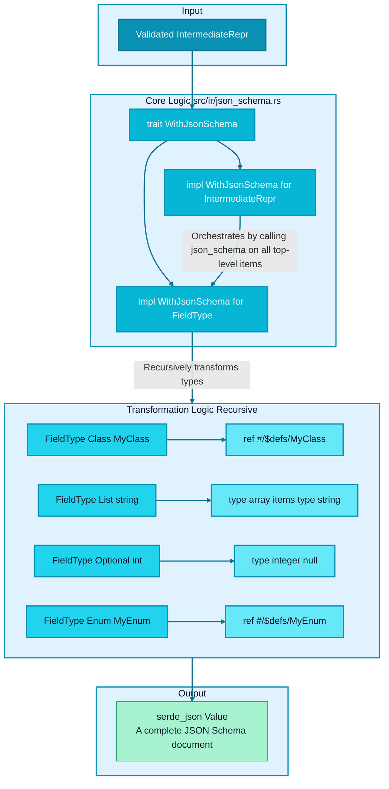

Of course! Based on the provided codebase, here is a series of diagrams illustrating the core workings of BoundaryML's `internal-baml-core` library.

The process can be broken down into four main stages:
1.  **High-Level Compilation Pipeline**: The overall flow from source files to a usable artifact.
2.  **Schema Validation**: A d    %% BAML-inspired styling
    classDef setupPhase fill:#0891b2,stroke:#0e7490,stroke-width:2px,color:#fff
    classDef concurrentEngine fill:#06b6d4,stroke:#0891b2,stroke-width:2px,color:#fff
    classDef taskNode fill:#22d3ee,stroke:#0891b2,stroke-width:2px,color:#0f172a
    classDef processNode fill:#67e8f9,stroke:#0891b2,stroke-width:2px,color:#0f172a
    classDef resultNode fill:#a7f3d0,stroke:#059669,stroke-width:1px,color:#0f172a
    classDef aggregationPhase fill:#f3f4f6,stroke:#6b7280,stroke-width:2px,color:#374151
    classDef subgraphTitleTop fill:#e0f2fe,stroke:#0891b2,stroke-width:2px,color:#0f172a

    class A setupPhase
    class B,C,D,E,F concurrentEngine
    class Diagnostics1 taskNode
    class G,H processNode
    class I resultNode
    class InputGen,ValidationLoading,OutputConf,DownstreamImpact subgraphTitleTop

    %% BAML brand styling for arrows
    linkStyle default stroke:#0e7490,stroke-width:2pxBAML code is checked for correctness.
3.  **AST to IR Transformation**: How the parsed code is converted into a more structured Intermediate Representation (IR).
4.  **IR Hashing & Signatures**: An advanced mechanism for change detection and caching.

---

### Diagram 1: The High-Level BAML Compilation Pipeline

This diagram shows the main journey of your BAML code from raw text files to a validated, structured Intermediate Representation (IR). The `internal-baml-core` library orchestrates this entire process.

**Explanation:**

1.  **Input**: The process starts with one or more `.baml` source files.
2.  **Parsing**: An external crate, `internal-baml-parser-database`, consumes these files. It parses the text into an **Abstract Syntax Tree (AST)**, which is a raw, tree-like representation of the code. This AST also includes information about file locations (spans) for accurate error reporting.
3.  **Validation & IR Generation**: This is the heart of `internal-baml-core`. The main `validate()` function (from `src/lib.rs`) takes the AST and orchestrates a series of complex steps to:
    *   Check the code for logical errors, inconsistencies, and adherence to BAML's rules.
    *   Transform the raw AST into a structured, easier-to-use **Intermediate Representation (IR)**.
4.  **Output**: The pipeline produces two key outputs:
    *   **Validated IR**: A rich, in-memory representation of the entire BAML project, which code generators (e.g., for Python or TypeScript) can use to produce client code.
    *   **Diagnostics**: A collection of any errors or warnings found during the process, complete with locations pointing back to the original source files.

---

### Diagram 2: Deep Dive into the Validation Pipeline

Validation is a critical, multi-step process. It ensures that your BAML schema is not only syntactically correct but also semantically valid.

**Explanation:**

1.  **Load Generators**: The pipeline first parses any `generator` blocks in your schema to understand what code you intend to generate (e.g., `python`, `typescript`). This context is crucial for later steps, like checking for reserved keywords.
2.  **Run Validation Checks**: `internal-baml-core` runs a battery of checks, as defined in `src/validate/validation_pipeline/validations/`. These include:
    *   **Types**: Are all referenced types (`MyClass`, `MyEnum`) actually defined? Are types used correctly (e.g., you can't use a class as a map key)?
    *   **Cycles**: Are there any infinite dependency cycles between your classes (e.g., `class A { b: B }`, `class B { a: A }`)? BAML allows some cycles through lists and maps but flags direct, non-terminating ones.
    *   **Functions, Classes, Enums**: Each major entity has its own specific rules. For example, ensuring function clients are defined, or class fields don't conflict with language keywords.
    *   **Expression Type-Checking**: For BAML `expr`, the system validates and infers the types to ensure operations are valid (e.g., you can't add a string to an integer).
3.  **Validate `test` Blocks**: A special feature of BAML is that `test` blocks can define their own local types. The validator creates a temporary, "scoped" database for each test case, combining global types with the test's local types, and runs the entire validation pipeline again on this temporary scope.
4.  **Finalize & Link**: After validation, a final linking step resolves all references, ensuring the entire schema is consistent.

---

### Diagram 3: AST to Intermediate Representation (IR) Transformation

Once the AST is validated, it's transformed into the more structured and powerful Intermediate Representation (IR). This process happens in `src/ir/repr.rs` within the `from_parser_database` function.

**Explanation:**

The transformation is a systematic conversion:

1.  The `from_parser_database` function receives the validated AST.
2.  It uses "walkers" (`db.walk_classes()`, `db.walk_enums()`, etc.) to iterate over every top-level definition in the AST.
3.  For each AST node (like a class or function), it calls a `.repr(db)` method. This method is responsible for:
    *   Extracting all relevant data (name, fields, arguments, return types, docstrings, attributes like `@alias`).
    *   Resolving any type references.
    *   Creating a corresponding IR struct (e.g., `ir::Class`, `ir::Function`).
4.  Each new IR object is wrapped in a `Node<T>` which attaches metadata like source spans and attributes.
5.  All these `Node` objects are collected into vectors (`Vec<ir::Class>`, `Vec<ir::Enum>`, etc.) inside the final `IntermediateRepr` struct. This struct is the definitive, validated model of your BAML project.

---

### Diagram 4: The IR Hashing & Signature System

BAML Core includes a sophisticated hashing system (`src/ir/ir_hasher/`) to create a unique, deterministic "signature" for every element in the IR. This is primarily used for **change detection and caching**. If a function's signature hasn't changed, a tool using the IR knows it doesn't need to be re-processed.

**Explanation:**

The signature of an element changes if either its own code changes or if any of its dependencies change.

1.  **Shallow Hash**: First, the system computes a "shallow" hash for every item. This hash only considers the item's own definition. For a class, this would be its name and the names and types of its fields.
2.  **Dependency Analysis**: The system builds a graph of dependencies. A function `MyFn(input: MyClass) -> MyEnum` depends on `MyClass` and `MyEnum`.
3.  **Recursive Signature Generation**: To compute the final, deep signature for `MyFn`, the system does the following:
    *   It starts a hasher.
    *   It adds `MyFn`'s shallow hash.
    *   It then recursively looks at its dependencies, `MyClass` and `MyEnum`.
    *   It adds the final signature of `MyClass` to the hasher.
    *   It adds the final signature of `MyEnum` to the hasher.
    *   The result is a hash that is stable as long as `MyFn`, `MyClass`, and `MyEnum` (and any of their dependencies) do not change.

This creates an extremely reliable way to detect exactly what has changed between different versions of the BAML source.

Excellent. Let's continue by exploring the next set of high-level functionalities and then drill down into the specifics of how they are implemented.

### Diagram 5: Configuration Loading and Processing

Before validation can be fully effective, the system needs to understand the project's configuration, which is primarily defined in `generator` blocks. This process is handled by the `generator_loader`.

**Explanation:**

1.  **Parsing**: The `generator_loader` (`src/validate/generator_loader/v2.rs`) is invoked early in the validation pipeline. It finds all `generator` blocks in the AST.
2.  **Allowlist Check**: It first validates that only known properties (like `output_type`, `output_dir`, `version`, `default_client_mode`, etc.) are used. An unknown property will immediately generate an error.
3.  **Key Parsing**: It then systematically parses each property. Some are mandatory (`output_type`), and their absence is an error. Others are optional. The parser validates the value's type (e.g., ensuring `version` is a string).
4.  **Struct Construction**: The parsed and validated properties are used to build a strongly-typed `CodegenGenerator` or `CloudProject` struct (defined in `src/configuration.rs`).
5.  **Downstream Impact**: This final `Configuration` object is passed to the rest of the validation pipeline. It's used, for example, to determine which set of reserved language keywords to check against when validating class and enum field names.

---

### Diagram 6: Interacting with the IR (The `ir_helpers` Module)

Once the `IntermediateRepr` is built, it's not just a static data structure. The `ir_helpers` module provides a rich API to query, manipulate, and reason about the types and values within the IR. This is the primary interface for any tool that consumes the IR.

**Explanation:**

The `IRHelper` and `IRHelperExtended` traits, implemented for `IntermediateRepr`, provide essential functionality:

*   **Lookup (`find_*`)**: Simple, efficient methods to find a specific class, enum, or function by its name string.
*   **Type Compatibility (`is_subtype`)**: A powerful recursive function that determines if a value of one type can be safely used where another type is expected. It correctly handles unions, optionals, lists, and maps. This is fundamental to type checking.
*   **Value Annotation (`distribute_type`)**: This is a cornerstone function. It takes a raw `BamlValue` (which has no type information) and a `FieldType` and walks both structures in parallel. It produces a `BamlValueWithMeta`, where every single node in the value tree (even nested ones) is annotated with its corresponding type. This is invaluable for detailed validation and transformation.
*   **Argument Coercion (`coerce_arg`)**: When processing function arguments, this helper attempts to convert user-provided values into the schema-defined types. It handles cases like converting a string to a matching enum value, or parsing a dictionary into a class instance.
*   **Constraint Aggregation (`distribute_constraints`)**: A type's constraints (`@assert` or `@check`) can be defined in multiple places (on the type itself, on the class/enum definition). This helper recursively traverses the type definition to gather all applicable constraints into a single list.

---

## Drilling Down: Specific Subsystems

Now we'll move into more detailed diagrams of specific, complex internal mechanisms.

### Diagram 7: The BAML Expression Subsystem (`expr_fn`)

BAML's `expr_fn` allows for more complex, code-like logic. This requires a multi-pass compilation approach within `internal-baml-core`.

**Explanation:**

1.  **AST to IR Expression**: During the main IR transformation, the raw expression from the AST is converted into a structured `ir::repr::Expr` enum. This turns the code into a tree of operations (`Let`, `App` for function application, etc.). At this stage, most type information is missing.
2.  **Type Inference**: The `infer_types_in_context` function performs a crucial pass. It traverses the `Expr` tree, using a `HashMap` context that maps variable names to their types. It starts with the function's parameters (`val: int`). As it descends the tree, it infers the type of each sub-expression (e.g., it knows `val * val` results in an `int`) and annotates the `Expr` node's metadata with this new type information.
3.  **Type Checking**: Finally, `typecheck_in_context` performs a verification pass on the type-annotated tree. It confirms that all operations are valid for the given types. For example, in a function call `MyFn(x)`, it uses `is_subtype` to ensure the type of `x` is compatible with `MyFn`'s expected parameter type. It also confirms that the function's final expression type matches its declared return type. Any mismatch results in a diagnostic error.

---

### Diagram 8: IR to JSON Schema Generation

This is a great example of a "downstream" application of the validated IR. The `src/ir/json_schema.rs` module transforms the BAML IR into a standard JSON Schema, which is useful for validation, documentation, and tooling.

**Explanation:**

This feature is elegantly implemented using a trait.

1.  **The Trait**: A trait `WithJsonSchema` is defined with a single method, `json_schema() -> serde_json::Value`.
2.  **Implementation**: This trait is implemented for the `IntermediateRepr` and, crucially, for every variant of `FieldType` and other IR nodes.
3.  **Orchestration**: The implementation for `IntermediateRepr` is the entry point. It creates the top-level JSON Schema structure (with `$defs` for definitions) and then iterates through all its classes, enums, and functions, calling `.json_schema()` on each to populate the `$defs`.
4.  **Recursive Transformation**: The core logic resides in `impl WithJsonSchema for FieldType`. This implementation is recursive:
    *   A BAML `class` or `enum` becomes a JSON Schema `$ref` to its definition in `$defs`.
    *   A BAML `list` becomes a JSON Schema object with `type: "array"`. The `items` property is generated by recursively calling `json_schema()` on the list's inner type.
    *   An `optional` BAML type is handled by adding `"null"` to the `type` array in the resulting schema.
    *   Primitives like `int`, `string`, `bool` map directly to `integer`, `string`, `boolean`.
5.  **Output**: The final result is a single, self-contained `serde_json::Value` that represents a valid JSON Schema for the entire BAML project.