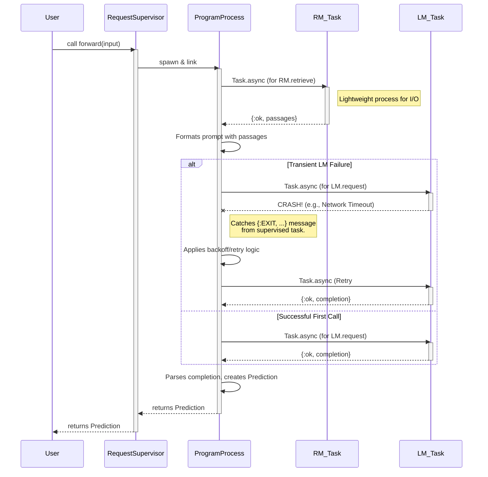
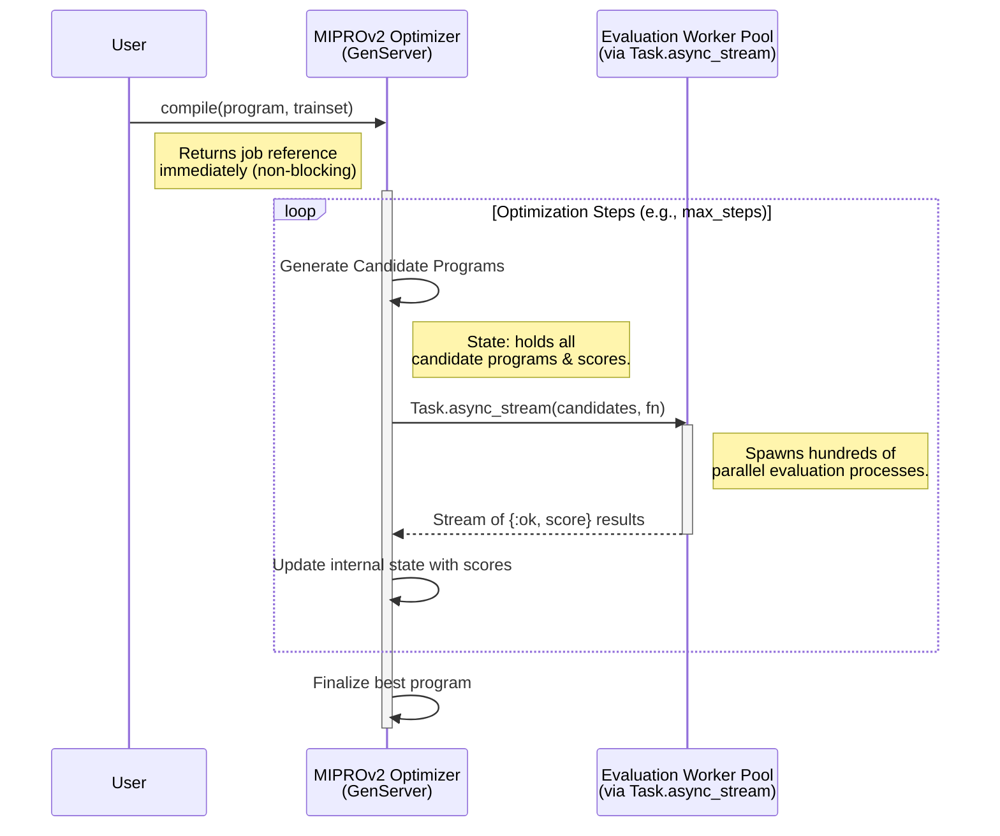

Excellent. Let's visualize the proposed architecture with a series of diagrams. These diagrams will illustrate the core concepts from the architectural analysis, focusing on the BEAM/OTP advantages in concurrency, state management, and fault tolerance.

We will cover four key areas:
1.  **High-Level Component Architecture:** A static view of how the main components of `DSPEx` interact.
2.  **Concurrent Request Lifecycle:** A dynamic view showing how a single request is handled by a tree of supervised processes, including a failure and retry scenario.
3.  **Teleprompter (Optimizer) Architecture:** A view of the long-running, stateful optimization process.
4.  **Metaprogramming Flow:** A diagram showing how `defsignature` provides a clean developer experience at compile time.

---

### Diagram 1: High-Level Component Architecture

This diagram shows the main logical components of `DSPEx` and their relationships. It highlights which components are stateful (`GenServer`s) and how they are supervised.

```mermaid
graph TD
    subgraph "User Interaction"
        User(Dev/Client)
    end

    subgraph "DSPEx Application (Supervised by OTP)"
        direction LR
        Supervisor(App Supervisor)

        subgraph "Stateless Program Logic"
            direction TB
            ProgramModule["DSPEx.Program (Behaviour)"]
            style ProgramModule fill:#cde,stroke:#333,stroke-width:2px
            Signature["DSPEx.Signature (Struct)"]
            style Signature fill:#cde,stroke:#333,stroke-width:2px
        end

        subgraph "Stateful Service Layer"
            direction TB
            LM_Client["LM Client (GenServer)"]
            style LM_Client fill:#f9f,stroke:#333,stroke-width:2px
            RM_Client["RM Client (GenServer)"]
            style RM_Client fill:#f9f,stroke:#333,stroke-width:2px
            Cache["Cache (GenServer + ETS)"]
            style Cache fill:#f9f,stroke:#333,stroke-width:2px
            Teleprompter["Teleprompter (GenServer)"]
            style Teleprompter fill:#f9f,stroke:#333,stroke-width:2px
        end
    end

    User --> ProgramModule
    Supervisor --> LM_Client
    Supervisor --> RM_Client
    Supervisor --> Cache
    Supervisor --> Teleprompter

    ProgramModule -- "Uses" --> Signature
    ProgramModule -- "Makes Request to" --> LM_Client
    ProgramModule -- "Makes Request to" --> RM_Client
    LM_Client -- "Checks/Updates" --> Cache
    RM_Client -- "Checks/Updates" --> Cache
    Teleprompter -- "Uses" --> ProgramModule
    Teleprompter -- "Uses" --> LM_Client

    note right of Supervisor
        <b>OTP Supervision Tree</b>
        The App Supervisor ensures that all
        stateful services (Clients, Cache, etc.)
        are running and restarts them on failure.
    end

    note right of ProgramModule
        <b>Stateless & Functional</b>
        The core program logic is defined in
        simple Elixir modules, following
        functional principles.
    end

    note left of LM_Client
        <b>Stateful & Concurrent-Safe</b>
        `GenServer`s manage state like API keys,
        caches, and long-running optimization jobs,
        making them safe for concurrent access.
    end
```

**Architectural Takeaways:**

*   **Separation of Concerns:** The stateless, functional program logic (`ProgramModule`) is cleanly separated from the stateful, concurrent service layer (`GenServer`s).
*   **Resilience via Supervision:** The OTP Supervisor is the root of all stateful components, guaranteeing their availability.
*   **Centralized State:** State is not global but encapsulated within specific processes (`GenServer`s), which is the OTP way to handle state in a concurrent system.

---

### Diagram 2: Concurrent Request Lifecycle (with Fault Tolerance)

This sequence diagram illustrates the dynamic creation of processes for a single `forward` call. It demonstrates the "let it crash" philosophy and supervised retries for I/O operations.



**Architectural Takeaways:**

*   **Process per Request:** A new process tree is created for each request, providing complete isolation.
*   **Task for I/O:** I/O-bound operations (database, API calls) are offloaded to `Task` processes. They do their work and then disappear.
*   **Supervised Fault Tolerance:** The `ProgramProcess` acts as a temporary supervisor for its `Task`s. When `LM_Task` crashes, the `ProgramProcess` isn't affected. It simply receives an exit signal and can implement retry logic without complex `try/catch` blocks around the I/O code itself. This is the "let it crash" principle in action.

---

### Diagram 3: Teleprompter (Optimizer) Architecture

This diagram shows how a long-running, stateful optimization process like `MIPROv2` would be structured to leverage OTP's strengths for parallel computation and state management.



**Architectural Takeaways:**

*   **Asynchronous Execution:** The user kicks off the long-running compile job without blocking.
*   **Stateful Process:** The `MIPROv2` `GenServer` is the heart of the operation, safely managing the optimization state across many steps.
*   **Massive, Effortless Parallelism:** The evaluation of candidate programs—the most expensive part—is trivially parallelized using `Task.async_stream`. The BEAM VM handles scheduling these lightweight processes across all available CPU cores efficiently.

---

### Diagram 4: Compile-Time Metaprogramming (`defsignature`)

This diagram explains how the declarative `Signature` syntax is transformed into efficient, structured code *before* the program ever runs.

```mermaid
graph TD
    subgraph "Phase 1: Development"
        A[Developer writes code in `my_app.ex`]
        CodeBlock["
        defmodule MyQuery do
          use DSPEx.Signature,
            \"question -> answer\"
        end
        "]
        A --> CodeBlock
    end

    subgraph "Phase 2: Compilation (`mix compile`)"
        B[Elixir Compiler encounters `use DSPEx.Signature`]
        C{DSPEx.Signature Macro (`__using__/1`) Executes}
        D[Macro parses \"question -> answer\" string]
        E[Macro generates Elixir AST (code definition)]
        F[
            Generated AST:
            - `defstruct [:question, :answer, ...]`
            - `@type t :: %MyQuery{...}`
            - `@instructions \"...\"`
            - Helper functions
        ]

        B --> C --> D --> E --> F
    end

    subgraph "Phase 3: Runtime Artifact"
        G[Compiler outputs `my_query.beam` file]
        H{`MyQuery` is a normal, fast Elixir struct}

        F --> G --> H
    end

    style C fill:#f9f,stroke:#333,stroke-width:2px
    style E fill:#cde,stroke:#333,stroke-width:2px
```

**Architectural Takeaways:**

*   **Developer Ergonomics:** The developer writes a simple, declarative line of code.
*   **Compile-Time Power:** All the complex parsing and code generation happens once, at compile time, via macros.
*   **Runtime Efficiency:** The final result is not an interpreted object but a native, highly efficient Elixir struct and compiled module, with no runtime overhead from the original string definition. This brings the best of both worlds: dynamic-feeling syntax with compiled-code performance.
