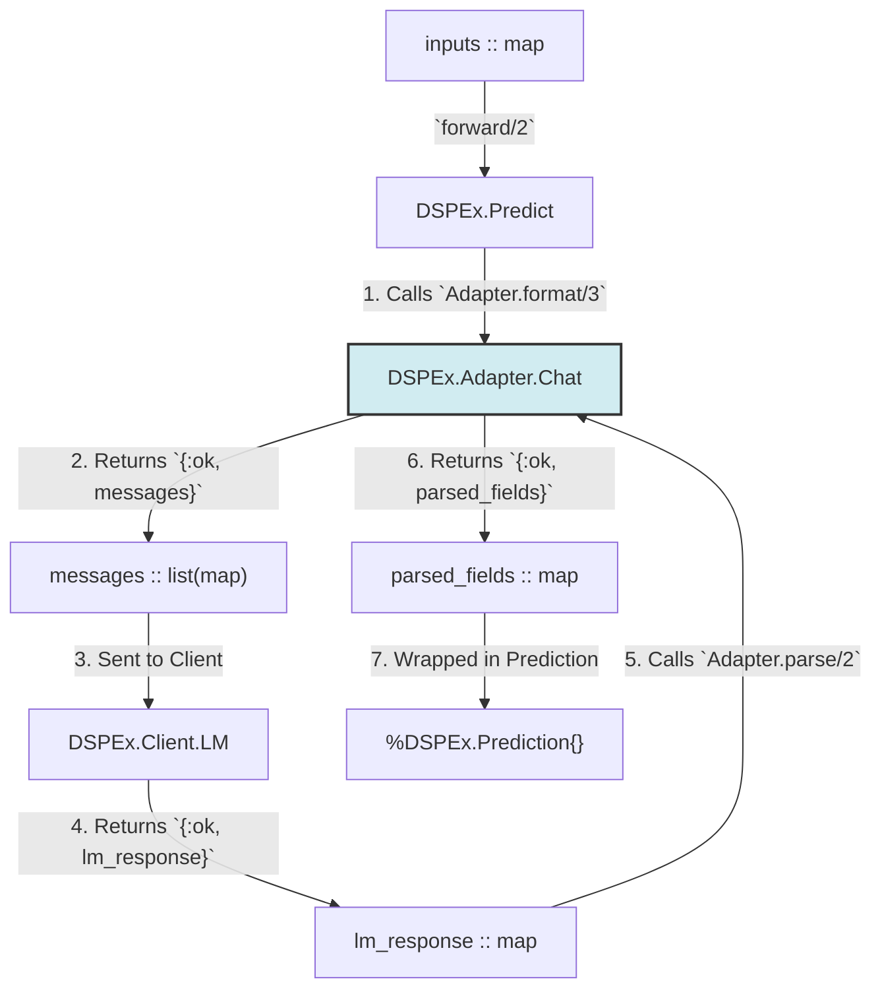

Excellent. We will now generate the second technical document in the `foundation`-accelerated series. This document builds upon the robust `LM Client` and `Predict` module, focusing on the components that enable more sophisticated prompting and program composition.

This blueprint details the **Adapter Layer** and the **`ChainOfThought` Module**, which are essential for moving beyond simple one-shot predictions and into complex reasoning tasks.

---

### **`DSPEx` Technical Blueprint (Foundation-Accelerated) - Document 2 of 3**

### **Topic: The Adapter Layer and `ChainOfThought` Module**

**Objective:** To provide a detailed engineering blueprint for transforming a declarative `Signature` into a complex, multi-turn prompt suitable for reasoning tasks. This involves creating the `Adapter` layer and the first compositional module, `ChainOfThought`.

---

### **1. The `Adapter` Layer Architecture**

**Purpose:** The `Adapter` is a stateless transformation layer. Its role is to bridge the gap between the high-level, semantic `DSPEx.Signature` and the low-level, concrete `messages` format required by an LM provider's API. This decoupling is a cornerstone of DSPy's philosophy, allowing a single `DSPEx` program to target different LMs or prompting styles simply by swapping adapters.

#### **1.1. `Adapter` Behaviour and Data Flow**

The `Adapter` `behaviour` defines the public contract for all adapter implementations.

**File:** `lib/dspex/adapter.ex`

```elixir
defmodule DSPEx.Adapter do
  alias DSPEx.{Example, Prediction, Signature}

  @doc """
  The behaviour for all DSPEx Adapters. Defines the contract for formatting
  prompts and parsing LM responses.
  """
  @callback format(signature :: module(), demos :: list(Example.t()), inputs :: map()) :: 
    {:ok, messages :: list(map())} | {:error, term()}
  
  @callback parse(signature :: module(), lm_response :: map()) :: 
    {:ok, parsed_fields :: map()} | {:error, term()}
end
```

**Refined Data Flow Diagram:**

This diagram shows the `Adapter`'s central role in the `Predict.forward` lifecycle.



#### **1.2. `DSPEx.Adapter.Chat` Implementation**

This module is a direct implementation of the `dspy.ChatAdapter`, responsible for creating the well-known `[[ ## field_name ## ]]` prompt format.

**File:** `lib/dspex/adapter/chat.ex`

```elixir
defmodule DSPEx.Adapter.Chat do
  @behaviour DSPEx.Adapter
  alias DSPEx.Signature

  @impl DSPEx.Adapter
  def format(signature, demos, inputs) do
    system_message = build_system_message(signature)
    demo_messages = build_demo_messages(signature, demos)
    user_message = build_user_message(signature, inputs, is_demo: false)

    messages = [system_message | (demo_messages ++ [user_message])]
    {:ok, messages}
  end

  @impl DSPEx.Adapter
  def parse(signature, lm_response) do
    with content when not is_nil(content) <- get_in(lm_response, ["choices", 0, "message", "content"]) do
      output_fields = Signature.output_fields(signature)
      
      parsed = Enum.reduce(output_fields, %{}, fn field_name, acc ->
        # Regex to find the content for a specific field, handling multi-line content.
        pattern = ~r/\[\[ ## #{field_name} ## \]\]\s*(.*?)(?=\[\[ ##|\z)/s
        
        case Regex.run(pattern, content, capture: :all_but_first) do
          [field_content] -> Map.put(acc, field_name, String.trim(field_content))
          nil -> acc
        end
      end)
      {:ok, parsed}
    else
      _ -> {:error, :missing_content_in_lm_response}
    end
  end

  # --- Private Helper Functions ---
  
  defp build_system_message(signature) do
    instructions = Signature.instructions(signature)
    # In future layers, this will include more detailed field descriptions.
    %{role: "system", content: instructions}
  end

  defp build_demo_messages(signature, demos) do
    Enum.flat_map(demos, fn demo ->
      [
        build_user_message(signature, demo.inputs, is_demo: true),
        build_assistant_message(signature, demo.labels)
      ]
    end)
  end
  
  defp build_user_message(signature, data_map, opts) do
    is_demo = Keyword.get(opts, :is_demo, false)
    
    # Use only input fields for user messages
    content =
      Signature.input_fields(signature)
      |> Enum.map_join("\n\n", fn field ->
        "[[ ## #{field} ## ]]\n#{Map.get(data_map, field)}"
      end)

    %{role: "user", content: content}
  end

  defp build_assistant_message(signature, data_map) do
    # For demos, the assistant provides the ground-truth outputs
    content =
      Signature.output_fields(signature)
      |> Enum.map_join("\n\n", fn field ->
        "[[ ## #{field} ## ]]\n#{Map.get(data_map, field)}"
      end)
      
    %{role: "assistant", content: content}
  end
end
```
**Key Implementation Details:**
*   **Statelessness:** The adapter is a stateless module with pure functions, making it easy to test and reason about.
*   **Robust Parsing:** The regex in `parse/2` is crucial. The `(?=\[\[ ##|\z)` part is a positive lookahead that ensures we capture everything until the *next* field marker or the end of the string, correctly handling multi-line outputs.
*   **Data-Driven Formatting:** The formatting functions are driven entirely by the `input_fields` and `output_fields` defined in the `Signature`, making the adapter generic and reusable for any task.

---

### **2. `DSPEx.ChainOfThought` Module**

**Purpose:** To programmatically inject a "reasoning" step into a `Signature` before execution. It is a compositional module that contains and delegates to an internal `Predict` instance.

**File:** `lib/dspex/chain_of_thought.ex`

```elixir
defmodule DSPEx.ChainOfThought do
  @behaviour DSPEx.Program
  
  # The struct holds the original signature and the internal Predict module.
  defstruct [:signature, :predictor]

  # The constructor creates the internal `Predict` module with an extended signature.
  def new(signature, client) do
    # 1. Create the extended signature by adding the :reasoning field.
    # We will use a helper function in the Signature module for this.
    extended_signature = DSPEx.Signature.prepend_output_field(
      signature, 
      :reasoning, 
      %{desc: "Think step-by-step to reach the answer."}
    )

    # 2. Create an internal Predict module that uses this new signature.
    predictor = %DSPEx.Predict{
      signature: extended_signature,
      client: client
      # The adapter can be inherited or specified here.
    }
    
    %__MODULE__{signature: signature, predictor: predictor}
  end

  @impl DSPEx.Program
  def forward(program, inputs) do
    # 3. Delegate the call to the internal predictor.
    DSPEx.Program.forward(program.predictor, inputs)
  end
end
```

#### **Supporting `Signature` Manipulation**

To make `ChainOfThought.new/2` work cleanly, we need to add helper functions to the `DSPEx.Signature` module to allow for programmatic manipulation.

**File:** `lib/dspex/signature.ex` (New functions to be added to the macro's generated code)

```elixir
# Inside the `quote` block of the `defsignature` macro...

@doc "Returns a new signature module with a field prepended to the outputs."
def prepend_output_field(original_signature, field_name, field_opts) do
  # This function will dynamically create a new module on the fly,
  # or return a map/struct that represents the new signature contract.
  # For now, we'll represent it as a map that mimics the behaviour.
  
  new_output_fields = [{field_name, field_opts} | original_signature.output_fields()]
  
  # Return an anonymous module or a "signature-like" map
  %{
    instructions: original_signature.instructions(),
    input_fields: original_signature.input_fields(),
    output_fields: Enum.map(new_output_fields, &elem(&1, 0))
    # ... and so on
  }
end
```

**Key Architectural Details:**

1.  **Immutability and Composition:** `ChainOfThought` does not modify the original signature. It creates a *new, extended signature* and uses it to configure its internal `Predict` module. This is a core functional programming principle.
2.  **Delegation:** The `forward/2` function is a pure pass-through. `ChainOfThought`'s only job is orchestration and setup; the actual execution is handled by `Predict`.
3.  **Dynamic vs. Static:** While the signature manipulation feels dynamic, it happens once during the initialization of the `ChainOfThought` module. The execution path remains fast and type-safe.

---

### **Conclusion**

With the completion of the `Adapter` and `ChainOfThought` designs, the `DSPEx` core engine is now capable of:
-   **Sophisticated Prompting:** Translating high-level `Signatures` into multi-turn, few-shot chat prompts.
-   **Reliable Parsing:** Extracting structured data from an LM's free-text response.
-   **Programmatic Composition:** Building more complex modules (`ChainOfThought`) out of simpler ones (`Predict`).

This layer provides the necessary power and flexibility to build real-world RAG and agentic systems. The next and final document will detail the dynamic interactions, solidifying the complete blueprint for a production-ready core.
