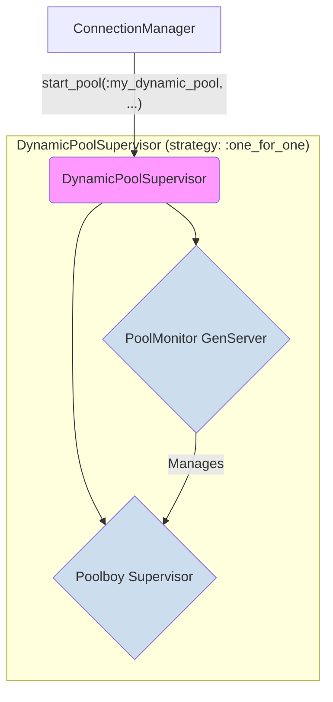

Of course. Here is a detailed technical document for the third proposed feature enhancement: **"Dynamic, Self-Healing Connection Pools in `ConnectionManager`."**

---

### **Technical Specification: Dynamic, Self-Healing Connection Pools**

**Document Version:** 1.0
**Author:** AI Assistant
**Status:** PROPOSED

#### **1. Overview**

This document specifies a significant upgrade to the `Foundation.Infrastructure.ConnectionManager`. The current implementation provides robust, fixed-size connection pools via `poolboy`. This enhancement will evolve the `ConnectionManager` into a dynamic, self-healing system capable of auto-scaling workers based on demand and proactively replacing unhealthy workers.

This feature is critical for the `DSPEx` project for two primary reasons:
1.  **Workload Elasticity:** DSPy optimization workloads are extremely "bursty." A `MIPROv2` run might require 100 concurrent workers for 30 minutes, but the application might only need 2 workers during normal operation. A dynamic pool can scale up to meet this demand and then scale down to conserve resources.
2.  **Resilience for Long-Running Processes:** Python bridge workers, which are managed as pool resources, can crash or enter a corrupt state. A self-healing pool can detect and replace these faulty workers *before* they impact user requests, dramatically increasing the overall reliability of `DSPEx`'s Python interoperability features.

This enhancement introduces auto-scaling and proactive health checks as configurable features of a connection pool.

---

#### **2. Problem Statement & Use Case**

A `DSPEx` application is deployed to production.
*   **Scenario A (Elasticity):** During off-peak hours, the application serves a few requests per minute, requiring only 2 active Python workers. Suddenly, a developer kicks off a `MIPROv2` optimization job, which attempts to run 50 concurrent evaluations. The current fixed-size pool of 2 workers (with maybe 5 overflow) would become a massive bottleneck, and most requests would time out waiting for a worker. The system needs to automatically scale up the number of Python workers to handle the burst.
*   **Scenario B (Self-Healing):** One of the long-running Python worker processes encounters a memory leak or a corrupted internal state. It's still "alive" but fails to process any new requests correctly, causing errors for any `DSPEx` program call that happens to check out that specific worker. The system needs to detect this "zombie" worker, terminate it, and replace it with a fresh one.

---

#### **3. Proposed API and Configuration Changes**

The primary changes will be in the configuration passed to `ConnectionManager.start_pool/2`. The public API for using the pool (`with_connection/3`) remains unchanged.

##### **3.1. Enhanced Pool Configuration**

The `pool_config` map/keyword list will be extended to support new keys for auto-scaling and health checks.

**New Configuration Options:**
```elixir
# in foundation/infrastructure/connection_manager.ex

# Example of a fully-configured dynamic pool
ConnectionManager.start_pool(:dynamic_python_pool,
  # --- Existing Options ---
  worker_module: Foundation.Bridge.Python.Worker,
  worker_args: [...],
  strategy: :lifo,

  # --- New Auto-Scaling Options ---
  initial_size: 2,         # The number of workers to start with. Replaces `size`.
  min_size: 2,             # The minimum number of workers to maintain.
  max_size: 50,            # The maximum number of workers to scale up to.
  
  # --- New Health Check Options ---
  health_check_interval_ms: 30_000, # (Optional) Check worker health every 30s.
  
  # The worker_module must implement this health check function.
  # It receives the worker's state and should return :ok or {:error, reason}.
  health_check_fun: &Foundation.Bridge.Python.Worker.health_check/1
)
```

*   `size` is deprecated in favor of `initial_size`, `min_size`, and `max_size`. If only `size` is provided, it will be treated as `initial_size = min_size = max_size` for backwards compatibility.
*   `health_check_fun`: A function of arity 1 that takes the worker's `pid` and returns an `:ok` or `{:error, reason}` tuple. The `ConnectionManager` will use this to proactively check worker health.

---

#### **4. Internal Implementation Details**

This feature requires a new supervising process for each dynamic pool, which we'll call the `PoolMonitor`.

##### **4.1. New Supervision Structure**

When `ConnectionManager.start_pool/2` is called with dynamic options (`max_size` > `min_size` or a `health_check_interval_ms`), it will start a different supervision tree.



*   **`DynamicPoolSupervisor`:** A simple supervisor to ensure both the `PoolMonitor` and `Poolboy` are started together and restarted if one fails.
*   **`PoolMonitor` (`GenServer`):** This is the new "brains" of the dynamic pool. It is responsible for all scaling and health-check logic.
*   **`Poolboy Supervisor`:** The standard `poolboy` process tree, which still manages the low-level checkout/checkin of workers.

##### **4.2. The `PoolMonitor` GenServer**

This process will manage the pool's lifecycle through a series of scheduled, recurring messages.

**State (`defstruct`):**
```elixir
defstruct [
  :pool_name,
  :pool_pid,
  :config,
  :metrics_history, # A queue of recent utilization metrics
  :health_check_timer_ref,
  :scaling_timer_ref
]
```

**Main Logic (`handle_info`):**

1.  **`handle_info(:health_check, state)`:**
    *   Triggered every `health_check_interval_ms`.
    *   Gets a list of all busy and free workers from `:poolboy.status(state.pool_pid)`.
    *   For each worker `pid` in the list, it calls the configured `health_check_fun`.
        ```elixir
        # inside the health_check handler
        all_workers = # ... get from poolboy ...
        Enum.each(all_workers, fn worker_pid ->
          case state.config.health_check_fun.(worker_pid) do
            :ok ->
              # Worker is healthy
              :ok
            {:error, reason} ->
              # Worker is unhealthy!
              Logger.warn("Worker #{inspect worker_pid} failed health check: #{inspect reason}. Terminating.")
              # Tell poolboy to terminate this specific worker. Poolboy will automatically
              # start a new one to replace it, maintaining the pool size.
              :poolboy.transaction(state.pool_pid, fn _ -> :poolboy.kill_worker(state.pool_pid, worker_pid) end)
          end
        end)
        ```

2.  **`handle_info(:scaling_check, state)`:**
    *   Triggered periodically (e.g., every 60 seconds).
    *   Gathers pool metrics:
        *   `available_workers = :poolboy.status(state.pool_pid).available`
        *   `total_workers = :poolboy.status(state.pool_pid).size`
        *   `utilization = (total_workers - available_workers) / total_workers`
    *   Applies scaling logic:
        *   **Scale Up:** If `utilization > scale_up_threshold` and `total_workers < max_size`, call `ConnectionManager.add_worker_to_pool(state.pool_name)`. This private function will find the `poolboy` supervisor and dynamically add a new child worker spec.
        *   **Scale Down:** If `utilization < scale_down_threshold` and `total_workers > min_size`, call `ConnectionManager.remove_worker_from_pool(state.pool_name)`. This private function will find an idle worker and terminate it.

##### **4.3. Integrating with `ConnectionManager`**

The `ConnectionManager` will need new internal functions to be called by the `PoolMonitor`.

*   **`add_worker_to_pool(pool_name)`:**
    *   Looks up the `poolboy` supervisor PID for the given `pool_name`.
    *   Constructs a new child spec for the `worker_module`.
    *   Calls `DynamicSupervisor.start_child(poolboy_sup_pid, child_spec)`. `poolboy` is designed to handle this gracefully.

*   **`remove_worker_from_pool(pool_name)`:**
    *   This is more complex. It needs to find an *idle* worker to terminate.
    *   It can do this by checking out a worker (`:poolboy.checkout`), immediately terminating it (`Process.exit(worker_pid, :shutdown)`), and *not* checking it back in. `poolboy` will detect the worker's death and simply reduce its internal count of available workers.

---

#### **5. Telemetry Enhancements**

New telemetry events will be emitted by the `PoolMonitor` to provide observability into its actions.

*   `[:foundation, :connection_pool, :scale_up]`
    *   **Metadata:** `%{pool_name: ..., new_size: ..., reason: "utilization > threshold"}`
*   `[:foundation, :connection_pool, :scale_down]`
    *   **Metadata:** `%{pool_name: ..., new_size: ..., reason: "utilization < threshold"}`
*   `[:foundation, :connection_pool, :unhealthy_worker_terminated]`
    *   **Metadata:** `%{pool_name: ..., worker_pid: ..., reason: "health check failed"}`

---

#### **6. Conclusion**

This enhancement transforms the `ConnectionManager` from a static resource allocator into a dynamic, intelligent, and self-healing system. By adding a dedicated `PoolMonitor` process for each dynamic pool, we can implement sophisticated auto-scaling and health-checking logic without cluttering the core `ConnectionManager` or the `poolboy` library itself.

For `DSPEx`, this provides two immense benefits:
1.  **Cost-Effectiveness:** Resources (like expensive Python processes) are only provisioned when needed, reducing idle infrastructure costs.
2.  **Robustness:** The system can automatically recover from common failure modes (zombie workers, memory leaks) without manual intervention, leading to higher uptime and reliability for production AI applications.
