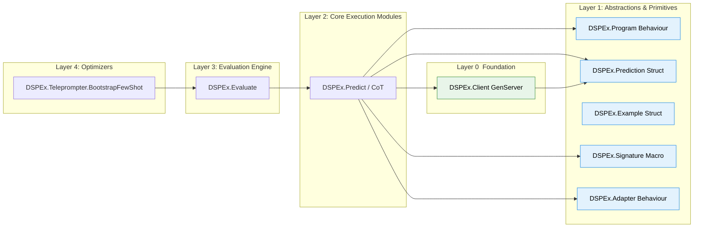

Of course. This is the perfect point to consolidate the refined strategy into a set of ground-up technical documents. The goal is to create a clear, pragmatic, and technically sound proposal that can be presented to senior Elixir engineers.

This first document will provide a detailed implementation plan that can also serve as a progress checklist. It maps our proposed Elixir components to their counterparts in the existing Python `dspy` codebase, ensuring we capture the essential logic while leveraging Elixir's strengths. It concludes with a deep-dive specification for the most foundational component: the resilient API client.

### **Document 1: The Resilient Client & Core Execution Engine**

**Objective:** To provide a detailed, actionable specification for the foundational layer of `DSPEx`. This includes a resilient, stateful, and concurrent API client, and the core `Program` behaviour that all executable modules will implement. This document serves as the primary technical guide for building and testing the bedrock of the framework.

---

#### **Dependency Graph**

This graph illustrates the layered dependencies of the MVP components. We will build from the bottom up, starting with the `Client` and `Primitives`.



---

### **Implementation Progress Checklist**

This section breaks down the MVP into concrete implementation tasks, mapping each to its corresponding logic in the Python `dspy` codebase.

#### **[ ] Layer 0: The Foundation**

*   **[ ] `DSPEx.Client` (GenServer)**
    *   **Description:** A stateful, resilient wrapper around HTTP calls to LLM providers. Manages API keys, caching, and circuit breaking for a specific provider configuration.
    *   **Mapping to `dspy`:** This component centralizes logic that is distributed in `dspy`.
        *   **HTTP Request Logic:** Maps to the `litellm.completion` and `litellm.acompletion` calls within `dspy/clients/lm.py`. Our `http_post` function will be a `Req`-based implementation of this.
        *   **Caching:** Maps to the `@request_cache` decorator and `dspy.Cache` class found in `dspy/clients/cache.py`. Our `handle_call` will use `Cachex` to achieve the same result.
        *   **Resilience:** This is an enhancement. `dspy` relies on LiteLLM's built-in retry mechanisms. `DSPEx.Client` will use `Fuse` for more robust, stateful circuit breaking, which is a significant improvement.
        *   **State Management (API Keys, etc.):** Maps to the `__init__` method of `dspy.LM` in `dspy/clients/lm.py`, where `model`, `api_key`, and other `kwargs` are stored on the object instance. Our `GenServer` state will hold this.

#### **[ ] Layer 1: Abstractions & Primitives**

*   **[ ] `DSPEx.Program` (Behaviour)**
    *   **Description:** A behaviour that defines the `forward/2` and `configure/2` contract for all executable modules. This ensures any `DSPEx` module can be used by the `Evaluate` and `Teleprompter` components.
    *   **Mapping to `dspy`:** Corresponds to the `dspy.Module` class in `dspy/primitives/program.py`. The `forward` method is a direct conceptual map. The `configure` callback is an Elixir-idiomatic equivalent of creating a new, modified instance of a module.

*   **[ ] `DSPEx.Signature` (Macro)**
    *   **Description:** A compile-time macro (`defsignature`) for declaratively defining the I/O contract of a program.
    *   **Mapping to `dspy`:** Maps to the `dspy.Signature` metaclass implementation in `dspy/signatures/signature.py`. The Python version uses Pydantic fields and a metaclass to build the signature at class definition time. Our Elixir macro will achieve the same goal of compile-time definition, but produce a more lightweight struct and module.

*   **[ ] `DSPEx.Adapter` (Behaviour)**
    *   **Description:** Defines a contract for translating a `Signature` and input data into an LLM-specific message format and parsing the response back.
    *   **Mapping to `dspy`:** Maps to the `dspy.Adapter` base class and its subclasses (`ChatAdapter`, `JSONAdapter`) in `dspy/adapters/`. Our `format/3` callback is equivalent to the `format` method, and our `parse/2` is equivalent to the `parse` method.

*   **[ ] `DSPEx.Example` & `DSPEx.Prediction` (Structs)**
    *   **Description:** Standardized data containers for training/dev data (`Example`) and program outputs (`Prediction`).
    *   **Mapping to `dspy`:**
        *   `DSPEx.Example` maps directly to `dspy.Example` in `dspy/primitives/example.py`. The concept of `.with_inputs()` is identical.
        *   `DSPEx.Prediction` maps directly to `dspy.Prediction` in `dspy/primitives/prediction.py`. The idea of storing inputs, outputs, and raw responses is the same.

#### **[ ] Layer 2: Core Execution**

*   **[ ] `DSPEx.Predict`**
    *   **Description:** The simplest `Program` implementation. Orchestrates a single call to an LLM via the `Adapter` and `Client`.
    *   **Mapping to `dspy`:** Maps to the `dspy.Predict` class in `dspy/predict/predict.py`. Its `forward` method is a direct conceptual equivalent to our `forward/2` implementation, orchestrating the call to the adapter and the LM.

#### **[ ] Layer 3: Evaluation**

*   **[ ] `DSPEx.Evaluate`**
    *   **Description:** A concurrent evaluation engine that runs a program against a dev set using `Task.async_stream`.
    *   **Mapping to `dspy`:** Maps to the `dspy.Evaluate` class in `dspy/evaluate/evaluate.py`. The key difference is the concurrency model. `dspy` uses a `ParallelExecutor` with a `ThreadPoolExecutor` (`dspy/utils/parallelizer.py`), whereas we will use OTP's `Task` primitives for superior I/O-bound concurrency and fault isolation.

#### **[ ] Layer 4: Optimization**

*   **[ ] `DSPEx.Teleprompter.BootstrapFewShot`**
    *   **Description:** An optimizer that generates few-shot examples for a `student` program by running a `teacher` program over a training set.
    *   **Mapping to `dspy`:** Maps to the `dspy.BootstrapFewShot` class in `dspy/teleprompt/bootstrap.py`. The core logic of the `compile` method—running a teacher, filtering successful traces, and creating demos—is identical. Our implementation will leverage our concurrent `DSPEx.Evaluate` engine to do this efficiently.

---

### **Deep Dive Specification: `DSPEx.Client`**

This is the most foundational runtime component. It must be robust, efficient, and testable in isolation.

**File:** `lib/dspex/client.ex`

```elixir
defmodule DSPEx.Client do
  @moduledoc """
  A stateful, resilient GenServer for making requests to an LLM API.

  Each `Client` process is configured for a specific LLM provider and model
  (e.g., OpenAI's gpt-4o) and manages its own cache, API keys, and
  circuit breaker state. This ensures that contention or failures with one
  provider do not affect others.
  """
  use GenServer

  require Logger

  alias Fuse.Circuit

  # =================================================================
  # Public API
  # =================================================================

  @doc """
  Starts a `DSPEx.Client` GenServer.

  ## Options

    * `:name` (required) - A unique atom to register the client process.
    * `:adapter` (required) - The adapter module used for formatting requests.
    * `:config` (required) - A map containing provider-specific configuration.
      * `:api_key` - The API key.
      * `:base_url` - The API base URL.
      * `:model` - The specific model string (e.g., "gpt-4o-mini").

  """
  def start_link(opts) do
    GenServer.start_link(__MODULE__, opts, name: Keyword.fetch!(opts, :name))
  end

  @doc """
  Makes a synchronous request to the LLM API.

  This is the primary way to interact with the client. It will block until
  a response is received, the request times out, or the circuit breaker
  is open.
  """
  def request(client_name, messages, opts \\ %{}) when is_atom(client_name) do
    # Default timeout of 30 seconds for the GenServer call.
    GenServer.call(client_name, {:request, messages, opts}, 30_000)
  end


  # =================================================================
  # GenServer Callbacks
  # =================================================================

  @impl true
  def init(opts) do
    # Extract config from opts passed to start_link/1
    name = Keyword.fetch!(opts, :name)
    config = Keyword.fetch!(opts, :config)

    # Set up names for dependent services, scoped to this client
    fuse_name = :"fuse_#{name}"
    cache_name = :"cache_#{name}"

    # Start the cache for this client
    :ok = Cachex.start_link(name: cache_name)

    # Configure and install the circuit breaker
    # If the function fails 5 times in a 10-second window, the fuse melts (opens).
    # It will stay open for 5 seconds before trying again.
    fuse_opts = [
      strategy: {Fuse.Strategy.ExponentialBackoff, {5_000, 2.0}},
      reset_timeout: 10_000,
      failure_threshold: 5
    ]
    :ok = Fuse.install(fuse_name, fuse_opts)

    Logger.info("DSPEx.Client #{inspect(name)} started.")

    state = %{
      name: name,
      config: config,
      fuse_name: fuse_name,
      cache_name: cache_name
    }

    {:ok, state}
  end

  @impl true
  def handle_call({:request, messages, _opts}, _from, state) do
    # The core logic: try the cache, then the network via the fuse.
    cache_key = build_cache_key(messages, state.config)

    response =
      Cachex.get_or_set(state.cache_name, cache_key, fn ->
        # This function is only executed on a cache miss.
        # It's wrapped in a circuit breaker for resilience.
        Fuse.call({:default, state.fuse_name}, fn ->
          http_post(messages, state.config)
        end)
      end)

    {:reply, response, state}
  end

  # =================================================================
  # Private Helpers
  # =================================================================

  @spec http_post(list(map()), map()) :: {:ok, map()} | no_return()
  defp http_post(messages, config) do
    body = %{
      model: config.model,
      messages: messages,
      # Add other parameters like temperature, max_tokens if needed
    }

    headers = [
      {"Authorization", "Bearer #{config.api_key}"},
      {"Content-Type", "application/json"}
    ]

    case Req.post(config.base_url, json: body, headers: headers) do
      {:ok, %{status: 200, body: response_body}} ->
        # On success, return the parsed body.
        {:ok, response_body}

      {:ok, %{status: status, body: body}} ->
        # For non-200 responses, raise an error that Fuse can catch.
        Logger.error("LLM API Error: Status #{status}, Body: #{inspect(body)}")
        raise "LLM API request failed with status #{status}"

      {:error, reason} ->
        # For network-level errors, raise an error that Fuse can catch.
        Logger.error("HTTP Request Error: #{inspect(reason)}")
        raise "HTTP request failed: #{inspect(reason)}"
    end
  end

  @spec build_cache_key(any, map) :: binary()
  defp build_cache_key(messages, config) do
    # Create a deterministic term to hash for the cache key.
    # This ensures that identical requests produce the same cache key.
    term_to_hash = {messages, config.model}
    :crypto.hash(:sha256, :erlang.term_to_binary(term_to_hash))
  end
end
```

#### **Testing Strategy for `DSPEx.Client`**

This module can and should be tested in complete isolation before any other components are built.

1.  **Unit Test with `Mox`:**
    *   Define a `ReqMock` behaviour and use `Mox` to mock the `Req.post/2` function.
    *   **Test Case 1 (Success):** Assert that `DSPEx.Client.request/2` calls `Req.post/2` with the correct URL, headers, and body. Verify that it returns `{:ok, response_body}` when the mock returns a 200 OK.
    *   **Test Case 2 (API Error):** Configure the `ReqMock` to return a 4xx or 5xx status. Assert that the `request/2` call returns `{:error, {:fuse_melted, _}}` after the threshold is reached.
    *   **Test Case 3 (Network Error):** Configure the `ReqMock` to return `{:error, :econnrefused}`. Assert the behaviour is the same as the API error case.

2.  **Cache Integration Test:**
    *   Using a real `Cachex` instance, call `DSPEx.Client.request/2` twice with the exact same arguments.
    *   Use `Mox` to `expect` the `ReqMock.post/2` function to be called **exactly once**.
    *   Verify that the result of both calls is identical.

3.  **Fuse Integration Test:**
    *   Set the `failure_threshold` in the Fuse configuration to a low number (e.g., 2) for the test environment.
    *   Configure the `ReqMock` to consistently return an error.
    *   Call `request/2` three times. Assert the first two calls return an error after a delay (as they attempt the HTTP call) and the third call returns `{:error, {:fuse_melted, _}}` almost instantly, proving the circuit is open.
