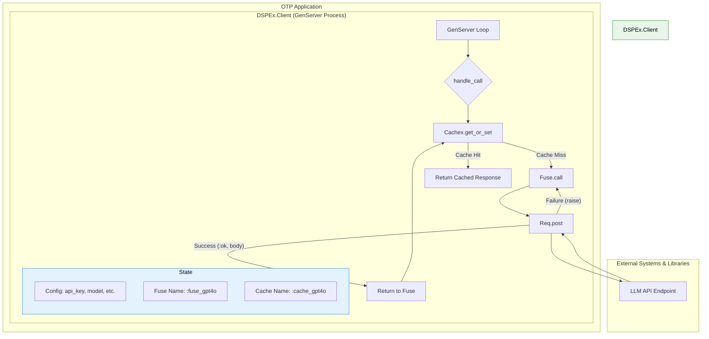

Excellent analysis. The provided documentation offers a clear, staged, and well-reasoned plan for porting `dspy` to Elixir.

Based on your plans, the most foundational active module is unequivocally the **`DSPEx.Client`**.

While primitives like `Signature` and `Example` are conceptually foundational, they are passive data structures and compile-time macros. The `Client` is the first *runtime component* with state, concurrency, and external interaction. It is the engine that every active module (`Predict`, `ChainOfThought`, etc.) will depend on to perform its work. Its robustness and performance are paramount to the success of the entire framework.

Let's elucidate its Elixir internals.

### The Foundational Module: `DSPEx.Client`

In the Python `dspy` implementation, the `dspy.LM` class is a relatively simple object that holds configuration and calls out to `litellm` for execution. This works, but it bundles configuration, caching logic, and execution into a single, stateless-feeling object instance.

The Elixir port, `DSPEx.Client`, elevates this concept by leveraging OTP to create a more robust, stateful, and resilient component. It's not just a class instance; it's a supervised, long-running process with its own isolated state and lifecycle.

#### Internal Architecture of a `DSPEx.Client` Process

The following diagram illustrates the internal components and data flow within a single `DSPEx.Client` GenServer process. Each configured LLM (e.g., one for `gpt-4o-mini`, another for `claude-3-opus`) would have its own independent process like this running in the system.

#### Deep Dive: Elixir Internals Explained

1.  **The GenServer as the Core Container:**
    The entire module is wrapped in a `GenServer`. This is a deliberate and critical design choice that provides:
    *   **State Management:** The GenServer's state (`%{config: ..., fuse_name: ..., cache_name: ...}`) holds the API key, model name, and other configuration. This is the Elixir equivalent of an object's instance variables (`self.model`, `self.api_key`), but with the added benefits of process isolation.
    *   **Controlled Concurrency:** All requests to a specific LLM configuration are serialized through this single process's mailbox. While the `GenServer.call` is synchronous from the caller's perspective, the GenServer itself can handle many such calls without blocking the entire system, processing one at a time. This prevents race conditions related to state changes.
    *   **Lifecycle Management:** As part of an OTP supervision tree, if a `Client` process crashes due to an unrecoverable error, the supervisor can automatically restart it, ensuring the system remains available.

2.  **Resilience via `Fuse` (Circuit Breaker):**
    The Python `dspy` implementation delegates retries to `litellm`. The Elixir implementation takes a more robust approach with the `Fuse` library.
    *   **Mechanism:** In `handle_call`, the actual network request (`http_post`) is wrapped in `Fuse.call`.
    *   **Stateful Failure Tracking:** `Fuse` maintains its own state (under the hood, in an ETS table associated with `:fuse_gpt4o`). It counts recent failures. If `http_post` raises an exception (e.g., from a 503 error or a timeout), `Fuse` catches it and increments its failure count.
    *   **"Melting" the Fuse:** Once the failure threshold is reached (e.g., 5 failures in 10 seconds), the fuse "melts" or opens. For the next 5 seconds (the reset timeout), any call to `Fuse.call` for this specific fuse will **immediately** fail with `{:error, {:fuse_melted, _}}` without ever attempting a network request.
    *   **Benefit:** This prevents a struggling downstream API from overwhelming our application with failing requests. We back off intelligently, giving the external service time to recover. This is a significant improvement over simple retry loops.

3.  **Performance via `Cachex`:**
    This directly maps to the caching functionality in `dspy`.
    *   **Mechanism:** `Cachex.get_or_set/3` is a powerful caching primitive. It first attempts to `get` a value from the cache using a deterministic key.
    *   **Cache Hit:** If the key exists, it immediately returns the cached value. The function provided as the third argument (which contains the `Fuse.call`) is **never executed**.
    *   **Cache Miss:** If the key does not exist, it executes the function, takes its return value, `set`s it in the cache, and then returns it.
    *   **The Key:** The `build_cache_key/2` function is critical. It creates a deterministic hash from the request payload (messages and model config). This ensures that identical requests always hit the cache, while different requests result in new API calls.

4.  **The Request Lifecycle (A Walkthrough):**
    1.  A `DSPEx.Predict` module calls `DSPEx.Client.request(:gpt4o_client, messages)`.
    2.  This sends a synchronous `:request` message to the `:gpt4o_client` GenServer process.
    3.  The process's `handle_call` function is invoked.
    4.  A `cache_key` is generated from the `messages` and the model config stored in the GenServer's state.
    5.  `Cachex.get_or_set` checks the `:cache_gpt4o` cache.
        *   **On Hit:** The cached `{:ok, response_body}` is retrieved and immediately sent back as the `GenServer.call` reply.
        *   **On Miss:** `Cachex` executes its provided function.
    6.  `Fuse.call` is invoked for the `:fuse_gpt4o` fuse.
        *   **If Fuse is Open:** It immediately returns `{:error, {:fuse_melted, _}}`. This becomes the reply.
        *   **If Fuse is Closed:** It executes the `http_post` function.
    7.  Inside `http_post`, `Req.post!` makes the actual HTTP call.
        *   **If 200 OK:** It returns `{:ok, response_body}`. `Fuse` passes this through, `Cachex` stores it, and it becomes the `GenServer.call` reply.
        *   **If > 200 Status or Network Error:** It `raise`s an exception. `Fuse` catches this, records the failure, and returns `{:error, {:raised, reason}}`. This becomes the reply.

---

### Mapping `DSPEx.Client` Internals to Python `dspy`

This mapping shows how the Elixir design corresponds to and improves upon the logic distributed across several Python files.

| Elixir Component (`DSPEx.Client`) | Python `dspy` Equivalent (`dspy/`) | Line Numbers (Approx.) & Rationale |
| :--- | :--- | :--- |
| **`GenServer` State** (`init/1`) (holds `config`, `fuse_name`, etc.) | `clients/lm.py` (`LM.__init__`) | `17-37` |
| | The `__init__` method of the `LM` class sets `self.model`, `self.provider`, `self.kwargs`, `self.cache`, etc. In Elixir, this becomes the immutable state of the `Client` GenServer process, providing better isolation. |
| **Request Execution** (`handle_call`) | `clients/lm.py` (`LM.forward`) `clients/lm.py` (`litellm_completion`) | `65-72` `166-174` |
| | The `LM.forward` method orchestrates the call, ultimately delegating to `litellm_completion`. Our `handle_call` serves the same orchestrational role but within the GenServer's context. |
| **Caching Logic** (`Cachex.get_or_set`) | `clients/cache.py` (`request_cache` decorator) | `116-172` |
| | `dspy` uses a decorator (`@request_cache`) to wrap the `litellm` call. This decorator checks a `dspy.Cache` instance. `Cachex.get_or_set` provides the exact same "check-then-compute" logic in a more direct, functional style without decorators. |
| **Resilience Logic** (`Fuse.call`) | `clients/lm.py` (`litellm_completion`) | `168` (`num_retries`) |
| | `dspy` passes a `num_retries` parameter to `litellm`, which performs simple retries. `Fuse` is a conceptual upgrade, providing a stateful circuit breaker that tracks failure rates over time and opens the circuit to prevent system overload, which is a more advanced resilience pattern. |
| **HTTP Request** (`Req.post`) | `clients/lm.py` (`litellm_completion`) | `166-174` |
| | The `litellm.completion(...)` call is where the actual HTTP request is made. Our `http_post` function using `Req` is a direct, native Elixir replacement for this specific functionality, giving us full control over headers, body, and error handling. |