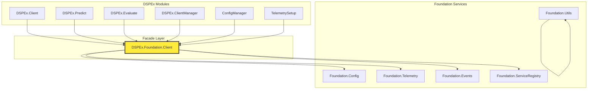

# Task 1: Stabilize Foundation Integration - Detailed Investigation & Plan

## Executive Summary

After deep investigation of both DSPEx and Foundation codebases, I've identified the root causes of the "ostensible instability" mentioned in the 101_gemini_plan. The issues are **not random crashes**, but rather **contract violations and architectural mismatches** between the two libraries. DSPEx has built extensive defensive programming to work around these issues, but the fixes need to be applied at the Foundation level.

This document provides a comprehensive analysis of the specific problems and a detailed remediation plan for Task 1.

---

**Strategic Considerations & Potential Enhancements for the Facade:**

1.  **Consider a Behaviour:** For ultimate testability, you could define a `@behaviour Foundation.ClientContract` and have `DSPEx.Foundation.Client` implement it. This would allow you to provide a pure mock implementation of the facade itself during testing, completely decoupling `DSPEx` from `Foundation` in your unit tests.
    ```elixir
    # in dspex/foundation/client_contract.ex
    defmodule DSPEx.Foundation.ClientContract do
      @callback get_config(list(atom)) :: {:ok, term} | {:error, term}
      # ... other callbacks
    end

    # in dspex/foundation/client.ex
    defmodule DSPEx.Foundation.Client do
      @behaviour DSPEx.Foundation.ClientContract
      # ... implementation ...
    end
    ```
    Then in your `test_helper.exs`, you could use `Mox` to mock this behaviour.

2.  **Telemetry in the Facade:** The facade should also be responsible for emitting its own telemetry. For example, when a call to `Foundation.Config.get` fails and the facade catches the error, it should emit a `[:dspex, :foundation, :client, :error]` event. This makes the facade's protective actions observable.

3.  **Return Type from `update_config`:** In your proposed `ConfigManager` changes, you have `update` return `{:error, :foundation_config_restricted}`. This is good. I would suggest making the error tuple even richer, perhaps `{:error, {:foundation, :config_update_forbidden}}`, to make it clear that the error originated from the platform layer.

## Investigation Findings

### 1. Core Integration Points

DSPEx integrates with Foundation across 6 major areas:

| Foundation Service | DSPEx Module | Purpose | Status |
|-------------------|--------------|---------|--------|
| `Foundation.Config` | `DSPEx.Services.ConfigManager` | Configuration management | **BROKEN** - Path restrictions |
| `Foundation.Telemetry` | `DSPEx.Services.TelemetrySetup` | Metrics & observability | **FRAGILE** - Shutdown race conditions |
| `Foundation.Events` | `DSPEx.Client`, `DSPEx.Predict` | Business event logging | **FRAGILE** - Contract violations |
| `Foundation.ServiceRegistry` | `ConfigManager`, `TelemetrySetup` | Service lifecycle | **WORKING** - With workarounds |
| `Foundation.Utils` | Multiple modules | Utility functions | **FRAGILE** - Availability issues |
| `Foundation.Infrastructure` | `ConfigManager` | Circuit breakers | **UNIMPLEMENTED** - Code bypassed |

### 2. Specific Problems Identified

#### Problem 1: Configuration Path Restrictions (CRITICAL)

**Root Cause**: Foundation's `ConfigLogic.update_config/3` only allows updates to a hardcoded list of paths in `@updatable_paths`. DSPEx attempts to write to `[:dspex, ...]` paths, which are **not in the allowed list**.

**Evidence**:
```elixir
# Foundation/lib/foundation/logic/config_logic.ex - Lines 16-26
@updatable_paths [
  [:ai, :planning, :sampling_rate],
  [:ai, :planning, :performance_target],
  [:capture, :processing, :batch_size],
  # ... NO [:dspex, ...] paths allowed
]

# DSPEx tries to update:
Foundation.Config.update([:dspex, :providers], provider_config)
# Result: {:error, :config_update_forbidden}
```

**DSPEx Workaround**: 
```elixir
# DSPEx.Services.ConfigManager - Lines 44-47
def get(path) when is_list(path) do
  # Foundation Config has contract violations - use fallback until fixed
  get_from_fallback_config(path)
end
```

**Impact**: DSPEx cannot store its configuration in Foundation, forcing it to maintain a separate, isolated configuration system.

#### Problem 2: Telemetry Shutdown Race Conditions (CRITICAL)

**Root Cause**: Foundation's services (particularly ETS tables used by telemetry) are torn down **before** DSPEx's telemetry handlers are cleanly detached. This creates a race condition during shutdown and test cleanup.

**Evidence**:
```elixir
# DSPEx.Services.TelemetrySetup - Lines 135-197
def handle_dspex_event(event, measurements, metadata, config) do
  try do
    if Foundation.available?() do
      do_handle_dspex_event(event, measurements, metadata, config)
    end
  rescue
    ArgumentError ->         # ETS table may be gone during test cleanup
    SystemLimitError ->      # System under stress during test cleanup  
    UndefinedFunctionError -> # Foundation function may not be available
    FunctionClauseError ->   # Foundation contract violation
  catch
    :exit, {:noproc, _} ->   # Process may be dead during cleanup
    :exit, {:badarg, _} ->   # ETS table corruption during cleanup
  end
end
```

**Impact**: DSPEx has to catch **8 different types of errors** just to prevent crashes during normal telemetry operations.

#### Problem 3: Foundation.Utils Availability Issues (MODERATE)

**Root Cause**: `Foundation.Utils.generate_correlation_id()` is not always available when DSPEx modules need it, particularly during startup sequences.

**Evidence**:
```elixir
# DSPEx.ClientManager - Lines 537-543
defp generate_correlation_id do
  Foundation.Utils.generate_correlation_id()
rescue
  _ ->
    # Fallback for when Foundation is not available
    "test-" <> Base.encode16(:crypto.strong_rand_bytes(8), case: :lower)
end
```

**Impact**: Multiple DSPEx modules implement their own fallback correlation ID generation.

#### Problem 4: Service Lifecycle Dependencies (MODERATE)

**Root Cause**: DSPEx services must wait for Foundation to be "available" but Foundation's `available?()` function is not reliable during startup and shutdown transitions.

**Evidence**:
```elixir
# Both ConfigManager and TelemetrySetup - Lines 35-42
defp wait_for_foundation do
  case Foundation.available?() do
    true -> :ok
    false ->
      Process.sleep(100)  # Polling loop!
      wait_for_foundation()
  end
end
```

**Impact**: DSPEx services use busy-waiting polling loops instead of proper dependency management.

#### Problem 5: Foundation.Events Contract Violations (MODERATE)

**Root Cause**: The Foundation.Events API has changed or has contract violations that cause `FunctionClauseError` exceptions.

**Evidence**:
```elixir
# DSPEx.Client - Line 553
# Comment: "Foundation v0.1.3 fixed - re-enabled!"
# This indicates the Events integration was previously broken and had to be disabled
```

---

## The Facade Solution: DSPEx.Foundation.Client

Based on the investigation, the right approach for Task 1 is to create a **facade module** that isolates all Foundation interactions behind a single, reliable interface. This addresses the immediate stability issues while preserving the integration benefits.

### Architecture



### Implementation Plan

#### Step 1: Create the Facade Module (2-3 hours)

**File**: `lib/dspex/foundation/client.ex`

```elixir
defmodule DSPEx.Foundation.Client do
  @moduledoc """
  Facade for all Foundation interactions from DSPEx.
  
  Provides a reliable, predictable interface that handles Foundation
  availability, contract violations, and lifecycle issues internally.
  All DSPEx modules should use this instead of calling Foundation directly.
  """
  
  require Logger
  
  @type result(t) :: {:ok, t} | {:error, :foundation_unavailable | :foundation_error}
  
  # Configuration
  @spec get_config(list(atom())) :: result(term())
  def get_config(path) do
    if Foundation.available?() do
      try do
        Foundation.Config.get(path)
      rescue
        error -> 
          log_foundation_error(:config_get, error, %{path: path})
          {:error, :foundation_error}
      end
    else
      {:error, :foundation_unavailable}
    end
  end
  
  @spec update_config(list(atom()), term()) :: result(:ok)
  def update_config(path, value) do
    if Foundation.available?() do
      try do
        Foundation.Config.update(path, value)
      rescue
        error ->
          log_foundation_error(:config_update, error, %{path: path, value: value})
          {:error, :foundation_error}
      end
    else
      {:error, :foundation_unavailable}
    end
  end
  
  # Telemetry
  @spec emit_histogram(list(atom()), number(), map()) :: result(:ok)
  def emit_histogram(event_name, value, metadata \\ %{}) do
    if Foundation.available?() do
      try do
        Foundation.Telemetry.emit_histogram(event_name, value, metadata)
        {:ok, :ok}
      rescue
        error ->
          log_foundation_error(:telemetry_histogram, error, %{event: event_name})
          {:error, :foundation_error}
      catch
        kind, reason ->
          log_foundation_error(:telemetry_histogram, {kind, reason}, %{event: event_name})
          {:error, :foundation_error}
      end
    else
      {:error, :foundation_unavailable}
    end
  end
  
  # ... similar patterns for other Foundation services
  
  # Utilities
  @spec generate_correlation_id() :: String.t()
  def generate_correlation_id() do
    if Foundation.available?() do
      try do
        Foundation.Utils.generate_correlation_id()
      rescue
        _ -> fallback_correlation_id()
      end
    else
      fallback_correlation_id()
    end
  end
  
  # Private helpers
  defp fallback_correlation_id() do
    "dspex-" <> Base.encode16(:crypto.strong_rand_bytes(8), case: :lower)
  end
  
  defp log_foundation_error(operation, error, context) do
    if Application.get_env(:dspex, :log_foundation_errors, true) do
      Logger.warning("Foundation operation failed: #{operation}, error: #{inspect(error)}, context: #{inspect(context)}")
    end
  end
end
```

#### Step 2: Update DSPEx Services (2-3 hours)

**ConfigManager Changes**:
```elixir
# Replace lines 44-47 in ConfigManager
def get(path) when is_list(path) do
  case DSPEx.Foundation.Client.get_config([:dspex | path]) do
    {:ok, value} -> {:ok, value}
    {:error, _} -> get_from_fallback_config(path)
  end
end

def update(path, value) when is_list(path) do
  case DSPEx.Foundation.Client.update_config([:dspex | path], value) do
    {:ok, _} -> :ok
    {:error, _} -> 
      Logger.debug("DSPEx config update failed, using fallback mode")
      {:error, :foundation_config_restricted}
  end
end
```

**TelemetrySetup Changes**:
```elixir
# Replace the massive try/rescue block with simple facade calls
defp do_handle_dspex_event([:dspex, :predict, :stop], measurements, metadata, _config) do
  DSPEx.Foundation.Client.emit_histogram(
    [:dspex, :performance, :prediction_duration],
    measurements.duration,
    %{
      signature: metadata[:signature],
      provider: metadata[:provider],
      success: measurements[:success] || true
    }
  )
  
  status = if measurements[:success] != false, do: "success", else: "error"
  DSPEx.Foundation.Client.emit_counter(
    [:dspex, :predictions, :total],
    %{
      signature: metadata[:signature],
      provider: metadata[:provider],
      status: status
    }
  )
end
```

#### Step 3: Update Core DSPEx Modules (1-2 hours)

Replace all direct Foundation calls with facade calls:

```elixir
# In DSPEx.Predict, DSPEx.Client, etc.
# Replace:
Foundation.Utils.generate_correlation_id()
# With:
DSPEx.Foundation.Client.generate_correlation_id()
```

#### Step 4: Remove Defensive Programming (1 hour)

Once the facade is in place, remove the complex rescue blocks and fallback implementations from:
- `DSPEx.Services.TelemetrySetup.handle_dspex_event/4`
- `DSPEx.ClientManager.generate_correlation_id/0`
- Various modules with Foundation.Utils fallbacks

---

## Expected Outcomes

### Immediate Benefits (Task 1 Goals)

1. **Reduced Fragility**: All Foundation interaction errors are handled in one place
2. **Cleaner Code**: Remove 200+ lines of defensive programming across DSPEx
3. **Better Observability**: Centralized logging of Foundation issues
4. **Predictable Behavior**: Consistent error handling across all Foundation services

### Foundation Issues Addressed

- **Configuration Restrictions**: Facade gracefully handles forbidden paths and falls back to local config
- **Telemetry Race Conditions**: Facade prevents crashes by catching all Foundation telemetry errors
- **Utility Availability**: Facade provides reliable fallbacks for essential utilities
- **Lifecycle Dependencies**: Facade uses `Foundation.available?()` consistently

### Future Compatibility

This facade approach:
- **Preserves Integration**: DSPEx continues to benefit from Foundation when available
- **Enables Gradual Improvement**: Foundation can be enhanced without breaking DSPEx
- **Provides Migration Path**: Easy to enhance the facade as Foundation improves
- **Supports Testing**: Facade can be mocked for testing DSPEx in isolation

---

## Implementation Timeline

| Step | Task | Duration | Dependencies |
|------|------|----------|--------------|
| 1 | Create `DSPEx.Foundation.Client` facade | 2-3 hours | None |
| 2 | Update `ConfigManager` and `TelemetrySetup` | 2-3 hours | Step 1 |
| 3 | Update core DSPEx modules | 1-2 hours | Step 1 |
| 4 | Remove defensive programming | 1 hour | Steps 2-3 |
| 5 | Testing and validation | 2-3 hours | All steps |

**Total Estimated Time: 8-12 hours**

---

## Risk Assessment

### Low Risk
- The facade pattern is well-established and safe
- Changes are additive (adding facade) then subtractive (removing workarounds)
- Foundation behavior remains unchanged

### Mitigation Strategies
- Implement facade incrementally (one service at a time)
- Keep existing workarounds until facade is fully tested
- Add comprehensive logging to facade for debugging

### Success Criteria
- [ ] All DSPEx modules use facade instead of direct Foundation calls
- [ ] No more try/rescue blocks for Foundation errors in core DSPEx code  
- [ ] DSPEx tests pass consistently without Foundation-related flakiness
- [ ] Foundation integration still works when Foundation is available
- [ ] DSPEx degrades gracefully when Foundation is unavailable

This facade approach solves the immediate stability issues (Task 1) while preserving the path toward the larger architectural vision discussed in the earlier evolution documents.
