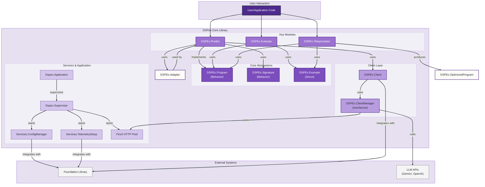
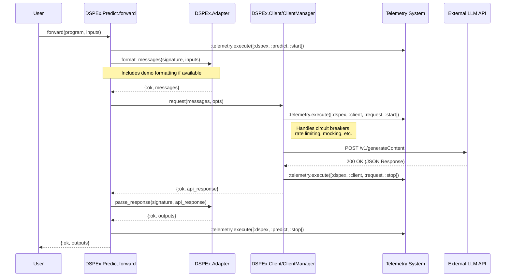
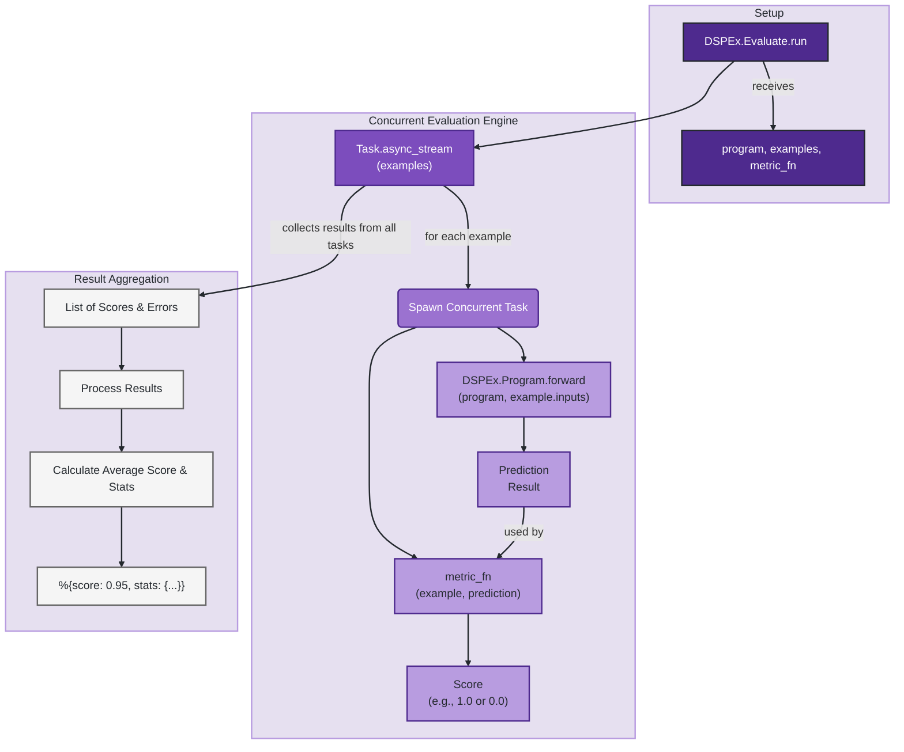
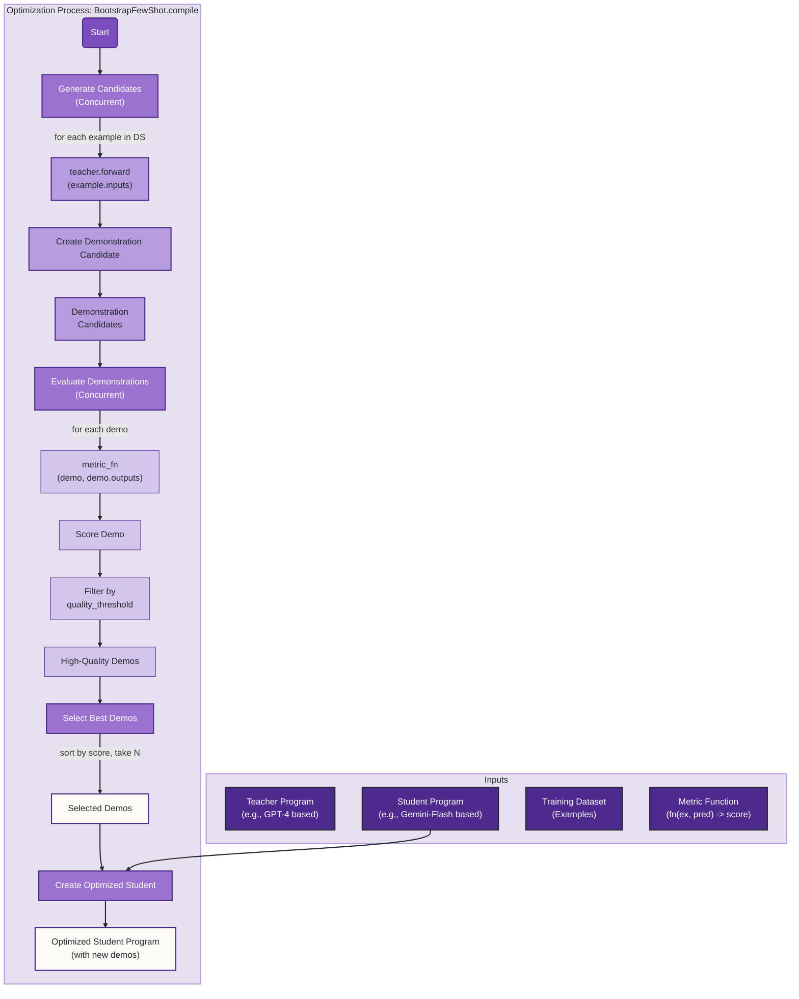
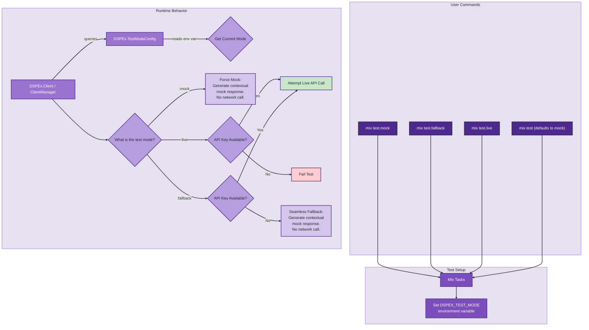

Of course. Here is a comprehensive series of technical diagrams that illustrate the architecture, core workflows, and key features of the DSPex implementation. The diagrams are designed to provide a clear understanding of the system, from high-level architecture to detailed operational flows.

***

## Introduction

These diagrams provide a visual guide to the DSPex library's architecture and functionality. They cover the main processes: making a prediction, evaluating a program's performance, and optimizing a program with few-shot demonstrations. The diagrams also detail the supporting services like configuration, telemetry, and the flexible testing framework.

---

### **Diagram 1: High-Level System Architecture**

This diagram shows the main components of the DSPex library and their relationships. It illustrates how the core abstractions (`Program`, `Signature`) are used by key modules and how supporting services integrate with the underlying "Foundation" library and external APIs.

**Workflow Description:**
*   A user's application interacts with the primary modules: `Predict` for inference, `Evaluate` for performance measurement, and `Teleprompter` for optimization.
*   These modules are built upon core abstractions: a `Program` defines an executable unit, a `Signature` defines its I/O contract, and an `Example` holds data.
*   The `Predict` module uses an `Adapter` to format data and a `Client` to communicate with external `LLM APIs`.
*   The `ClientManager` provides a stateful, resilient GenServer-based alternative to the functional `Client`. It uses a `Finch` pool for HTTP requests.
*   The entire system is started as an OTP `Application`, which supervises the key background services (`ConfigManager`, `TelemetrySetup`).
*   These services integrate deeply with an external `Foundation` library to provide centralized configuration, telemetry, and other infrastructure services.

---

### **Diagram 2: Core Prediction Flow (`DSPEx.Predict`)**

This sequence diagram details the steps involved when making a single prediction. It shows the flow of control from the `Predict` program through the `Adapter` and `Client` layers to the LLM API and back.

**Workflow Description:**

- **Initiation:** A user calls `DSPEx.Predict.forward` with a program instance and input data.
- **Telemetry Start:** The `Predict` module emits a `:start` telemetry event.
- **Format Request:** `Predict` calls `DSPEx.Adapter.format_messages`. The adapter uses the program's `Signature` and any few-shot `demos` to create a list of messages suitable for the LLM API.
- **Client Request:** The formatted messages are passed to `DSPEx.Client.request`.
- **API Call:** The `Client` (or `ClientManager`) handles the HTTP call to the external LLM provider (e.g., Gemini). It manages resilience patterns like circuit breaking and emits its own telemetry events.
- **Receive Response:** The `Client` receives the raw JSON response from the API.
- **Parse Response:** The `Predict` module passes the API response to `DSPEx.Adapter.parse_response`. The adapter extracts the relevant content and structures it according to the `Signature`'s output fields.
- **Telemetry Stop:** A `:stop` telemetry event is emitted with duration and success metrics.
- **Return Result:** The final, structured output map is returned to the user.

---

### **Diagram 3: Program Evaluation Flow (`DSPEx.Evaluate`)**

This diagram illustrates how `DSPEx.Evaluate` concurrently assesses a program's performance against a dataset. It highlights the use of `Task.async_stream` for parallelism.

**Workflow Description:**

- **Initiation:** The user calls `DSPEx.Evaluate.run` with a `program` to test, a list of `examples` (each with inputs and expected outputs), and a `metric_fn`.
- **Concurrency:** `Evaluate` uses `Task.async_stream` to process the list of examples in parallel, up to a configurable concurrency limit.
- **Single Example Evaluation (per task):**
    - For each example, a task is spawned.
    - Inside the task, `DSPEx.Program.forward` is called with the example's inputs to get a `prediction`.
    - The `metric_fn` is then called with the original `example` and the new `prediction` to generate a quality `score`.
- **Aggregation:** The main process collects the results (scores or errors) from all completed tasks.
- **Final Report:** The collected scores are aggregated to produce a final `evaluation_result` map, containing the average score and detailed statistics like success rate, duration, and error counts.

---

### **Diagram 4: Program Optimization Flow (`BootstrapFewShot`)**

This diagram shows the "compilation" process of the `BootstrapFewShot` teleprompter. It details the algorithm used to generate high-quality few-shot examples (demonstrations) for a "student" program.

**Workflow Description:**

- **Inputs:** The `compile` function takes a `student` program (to be optimized), a more powerful `teacher` program, a `trainset` of examples, and a `metric_fn`.
- **Generate Candidates:** The teleprompter iterates through the `trainset`. For each example, it uses the `teacher` program to generate a high-quality prediction. This input-output pair becomes a "demonstration candidate." This step is run concurrently.
- **Evaluate Demonstrations:** Each demonstration candidate is evaluated using the `metric_fn`. Since the demonstration's outputs were generated by the teacher, they are treated as both the prediction and the expected output, effectively scoring the internal consistency and quality of the teacher's generation. Candidates that score below a `quality_threshold` are discarded.
- **Select Best Demos:** The surviving high-quality demos are sorted by their score, and the top `N` (e.g., `max_bootstrapped_demos`) are selected.
- **Create Optimized Student:** The selected demonstrations are attached to the `student` program, creating a new, optimized program. If the student program doesn't have a native `:demos` field, it's wrapped in `DSPEx.OptimizedProgram`.

---

### **Diagram 5: Test Mode Architecture**

This diagram explains the flexible testing framework, which allows developers to run tests in different modes (`mock`, `fallback`, `live`) to control interaction with external APIs.

**Workflow Description:**

- **Command:** The developer runs a test command like `mix test.mock` or `mix test.fallback`.
- **Environment Setup:** The corresponding Mix task (`Mix.Tasks.Test.Mock`, etc.) sets the `DSPEX_TEST_MODE` environment variable.
- **Mode Detection:** During the test run, `DSPEx.TestModeConfig` reads this environment variable to determine the active mode.
- **Conditional Logic:** The `DSPEx.Client` and `ClientManager` modules query `TestModeConfig` and adjust their behavior accordingly:
    - **:mock:** All API calls are intercepted. A contextual mock response is generated locally without any network requests. This is the default, ensuring tests are fast and don't require credentials.
    - **:live:** The client attempts a real API call. If API keys are missing, the call (and thus the test) will fail. This is for strict integration testing.
    - **:fallback:** The client first checks for API keys. If present, it attempts a live API call. If not, it "seamlessly" falls back to the mock behavior, allowing tests to pass while still validating live integration when possible.