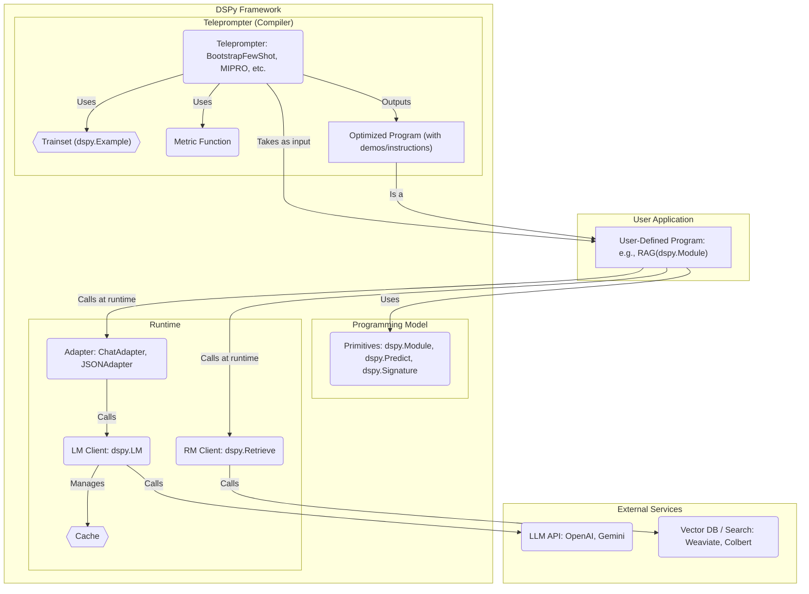
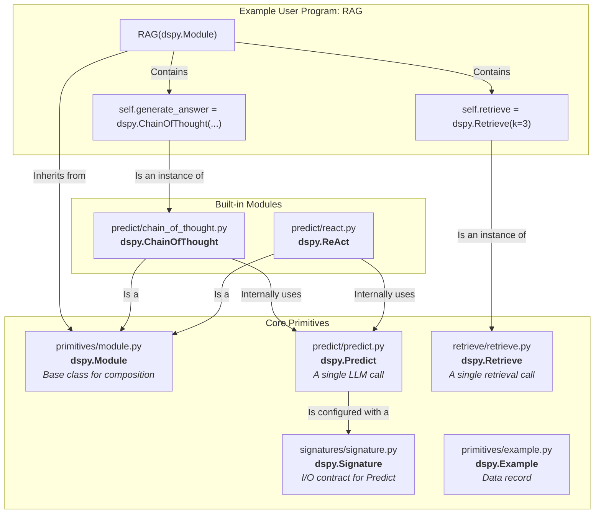
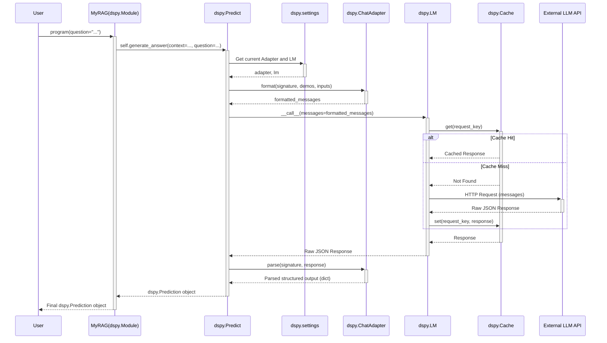
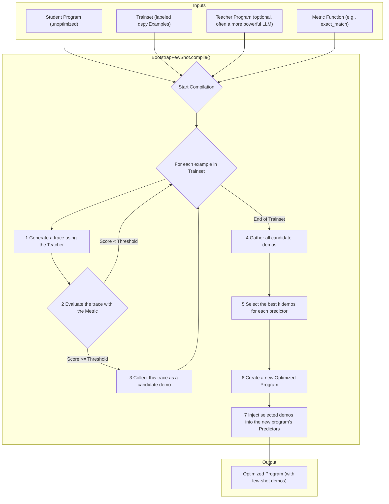

Of course. Given that you're porting DSPy to Elixir (DSPEx), I will create a series of architectural diagrams and explanations that focus on the core concepts, data flows, and design patterns of the original Python DSPy. This will help you understand not just *what* the code does, but *why* it's structured the way it is, which is crucial for a successful port.

I will structure this analysis from a high-level overview down to the specifics of key components like optimization and execution.

### 1. High-Level Conceptual Architecture

This diagram shows the main layers of the DSPy framework. It separates the user-facing programming model from the optimization (compilation) and execution (runtime) layers.

**Architectural Insights & Elixir Porting Notes:**

*   **Separation of Concerns:** DSPy elegantly separates the *what* (the program logic defined in `dspy.Module`) from the *how* (the specific prompt format, which is handled by the `Adapter` and `Teleprompter`).
*   **Compilation vs. Runtime:** The "Teleprompter" is a **compiler**. It takes a program (`student`), data (`trainset`), and an objective (`metric`) and outputs a new, optimized program. This compilation is often a slow, data-intensive process.
    *   **For DSPEx:** This compilation step is a perfect candidate for massive concurrency using `Task.async_stream` or distributed computing across a BEAM cluster, as your `dspex/evaluate.ex` file suggests you're already doing.
*   **Runtime Execution:** A `forward()` call on a program is the runtime execution path. This is where the `Adapter` and `LM` clients come into play to make a single prediction.
*   **State:** The "optimized" state (few-shot examples, improved instructions) is stored within the `dspy.Predict` modules of the returned program. In Python, this is done by modifying the object's attributes. In Elixir, your `DSPEx.OptimizedProgram` struct correctly captures this by wrapping the original program and adding demos, which is the idiomatic functional approach.

---

### 2. Core Primitives and Program Composition

This diagram details how users build programs using DSPy's core building blocks.

**Architectural Insights & Elixir Porting Notes:**

*   **Composition over Inheritance:** Users build complex programs by composing smaller, pre-defined modules (`ChainOfThought`, `Retrieve`) inside their own `dspy.Module`. This is a powerful pattern.
*   **`dspy.Predict` is the Atomic Unit:** The most fundamental action is `dspy.Predict`, which represents a single, specific query to an LLM. More complex modules like `ChainOfThought` and `ReAct` are themselves `dspy.Module`s that orchestrate one or more `dspy.Predict` calls.
*   **`dspy.Signature` is the "Type Spec":** A signature is not just a docstring; it's a structured object that defines the input and output fields for a `Predict` module. It's used by the `Adapter` to format prompts and parse outputs correctly. Your macro-based `DSPEx.Signature` is an excellent, compile-time-safe Elixir equivalent.
*   **State Management:** An optimized program is one where the `demos` attribute of its `dspy.Predict` instances has been populated by a `Teleprompter`. Your `DSPEx.OptimizedProgram` struct handles this immutably.

---

### 3. The Execution Flow: A `forward()` Call

This diagram traces a single call to a `dspy.Predict` module at runtime. This is the most critical flow to understand for the core runtime.

**Architectural Insights & Elixir Porting Notes:**

*   **Global Settings (`dspy.settings`):** This is a key architectural choice in Python. It's a thread-local global object that holds the configured LM, RM, and Adapter. This makes it easy to swap out backends without changing the program code.
    *   **For DSPEx:** This pattern is less common in Elixir. Your `DSPEx.Services.ConfigManager` GenServer is the correct idiomatic replacement. Instead of a global, you fetch configuration from a known, stateful process.
*   **The Adapter's Role:** The `Adapter` is the crucial middleman. It takes the high-level, structured `Signature` and `Example`s and translates them into the specific string format required by the LLM (e.g., a JSON object for some models, or a specific chat message format for others). It also does the reverse (`parse`). This decouples the program's logic from the LLM's prompt engineering quirks.
*   **Caching:** Caching is built into the `dspy.LM` client layer. It hashes the request parameters (prompt, model, temperature, etc.) to create a cache key. This is a critical feature for reducing costs and speeding up development, especially during teleprompting.
*   **Client Abstraction:** The `dspy.LM` class wraps `litellm`, which provides a unified interface to hundreds of LLMs. This is a powerful abstraction. Your `DSPEx.ClientManager` and `DSPEx.Client` appear to be building a similar, robust abstraction using Elixir's strengths (GenServers, supervision).

---

### 4. The Optimization Flow: The "Compilation" Loop

This diagram shows how a `Teleprompter` like `BootstrapFewShot` optimizes a program.

**Architectural Insights & Elixir Porting Notes:**

*   **Data-Driven Optimization:** This is the core idea of DSPy. Instead of manually writing prompts, you provide data and a metric, and the framework *learns* the best few-shot demonstrations to include in the prompt.
*   **Teacher/Student Model:** The `teacher` (a more powerful/expensive model) is used to generate high-quality outputs (the "reasoning" in Chain of Thought, for example). These outputs become part of the demonstrations for the `student` (a cheaper/faster model), effectively teaching it to perform the task well.
*   **Parallelism is Key:** Step `F` (`For each example...`) is embarrassingly parallel. This is where the performance of the teleprompter is determined. The Python implementation uses `dspy.utils.parallelizer.ParallelExecutor`, which is a wrapper around `ThreadPoolExecutor`.
    *   **For DSPEx:** Your use of `Task.async_stream` in `dspex/teleprompter/bootstrap_fewshot.ex` is the perfect, more performant BEAM equivalent. It will handle I/O-bound LLM calls much more efficiently than Python threads.
*   **The Output is a Program:** The result of compilation isn't just a set of prompts; it's a new, complete, and executable `dspy.Module` instance that has been "programmed" with the optimal demonstrations.

### Summary for Your DSPEx Port

Your current architecture for DSPEx seems to be on the right track by translating Python's imperative/object-oriented patterns into Elixir's functional and concurrent ones.

1.  **State Management:** You've correctly identified that Python's global `dspy.settings` should be replaced by a managed process like your `ConfigManager`. This is more robust and idiomatic in Elixir.
2.  **Concurrency:** You've correctly identified that the evaluation and optimization loops are prime candidates for `Task.async_stream`, which will be a significant performance advantage over the Python implementation.
3.  **Core Primitives:** Your `DSPEx.Signature`, `DSPEx.Program`, and `DSPEx.Example` modules are the right foundation. The macro-based `DSPEx.Signature` is particularly clever, providing compile-time safety that Python lacks.
4.  **Client Layer:** Building your `DSPEx.ClientManager` on GenServers is the right long-term approach for resilience, allowing you to easily add supervision, circuit breakers (`Fuse`), and stateful features like rate limiting.

By understanding these core architectural patterns from the original DSPy, you can ensure your DSPEx port is not only functionally equivalent but also idiomatically Elixir and architecturally superior in terms of concurrency and fault tolerance.
