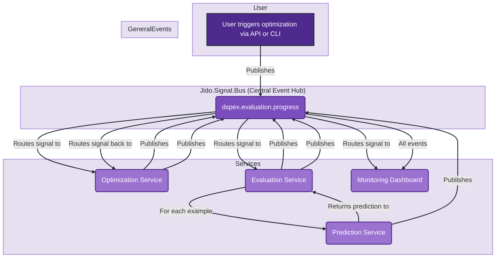
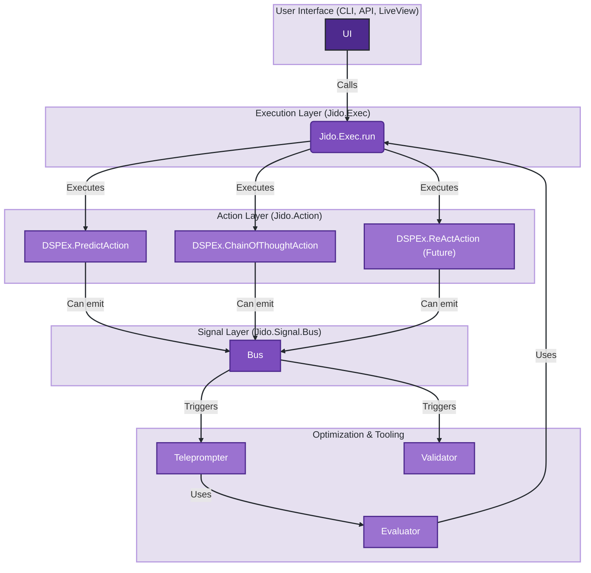

Excellent analysis request. Evaluating the fit of `jido_action` and `jido_signal` into the DSPEx vision requires a deep understanding of all three codebases. Based on the provided files, here is a comprehensive analysis of how these libraries can not only fit but significantly enhance the DSPEx framework, aligning it more closely with the robust, concurrent, and fault-tolerant principles of the BEAM.

### Executive Summary

Yes, both `jido_action` and `jido_signal` fit remarkably well into the vision for DSPEx. They are not just compatible; they represent a more mature, feature-rich, and idiomatic Elixir implementation of the concepts DSPEx is already building.

*   **`jido_action`** can be seen as the next logical evolution of `DSPEx.Program`. It provides a more generic and powerful foundation for defining and executing computational units, complete with built-in features like chaining, retries, and timeouts that DSPEx would otherwise need to build.
*   **`jido_signal`** introduces a sophisticated, event-driven communication layer that DSPEx currently lacks. This would allow DSPEx to move beyond a simple request/response model, enabling more complex, decoupled, and observable workflows for program optimization and execution.

Adopting these libraries would transform DSPEx from a direct port of DSPy's concepts into a truly BEAM-native AI optimization framework.

---

### Conceptual Alignment: DSPEx vs. Jido

This table maps the core concepts from each library to show their alignment.

| DSPEx Concept | `jido_action` Equivalent | `jido_signal` Equivalent | Synergy / Improvement |
| :--- | :--- | :--- | :--- |
| `DSPEx.Program` | `Jido.Action` | N/A | `Jido.Action` is a more abstract and powerful behavior for any executable unit. |
| `DSPEx.Predict.forward/3` | `Jido.Exec.run/4` | N/A | `Jido.Exec` is a generic, robust executor with retries, timeouts, and telemetry. |
| `DSPEx.Signature` | Schema definition within `use Jido.Action` | N/A | Unifies the program's logic and its I/O contract into a single module definition. |
| Program Composition (e.g., ChainOfThought) | `Jido.Exec.Chain` | N/A | Provides a ready-made, generic solution for chaining actions. |
| Telemetry Events | `Jido.Signal` & `Jido.Signal.Dispatch` | Core feature | Replaces simple telemetry with a powerful, routable eventing system. |
| LLM API Calls (`DSPEx.Client`) | A specific `Jido.Action` implementation | N/A | `DSPEx.Client`'s logic would be encapsulated within a `Jido.Action`'s `run/2` callback. |

---

## Part 1: Integrating `jido_action` - A More Robust Program Foundation

The `jido_action` library provides a perfect, more abstract foundation for what `DSPEx.Program` aims to achieve. A `DSPEx.Predict` module is, in essence, a very specific type of `Jido.Action`.

### Proposed Integration Strategy

1.  **Unify `DSPEx.Program` and `Jido.Action`**: The `DSPEx.Program` behavior would be deprecated in favor of `Jido.Action`. All programs in DSPEx, including `Predict`, `ChainOfThought`, etc., would `use Jido.Action`.
2.  **Unify `DSPEx.Signature` and Action Schema**: The `use DSPEx.Signature` macro would be merged into `use Jido.Action`. The signature string (`"question -> answer"`) would be parsed to generate the `:schema` and `:output_schema` options for the action.
3.  **Replace Execution Logic with `Jido.Exec`**: Instead of custom logic within `DSPEx.Predict.forward/3`, all program execution would go through the `Jido.Exec.run/4` function. This provides DSPEx with battle-tested timeouts, retries, and async execution "for free."

#### **Before: Current DSPEx Structure**

```elixir
# lib/dspex/signature.ex
defmodule MySignature do
  use DSPEx.Signature, "question -> answer"
end

# lib/dspex/predict.ex
defmodule MyPredictProgram do
  # Simplified
  def forward(program, inputs, _opts) do
    # ... hardcoded logic to format, call client, parse ...
  end
end

# Usage
program = %DSPEx.Predict{signature: MySignature, ...}
DSPEx.Program.forward(program, %{question: "What is 2+2?"})
```

#### **After: Proposed DSPEx Structure with `jido_action`**

```elixir
# lib/dspex/predict_action.ex
defmodule DSPEx.PredictAction do
  # A Jido.Action that knows how to talk to an LLM
  use Jido.Action,
    name: "predict",
    description: "Executes a prediction using a signature and inputs",
    # The signature string is parsed into a schema at compile time
    # (This would be an enhancement to the Jido.Action macro)
    signature: "question -> answer", # "question -> answer"
    schema: [
      question: [type: :string, required: true, doc: "The user's question."]
    ],
    output_schema: [
      answer: [type: :string, required: true, doc: "The generated answer."]
    ]

  # The core logic of making an LLM call
  @impl Jido.Action
  def run(params, context) do
    # `context` would contain client config, demos, etc.
    client = context.client

    # Adapter and Client logic from the original DSPEx.Predict.forward
    with {:ok, messages} <- DSPEx.Adapter.format_messages(context.signature, params),
         {:ok, response} <- DSPEx.Client.request(client, messages),
         {:ok, outputs} <- DSPEx.Adapter.parse_response(context.signature, response) do
      {:ok, outputs}
    end
  end
end

# Usage
# The execution is now handled by the robust Jido.Exec module
Jido.Exec.run(DSPEx.PredictAction, %{question: "What is 2+2?"}, %{client: :openai})
```

### Benefits of this Integration

*   **Robust Execution**: DSPEx immediately gains a battle-tested execution engine with timeouts, retries, and async capabilities.
*   **Clear Abstraction**: `Predict` becomes just one type of "Action" in the system, sitting alongside other potential actions like `RetrieveFromVectorDB`, `CallApi`, etc. This aligns perfectly with the vision for `ReAct` patterns.
*   **Composability**: `Jido.Exec.Chain` provides a ready-made, generic way to compose programs, which is essential for `ChainOfThought` and other complex workflows.

---

## Part 2: Integrating `jido_signal` - An Event-Driven Nervous System

`jido_signal` introduces an event bus architecture that can decouple the components of DSPEx, making the entire framework more modular, observable, and scalable.

### Proposed Integration Strategy

Instead of being a direct replacement for an existing component, `jido_signal` would be integrated as a core communication layer.

1.  **Asynchronous Workflows**: The output of one program (`Action`) could be a `Signal` that triggers the next program in a chain. This is far more robust and scalable than direct function calls, especially for long-running optimization tasks.
2.  **Enhanced Telemetry**: The current `:telemetry` events in DSPEx could be replaced by publishing rich `Jido.Signal` events to a bus. The `jido_signal` `Dispatch` adapters (`:logger`, `:http`, etc.) are more powerful and configurable than basic telemetry handlers.
3.  **Real-Time Observability**: The `BootstrapFewShot` teleprompter could publish signals like `dspex.optimization.trial.complete` or `dspex.optimization.progress`. A Phoenix LiveView or other monitoring tool could subscribe to this bus to provide a real-time dashboard of the optimization process.
4.  **Decoupling Optimization and Execution**: An optimization run could be triggered by a signal (e.g., `dspex.optimize.start` with a program and dataset). When complete, the teleprompter would emit a `dspex.optimize.complete` signal containing the newly optimized program, which could then be automatically deployed or registered.

#### **Architectural Diagram: Event-Driven DSPEx**

This diagram illustrates how `jido_signal` could create a more decoupled and powerful architecture.



### Benefits of this Integration

*   **Scalability**: Different parts of the DSPEx pipeline (e.g., candidate generation, evaluation) can be scaled independently as separate services that communicate via signals.
*   **Resilience**: If the `Evaluation Service` crashes, it can be restarted and resume its work by re-reading signals from the bus's journal, without the `Optimization Service` ever knowing there was a problem.
*   **Observability**: All system activity becomes a stream of signals on the bus, which can be logged, monitored, and analyzed in a unified way.
*   **Extensibility**: New tools and services can easily plug into the DSPEx ecosystem by simply subscribing to relevant signals on the bus.

---

## Combined Vision: A Unified, BEAM-Native DSPEx

By integrating both `jido_action` and `jido_signal`, DSPEx would evolve into a powerful, two-layered system:

1.  **The Action Layer (via `jido_action`)**: A robust, generic framework for defining and executing any self-contained computational unit (an LLM call, a database query, a tool use).
2.  **The Signal Layer (via `jido_signal`)**: A decoupled, event-driven communication bus for orchestrating complex workflows between Actions and observing the system's behavior.

This architecture is not only more powerful but also a much better fit for the BEAM's philosophy of building systems from small, isolated, communicating processes.

### **Final Proposed Architecture**



### Strategic Recommendation

1.  **Phase 1: Adopt `jido_action`**. Refactor `DSPEx.Program` and `DSPEx.Predict` to be based on the `Jido.Action` and `Jido.Exec` primitives. This will immediately improve the robustness and feature set of the core execution engine.
2.  **Phase 2: Integrate `jido_signal`**. Begin by replacing the `:telemetry` system with `Jido.Signal` publishing. Then, start building more complex, asynchronous optimization workflows that are triggered by and communicate via signals.

This path allows for an incremental and non-breaking evolution of DSPEx into a truly state-of-the-art, BEAM-native framework for AI program optimization.
