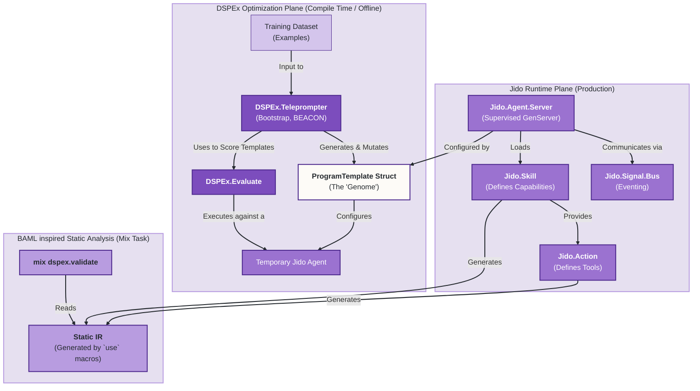

Excellent. Let's continue building out the vision for this revamped, BAML-inspired, `jido`-powered DSPEx.

We'll structure this as a three-part deep dive:
1.  **The New Core Abstractions**: Redefining the fundamental building blocks.
2.  **The Unified Workflow**: Illustrating the end-to-end developer experience from definition to optimization.
3.  **The Architectural Blueprint**: A diagram showing the final, cohesive system.

---

### Part 1: The New Core Abstractions (The "Lego Bricks")

The foundation of the new system relies on redefining and unifying the core concepts from both `jido` and `DSPEx`.

#### 1. `Jido.Action` (The Fundamental Unit of Work)

*   **Role**: Replaces `DSPEx.Predict`. It is the smallest, indivisible, executable component. It's not just for LLM calls; it's for *any* tool or operation.
*   **Enhancement (BAML-inspired)**: The `use Jido.Action` macro will be enhanced to generate a `__static_ir__/0` function. This function returns a simple, serializable struct containing the action's schema, description, etc. This is the key to enabling static analysis without sacrificing runtime performance.

    ```elixir
    # BAML-inspired Jido.Action
    defmodule Tools.GetWeather do
      use Jido.Action,
        name: "get_weather",
        description: "Gets the current weather for a location.",
        schema: [
          location: [type: :string, required: true, doc: "The city, e.g. 'San Francisco, CA'"]
        ],
        output_schema: [
          temperature: [type: :integer],
          conditions: [type: :string]
        ]

      # The `use` macro automatically generates this:
      def __static_ir__ do
        %Jido.IR.Action{
          name: "get_weather",
          description: "...",
          input_schema: [...],
          output_schema: [...]
        }
      end

      def run(%{location: location}, _context) do
        # ... logic to call weather API ...
        {:ok, %{temperature: 72, conditions: "sunny"}}
      end
    end
    ```

#### 2. `Jido.Skill` (The "Toolbox")

*   **Role**: Replaces the loose collection of "tools" in `jido_ai`. A Skill is a curated set of related `Actions` and the routing logic to use them. It's a modular, reusable capability pack.
*   **Enhancement (BAML-inspired)**: The `use Jido.Skill` macro will also generate a `__static_ir__/0` function. This IR will contain the skill's metadata and, crucially, a list of the static IRs of all the `Actions` it provides.

    ```elixir
    # BAML-inspired Jido.Skill
    defmodule Skills.Arithmetic do
      use Jido.Skill,
        name: "arithmetic",
        description: "Provides basic math capabilities.",
        opts_key: :arithmetic

      # The `mount/2` callback registers actions with an agent
      def mount(agent, _opts) do
        Jido.Agent.register_action(agent, [
          Jido.Actions.Arithmetic.Add,
          Jido.Actions.Arithmetic.Subtract
        ])
      end

      # The `router/1` callback defines how signals map to actions
      def router(_opts) do
        [
          {"math.add", %Instruction{action: Jido.Actions.Arithmetic.Add}},
          {"math.subtract", %Instruction{action: Jido.Actions.Arithmetic.Subtract}}
        ]
      end

      # The `use` macro generates this IR:
      def __static_ir__ do
        %Jido.IR.Skill{
          name: "arithmetic",
          actions: [
            Jido.Actions.Arithmetic.Add.__static_ir__(),
            Jido.Actions.Arithmetic.Subtract.__static_ir__()
          ],
          routes: [...]
        }
      end
    end
    ```

#### 3. `Jido.Agent` (The Stateful Executor)

*   **Role**: This remains the core runtime entity—a supervised, stateful GenServer. Its behavior is defined by the `Skills` it possesses.
*   **Enhancement (DSPEx Integration)**: The `Jido.Agent` itself doesn't need much change. The magic happens in how it's *configured and optimized* by DSPEx.

#### 4. `DSPEx.ProgramTemplate` (The "Genome")

*   **Role**: This is the new `DSPEx.Program`. It is **not an executable module**. It is a declarative, serializable data structure (a struct) that defines the "genetic makeup" of a `Jido.Agent`.
*   **Structure**:

    ```elixir
    defmodule DSPEx.ProgramTemplate do
      use TypedStruct

      typedstruct do
        field :id, String.t()
        field :base_agent, module(), default: Jido.AI.Agent
        field :skills, [module()], default: []
        field :prompt_template, Jido.AI.Prompt.Template.t()

        # The "demos" are now part of the prompt template's context
        # or handled by a specific skill.

        # Metadata about how this template was optimized
        field :optimization_metadata, map(), default: %{}
      end
    end
    ```
This `ProgramTemplate` is what the `DSPEx.Teleprompter` will create, manipulate, and score. It is the central artifact of the optimization process.

---

### Part 2: The Unified Workflow (The Developer Experience)

This is how a developer would use the integrated system.

**Step 1: Define the Building Blocks (Actions and Skills)**
The developer creates standard `Jido.Action` and `Jido.Skill` modules. This part of the workflow is pure `jido`.

**Step 2: Define the Task with a `ProgramTemplate`**
The developer creates an initial, un-optimized `ProgramTemplate`. This defines the "student" program.

```elixir
# In my_app/lib/my_app/qa_program.ex
defmodule MyApp.RAGProgram do
  alias DSPEx.ProgramTemplate
  alias Jido.AI.Prompt.Template
  alias Skills.{WebSearchSkill, DocumentQASkill}

  def initial_template do
    %ProgramTemplate{
      id: "rag_v1",
      skills: [WebSearchSkill, DocumentQASkill],
      prompt_template: Template.new!(
        role: :system,
        text: """
        You are a helpful research assistant.
        Answer the user's question based *only* on the provided context.
        If the context is insufficient, say 'I don't know'.

        --- CONTEXT ---
        <%= @context %>
        --- END CONTEXT ---

        Question: <%= @question %>
        Answer:
        """
      )
    }
  end
end
```

**Step 3: Run the DSPEx Teleprompter (The "Compiler")**
The developer uses the `DSPEx.Teleprompter` to optimize the template. The teleprompter's job is to find the best `prompt_template` and potentially the best combination of `skills`.

```elixir
# In an optimization script or IEx session
student_template = MyApp.RAGProgram.initial_template()
train_set = # ... load training examples ...
metric_fn = # ... define a metric ...

# The `compile` function now optimizes the template
{:ok, optimized_template} = DSPEx.Teleprompter.BootstrapFewShot.compile(
  student_template,
  # The "teacher" is also a template, perhaps with a more powerful model or skills
  teacher_template,
  train_set,
  metric_fn
)

# The result is a NEW, optimized ProgramTemplate struct
# The teleprompter might have added few-shot examples to the prompt_template.text
IO.inspect(optimized_template.prompt_template.text)
# """
# You are a helpful research assistant...
#
# --- Example 1 ---
# Context: Elixir is a dynamic, functional language...
# Question: What is Elixir?
# Answer: Elixir is a dynamic, functional language for building scalable applications.
#
# --- CONTEXT ---
# ...
# """
```

**Step 4: Deploy and Run the Optimized Agent**
The optimized `ProgramTemplate` is used to configure and start a production `Jido.Agent`.

```elixir
# In your application supervisor
children = [
  %{
    id: :my_optimized_rag_agent,
    start: {Jido.Agent.Server, :start_link, [
      id: "production_rag_agent",
      agent: optimized_template.base_agent,
      skills: optimized_template.skills,
      # The prompt is now part of the agent's initial state
      initial_state: %{prompt: optimized_template.prompt_template}
    ]}
  }
]
```

---

### Part 3: The Architectural Blueprint

This diagram shows how the components fit together in the final, unified architecture. It illustrates the clear separation between the **DSPEx Optimization Plane** and the **Jido Runtime Plane**.



**Workflow Summary:**

1.  **Development & Definition**: Developers define `Actions` and `Skills` using the `jido` framework. These macros generate a **Static IR** (`J`).
2.  **Static Analysis**: The `mix dspex.validate` task (`I`) can be run at any time to analyze the IR, checking for compatibility between skills, validating schemas, and finding potential issues before runtime. This is the **BAML-inspired safety net**.
3.  **Optimization**: The `DSPEx.Teleprompter` (`A`) takes an initial `ProgramTemplate` (`C`) and a dataset (`D`). It runs an optimization loop, where each iteration involves:
    a. Creating a new candidate `ProgramTemplate`.
    b. Spinning up a temporary `Jido.Agent` (`TempAgent`) configured with that template.
    c. Using `DSPEx.Evaluate` (`B`) to score the agent's performance.
4.  **Deployment**: The final, optimized `ProgramTemplate` produced by the teleprompter is a simple, serializable Elixir struct. This struct is used to configure the production `Jido.Agent.Server` (`E`) in your application's supervision tree.

This architecture achieves the ultimate goal: it leverages `jido` as a robust, feature-rich, and distributed runtime, while positioning `DSPEx` as the intelligent, offline "compiler" that finds the optimal configuration for that runtime. It's the best of both worlds.
