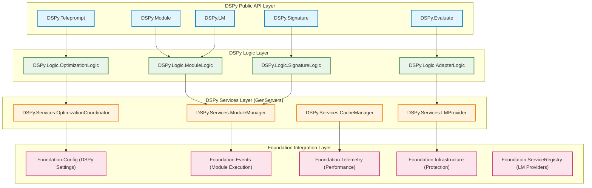

DSPy to Elixir/BEAM: Architecture Built on Foundation
Based on the Foundation library's capabilities, here's a comprehensive architectural design for porting DSPy to the Elixir/BEAM ecosystem.

# DSPy Elixir Architecture on Foundation

## Overview

This architecture leverages the Foundation library's infrastructure to create a robust, observable, and fault-tolerant implementation of DSPy patterns in Elixir. The design emphasizes modularity, supervision, and the "let it crash" philosophy while maintaining DSPy's core abstractions.

## System Architecture

### High-Level Component Structure



## Core Behaviours and Contracts

### 1. DSPy.Module Behaviour

Defines the contract for all DSPy modules (ChainOfThought, ReAct, etc.)

```elixir
defmodule DSPy.Module do
  @moduledoc """
  Behaviour for DSPy modules with Foundation integration.
  """

  @callback signature() :: DSPy.Signature.t()
  @callback forward(inputs :: map(), opts :: keyword()) :: 
    {:ok, map()} | {:error, Foundation.Types.Error.t()}
  @callback configure(config :: map()) :: :ok | {:error, Foundation.Types.Error.t()}
  @callback reset() :: :ok

  # Optional callbacks for optimization
  @callback update_parameters(params :: map()) :: :ok | {:error, Foundation.Types.Error.t()}
  @callback get_parameters() :: {:ok, map()} | {:error, Foundation.Types.Error.t()}

  @optional_callbacks [update_parameters: 1, get_parameters: 0]
end
```

### 2. DSPy.LMProvider Behaviour

Standardizes language model integrations with Foundation's protection patterns

```elixir
defmodule DSPy.LMProvider do
  @moduledoc """
  Behaviour for language model providers with circuit breaker and rate limiting.
  """

  @callback name() :: atom()
  @callback complete(messages :: list(), opts :: keyword()) :: 
    {:ok, map()} | {:error, Foundation.Types.Error.t()}
  @callback stream(messages :: list(), opts :: keyword()) :: 
    {:ok, Enumerable.t()} | {:error, Foundation.Types.Error.t()}
  @callback supports_streaming?() :: boolean()
  @callback cost_per_token() :: %{input: float(), output: float()}
  @callback context_window() :: pos_integer()
  @callback configure(config :: map()) :: :ok | {:error, Foundation.Types.Error.t()}
end
```

### 3. DSPy.Optimizer Behaviour

Defines teleprompting/optimization strategies

```elixir
defmodule DSPy.Optimizer do
  @moduledoc """
  Behaviour for DSPy optimization strategies (COPRO, Bootstrap, etc.)
  """

  @callback compile(student :: module(), trainset :: list(), opts :: keyword()) ::
    {:ok, DSPy.Module.t()} | {:error, Foundation.Types.Error.t()}
  @callback name() :: atom()
  @callback supports_distributed?() :: boolean()
  @callback configure(config :: map()) :: :ok | {:error, Foundation.Types.Error.t()}
end
```

### 4. DSPy.Adapter Behaviour

Handles different prompt formats (Chat, JSON, etc.)

```elixir
defmodule DSPy.Adapter do
  @moduledoc """
  Behaviour for prompt adapters with signature-aware formatting.
  """

  @callback format(signature :: DSPy.Signature.t(), demos :: list(), inputs :: map()) ::
    {:ok, list()} | {:error, Foundation.Types.Error.t()}
  @callback parse(signature :: DSPy.Signature.t(), completion :: String.t()) ::
    {:ok, map()} | {:error, Foundation.Types.Error.t()}
  @callback supports_streaming?() :: boolean()
  @callback name() :: atom()
end
```

## Core Data Structures

### DSPy.Signature

Type-safe signature definitions using Elixir structs and behaviours

```elixir
defmodule DSPy.Signature do
  @moduledoc """
  Defines input/output structure for DSPy modules with validation.
  """
  
  defstruct [
    :name,
    :instructions,
    :input_fields,
    :output_fields,
    :metadata
  ]

  @type t() :: %__MODULE__{
    name: atom(),
    instructions: String.t(),
    input_fields: %{atom() => DSPy.Field.t()},
    output_fields: %{atom() => DSPy.Field.t()},
    metadata: map()
  }

  defmacro __using__(opts) do
    quote do
      @behaviour DSPy.Signature
      
      def validate_inputs(inputs), do: DSPy.Signature.validate_inputs(__MODULE__, inputs)
      def validate_outputs(outputs), do: DSPy.Signature.validate_outputs(__MODULE__, outputs)
      def format_prompt(demos, inputs), do: DSPy.Signature.format_prompt(__MODULE__, demos, inputs)
      
      defoverridable [validate_inputs: 1, validate_outputs: 1, format_prompt: 2]
    end
  end
end

defmodule DSPy.Field do
  defstruct [
    :name,
    :type,        # :input | :output  
    :annotation,  # String.t() | :integer | custom_type
    :description,
    :required,
    :default,
    :validator
  ]

  @type t() :: %__MODULE__{
    name: atom(),
    type: :input | :output,
    annotation: atom() | module(),
    description: String.t(),
    required: boolean(),
    default: term(),
    validator: function() | nil
  }
end
```

### DSPy.Module.State

Encapsulates module runtime state with Foundation integration

```elixir
defmodule DSPy.Module.State do
  defstruct [
    :module_id,
    :signature,
    :parameters,
    :demos,
    :lm_provider,
    :adapter,
    :config,
    :metrics,
    :correlation_id
  ]

  @type t() :: %__MODULE__{
    module_id: String.t(),
    signature: DSPy.Signature.t(),
    parameters: map(),
    demos: list(),
    lm_provider: atom(),
    adapter: atom(),
    config: map(),
    metrics: map(),
    correlation_id: String.t() | nil
  }
end
```

## Service Architecture

### DSPy.Services.ModuleManager

Central coordination service for DSPy modules built on Foundation

```elixir
defmodule DSPy.Services.ModuleManager do
  use GenServer
  require Logger

  @moduledoc """
  Manages DSPy module instances with Foundation telemetry and error handling.
  """

  # Built on Foundation's service patterns
  def start_link(opts) do
    namespace = Keyword.get(opts, :namespace, :production)
    GenServer.start_link(__MODULE__, opts, 
      name: Foundation.ServiceRegistry.via_tuple(namespace, :dspy_module_manager))
  end

  def init(opts) do
    # Register with Foundation
    :ok = Foundation.ServiceRegistry.register(
      opts[:namespace] || :production, 
      :dspy_module_manager, 
      self()
    )
    
    # Emit startup telemetry
    Foundation.Telemetry.emit_system_event(:service_started, %{
      service: :dspy_module_manager,
      pid: self()
    })

    state = %{
      modules: %{},
      config: opts[:config] || %{},
      namespace: opts[:namespace] || :production
    }

    {:ok, state}
  end

  # Module lifecycle management
  def handle_call({:create_module, module_spec}, from, state) do
    correlation_id = Foundation.Utils.generate_correlation_id()
    
    # Use Foundation's error context
    context = Foundation.ErrorContext.new(
      __MODULE__, 
      :create_module,
      correlation_id: correlation_id,
      metadata: %{module_spec: module_spec}
    )

    result = Foundation.ErrorContext.with_context(context, fn ->
      create_module_impl(module_spec, state)
    end)

    case result do
      {:ok, {module_id, new_state}} ->
        # Emit success event
        Foundation.Events.new_event(:module_created, %{
          module_id: module_id,
          module_type: module_spec.type
        }, correlation_id: correlation_id)
        |> Foundation.Events.store()

        {:reply, {:ok, module_id}, new_state}
      
      {:error, error} ->
        # Error already enhanced by ErrorContext
        {:reply, {:error, error}, state}
    end
  end

  def handle_call({:execute_module, module_id, inputs, opts}, from, state) do
    correlation_id = Keyword.get(opts, :correlation_id) || Foundation.Utils.generate_correlation_id()
    
    # Use Foundation's infrastructure protection
    result = Foundation.Infrastructure.execute_protected(
      :module_execution,
      [
        circuit_breaker: :dspy_module_breaker,
        rate_limiter: {:module_execution, module_id}
      ],
      fn -> execute_module_impl(module_id, inputs, opts, state) end
    )

    case result do
      {:ok, outputs} ->
        # Record successful execution
        Foundation.Telemetry.emit_counter([:dspy, :module, :execution, :success], %{
          module_id: module_id,
          module_type: get_module_type(module_id, state)
        })

        {:reply, {:ok, outputs}, state}
      
      {:error, reason} ->
        # Record failed execution
        Foundation.Telemetry.emit_counter([:dspy, :module, :execution, :error], %{
          module_id: module_id,
          error_type: reason
        })

        {:reply, {:error, reason}, state}
    end
  end

  # Private implementation functions would follow...
end
```

### DSPy.Services.LMProvider

Language model provider service with Foundation's protection patterns

```elixir
defmodule DSPy.Services.LMProvider do
  use GenServer

  @moduledoc """
  Manages language model providers with circuit breakers and rate limiting.
  """

  def start_link(opts) do
    provider_name = Keyword.fetch!(opts, :provider_name)
    namespace = Keyword.get(opts, :namespace, :production)
    
    GenServer.start_link(__MODULE__, opts,
      name: Foundation.ServiceRegistry.via_tuple(namespace, {:lm_provider, provider_name}))
  end

  def init(opts) do
    provider_name = opts[:provider_name]
    provider_module = opts[:provider_module]
    
    # Configure Foundation infrastructure protection
    :ok = Foundation.Infrastructure.configure_protection(
      {:lm_provider, provider_name},
      %{
        circuit_breaker: %{
          failure_threshold: 5,
          recovery_time: 30_000
        },
        rate_limiter: %{
          scale: 60_000,  # 1 minute
          limit: 100      # 100 requests per minute
        }
      }
    )

    state = %{
      provider_name: provider_name,
      provider_module: provider_module,
      config: opts[:config] || %{},
      metrics: %{},
      namespace: opts[:namespace] || :production
    }

    {:ok, state}
  end

  def handle_call({:complete, messages, opts}, from, state) do
    correlation_id = Keyword.get(opts, :correlation_id) || Foundation.Utils.generate_correlation_id()
    
    # Measure and protect the LM call
    result = Foundation.Telemetry.measure(
      [:dspy, :lm, :completion],
      %{provider: state.provider_name, correlation_id: correlation_id},
      fn ->
        Foundation.Infrastructure.execute_protected(
          {:lm_provider, state.provider_name},
          [],
          fn -> apply(state.provider_module, :complete, [messages, opts]) end
        )
      end
    )

    case result do
      {:ok, completion} ->
        # Emit cost telemetry if available
        if cost = calculate_cost(completion, state.provider_module) do
          Foundation.Telemetry.emit_gauge([:dspy, :lm, :cost], cost, %{
            provider: state.provider_name,
            correlation_id: correlation_id
          })
        end

        {:reply, {:ok, completion}, state}
      
      {:error, reason} ->
        {:reply, {:error, reason}, state}
    end
  end

  # Stream handling with Foundation events
  def handle_call({:stream, messages, opts}, from, state) do
    correlation_id = Keyword.get(opts, :correlation_id) || Foundation.Utils.generate_correlation_id()
    
    if apply(state.provider_module, :supports_streaming?, []) do
      # Create a GenStage producer for streaming
      {:ok, producer_pid} = DSPy.Streaming.Producer.start_link(
        provider_module: state.provider_module,
        messages: messages,
        opts: opts,
        correlation_id: correlation_id
      )
      
      {:reply, {:ok, producer_pid}, state}
    else
      error = Foundation.Error.new(
        :streaming_not_supported,
        "Provider #{state.provider_name} does not support streaming",
        context: %{provider: state.provider_name}
      )
      {:reply, {:error, error}, state}
    end
  end
end
```

### DSPy.Services.OptimizationCoordinator

Coordinates teleprompting optimizations with distributed capabilities

```elixir
defmodule DSPy.Services.OptimizationCoordinator do
  use GenServer

  @moduledoc """
  Coordinates optimization processes with Foundation configuration and events.
  """

  def start_link(opts) do
    namespace = Keyword.get(opts, :namespace, :production)
    GenServer.start_link(__MODULE__, opts,
      name: Foundation.ServiceRegistry.via_tuple(namespace, :optimization_coordinator))
  end

  def init(opts) do
    # Subscribe to relevant configuration changes
    :ok = Foundation.Config.subscribe()
    
    state = %{
      active_optimizations: %{},
      optimization_history: [],
      config: opts[:config] || %{},
      namespace: opts[:namespace] || :production
    }

    {:ok, state}
  end

  def handle_call({:start_optimization, spec}, from, state) do
    correlation_id = Foundation.Utils.generate_correlation_id()
    optimization_id = Foundation.Utils.generate_id()
    
    # Create optimization context
    context = Foundation.ErrorContext.new(
      __MODULE__,
      :start_optimization,
      correlation_id: correlation_id,
      metadata: %{
        optimization_id: optimization_id,
        optimizer_type: spec.optimizer,
        student_module: spec.student_module
      }
    )

    result = Foundation.ErrorContext.with_context(context, fn ->
      start_optimization_impl(optimization_id, spec, state)
    end)

    case result do
      {:ok, new_state} ->
        # Store optimization event
        Foundation.Events.new_event(:optimization_started, %{
          optimization_id: optimization_id,
          optimizer_type: spec.optimizer,
          student_module: spec.student_module,
          trainset_size: length(spec.trainset)
        }, correlation_id: correlation_id)
        |> Foundation.Events.store()

        {:reply, {:ok, optimization_id}, new_state}
      
      {:error, error} ->
        {:reply, {:error, error}, state}
    end
  end

  # Handle configuration changes
  def handle_info({:config_notification, {:config_updated, path, value}}, state) do
    # React to relevant configuration changes
    case path do
      [:dspy, :optimization | _] ->
        # Update optimization parameters for active optimizations
        updated_state = update_active_optimizations(state, path, value)
        {:noreply, updated_state}
      _ ->
        {:noreply, state}
    end
  end
end
```

## Configuration Schema

DSPy-specific configuration integrated with Foundation's config system:

```elixir
# Foundation configuration extended for DSPy
%{
  # Existing Foundation config sections...
  ai: %{
    provider: :openai,  # Used by Foundation
    api_key: {:system, "OPENAI_API_KEY"}
  },
  
  # DSPy-specific configuration
  dspy: %{
    modules: %{
      default_lm_provider: :openai,
      default_adapter: :chat,
      cache_enabled: true,
      cache_ttl: 3600
    },
    
    optimization: %{
      copro: %{
        breadth: 10,
        depth: 3,
        temperature: 1.4,
        max_iterations: 50
      },
      bootstrap: %{
        max_bootstrapped_demos: 4,
        max_labeled_demos: 16,
        teacher_settings: %{},
        student_settings: %{}
      }
    },
    
    providers: %{
      openai: %{
        base_url: "https://api.openai.com/v1",
        default_model: "gpt-4",
        max_retries: 3,
        timeout: 30_000
      },
      anthropic: %{
        base_url: "https://api.anthropic.com",
        default_model: "claude-3-sonnet-20240229",
        max_retries: 3,
        timeout: 30_000
      }
    },
    
    infrastructure: %{
      circuit_breakers: %{
        dspy_module_breaker: %{
          failure_threshold: 5,
          recovery_time: 30_000
        }
      },
      rate_limiters: %{
        module_execution: %{scale: 60_000, limit: 100},
        lm_provider_default: %{scale: 60_000, limit: 50}
      }
    }
  }
}
```

## Event Schema

DSPy events integrated with Foundation's event system:

```elixir
# Module execution events
%Foundation.Types.Event{
  event_type: :module_execution_start,
  data: %{
    module_id: "cot_1234",
    module_type: :chain_of_thought,
    signature: "question -> answer",
    input_data: %{question: "What is the capital of France?"}
  },
  correlation_id: "req_abc123"
}

%Foundation.Types.Event{
  event_type: :module_execution_complete,
  data: %{
    module_id: "cot_1234", 
    output_data: %{answer: "Paris"},
    duration_ms: 1234,
    lm_calls: 1,
    cost_usd: 0.001
  },
  correlation_id: "req_abc123"
}

# Optimization events
%Foundation.Types.Event{
  event_type: :optimization_iteration,
  data: %{
    optimization_id: "opt_5678",
    iteration: 3,
    candidate_instruction: "Think step by step...",
    evaluation_score: 0.85,
    metric: :accuracy
  },
  correlation_id: "opt_xyz789"
}

# LM provider events
%Foundation.Types.Event{
  event_type: :lm_request,
  data: %{
    provider: :openai,
    model: "gpt-4",
    input_tokens: 150,
    output_tokens: 75,
    cost_usd: 0.002,
    duration_ms: 800
  },
  correlation_id: "req_abc123"
}
```

## Telemetry Schema

DSPy metrics integrated with Foundation's telemetry:

```elixir
# Performance metrics
[:dspy, :module, :execution, :duration] # Histogram
[:dspy, :module, :execution, :success]  # Counter
[:dspy, :module, :execution, :error]    # Counter

# LM provider metrics  
[:dspy, :lm, :request, :duration]       # Histogram
[:dspy, :lm, :request, :tokens]         # Gauge
[:dspy, :lm, :request, :cost]           # Gauge

# Optimization metrics
[:dspy, :optimization, :iteration]      # Counter
[:dspy, :optimization, :score]          # Gauge
[:dspy, :optimization, :duration]       # Histogram

# Infrastructure metrics
[:dspy, :circuit_breaker, :state]       # Gauge (open/closed)
[:dspy, :rate_limiter, :rejected]       # Counter
[:dspy, :cache, :hit_rate]              # Gauge
```

## Supervision Strategy

```mermaid
graph TD
    subgraph "DSPy.Application"
        Supervisor["DSPy.Supervisor"]
    end

    subgraph "Foundation Layer"
        Foundation["Foundation.Application"]
    end

    subgraph "Core DSPy Services"
        ModuleMgr["DSPy.Services.ModuleManager"]
        OptCoord["DSPy.Services.OptimizationCoordinator"]
        CacheMgr["DSPy.Services.CacheManager"]
    end

    subgraph "LM Provider Pool"
        LMSup["DSPy.LMProvider.Supervisor"]
        OpenAI["DSPy.Services.LMProvider (OpenAI)"]
        Anthropic["DSPy.Services.LMProvider (Anthropic)"]
        Local["DSPy.Services.LMProvider (Local)"]
    end

    subgraph "Optimization Workers"
        OptSup["DSPy.Optimization.Supervisor"]
        COPROWorker["DSPy.Optimization.COPROWorker"]
        BootstrapWorker["DSPy.Optimization.BootstrapWorker"]
    end

    Supervisor --> Foundation
    Supervisor --> ModuleMgr
    Supervisor --> OptCoord
    Supervisor --> CacheMgr
    Supervisor --> LMSup
    Supervisor --> OptSup

    LMSup --> OpenAI
    LMSup --> Anthropic
    LMSup --> Local

    OptSup --> COPROWorker
    OptSup --> BootstrapWorker

    style Supervisor fill:#e3f2fd,stroke:#1976d2,stroke-width:2
    style Foundation fill:#f3e5f5,stroke:#7b1fa2,stroke-width:2
    style ModuleMgr fill:#e8f5e8,stroke:#388e3c,stroke-width:2
    style OptCoord fill:#e8f5e8,stroke:#388e3c,stroke-width:2
    style CacheMgr fill:#e8f5e8,stroke:#388e3c,stroke-width:2
    style LMSup fill:#fff3e0,stroke:#f57c00,stroke-width:2
    style OptSup fill:#fff3e0,stroke:#f57c00,stroke-width:2
```



## Distributed Architecture Patterns

### Multi-Node Optimization

```elixir
defmodule DSPy.Cluster.OptimizationManager do
  @moduledoc """
  Manages distributed optimization across cluster nodes.
  """
  
  # Leverages Foundation's service registry for cluster coordination
  def distribute_optimization(optimization_spec) do
    nodes = Node.list() ++ [Node.self()]
    
    # Use Foundation's error context for distributed operations
    correlation_id = Foundation.Utils.generate_correlation_id()
    context = Foundation.ErrorContext.new(__MODULE__, :distribute_optimization,
      correlation_id: correlation_id,
      metadata: %{nodes: nodes, spec: optimization_spec}
    )
    
    Foundation.ErrorContext.with_context(context, fn ->
      # Distribute work across nodes using Foundation's service registry
      tasks = distribute_work_across_nodes(nodes, optimization_spec)
      
      # Collect results with Foundation telemetry
      results = collect_distributed_results(tasks, correlation_id)
      
      # Aggregate using Foundation events for audit trail
      final_result = aggregate_optimization_results(results, correlation_id)
      
      {:ok, final_result}
    end)
  end
end
```

### Streaming and Real-time Processing

```elixir
defmodule DSPy.Streaming.ModuleExecution do
  @moduledoc """
  Handles streaming module execution with Foundation telemetry.
  """
  
  use GenStage
  
  def start_link(opts) do
    GenStage.start_link(__MODULE__, opts)
  end
  
  def init(opts) do
    # Subscribe to Foundation events for reactive processing
    :ok = Foundation.Events.subscribe([:module_execution_start])
    
    {:consumer, %{
      module_manager: opts[:module_manager],
      correlation_id: opts[:correlation_id]
    }}
  end
  
  def handle_events(events, _from, state) do
    # Process streaming events with Foundation error handling
    processed_events = Enum.map(events, fn event ->
      Foundation.ErrorContext.with_context(
        Foundation.ErrorContext.new(__MODULE__, :handle_event,
          correlation_id: state.correlation_id),
        fn -> process_streaming_event(event, state) end
      )
    end)
    
    {:noreply, [], state}
  end
end
```

## Testing Architecture

Built on Foundation's test isolation capabilities:

```elixir
defmodule DSPy.Test.Support do
  @moduledoc """
  Test utilities leveraging Foundation's test isolation.
  """
  
  def setup_isolated_dspy_environment do
    # Create isolated Foundation environment
    test_ref = make_ref()
    namespace = {:test, test_ref}
    
    # Start isolated DSPy services
    {:ok, _} = DSPy.Services.ModuleManager.start_link(namespace: namespace)
    {:ok, _} = DSPy.Services.OptimizationCoordinator.start_link(namespace: namespace)
    
    # Configure test-specific settings
    Foundation.Config.update([:dspy, :modules, :cache_enabled], false)
    Foundation.Config.update([:dspy, :optimization, :copro, :max_iterations], 3)
    
    on_exit(fn ->
      Foundation.ServiceRegistry.cleanup_test_namespace(test_ref)
    end)
    
    %{namespace: namespace, test_ref: test_ref}
  end
end

defmodule DSPy.ModuleTest do
  use ExUnit.Case
  import DSPy.Test.Support
  
  setup do
    setup_isolated_dspy_environment()
  end
  
  test "chain of thought execution", %{namespace: namespace} do
    # Test uses isolated DSPy environment with Foundation telemetry
    correlation_id = Foundation.Utils.generate_correlation_id()
    
    # Module execution with full observability
    result = DSPy.Module.call(
      DSPy.ChainOfThought,
      %{question: "Test question"},
      namespace: namespace,
      correlation_id: correlation_id
    )
    
    assert {:ok, %{answer: _}} = result
    
    # Verify telemetry was emitted
    {:ok, events} = Foundation.Events.get_by_correlation(correlation_id)
    assert length(events) > 0
  end
end
```

## Performance and Scalability Patterns

### Caching Strategy

```elixir
defmodule DSPy.Services.CacheManager do
  @moduledoc """
  Multi-layer caching with Foundation telemetry integration.
  """
  
  # L1: In-memory ETS cache for hot data
  # L2: Distributed cache across cluster nodes  
  # L3: Persistent cache for expensive operations
  
  def get_cached_result(cache_key, opts \\ []) do
    correlation_id = Keyword.get(opts, :correlation_id)
    
    Foundation.Telemetry.measure(
      [:dspy, :cache, :lookup],
      %{cache_key: cache_key, correlation_id: correlation_id},
      fn ->
        case lookup_l1_cache(cache_key) do
          {:hit, result} ->
            Foundation.Telemetry.emit_counter([:dspy, :cache, :l1_hit], %{})
            {:ok, result}
          
          :miss ->
            case lookup_l2_cache(cache_key) do
              {:hit, result} ->
                # Populate L1 cache
                populate_l1_cache(cache_key, result)
                Foundation.Telemetry.emit_counter([:dspy, :cache, :l2_hit], %{})
                {:ok, result}
              
              :miss ->
                case lookup_l3_cache(cache_key) do
                  {:hit, result} ->
                    # Populate both L1 and L2
                    populate_l1_cache(cache_key, result)
                    populate_l2_cache(cache_key, result)
                    Foundation.Telemetry.emit_counter([:dspy, :cache, :l3_hit], %{})
                    {:ok, result}
                  
                  :miss ->
                    Foundation.Telemetry.emit_counter([:dspy, :cache, :miss], %{})
                    :miss
                end
            end
        end
      end
    )
  end
end
```

### Resource Pool Management

```elixir
defmodule DSPy.ResourcePool do
  @moduledoc """
  Manages pools of expensive resources (LM connections, optimization workers)
  using Foundation's connection manager patterns.
  """
  
  def start_lm_provider_pool(provider_name, opts \\ []) do
    pool_config = [
      name: {:local, :"#{provider_name}_pool"},
      worker_module: DSPy.LMProvider.Worker,
      size: opts[:pool_size] || 5,
      max_overflow: opts[:max_overflow] || 10,
      worker_args: [
        provider_name: provider_name,
        config: opts[:config] || %{}
      ]
    ]
    
    # Use Foundation's connection manager for pool lifecycle
    Foundation.Infrastructure.ConnectionManager.start_pool(
      :"#{provider_name}_pool",
      pool_config
    )
  end
  
  def execute_with_provider(provider_name, operation_fn) do
    pool_name = :"#{provider_name}_pool"
    
    # Use Foundation's protected execution with connection pooling
    Foundation.Infrastructure.execute_protected(
      :lm_provider_call,
      [
        connection_pool: pool_name,
        circuit_breaker: :"#{provider_name}_breaker",
        rate_limiter: {:lm_provider, provider_name}
      ],
      operation_fn
    )
  end
end
```

## Advanced DSPy Features

### Signature Composition and Inheritance

```elixir
defmodule DSPy.Signature.Composition do
  @moduledoc """
  Advanced signature patterns with type safety and validation.
  """
  
  defmacro compose_signatures(signatures) do
    quote do
      def composed_signature do
        base_signatures = unquote(signatures)
        
        # Merge input and output fields with conflict resolution
        merged_inputs = merge_signature_fields(base_signatures, :input)
        merged_outputs = merge_signature_fields(base_signatures, :output)
        
        %DSPy.Signature{
          name: :composed,
          instructions: compose_instructions(base_signatures),
          input_fields: merged_inputs,
          output_fields: merged_outputs,
          metadata: %{composed_from: Enum.map(base_signatures, & &1.name)}
        }
      end
    end
  end
  
  # Dynamic signature creation for complex workflows
  def create_dynamic_signature(workflow_spec) do
    correlation_id = Foundation.Utils.generate_correlation_id()
    
    context = Foundation.ErrorContext.new(__MODULE__, :create_dynamic_signature,
      correlation_id: correlation_id,
      metadata: %{workflow_spec: workflow_spec}
    )
    
    Foundation.ErrorContext.with_context(context, fn ->
      signature = build_signature_from_spec(workflow_spec)
      
      # Validate the dynamically created signature
      case DSPy.Signature.validate(signature) do
        :ok ->
          # Store signature creation event
          Foundation.Events.new_event(:signature_created, %{
            signature_name: signature.name,
            field_count: map_size(signature.input_fields) + map_size(signature.output_fields)
          }, correlation_id: correlation_id)
          |> Foundation.Events.store()
          
          {:ok, signature}
        
        {:error, validation_errors} ->
          error = Foundation.Error.new(
            :signature_validation_failed,
            "Dynamic signature validation failed",
            context: %{validation_errors: validation_errors}
          )
          {:error, error}
      end
    end)
  end
end
```

### Advanced Module Patterns

```elixir
defmodule DSPy.Module.ChainOfThought do
  @moduledoc """
  Chain of Thought implementation with Foundation integration.
  """
  
  @behaviour DSPy.Module
  use DSPy.Signature, fields: [
    question: DSPy.Field.input(:string, "Question to answer"),
    rationale: DSPy.Field.output(:string, "Step-by-step reasoning"),
    answer: DSPy.Field.output(:string, "Final answer")
  ]
  
  def signature do
    %DSPy.Signature{
      name: :chain_of_thought,
      instructions: "Think step by step and provide detailed reasoning before giving your final answer.",
      input_fields: %{question: DSPy.Field.input(:string, "Question to answer")},
      output_fields: %{
        rationale: DSPy.Field.output(:string, "Step-by-step reasoning"),
        answer: DSPy.Field.output(:string, "Final answer")
      },
      metadata: %{reasoning_type: :sequential}
    }
  end
  
  def forward(inputs, opts \\ []) do
    correlation_id = Keyword.get(opts, :correlation_id) || Foundation.Utils.generate_correlation_id()
    module_id = Keyword.get(opts, :module_id) || "cot_#{Foundation.Utils.generate_id()}"
    
    # Create execution context
    context = Foundation.ErrorContext.new(__MODULE__, :forward,
      correlation_id: correlation_id,
      metadata: %{module_id: module_id, inputs: inputs}
    )
    
    Foundation.ErrorContext.with_context(context, fn ->
      # Validate inputs
      case validate_inputs(inputs) do
        :ok -> execute_chain_of_thought(inputs, opts, context)
        {:error, validation_error} -> {:error, validation_error}
      end
    end)
  end
  
  defp execute_chain_of_thought(inputs, opts, context) do
    # Get LM provider from configuration or options
    provider = Keyword.get(opts, :lm_provider) || 
               Foundation.Config.get_with_default([:dspy, :modules, :default_lm_provider], :openai)
    
    # Get adapter for prompt formatting
    adapter = Keyword.get(opts, :adapter) ||
              Foundation.Config.get_with_default([:dspy, :modules, :default_adapter], :chat)
    
    # Format prompt using adapter
    case DSPy.Adapter.format(adapter, signature(), [], inputs) do
      {:ok, formatted_prompt} ->
        # Execute with LM provider through Foundation's protection
        result = Foundation.Infrastructure.execute_protected(
          :chain_of_thought_execution,
          [
            circuit_breaker: :dspy_module_breaker,
            rate_limiter: {:module_execution, provider}
          ],
          fn -> call_lm_provider(provider, formatted_prompt, opts) end
        )
        
        case result do
          {:ok, completion} ->
            # Parse completion using adapter
            case DSPy.Adapter.parse(adapter, signature(), completion) do
              {:ok, outputs} ->
                # Validate outputs
                case validate_outputs(outputs) do
                  :ok ->
                    # Emit success telemetry
                    Foundation.Telemetry.emit_counter([:dspy, :module, :cot, :success], %{
                      provider: provider,
                      correlation_id: context.correlation_id
                    })
                    
                    {:ok, outputs}
                  
                  {:error, validation_error} ->
                    {:error, validation_error}
                end
              
              {:error, parse_error} ->
                {:error, parse_error}
            end
          
          {:error, lm_error} ->
            {:error, lm_error}
        end
      
      {:error, format_error} ->
        {:error, format_error}
    end
  end
  
  defp call_lm_provider(provider, prompt, opts) do
    # Use Foundation's service registry to get provider
    case Foundation.ServiceRegistry.lookup(:production, {:lm_provider, provider}) do
      {:ok, provider_pid} ->
        GenServer.call(provider_pid, {:complete, prompt, opts})
      
      {:error, _} ->
        error = Foundation.Error.new(
          :lm_provider_unavailable,
          "LM provider #{provider} is not available",
          context: %{provider: provider}
        )
        {:error, error}
    end
  end
end
```

### Multi-Hop Reasoning Patterns

```elixir
defmodule DSPy.Module.MultiHopQA do
  @moduledoc """
  Multi-hop question answering with Foundation event tracking for each step.
  """
  
  @behaviour DSPy.Module
  
  def signature do
    %DSPy.Signature{
      name: :multi_hop_qa,
      instructions: "Answer complex questions by breaking them into steps and gathering information for each step.",
      input_fields: %{
        question: DSPy.Field.input(:string, "Complex question requiring multiple reasoning steps"),
        context: DSPy.Field.input(:list, "Available context documents")
      },
      output_fields: %{
        reasoning_steps: DSPy.Field.output(:list, "List of reasoning steps taken"),
        final_answer: DSPy.Field.output(:string, "Final comprehensive answer")
      },
      metadata: %{reasoning_type: :multi_hop, complexity: :high}
    }
  end
  
  def forward(inputs, opts \\ []) do
    correlation_id = Keyword.get(opts, :correlation_id) || Foundation.Utils.generate_correlation_id()
    
    context = Foundation.ErrorContext.new(__MODULE__, :forward,
      correlation_id: correlation_id,
      metadata: %{question: inputs.question}
    )
    
    Foundation.ErrorContext.with_context(context, fn ->
      # Step 1: Decompose question into sub-questions
      {:ok, sub_questions} = decompose_question(inputs.question, correlation_id)
      
      # Step 2: Answer each sub-question
      reasoning_steps = Enum.map(sub_questions, fn sub_q ->
        answer_sub_question(sub_q, inputs.context, correlation_id)
      end)
      
      # Step 3: Synthesize final answer
      final_answer = synthesize_answer(reasoning_steps, inputs.question, correlation_id)
      
      {:ok, %{
        reasoning_steps: reasoning_steps,
        final_answer: final_answer
      }}
    end)
  end
  
  defp decompose_question(question, correlation_id) do
    # Create child event for question decomposition
    Foundation.Events.new_event(:question_decomposition_start, %{
      question: question
    }, correlation_id: correlation_id)
    |> Foundation.Events.store()
    
    # Use a specialized module for question decomposition
    result = DSPy.Module.call(DSPy.QuestionDecomposer, %{question: question}, 
      correlation_id: correlation_id)
    
    case result do
      {:ok, %{sub_questions: sub_questions}} ->
        Foundation.Events.new_event(:question_decomposition_complete, %{
          question: question,
          sub_questions: sub_questions,
          sub_question_count: length(sub_questions)
        }, correlation_id: correlation_id)
        |> Foundation.Events.store()
        
        {:ok, sub_questions}
      
      error ->
        error
    end
  end
  
  defp answer_sub_question(sub_question, context, correlation_id) do
    # Each sub-question gets its own reasoning trace
    sub_correlation_id = "#{correlation_id}_sub_#{Foundation.Utils.generate_id()}"
    
    Foundation.Events.new_event(:sub_question_start, %{
      sub_question: sub_question,
      parent_correlation_id: correlation_id
    }, correlation_id: sub_correlation_id)
    |> Foundation.Events.store()
    
    # Use Chain of Thought for each sub-question
    result = DSPy.Module.call(DSPy.ChainOfThought, %{
      question: sub_question,
      context: context
    }, correlation_id: sub_correlation_id)
    
    case result do
      {:ok, %{rationale: rationale, answer: answer}} ->
        Foundation.Events.new_event(:sub_question_complete, %{
          sub_question: sub_question,
          rationale: rationale,
          answer: answer,
          parent_correlation_id: correlation_id
        }, correlation_id: sub_correlation_id)
        |> Foundation.Events.store()
        
        %{question: sub_question, rationale: rationale, answer: answer}
      
      {:error, _} ->
        %{question: sub_question, rationale: "Failed to answer", answer: "Unknown"}
    end
  end
end
```

## Optimization Engine Architecture

### COPRO Implementation with Foundation

```elixir
defmodule DSPy.Teleprompt.COPRO do
  @moduledoc """
  Collaborative Prompt Optimization with Foundation event tracking and distributed execution.
  """
  
  @behaviour DSPy.Optimizer
  
  def name, do: :copro
  def supports_distributed?, do: true
  
  def compile(student_module, trainset, opts \\ []) do
    correlation_id = Keyword.get(opts, :correlation_id) || Foundation.Utils.generate_correlation_id()
    
    # Get COPRO configuration from Foundation config
    {:ok, copro_config} = Foundation.Config.get([:dspy, :optimization, :copro])
    
    config = Map.merge(copro_config, Map.new(opts))
    
    context = Foundation.ErrorContext.new(__MODULE__, :compile,
      correlation_id: correlation_id,
      metadata: %{
        student_module: student_module,
        trainset_size: length(trainset),
        config: config
      }
    )
    
    Foundation.ErrorContext.with_context(context, fn ->
      optimization_id = Foundation.Utils.generate_id()
      
      # Start optimization tracking
      Foundation.Events.new_event(:optimization_started, %{
        optimization_id: optimization_id,
        optimizer: :copro,
        student_module: student_module,
        trainset_size: length(trainset),
        config: config
      }, correlation_id: correlation_id)
      |> Foundation.Events.store()
      
      # Run COPRO optimization
      result = run_copro_optimization(optimization_id, student_module, trainset, config, correlation_id)
      
      case result do
        {:ok, optimized_module} ->
          Foundation.Events.new_event(:optimization_completed, %{
            optimization_id: optimization_id,
            optimizer: :copro,
            final_score: optimized_module.final_score,
            iterations: optimized_module.iterations_completed
          }, correlation_id: correlation_id)
          |> Foundation.Events.store()
          
          {:ok, optimized_module}
        
        {:error, error} ->
          Foundation.Events.new_event(:optimization_failed, %{
            optimization_id: optimization_id,
            optimizer: :copro,
            error: Foundation.Error.to_string(error)
          }, correlation_id: correlation_id)
          |> Foundation.Events.store()
          
          {:error, error}
      end
    end)
  end
  
  defp run_copro_optimization(optimization_id, student_module, trainset, config, correlation_id) do
    # Initialize with baseline instruction
    current_instruction = get_baseline_instruction(student_module)
    best_score = 0.0
    best_instruction = current_instruction
    
    # Run depth iterations
    1..config.depth
    |> Enum.reduce_while({best_instruction, best_score}, fn iteration, {best_inst, best_sc} ->
      # Generate instruction candidates
      candidates = generate_instruction_candidates(
        best_inst, 
        config.breadth, 
        config.temperature,
        correlation_id
      )
      
      # Evaluate candidates in parallel with Foundation protection
      evaluation_results = evaluate_candidates_parallel(
        candidates, 
        student_module, 
        trainset, 
        correlation_id
      )
      
      # Find best candidate
      {iteration_best_instruction, iteration_best_score} = 
        Enum.max_by(evaluation_results, fn {_inst, score} -> score end)
      
      # Emit iteration telemetry
      Foundation.Telemetry.emit_gauge([:dspy, :optimization, :copro, :iteration_score], 
        iteration_best_score, %{
          optimization_id: optimization_id,
          iteration: iteration,
          correlation_id: correlation_id
        })
      
      # Track iteration progress
      Foundation.Events.new_event(:optimization_iteration, %{
        optimization_id: optimization_id,
        iteration: iteration,
        candidates_evaluated: length(candidates),
        best_score: iteration_best_score,
        best_instruction: iteration_best_instruction
      }, correlation_id: correlation_id)
      |> Foundation.Events.store()
      
      if iteration_best_score > best_sc do
        {:cont, {iteration_best_instruction, iteration_best_score}}
      else
        # No improvement, consider early stopping based on config
        if config[:early_stopping] && iteration > config[:min_iterations] do
          {:halt, {best_inst, best_sc}}
        else
          {:cont, {best_inst, best_sc}}
        end
      end
    end)
    |> case do
      {final_instruction, final_score} ->
        # Create optimized module
        optimized_module = create_optimized_module(
          student_module, 
          final_instruction, 
          final_score,
          optimization_id
        )
        {:ok, optimized_module}
    end
  end
  
  defp evaluate_candidates_parallel(candidates, student_module, trainset, correlation_id) do
    # Use Foundation's infrastructure protection for parallel evaluation
    tasks = Enum.map(candidates, fn candidate_instruction ->
      Task.async(fn ->
        Foundation.Infrastructure.execute_protected(
          :copro_candidate_evaluation,
          [
            circuit_breaker: :optimization_breaker,
            rate_limiter: {:optimization_eval, candidate_instruction}
          ],
          fn ->
            evaluate_single_candidate(candidate_instruction, student_module, trainset, correlation_id)
          end
        )
      end)
    end)
    
    # Collect results with timeout protection
    Task.await_many(tasks, 60_000)
    |> Enum.filter(fn
      {:ok, result} -> true
      {:error, _} -> false
    end)
    |> Enum.map(fn {:ok, result} -> result end)
  end
end
```

### Bootstrap Few-Shot with Process Pools

```elixir
defmodule DSPy.Teleprompt.Bootstrap do
  @moduledoc """
  Bootstrap few-shot optimization using Foundation's process management.
  """
  
  @behaviour DSPy.Optimizer
  
  def name, do: :bootstrap
  def supports_distributed?, do: true
  
  def compile(student_module, trainset, opts \\ []) do
    correlation_id = Keyword.get(opts, :correlation_id) || Foundation.Utils.generate_correlation_id()
    
    # Use Foundation's configuration for bootstrap settings
    {:ok, bootstrap_config} = Foundation.Config.get([:dspy, :optimization, :bootstrap])
    config = Map.merge(bootstrap_config, Map.new(opts))
    
    context = Foundation.ErrorContext.new(__MODULE__, :compile,
      correlation_id: correlation_id,
      metadata: %{student_module: student_module, config: config}
    )
    
    Foundation.ErrorContext.with_context(context, fn ->
      # Start teacher pool for generating examples
      {:ok, teacher_pool} = start_teacher_pool(config.teacher_settings, correlation_id)
      
      # Generate bootstrapped demonstrations
      {:ok, demonstrations} = generate_demonstrations(
        teacher_pool, 
        trainset, 
        config,
        correlation_id
      )
      
      # Select best demonstrations
      best_demos = select_best_demonstrations(demonstrations, config, correlation_id)
      
      # Create optimized student with demonstrations
      optimized_student = create_student_with_demos(student_module, best_demos, correlation_id)
      
      # Cleanup teacher pool
      :ok = stop_teacher_pool(teacher_pool)
      
      {:ok, optimized_student}
    end)
  end
  
  defp start_teacher_pool(teacher_settings, correlation_id) do
    # Use Foundation's connection manager for teacher process pool
    pool_config = [
      name: {:local, :bootstrap_teacher_pool},
      worker_module: DSPy.Bootstrap.TeacherWorker,
      size: teacher_settings[:pool_size] || 4,
      max_overflow: teacher_settings[:max_overflow] || 2,
      worker_args: [
        teacher_settings: teacher_settings,
        correlation_id: correlation_id
      ]
    ]
    
    Foundation.Infrastructure.ConnectionManager.start_pool(
      :bootstrap_teacher_pool,
      pool_config
    )
  end
  
  defp generate_demonstrations(teacher_pool, trainset, config, correlation_id) do
    # Generate demonstrations using teacher pool
    Foundation.Infrastructure.ConnectionManager.with_connection(
      :bootstrap_teacher_pool,
      fn teacher_worker ->
        # Generate demonstrations with Foundation telemetry
        Foundation.Telemetry.measure(
          [:dspy, :bootstrap, :demonstration_generation],
          %{correlation_id: correlation_id},
          fn ->
            demonstrations = Enum.map(trainset, fn example ->
              GenServer.call(teacher_worker, {:generate_demo, example, config})
            end)
            
            # Filter successful demonstrations
            successful_demos = Enum.filter(demonstrations, fn
              {:ok, _demo} -> true
              {:error, _} -> false
            end)
            |> Enum.map(fn {:ok, demo} -> demo end)
            
            {:ok, successful_demos}
          end
        )
      end
    )
  end
end
```

## Error Handling and Recovery Patterns

### Circuit Breaker Integration

```elixir
defmodule DSPy.Infrastructure.CircuitBreaker do
  @moduledoc """
  DSPy-specific circuit breaker patterns using Foundation's infrastructure.
  """
  
  def configure_dspy_circuit_breakers do
    # Configure circuit breakers for different DSPy operations
    breakers = [
      # Module execution protection
      {:dspy_module_breaker, %{
        failure_threshold: 5,
        recovery_time: 30_000,
        timeout: 60_000
      }},
      
      # LM provider protection  
      {:lm_provider_breaker, %{
        failure_threshold: 3,
        recovery_time: 15_000,
        timeout: 30_000
      }},
      
      # Optimization process protection
      {:optimization_breaker, %{
        failure_threshold: 2,
        recovery_time: 60_000,
        timeout: 300_000  # 5 minutes for long optimizations
      }}
    ]
    
    Enum.each(breakers, fn {name, config} ->
      Foundation.Infrastructure.configure_protection(name, %{
        circuit_breaker: config
      })
    end)
  end
  
  def handle_circuit_breaker_event(event_name, measurements, metadata) do
    case event_name do
      [:foundation, :circuit_breaker, :open] ->
        # Circuit breaker opened - implement fallback strategies
        handle_circuit_open(metadata.circuit_breaker_name, metadata)
      
      [:foundation, :circuit_breaker, :half_open] ->
        # Circuit breaker is testing - log for monitoring
        Foundation.Events.new_event(:circuit_breaker_testing, %{
          breaker_name: metadata.circuit_breaker_name,
          correlation_id: metadata[:correlation_id]
        }) |> Foundation.Events.store()
      
      [:foundation, :circuit_breaker, :closed] ->
        # Circuit breaker recovered - resume normal operation
        handle_circuit_recovered(metadata.circuit_breaker_name, metadata)
    end
  end
  
  defp handle_circuit_open(breaker_name, metadata) do
    case breaker_name do
      :dspy_module_breaker ->
        # Switch to cached responses or simpler models
        activate_module_fallback_strategy(metadata)
      
      :lm_provider_breaker ->
        # Switch to backup LM provider
        activate_backup_lm_provider(metadata)
      
      :optimization_breaker ->
        # Pause optimization processes
        pause_active_optimizations(metadata)
    end
  end
end
```

### Graceful Degradation Patterns

```elixir
defmodule DSPy.GracefulDegradation do
  @moduledoc """
  Implements graceful degradation patterns for DSPy operations.
  """
  
  def execute_with_fallback(operation, primary_strategy, fallback_strategies \\ []) do
    correlation_id = Foundation.Utils.generate_correlation_id()
    
    context = Foundation.ErrorContext.new(__MODULE__, :execute_with_fallback,
      correlation_id: correlation_id,
      metadata: %{operation: operation, strategies_available: length(fallback_strategies) + 1}
    )
    
    Foundation.ErrorContext.with_context(context, fn ->
      case try_strategy(operation, primary_strategy, correlation_id) do
        {:ok, result} ->
          {:ok, result}
        
        {:error, _primary_error} ->
          try_fallback_strategies(operation, fallback_strategies, correlation_id)
      end
    end)
  end
  
  defp try_fallback_strategies(_operation, [], correlation_id) do
    error = Foundation.Error.new(
      :all_strategies_failed,
      "All execution strategies failed",
      correlation_id: correlation_id
    )
    {:error, error}
  end
  
  defp try_fallback_strategies(operation, [strategy | remaining], correlation_id) do
    case try_strategy(operation, strategy, correlation_id) do
      {:ok, result} ->
        # Log successful fallback
        Foundation.Events.new_event(:fallback_strategy_success, %{
          operation: operation,
          strategy: strategy,
          remaining_strategies: length(remaining)
        }, correlation_id: correlation_id)
        |> Foundation.Events.store()
        
        {:ok, result}
      
      {:error, _} ->
        try_fallback_strategies(operation, remaining, correlation_id)
    end
  end
  
  # Module execution with fallback to cached results
  def execute_module_with_cache_fallback(module, inputs, opts \\ []) do
    cache_key = DSPy.Cache.generate_key(module, inputs)
    
    execute_with_fallback(
      {:module_execution, module, inputs},
      fn -> DSPy.Module.call(module, inputs, opts) end,
      [
        # Fallback 1: Use cached result if available
        fn -> DSPy.Cache.get_cached_result(cache_key, allow_stale: true) end,
        
        # Fallback 2: Use simplified version of the module
        fn -> DSPy.Module.call(module, inputs, Keyword.put(opts, :simplified, true)) end,
        
        # Fallback 3: Return default response
        fn -> {:ok, generate_default_response(module, inputs)} end
      ]
    )
  end
end
```

## Monitoring and Observability

### Comprehensive Telemetry Integration

```elixir
defmodule DSPy.Telemetry.Handler do
  @moduledoc """
  Central telemetry handler for DSPy operations using Foundation's telemetry system.
  """
  
  def setup_dspy_telemetry do
    # Attach handlers for DSPy-specific events
    events = [
      [:dspy, :module, :execution, :start],
      [:dspy, :module, :execution, :stop],
      [:dspy, :module, :execution, :exception],
      [:dspy, :optimization, :start],
      [:dspy, :optimization, :stop],
      [:dspy, :optimization, :iteration],
      [:dspy, :lm, :request, :start],
      [:dspy, :lm, :request, :stop],
      [:dspy, :cache, :hit],
      [:dspy, :cache, :miss]
    ]
    
    Foundation.Telemetry.attach_handlers(events)
    
    # Set up custom handlers for DSPy metrics
    :telemetry.attach_many(
      "dspy-telemetry-handler",
      events,
      &handle_dspy_event/4,
      %{}
    )
  end
  
  def handle_dspy_event([:dspy, :optimization, :iteration], measurements, metadata, _config) do
    # Track optimization progress
    Foundation.Telemetry.emit_gauge(
      [:dspy, :performance, :optimization_score],
      measurements.score,
      %{
        optimization_id: metadata.optimization_id,
        iteration: metadata.iteration,
        optimizer_type: metadata.optimizer_type
      }
    )
    
    # Store iteration event for detailed analysis
    Foundation.Events.new_event(:optimization_iteration_complete, %{
      optimization_id: metadata.optimization_id,
      iteration: metadata.iteration,
      score: measurements.score,
      instruction: metadata.instruction,
      parameters: metadata.parameters
    }, correlation_id: metadata.correlation_id)
    |> Foundation.Events.store()
  end
end
```

### Performance Monitoring and Alerting

```elixir
defmodule DSPy.Monitoring.PerformanceWatcher do
  use GenServer
  
  @moduledoc """
  Monitors DSPy system performance and triggers alerts based on Foundation telemetry.
  """
  
  def start_link(opts) do
    GenServer.start_link(__MODULE__, opts, name: __MODULE__)
  end
  
  def init(opts) do
    # Subscribe to Foundation telemetry events
    Foundation.Telemetry.subscribe([
      [:dspy, :module, :execution],
      [:dspy, :lm, :request],
      [:dspy, :optimization]
    ])
    
    state = %{
      performance_window: opts[:performance_window] || 300_000, # 5 minutes
      alert_thresholds: opts[:alert_thresholds] || default_thresholds(),
      metrics_buffer: :ets.new(:dspy_metrics, [:ordered_set, :private])
    }
    
    {:ok, state}
  end
  
  def handle_info({:telemetry, event_name, measurements, metadata}, state) do
    # Analyze performance patterns and detect anomalies
    case analyze_performance_trend(event_name, measurements, metadata, state) do
      {:alert, alert_type, details} ->
        trigger_alert(alert_type, details)
        
      {:degradation, metric, trend} ->
        Foundation.Events.new_event(:performance_degradation_detected, %{
          metric: metric,
          trend: trend,
          timestamp: System.system_time(:millisecond)
        }) |> Foundation.Events.store()
        
      :normal ->
        :ok
    end
    
    {:noreply, state}
  end
  
  defp analyze_performance_trend(event_name, measurements, metadata, state) do
    # Complex performance analysis using sliding windows
    # Implementation would analyze trends, detect outliers, etc.
  end
  
  defp default_thresholds do
    %{
      module_execution_p95: 5000,    # 5 seconds
      lm_request_failure_rate: 0.05, # 5%
      optimization_stagnation: 10    # iterations without improvement
    }
  end
end
```

## Advanced DSPy Features Implementation

### Signature Composition and Type Safety

```elixir
defmodule DSPy.Signature.Advanced do
  @moduledoc """
  Advanced signature patterns with compile-time validation and composition.
  """
  
  defmacro compose_signatures(signature_modules) do
    quote do
      # Compile-time signature validation and composition
      composed_fields = unquote(signature_modules)
      |> Enum.reduce(%{input: %{}, output: %{}}, fn sig_module, acc ->
        sig = sig_module.signature()
        
        # Validate field compatibility
        validate_field_compatibility!(acc.input, sig.input_fields, :input)
        validate_field_compatibility!(acc.output, sig.output_fields, :output)
        
        %{
          input: Map.merge(acc.input, sig.input_fields),
          output: Map.merge(acc.output, sig.output_fields)
        }
      end)
      
      # Generate composed signature struct
      %DSPy.Signature{
        name: :composed,
        instructions: compose_instructions(unquote(signature_modules)),
        input_fields: composed_fields.input,
        output_fields: composed_fields.output,
        metadata: %{
          composed_from: Enum.map(unquote(signature_modules), & &1.__name__),
          composition_time: System.system_time(:microsecond)
        }
      }
    end
  end
  
  # Dynamic signature adaptation based on runtime context
  def adapt_signature_for_context(base_signature, context) do
    correlation_id = Foundation.Utils.generate_correlation_id()
    
    context_analysis = analyze_context_requirements(context, correlation_id)
    
    case context_analysis do
      {:ok, adaptations} ->
        adapted_signature = apply_signature_adaptations(base_signature, adaptations)
        
        Foundation.Events.new_event(:signature_adapted, %{
          base_signature: base_signature.name,
          adaptations: adaptations,
          context_type: context.type
        }, correlation_id: correlation_id)
        |> Foundation.Events.store()
        
        {:ok, adapted_signature}
        
      {:error, reason} ->
        Foundation.Error.new(
          :signature_adaptation_failed,
          "Failed to adapt signature for context",
          context: %{reason: reason, context: context}
        )
    end
  end
end
```

### Multi-Modal Module Support

```elixir
defmodule DSPy.Module.MultiModal do
  @behaviour DSPy.Module
  
  @moduledoc """
  Multi-modal DSPy module supporting text, image, audio, and video inputs.
  """
  
  def signature do
    %DSPy.Signature{
      name: :multi_modal_analysis,
      instructions: "Analyze the provided multi-modal inputs and generate comprehensive insights.",
      input_fields: %{
        text_input: DSPy.Field.input(:string, "Text content to analyze"),
        image_input: DSPy.Field.input(:image, "Image content to analyze", optional: true),
        audio_input: DSPy.Field.input(:audio, "Audio content to analyze", optional: true),
        analysis_type: DSPy.Field.input(:enum, "Type of analysis required", 
          enum: [:sentiment, :content, :comprehensive])
      },
      output_fields: %{
        text_analysis: DSPy.Field.output(:string, "Analysis of text content"),
        image_analysis: DSPy.Field.output(:string, "Analysis of image content"),
        audio_analysis: DSPy.Field.output(:string, "Analysis of audio content"),
        cross_modal_insights: DSPy.Field.output(:string, "Insights from cross-modal analysis"),
        confidence_scores: DSPy.Field.output(:map, "Confidence scores for each analysis")
      },
      metadata: %{
        modalities: [:text, :image, :audio],
        requires_gpu: true
      }
    }
  end
  
  def forward(inputs, opts \\ []) do
    correlation_id = Keyword.get(opts, :correlation_id) || Foundation.Utils.generate_correlation_id()
    
    context = Foundation.ErrorContext.new(__MODULE__, :forward,
      correlation_id: correlation_id,
      metadata: %{inputs: inputs, modalities: detect_input_modalities(inputs)}
    )
    
    Foundation.ErrorContext.with_context(context, fn ->
      # Validate multi-modal inputs
      case validate_multimodal_inputs(inputs) do
        :ok -> execute_multimodal_analysis(inputs, opts, context)
        {:error, validation_error} -> {:error, validation_error}
      end
    end)
  end
  
  defp execute_multimodal_analysis(inputs, opts, context) do
    # Route to appropriate LM provider based on modality requirements
    provider = select_multimodal_provider(inputs, opts)
    
    # Process each modality
    modality_results = process_modalities_parallel(inputs, provider, context)
    
    # Perform cross-modal fusion
    case fuse_multimodal_results(modality_results, context) do
      {:ok, fused_results} ->
        Foundation.Telemetry.emit_counter([:dspy, :multimodal, :success], %{
          modalities: length(Map.keys(modality_results)),
          provider: provider
        })
        
        {:ok, fused_results}
      
      {:error, fusion_error} ->
        {:error, fusion_error}
    end
  end
end
```

### Advanced Optimization Patterns

```elixir
defmodule DSPy.Teleprompt.AdaptiveOptimizer do
  @behaviour DSPy.Optimizer
  
  @moduledoc """
  Adaptive optimization that learns from previous optimization runs and adjusts strategy.
  """
  
  def name, do: :adaptive_optimizer
  def supports_distributed?, do: true
  
  def compile(student_module, trainset, opts \\ []) do
    correlation_id = Keyword.get(opts, :correlation_id) || Foundation.Utils.generate_correlation_id()
    
    # Load optimization history from Foundation events
    optimization_history = load_optimization_history(student_module, correlation_id)
    
    # Select optimization strategy based on history and current context
    strategy = select_optimization_strategy(student_module, trainset, optimization_history)
    
    context = Foundation.ErrorContext.new(__MODULE__, :compile,
      correlation_id: correlation_id,
      metadata: %{
        student_module: student_module,
        strategy: strategy,
        trainset_size: length(trainset)
      }
    )
    
    Foundation.ErrorContext.with_context(context, fn ->
      optimization_id = Foundation.Utils.generate_id()
      
      Foundation.Events.new_event(:adaptive_optimization_started, %{
        optimization_id: optimization_id,
        strategy: strategy,
        student_module: student_module,
        historical_runs: length(optimization_history)
      }, correlation_id: correlation_id)
      |> Foundation.Events.store()
      
      # Execute selected optimization strategy
      result = execute_adaptive_strategy(
        strategy, 
        student_module, 
        trainset, 
        optimization_history, 
        correlation_id
      )
      
      case result do
        {:ok, optimized_module} ->
          # Store optimization results for future learning
          store_optimization_results(optimization_id, strategy, optimized_module, correlation_id)
          
          Foundation.Events.new_event(:adaptive_optimization_completed, %{
            optimization_id: optimization_id,
            strategy: strategy,
            final_score: optimized_module.final_score,
            adaptation_confidence: optimized_module.adaptation_confidence
          }, correlation_id: correlation_id)
          |> Foundation.Events.store()
          
          {:ok, optimized_module}
        
        {:error, error} ->
          Foundation.Events.new_event(:adaptive_optimization_failed, %{
            optimization_id: optimization_id,
            strategy: strategy,
            error: Foundation.Error.to_string(error)
          }, correlation_id: correlation_id)
          |> Foundation.Events.store()
          
          {:error, error}
      end
    end)
  end
  
  defp select_optimization_strategy(student_module, trainset, history) do
    # Analyze module complexity, trainset characteristics, and historical performance
    module_complexity = analyze_module_complexity(student_module)
    data_characteristics = analyze_data_characteristics(trainset)
    historical_performance = analyze_historical_performance(history)
    
    # Use Foundation's AI capabilities for strategy selection
    strategy_selector = Foundation.AI.create_selector(
      model: "strategy-selection-model",
      features: %{
        module_complexity: module_complexity,
        data_characteristics: data_characteristics,
        historical_performance: historical_performance
      }
    )
    
    case Foundation.AI.predict(strategy_selector) do
      {:ok, %{strategy: strategy, confidence: confidence}} when confidence > 0.7 ->
        strategy
      
      _ ->
        # Fallback to COPRO for safety
        :copro
    end
  end
end
```

## Integration with External Systems

### Foundation Integration Layer Enhancement

```elixir
defmodule DSPy.Foundation.Integration do
  @moduledoc """
  Deep integration layer between DSPy and Foundation for enhanced capabilities.
  """
  
  def setup_dspy_foundation_integration do
    # Configure Foundation for DSPy-specific needs
    Foundation.Config.register_namespace(:dspy, DSPy.Foundation.ConfigSchema)
    
    # Set up DSPy-specific event handlers
    Foundation.Events.register_handler(:dspy, DSPy.Foundation.EventHandler)
    
    # Configure telemetry aggregation
    Foundation.Telemetry.configure_aggregation(:dspy, %{
      aggregation_window: 60_000, # 1 minute
      metrics: [:module_performance, :optimization_progress, :lm_usage],
      storage_strategy: :time_series
    })
    
    # Set up distributed coordination
    Foundation.Cluster.register_service(:dspy_optimizer, DSPy.Services.OptimizationCoordinator)
    Foundation.Cluster.register_service(:dspy_module_manager, DSPy.Services.ModuleManager)
    
    :ok
  end
  
  # Enhanced error handling with Foundation's error tracking
  def with_foundation_error_handling(operation, context \\ %{}) do
    Foundation.ErrorContext.with_context(
      Foundation.ErrorContext.new(__MODULE__, operation, metadata: context),
      fn -> 
        operation_result = yield()
        
        # Enhance result with Foundation metadata
        case operation_result do
          {:ok, result} ->
            enhanced_result = Foundation.Utils.add_metadata(result, %{
              foundation_version: Foundation.version(),
              operation_timestamp: System.system_time(:microsecond),
              correlation_id: Foundation.ErrorContext.current_correlation_id()
            })
            {:ok, enhanced_result}
          
          {:error, error} ->
            # Enhanced error with Foundation context
            enhanced_error = Foundation.Error.enhance(error, context)
            {:error, enhanced_error}
        end
      end
    )
  end
end
```

### Real-time Adaptation and Learning

```elixir
defmodule DSPy.Adaptation.RealTimeEngine do
  use GenServer
  
  @moduledoc """
  Real-time adaptation engine that continuously optimizes DSPy modules based on performance feedback.
  """
  
  def start_link(opts) do
    GenServer.start_link(__MODULE__, opts, name: __MODULE__)
  end
  
  def init(opts) do
    # Subscribe to performance events
    Foundation.Events.subscribe([
      :module_execution_complete,
      :optimization_iteration_complete,
      :lm_request_complete
    ])
    
    state = %{
      adaptation_rules: load_adaptation_rules(),
      performance_baselines: %{},
      adaptation_queue: :queue.new(),
      learning_rate: opts[:learning_rate] || 0.01
    }
    
    # Schedule periodic adaptation processing
    :timer.send_interval(30_000, :process_adaptations) # Every 30 seconds
    
    {:ok, state}
  end
  
  def handle_info({:foundation_event, event}, state) do
    case analyze_event_for_adaptation(event, state) do
      {:adapt, adaptation_spec} ->
        new_queue = :queue.in(adaptation_spec, state.adaptation_queue)
        {:noreply, %{state | adaptation_queue: new_queue}}
      
      :no_adaptation ->
        {:noreply, state}
    end
  end
  
  def handle_info(:process_adaptations, state) do
    case :queue.out(state.adaptation_queue) do
      {{:value, adaptation_spec}, new_queue} ->
        # Process adaptation asynchronously
        Task.start(fn -> apply_real_time_adaptation(adaptation_spec) end)
        {:noreply, %{state | adaptation_queue: new_queue}}
      
      {:empty, _} ->
        {:noreply, state}
    end
  end
  
  defp apply_real_time_adaptation(adaptation_spec) do
    correlation_id = Foundation.Utils.generate_correlation_id()
    
    Foundation.Events.new_event(:real_time_adaptation_start, %{
      adaptation_type: adaptation_spec.type,
      module_id: adaptation_spec.module_id,
      trigger: adaptation_spec.trigger
    }, correlation_id: correlation_id)
    |> Foundation.Events.store()
    
    case execute_adaptation(adaptation_spec, correlation_id) do
      {:ok, updated_module} ->
        # Hot-swap the module in the running system
        DSPy.Services.ModuleManager.update_module(
          adaptation_spec.module_id, 
          updated_module, 
          correlation_id: correlation_id
        )
        
        Foundation.Events.new_event(:real_time_adaptation_success, %{
          module_id: adaptation_spec.module_id,
          adaptation_type: adaptation_spec.type
        }, correlation_id: correlation_id)
        |> Foundation.Events.store()
      
      {:error, reason} ->
        Foundation.Events.new_event(:real_time_adaptation_failed, %{
          module_id: adaptation_spec.module_id,
          reason: reason
        }, correlation_id: correlation_id)
        |> Foundation.Events.store()
    end
  end
end
```

## Security and Privacy Framework

```elixir
defmodule DSPy.Security.PrivacyEngine do
  @moduledoc """
  Privacy-preserving execution engine for DSPy with data sanitization and secure computation.
  """
  
  def secure_module_execution(module, inputs, privacy_config \\ %{}) do
    correlation_id = Foundation.Utils.generate_correlation_id()
    
    context = Foundation.ErrorContext.new(__MODULE__, :secure_execution,
      correlation_id: correlation_id,
      metadata: %{module: module, privacy_level: privacy_config[:level] || :standard}
    )
    
    Foundation.ErrorContext.with_context(context, fn ->
      # Data sanitization based on privacy configuration
      sanitized_inputs = sanitize_inputs(inputs, privacy_config)
      
      # Execute with privacy-preserving LM providers if required
      execution_opts = configure_privacy_execution(privacy_config, correlation_id)
      
      # Monitor for potential data leakage
      with_leakage_monitoring(correlation_id, fn ->
        DSPy.Module.call(module, sanitized_inputs, execution_opts)
      end)
    end)
  end
  
  defp sanitize_inputs(inputs, privacy_config) do
    case privacy_config[:level] do
      :high ->
        # Advanced PII detection and removal
        inputs
        |> detect_and_redact_pii()
        |> apply_differential_privacy()
        
      :medium ->
        # Basic sanitization
        inputs
        |> detect_and_redact_pii()
        
      _ ->
        inputs
    end
  end
  
  defp with_leakage_monitoring(correlation_id, execution_fn) do
    # Set up monitoring for potential data leakage
    monitor_pid = spawn_link(fn -> 
      monitor_data_leakage(correlation_id)
    end)
    
    try do
      result = execution_fn.()
      
      # Validate output for potential leakage
      case validate_output_privacy(result, correlation_id) do
        :safe -> 
          {:ok, result}
        {:unsafe, violations} ->
          {:error, Foundation.Error.new(
            :privacy_violation,
            "Output contains potential privacy violations",
            context: %{violations: violations}
          )}
      end
    after
      Process.exit(monitor_pid, :normal)
    end
  end
end
```

## Deployment and DevOps Integration

```elixir
defmodule DSPy.Deployment.Strategy do
  @moduledoc """
  Deployment strategies for DSPy applications with Foundation's deployment capabilities.
  """
  
  def deploy_dspy_application(app_spec, deployment_config) do
    correlation_id = Foundation.Utils.generate_correlation_id()
    
    # Validate deployment specification
    case validate_deployment_spec(app_spec) do
      :ok ->
        execute_deployment(app_spec, deployment_config, correlation_id)
      
      {:error, validation_errors} ->
        {:error, Foundation.Error.new(
          :invalid_deployment_spec,
          "Deployment specification validation failed",
          context: %{errors: validation_errors}
        )}
    end
  end
  
  defp execute_deployment(app_spec, config, correlation_id) do
    deployment_id = Foundation.Utils.generate_id()
    
    Foundation.Events.new_event(:dspy_deployment_started, %{
      deployment_id: deployment_id,
      app_name: app_spec.name,
      target_environment: config.environment
    }, correlation_id: correlation_id)
    |> Foundation.Events.store()
    
    deployment_steps = [
      {:validate_resources, &validate_deployment_resources/3},
      {:prepare_modules, &prepare_dspy_modules/3},
      {:configure_services, &configure_dspy_services/3},
      {:deploy_infrastructure, &deploy_dspy_infrastructure/3},
      {:verify_deployment, &verify_dspy_deployment/3},
      {:enable_traffic, &enable_deployment_traffic/3}
    ]
    
    # Execute deployment pipeline with Foundation's error handling
    Enum.reduce_while(deployment_steps, {:ok, %{}}, fn {step_name, step_fn}, {:ok, acc} ->
      case step_fn.(app_spec, config, acc) do
        {:ok, step_result} ->
          Foundation.Events.new_event(:dspy_deployment_step_complete, %{
            deployment_id: deployment_id,
            step: step_name,
            result: step_result
          }, correlation_id: correlation_id)
          |> Foundation.Events.store()
          
          {:cont, {:ok, Map.put(acc, step_name, step_result)}}
        
        {:error, step_error} ->
          Foundation.Events.new_event(:dspy_deployment_step_failed, %{
            deployment_id: deployment_id,
            step: step_name,
            error: Foundation.Error.to_string(step_error)
          }, correlation_id: correlation_id)
          |> Foundation.Events.store()
          
          {:halt, {:error, step_error}}
      end
    end)
  end
end
```

This comprehensive architecture builds upon Foundation's capabilities to provide a robust, observable, and fault-tolerant DSPy implementation in Elixir. The design leverages OTP's supervision trees, Foundation's error handling and event systems, and the BEAM's concurrency model to create a system that is both powerful and reliable.

The architecture emphasizes:

1. **Foundation Integration**: Deep integration with Foundation for configuration, events, telemetry, and error handling
2. **OTP Compliance**: Proper supervision strategies and "let it crash" philosophy
3. **Observability**: Comprehensive monitoring and telemetry throughout the system
4. **Fault Tolerance**: Circuit breakers, graceful degradation, and error recovery
5. **Scalability**: Distributed optimization and module execution capabilities
6. **Security**: Privacy-preserving execution and secure deployment practices

This provides a solid foundation for implementing DSPy's powerful language model programming capabilities in the Elixir/BEAM ecosystem while maintaining the reliability and fault-tolerance that OTP is known for.
