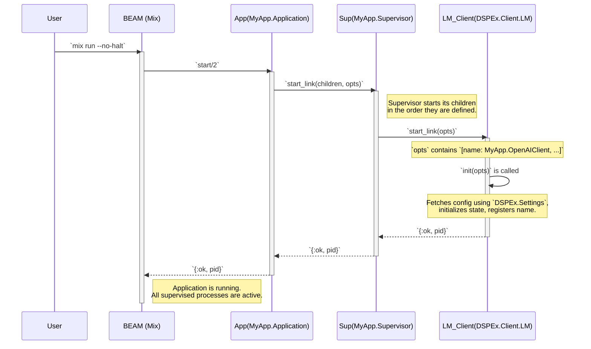

Excellent. Let's begin creating the detailed technical diagrams for Layer 1. We will start with the diagrams that define the static structure and startup sequence of the application, as these provide the foundational context for everything else.

Here is the first document in the series.

---

### **`DSPEx` Technical Blueprint - Document 1 of 3**

### **Topic: OTP Supervision & Application Startup**

**Objective:** To provide a clear and unambiguous blueprint of the application's process structure at boot time. This includes the static supervision tree and the sequence of events during application startup. These diagrams are essential for understanding process lifecycle management and service registration in `DSPEx`.

---

### **Diagram 1.1: Application Supervision Tree**

*   **Purpose:** This diagram illustrates the static, hierarchical relationship between supervisors and worker processes that are started when the `DSPEx` application boots. It defines "who watches whom" and the restart strategies.
*   **Type:** Component Diagram.

```mermaid
graph TD
    subgraph "OTP Application"
        A(MyApp.Application) -->|starts| B(MyApp.Supervisor)
        style A fill:#cde,stroke:#333,stroke-width:2px
    end

    subgraph "DSPEx Services Layer"
        B -- "supervises (one_for_one)" --> C(DSPEx.Client.LM)
        B -- "supervises (one_for_one)" --> D(DSPEx.Cache)

        subgraph C [LM Client GenServer]
            direction LR
            C_State["State: config, api_key"]
        end
        subgraph D [Cache GenServer (Placeholder for Layer 2)]
            direction LR
            D_State["State: ets_table_ref, disk_path"]
        end

        C -.->|registered as| C_Name(MyApp.OpenAIClient)
        D -.->|registered as| D_Name(MyApp.Cache)

        style B fill:#f9f,stroke:#333,stroke-width:2px
        style C fill:#f9f,stroke:#333,stroke-width:2px
        style D fill:#f9f,stroke:#333,stroke-width:2px
    end


    note right of C
        <b>Worker Process</b><br/>
        A long-lived GenServer that manages state<br/>
        and handles requests. It is registered with a<br/>
        globally unique name for easy access.
    end
    note left of B
        <b>Supervisor Process</b><br/>
        Its only job is to start and monitor its children.<br/>
        The `:one_for_one` strategy means if one child<br/>
        crashes, it gets restarted, but other children<br/>
        are not affected.
    end

```

#### **Key Architectural Details:**

1.  **Clear Hierarchy:** The top-level application starts a main supervisor (`MyApp.Supervisor`). This supervisor is responsible for all core `DSPEx` services.
2.  **Service Isolation:** The `LM` Client and `Cache` service are sibling worker processes under the same supervisor. The `:one_for_one` restart strategy ensures that a crash in the `LM` client (e.g., due to a bug in its initialization) will not affect the `Cache` service.
3.  **Named Registration:** Critical services like the `LM` Client are registered with a unique atom name (e.g., `MyApp.OpenAIClient`). This allows any other process in the application to send messages to it without needing to know its process ID (PID), which can change if the process is restarted.
4.  **State Encapsulation:** The state of each service (like API keys or cache table references) is encapsulated entirely within its own process, preventing shared-state concurrency issues.

---

### **Diagram 1.2: Application Startup Sequence**

*   **Purpose:** This diagram shows the chronological flow of function calls and process initializations that occur when the user runs `mix run` or `iex -S mix`.
*   **Type:** Sequence Diagram.



#### **Key Architectural Details:**

1.  **Order of Operations:** The diagram clearly shows that the application starts its supervisor, which in turn starts its child workers. This is the standard, robust OTP startup procedure.
2.  **`start_link`:** The use of `start_link` is critical. It creates a "link" between the supervisor and the child process. If the child process crashes for any reason, the supervisor is automatically notified and can take action (i.e., restart it).
3.  **`init/1` Callback:** The `init/1` callback within the `DSPEx.Client.LM` GenServer is the "constructor" for the process. This is where initial state is set up, such as reading API keys from the configuration. If `init/1` fails (e.g., returns `{:stop, :reason}`), the process will not start, and the supervisor will handle the failure according to its strategy.
4.  **Process Registration:** The diagram implies that during `init/1`, the `LM_Client` process registers itself under the given name. This makes it available for use by other parts of the system immediately after the application has finished starting.

This document provides the complete blueprint for the static process architecture and boot sequence of `DSPEx` v0.1. The next document will detail the dynamic process creation and data flow for handling a single program execution.
