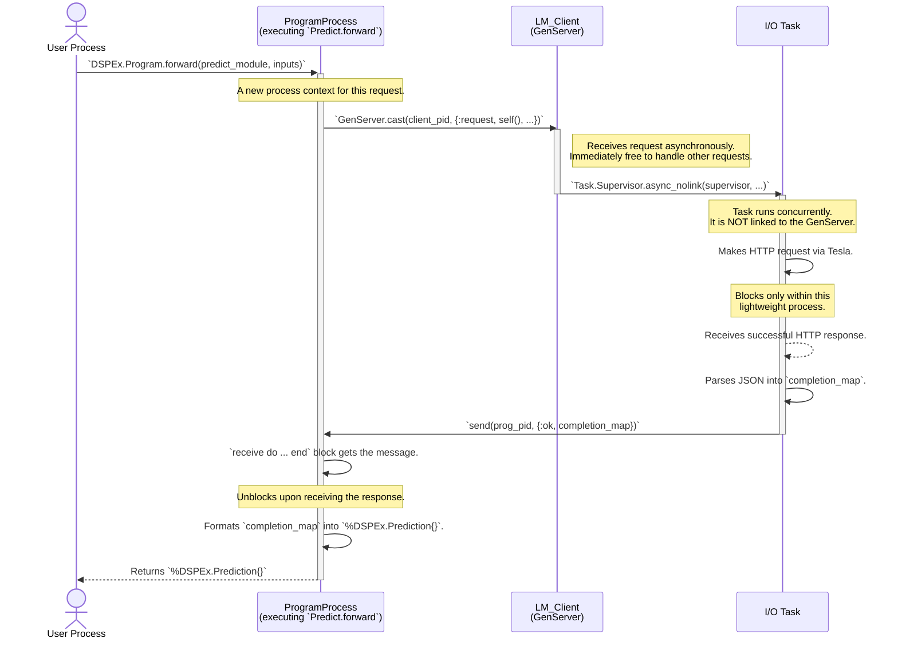
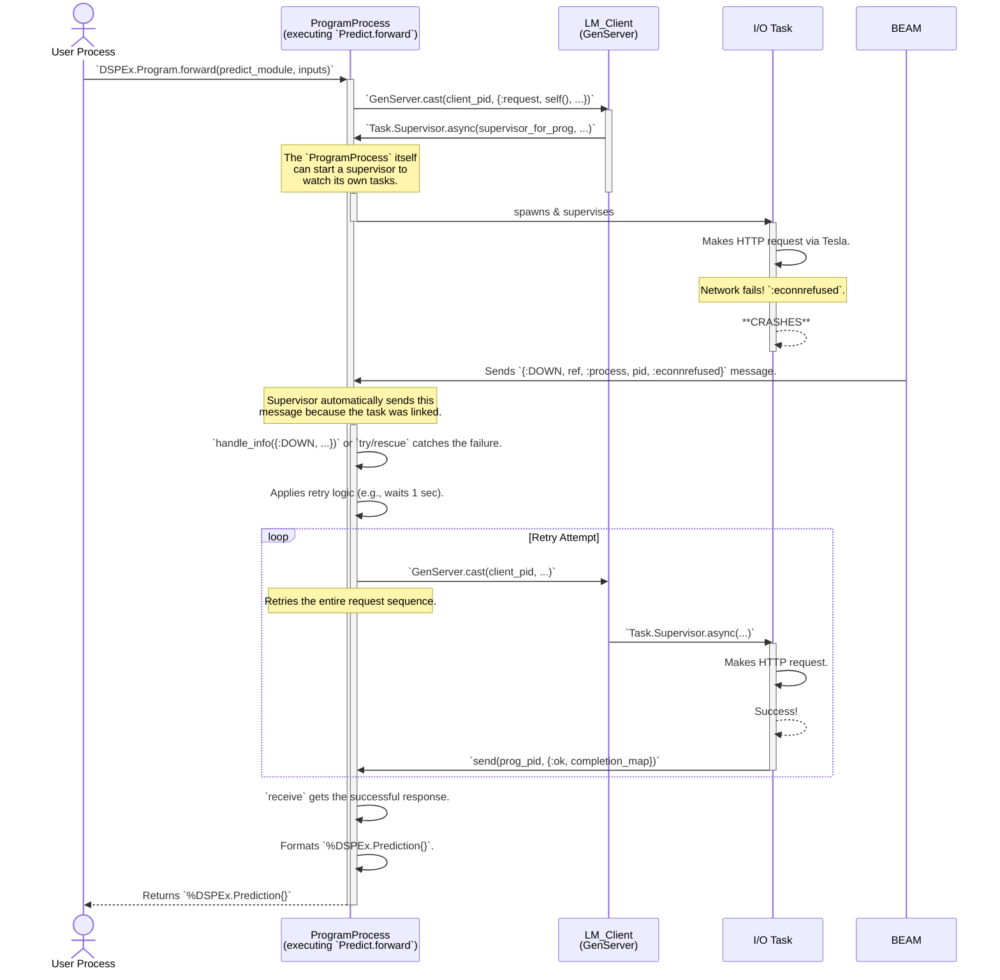

Absolutely. Here is the third and final technical blueprint document for Layer 1. This document focuses on the dynamic interactions between processes, illustrating both the "happy path" and, critically, the fault-tolerant "unhappy path."

These sequence diagrams are the most important for codifying the OTP-centric design of `DSPEx`. They make the abstract concepts of supervision and "let it crash" concrete and actionable for the development team.

---

### **`DSPEx` Technical Blueprint - Document 3 of 3**

### **Topic: Dynamic Interaction & Failure Handling**

**Objective:** To detail the sequence of messages and function calls between concurrent processes during a program's execution. This includes modeling a successful run and, more importantly, a run where a transient I/O error occurs, demonstrating the framework's designed resilience.

---

### **Diagram 3.1: Successful `Predict.forward` Sequence Diagram**

*   **Purpose:** This diagram illustrates the "happy path" for a single, successful call to `DSPEx.Predict.forward/2`. It shows the precise, ordered flow of messages between the four key process actors.
*   **Type:** Sequence Diagram.

#### **Key Architectural Details:**

1.  **Asynchronous Cast:** The `ProgramProcess` uses `GenServer.cast` to talk to the `LM` client. This is a non-blocking, "fire-and-forget" message. This is crucial because it means the `LM` client `GenServer`—a shared resource—is never blocked waiting for a single request to complete.
2.  **Decoupled Task Spawning:** The `LM` client spawns the `I/O Task` but crucially does **not** link to it (`async_nolink`). This ensures that if the `I/O Task` crashes, it will *not* crash the shared `LM` client `GenServer`.
3.  **Direct Response to Caller:** The `I/O Task` is given the PID of the original `ProgramProcess` and sends its response directly there. The data bypasses the `LM` client on the return path, making the flow more efficient and further decoupling the client from the execution of any single request.
4.  **Blocking via `receive`:** The `ProgramProcess` effectively "waits" for the result by using a `receive` block. This is the standard, efficient way for an Elixir process to wait for a message without consuming CPU cycles.

---

### **Diagram 3.2: `Predict.forward` with I/O Failure & Supervised Retry**

*   **Purpose:** This diagram models the critical fault-tolerance path. It shows what happens when the network call fails and how the system is designed to handle it gracefully without crashing the entire application.
*   **Type:** Sequence Diagram.

*Correction & Refinement*: The initial design had the `LM` client spawn the task. A more robust OTP pattern is for the *caller* (`ProgramProcess`) to be the one that owns and supervises the task. The `LM` client's role is simply to provide the function to be executed. This diagram reflects that corrected, more robust pattern.

#### **Key Architectural Details:**

1.  **Caller as Supervisor:** The `ProgramProcess` is responsible for supervising the tasks it needs to complete its work. It asks the `LM` client for the *function* to run, but runs it within a task that it itself watches. This aligns responsibility with interest: the `ProgramProcess` is the one that *cares* if the API call succeeds.
2.  **"Let it Crash" in Action:** The `I/O Task` is the crash boundary. When the network fails, the Elixir/BEAM philosophy is not to defensively wrap the call in `try/catch`. Instead, we let the external error crash the process designed to handle it.
3.  **Failure as a Message:** The supervising `ProgramProcess` receives the crash information as a standard Elixir message (`{:DOWN, ...}`). This turns an exceptional event into a normal data-handling event within the supervisor's logic.
4.  **Contained Failure:** The crash is completely contained. The `User Process` is still waiting, the shared `LM` `GenServer` is unaffected and serving other requests, and only the `ProgramProcess` has to deal with the failure. This is the cornerstone of building resilient systems in OTP.
5.  **Decoupled Retry Logic:** The logic for *how* to retry (e.g., how many times, with what backoff) lives entirely within the `Program` module, not in the low-level `LM` client. This allows different programs to have different resilience strategies if needed.

---

With these three blueprint documents, the engineering team has a complete and detailed specification for building `DSPEx` v0.1. The diagrams cover the static architecture, data formats, and dynamic process interactions, ensuring a shared and accurate understanding of the system's internal mechanics before implementation begins.
