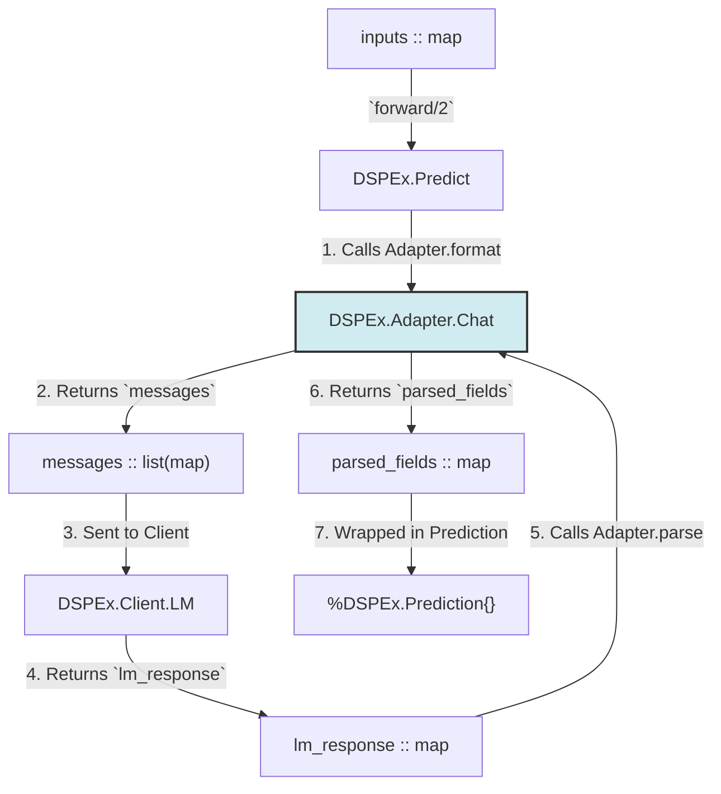

Excellent. We will now create the second technical document in the new, `foundation`-accelerated series. This document builds directly on the robust client and `Predict` module we just designed.

It will focus on implementing the **Adapter layer** and the first compositional module, **`ChainOfThought`**. This layer is responsible for translating the declarative `Signature` into a sophisticated, multi-turn prompt that can elicit complex reasoning from the Language Model.

---

### **`DSPEx` Technical Blueprint (Foundation-Accelerated) - Document 2 of 3**

### **Topic: The Adapter Layer and `ChainOfThought` Module**

**Objective:** To detail the design for transforming a simple `Signature` into a complex, multi-turn prompt suitable for reasoning tasks. This involves creating the `Adapter` layer and the `ChainOfThought` module, which programmatically modifies a `Signature` to inject a reasoning step.

---

### **1. The `Adapter` Layer Architecture**

**Purpose:** The `Adapter` is a crucial component that sits between a `Program` and the `LM Client`. Its sole responsibility is to take a high-level `Signature`, a list of few-shot `Example`s (demos), and the current inputs, and translate them into the final, formatted `messages` list that the LM API expects.

This decouples the *declarative intent* of the `Signature` from the *imperative formatting* required by a specific model or API style (e.g., chat vs. text completion).

#### **1.1. `Adapter` Behaviour and Data Flow**

We will define a standard `Adapter` behaviour that all specific adapters must implement.

**File:** `lib/dspex/adapter.ex`

```elixir
defmodule DSPEx.Adapter do
  alias DSPEx.{Example, Prediction, Signature}

  @doc """
  The behaviour for all DSPEx Adapters.
  """
  @callback format(signature :: module(), demos :: list(Example.t()), inputs :: map()) :: list(map())
  @callback parse(signature :: module(), response :: map()) :: map()
end
```

The data flow for a program call is now refined to include the `Adapter`:



#### **1.2. `DSPEx.Adapter.Chat` Implementation**

This will be the primary adapter for v0.1, designed for modern chat-based LMs. It must precisely replicate the prompt structure from the Python `dspy.ChatAdapter`.

**File:** `lib/dspex/adapter/chat.ex`

```elixir
defmodule DSPEx.Adapter.Chat do
  @behaviour DSPEx.Adapter

  # Main entry point.
  @impl DSPEx.Adapter
  def format(signature, demos, inputs) do
    system_message = build_system_message(signature)
    demo_messages = build_demo_messages(signature, demos)
    user_message = build_user_message(signature, inputs)

    # The final `messages` list structure
    [system_message | (demo_messages ++ [user_message])]
  end

  # This function parses the raw text completion back into structured fields.
  @impl DSPEx.Adapter
  def parse(signature, response) do
    # In Layer 2, this will be more complex. For now, we assume a simple case.
    # The response from OpenAI client is response["choices"][0]["message"]["content"]
    raw_text = get_in(response, ["choices", 0, "message", "content"])
    
    # Use Regex to parse fields like [[ ## answer ## ]]\n The answer is...
    output_fields = Signature.output_fields(signature)
    
    Enum.reduce(output_fields, %{}, fn field_name, acc ->
      # Regex to find the content for a specific field
      pattern = ~r/\[\[ ## #{field_name} ## \]\]\s*(.*)/s
      
      case Regex.run(pattern, raw_text, capture: :all_but_first) do
        [content] -> Map.put(acc, field_name, String.trim(content))
        nil -> acc
      end
    end)
  end

  # --- Private Helper Functions ---
  
  defp build_system_message(signature) do
    # Combines instructions, field descriptions, etc.
    %{role: "system", content: "..."}
  end

  defp build_demo_messages(signature, demos) do
    # Loops through demos, creating alternating user/assistant messages.
    Enum.flat_map(demos, fn demo ->
      [
        build_user_message(signature, demo.inputs),
        build_assistant_message(signature, demo.labels)
      ]
    end)
  end
  
  defp build_user_message(signature, inputs) do
    # Formats inputs into the "[[ ## field_name ## ]]\n..." format
    %{role: "user", content: "..."}
  end

  defp build_assistant_message(signature, outputs) do
    # Formats outputs into the "[[ ## field_name ## ]]\n..." format
    %{role: "assistant", content: "..."}
  end
end
```

**Key Implementation Detail:** The `parse/2` function is critical. It must reliably extract structured fields from the LM's free-text response. A robust regex-based approach is necessary for the `ChatAdapter`. Later, a `JSONAdapter` would use a JSON parsing library instead.

---

### **2. `DSPEx.ChainOfThought` Module**

**Purpose:** To programmatically inject a "reasoning" step into a `Signature` before execution, prompting the LM to think step-by-step. This is the first example of a compositional module.

**File:** `lib/dspex/chain_of_thought.ex`

```elixir
defmodule DSPEx.ChainOfThought do
  @behaviour DSPEx.Program
  
  # The struct holds the original signature and an internal Predict module.
  defstruct [:signature, :predictor]

  # The constructor is where the magic happens.
  def new(signature, client) do
    # 1. Programmatically create a new signature with `reasoning` added.
    #    The `__using__` block of the signature macro will need to support
    #    being called with a map of fields, not just a string.
    original_fields = Signature.fields(signature)
    
    reasoning_field = {
      :reasoning, 
      %{desc: "Think step-by-step to reach the answer.", type: :string}
    }
    
    # Prepend the reasoning field before the original output fields.
    extended_fields = # logic to insert reasoning_field into original_fields
    extended_signature_name = :"#{inspect(signature)}_with_CoT"
    
    # Dynamically define the new signature module
    DynamicSupervisor.start_child(
        Application.get_env(:my_app, :dynamic_supervisor), 
        %{id: extended_signature_name, start: {Kernel, :make_module, [extended_signature_name, extended_fields]}}
    )

    # 2. Create an internal Predict module that uses this new, extended signature.
    predictor = %DSPEx.Predict{
      signature: extended_signature,
      client: client
    }
    
    %__MODULE__{signature: signature, predictor: predictor}
  end

  @impl DSPEx.Program
  def forward(program, inputs) do
    # 3. Delegate the call to the internal predictor.
    #    The result will be a Prediction struct containing the `reasoning` field.
    DSPEx.Program.forward(program.predictor, inputs)
  end
end
```

**Key Architectural Decisions & Refinements:**

1.  **Dynamic Signature Generation:** The `ChainOfThought.new/2` function needs to create a *new* signature module at runtime. The simplest way to achieve this is to enhance our `defsignature` macro so it can be called programmatically, or create a helper function `DSPEx.Signature.create/2` that takes a name and a list of fields and uses `Code.eval_string` or similar techniques to define a new module on the fly. *Self-correction: A better approach would be to have a `Signature.prepend_field/3` function that returns a new anonymous struct or map representing the modified signature, avoiding the complexity of dynamic module creation.*
2.  **Composition over Inheritance:** `ChainOfThought` *contains* a `DSPEx.Predict` instance; it does not inherit from it. This is a core principle of composition and makes the system more flexible.
3.  **Hiding Complexity:** The user simply calls `DSPEx.ChainOfThought.new(MySignature, MyClient)`. All the signature manipulation is completely hidden from them.

---

### **3. Updated `Predict` Module to use Adapters**

The `Predict` module from Layer 1 must be updated to use the new `Adapter` layer.

**File:** `lib/dspex/predict.ex` (Revised `forward/2`)

```elixir
@impl DSPEx.Program
def forward(program, inputs) do
  # Assume an adapter is configured, e.g., in the program struct.
  # %DSPEx.Predict{signature: sig, client: c, adapter: DSPEx.Adapter.Chat}
  adapter = program.adapter

  # 1. Format the prompt using the adapter. Demos are empty for now.
  messages = adapter.format(program.signature, [], inputs)
  
  # 2. Call the LM client.
  case DSPEx.Client.LM.request(program.client, messages) do
    {:ok, lm_response} ->
      # 3. Parse the response using the adapter.
      parsed_fields = adapter.parse(program.signature, lm_response)
      
      # 4. Create the final prediction.
      prediction = DSPEx.Prediction.from_completions([parsed_fields], program.signature)
      {:ok, prediction}
      
    {:error, reason} ->
      {:error, reason}
  end
end
```

### **Conclusion**

With the `Adapter` layer and the `ChainOfThought` module, `DSPEx` gains the ability to implement sophisticated prompting techniques. The architecture ensures that:
-   **Prompting logic is decoupled** from program logic.
-   **Modules are composable**, allowing complex behaviors to be built from simple parts.
-   The system remains robust, leveraging `foundation` for all underlying infrastructure.

The next and final blueprint document will cover the dynamic interaction models for these more complex modules, including how few-shot demos are passed through the system.
