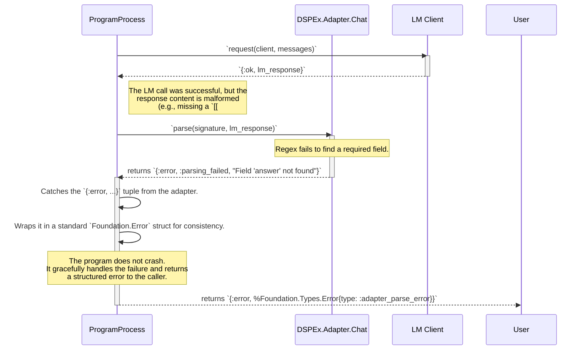
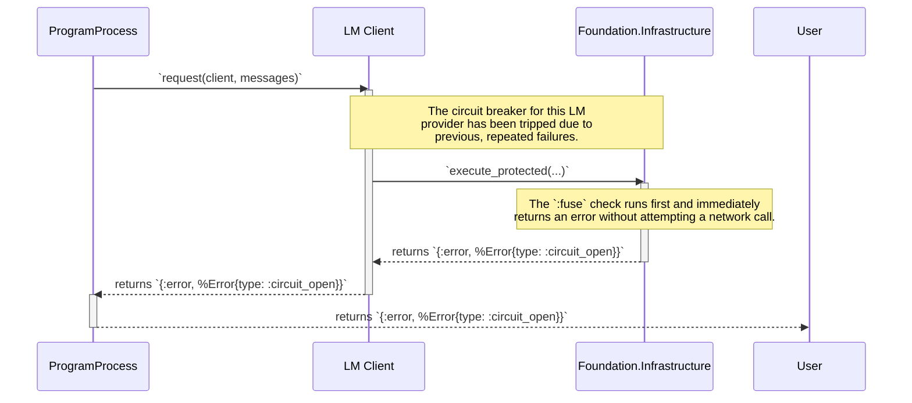

Excellent. Here is the third and final technical blueprint document in the `foundation`-accelerated series. This document ties everything together by detailing the dynamic interactions and failure-handling mechanisms for the complete Layer 1 and 2 system.

It provides the definitive sequences for a `ChainOfThought` execution, including how few-shot demonstrations are handled and how the system behaves when encountering errors, all while leveraging the resilience provided by the `foundation` library.

---

### **`DSPEx` Technical Blueprint (Foundation-Accelerated) - Document 3 of 3**

### **Topic: Compositional Dynamics, Demonstration Flow, and Failure Handling**

**Objective:** To provide a detailed blueprint of the runtime interactions within a compositional program (`ChainOfThought`). This includes specifying the data flow for few-shot demonstrations and modeling the system's response to common failure scenarios, showcasing the resilience provided by the `foundation` library.

---

### **1. `ChainOfThought` Execution with Few-Shot Demos**

**Purpose:** This diagram illustrates the complete, successful execution sequence of a `ChainOfThought` call that includes few-shot demonstrations. It shows how data is passed from the user, through the compositional modules, formatted by the adapter, and processed by the client.

**Type:** Sequence Diagram.

```mermaid
sequenceDiagram
    actor User
    participant CoT as ChainOfThought Program
    participant Predict as Internal Predict Program
    participant Adapter as DSPEx.Adapter.Chat
    participant Client as LM Client
    participant Foundation as Foundation.Infrastructure

    User->>+CoT: `forward(cot_program, %{inputs: ..., demos: ...})`
    Note over CoT: The `demos` are passed along with the inputs.

    CoT->>Predict: `forward(cot_program.predictor, %{inputs: ..., demos: ...})`
    activate Predict

    Predict->>Adapter: `format(extended_signature, demos, inputs)`
    activate Adapter
    Note over Adapter: **Critical Step:**<br/>Adapter iterates through the `demos` list,<br/>creating alternating user/assistant messages<br/>for the few-shot prompt.
    Adapter-->>Predict: returns `{:ok, messages}`
    deactivate Adapter

    Predict->>Client: `request(client, messages)`
    activate Client
    Client->>+Foundation: `execute_protected(...)`
    Note over Foundation: Handles connection pooling and<br/>circuit breaking for the API call.
    Foundation-->>-Client: `{:ok, lm_response}`
    Client-->>Predict: `{:ok, lm_response}`
    deactivate Client

    Predict->>Adapter: `parse(extended_signature, lm_response)`
    activate Adapter
    Adapter-->>Predict: returns `{:ok, parsed_fields}`
    deactivate Adapter

    Predict->>Predict: Wraps result in `%DSPEx.Prediction{}`
    Predict-->>-CoT: returns `{:ok, prediction}`
    deactivate Predict
    
    CoT-->>-User: returns `{:ok, prediction}`
    deactivate CoT
```

#### **Key Architectural Details:**

1.  **Demos as First-Class Data:** The `demos` list (a list of `%DSPEx.Example{}`) is passed down the call stack just like the `inputs`. It is treated as a runtime parameter of the execution.
2.  **Adapter's Central Role:** The `Adapter` is solely responsible for correctly formatting the demonstrations into the multi-turn chat format. This encapsulates the complex prompting logic, keeping the `Predict` and `CoT` modules clean.
3.  **Stateless Composition:** The entire flow is stateless from the perspective of the `CoT` and `Predict` modules. They simply transform data and pass it along. The only state is managed within the `LM Client` `GenServer` and the `foundation` services it uses.

---

### **2. Failure Handling Scenario: Adapter Parsing Error**

**Purpose:** To model how the system behaves when the Language Model produces a malformed response that the `Adapter` cannot parse. This is a common failure mode in real-world applications.

**Type:** Sequence Diagram.



#### **Key Architectural Details:**

1.  **Errors as Data:** The `Adapter.parse/2` function does not raise an exception on failure. Instead, it returns a tagged tuple (`{:error, ...}`). This treats failures as expected outcomes that can be handled gracefully by the caller. This is a core principle of functional error handling in Elixir.
2.  **Graceful Failure Propagation:** The `Predict` module receives the error tuple and propagates it up the call stack. The program doesn't crash; the user receives a structured error message that can be logged, analyzed, or used to trigger a retry with a different prompt.
3.  **No `try/rescue` Needed:** Because the `Adapter` returns a tagged tuple, the `Predict` module can use simple `case` statements for control flow, which is more idiomatic and often more performant than `try/rescue` in Elixir.

---

### **3. Failure Handling Scenario: Infrastructure Failure (Circuit Breaker)**

**Purpose:** To show how the system responds when an underlying `foundation` service (like the circuit breaker) prevents an operation from executing. This demonstrates the resilience inherited from the infrastructure layer.

**Type:** Sequence Diagram.



#### **Key Architectural Details:**

1.  **Fail-Fast Mechanism:** The circuit breaker provides a crucial fail-fast capability. The `LM Client` and `Predict` module are not even aware that a network call was prevented. They simply receive a standardized error from `foundation`.
2.  **System Protection:** This pattern protects the entire application from wasting resources on a known-failing external service. It also gives the external service time to recover.
3.  **Decoupled Resilience:** The `Predict` module's code does not need to know anything about circuit breakers. Its error handling logic (`case ... do`) is generic enough to handle any structured error returned by the client, whether it's a parsing error, a circuit breaker error, or a rate-limiting error. This is a powerful form of decoupling.

---

### **Final `DSPEx` Core Blueprint Summary**

This three-part technical blueprint provides a complete and actionable plan for implementing the foundational layers of `DSPEx`, accelerated by the `foundation` library.

-   **Document 1** established the **static OTP architecture**, defining how our core services are supervised and managed.
-   **Document 2** detailed the **core data structures and transformations**, clarifying the "shape" of data from compile-time macros to runtime structs.
-   **Document 3** has now specified the **dynamic process interactions and failure modes**, proving the resilience and compositional integrity of the system.

With this blueprint, the development team has everything needed to build a robust, observable, and extensible core execution engine, setting the stage for the successful implementation of `DSPEx`'s more advanced optimization and agentic capabilities.
