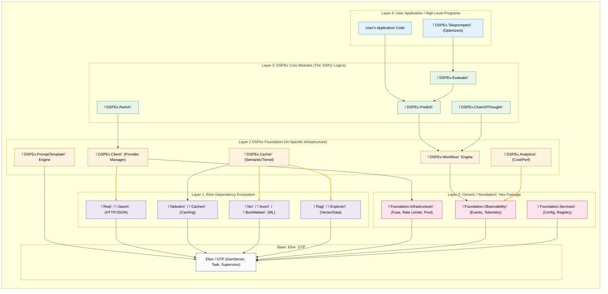
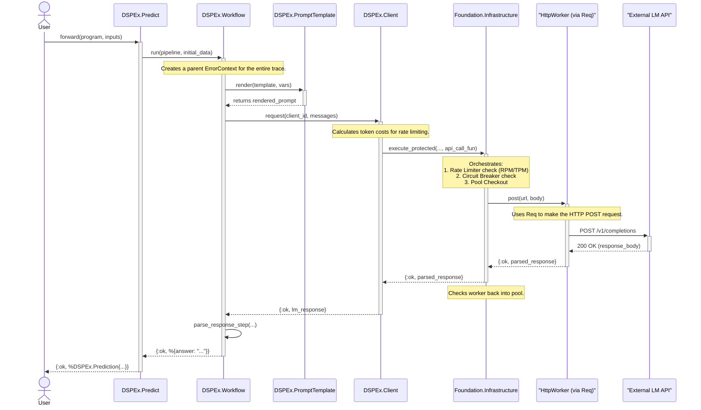
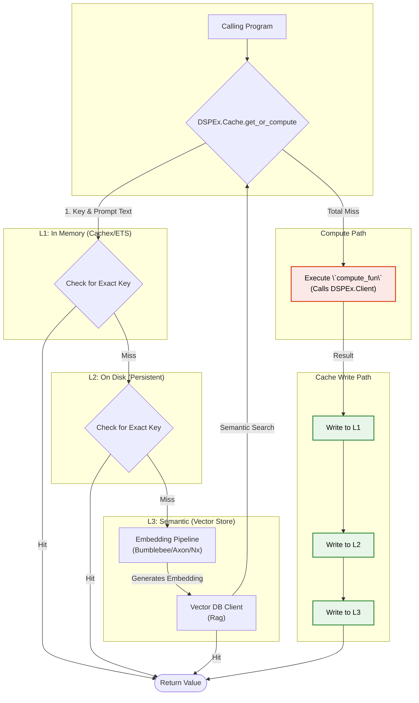

Of course. Here is a detailed set of diagrams showcasing how our evolved `DSPex Foundation` layer, its dependencies, and the underlying `foundation` hex package integrate with the broader `DSPEx` architecture.

This provides a holistic view, from the highest-level application logic down to the infrastructure that powers it.

---

### **Overview of the Diagrams**

1.  **Diagram 1: The Layered Architecture Stack:** A static, high-level view showing the layers of abstraction and dependency, from the user's application down to Elixir/OTP. This illustrates *what depends on what*.
2.  **Diagram 2: Dynamic Execution Flow of a `Predict` Call:** A sequence diagram tracing a single, successful `forward` call through the entire stack. This illustrates *who talks to whom, and when*.
3.  **Diagram 3: Advanced Component Deep Dive - The Semantic Cache:** A component interaction diagram showing how the `DSPex.Cache` uses its various dependencies (`Nebulex`, `Cachex`, `Nx`, `Bumblebee`, `Rag`) to fulfill a request. This illustrates *how a complex component works internally*.

---

### **Diagram 1: The `DSPEx` Layered Architecture Stack**

**Purpose:** This diagram provides a static, "30,000-foot view" of the entire system architecture. It clearly delineates the responsibilities of each layer and shows the strict, downward-only dependency flow, which is a hallmark of a well-designed, maintainable system.

---

### **Diagram 2: Dynamic Execution Flow of a `Predict` Call**

**Purpose:** This sequence diagram shows the real-time flow of a single, successful call through the stack. It highlights how `DSPex Foundation` components orchestrate work and delegate to the `foundation` hex package for resilience and resource management.

---

### **Diagram 3: Advanced Component Deep Dive - The Semantic Cache**

**Purpose:** This component interaction diagram illustrates the internal logic of the `DSPEx.Cache` module when a `get_or_compute` call is made. It shows the cascade of cache lookups and the integration of the ML embedding pipeline.

These three diagrams provide a comprehensive, multi-faceted view of the proposed `DSPEx` architecture. They show how a clear, layered design allows for the integration of powerful, specialized libraries at each level, all while building on the solid, generic infrastructure provided by the `foundation` package.
