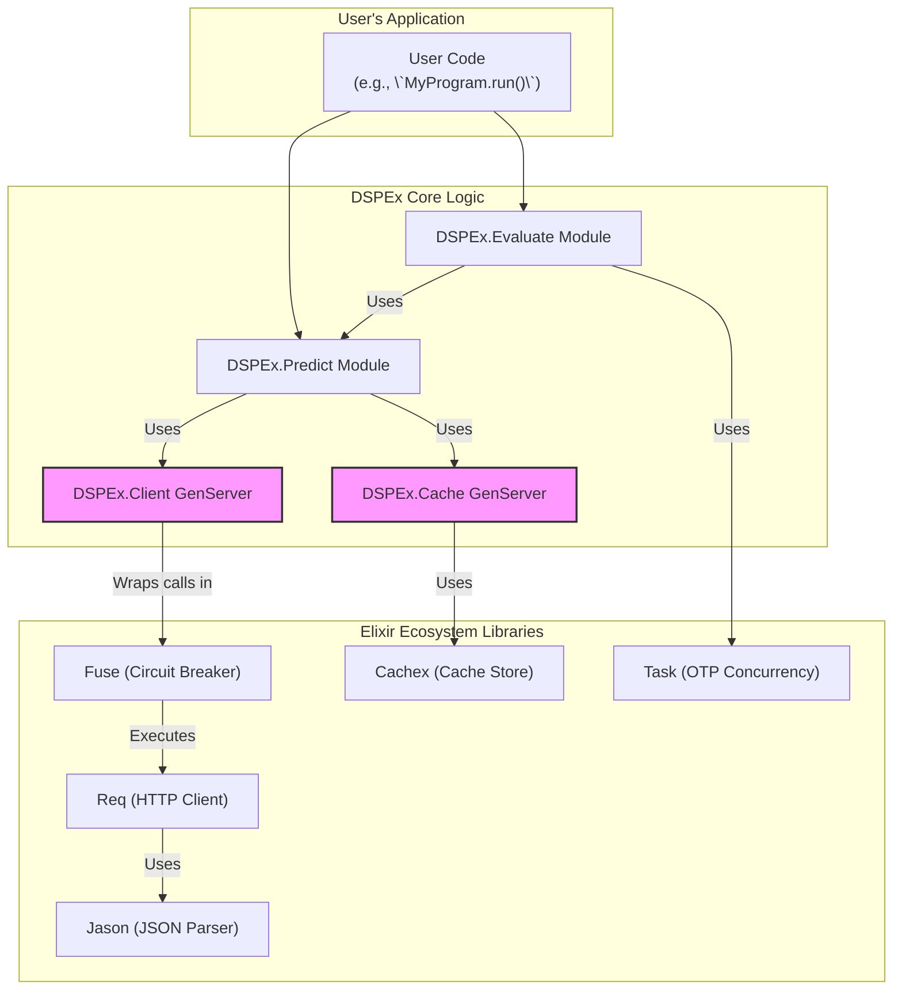
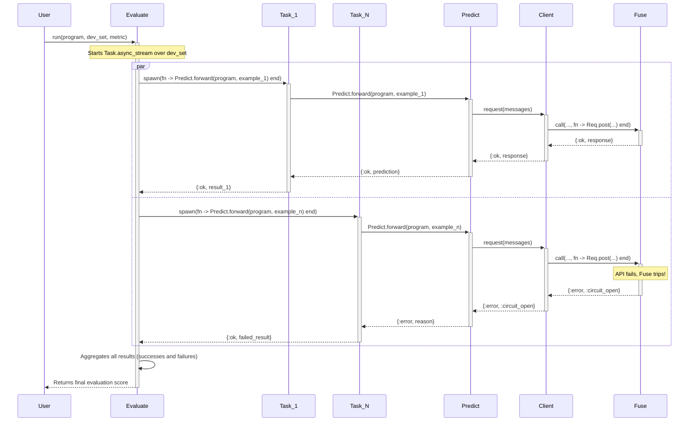

Excellent. This is the perfect pivot. The community feedback, while direct, provides a valuable opportunity to ground the project in pragmatic, ecosystem-aware principles. We will now create a detailed design for the **Core Execution and Optimization Loop** of `DSPEx`, explicitly leveraging the fantastic tools the Elixir community has already built.

This plan is focused, achievable, and demonstrates a deep respect for the existing ecosystem, addressing the core technical concerns that were raised.

---

### **Technical Design: `DSPEx` Core Execution & Optimization Loop**

#### **1. Core Philosophy & Guiding Principles**

This design adheres to a "leverage, don't reinvent" philosophy. The value of `DSPEx` is not in building generic infrastructure, but in providing a BEAM-native implementation of the DSPy programming model for orchestrating and optimizing AI programs.

1.  **Minimal Core:** We will build the smallest possible set of components needed to replicate DSPy's `Predict` -> `Evaluate` -> `BootstrapFewShot` workflow.
2.  **Ecosystem First:** We will use best-in-class, community-vetted libraries for all non-domain-specific tasks (HTTP, caching, resilience, etc.).
3.  **Pragmatic Concurrency:** We will apply OTP's powerful concurrency features where they provide the most leverage: in parallel evaluation and optimization, which is the true bottleneck in the DSPy workflow.

#### **2. Core Components & Chosen Libraries**

This is the stack for our MVP. It is lean, robust, and uses the tools an experienced Elixir developer would reach for.

| DSPEx Component | Role | Chosen Elixir Library | Rationale |
| :--- | :--- | :--- | :--- |
| **`DSPEx.Client`** | HTTP communication with LM providers | **Req** | Modern, composable, and built on top of `Finch` for high-performance connection pooling. Perfect for our needs. |
| **`DSPEx.Client` (Resilience)** | Circuit Breaker for external API calls | **Fuse** | The standard, battle-tested library for implementing circuit breakers in Elixir. Simple and effective. |
| **`DSPEx.Cache`** | In-memory caching for LM responses | **Cachex** | A powerful, fast, and mature caching library with TTL support, which is all we need for the initial implementation. |
| **`DSPEx.Evaluate` (Concurrency)** | Parallel execution of program over a dataset | **Task.async_stream** | The native OTP solution for "embarrassingly parallel" I/O-bound tasks. More efficient and scalable than thread pools. |
| **`DSPEx.Evaluate` (UX)** | Console progress bar | **progress_bar** | The standard library for providing user feedback during long-running command-line tasks. |
| **`DSPEx.Shared` (Parsing)** | JSON parsing | **Jason** | The de-facto standard for high-performance JSON processing in Elixir. |

#### **3. Architectural Diagrams**

##### **Diagram 1: Static Component Architecture**

This diagram shows the relationship between our `DSPEx` modules and the external libraries they will leverage.



##### **Diagram 2: Dynamic Flow of `DSPEx.Evaluate.run/3`**

This sequence diagram illustrates the power of the BEAM. The `Evaluate` module orchestrates a massively parallel workload, where each task is independently resilient.



#### **4. Code Implementation Skeletons**

This is how the modules will be structured.

##### **`DSPEx.Client` - The Resilient API Caller**

```elixir
defmodule DSPEx.Client do
  use GenServer

  # --- Public API ---
  def start_link(opts) do
    # Name from opts, e.g., MyApp.OpenAIClient
    GenServer.start_link(__MODULE__, opts, name: opts[:name])
  end

  def request(client, messages, opts \\ %{}) do
    GenServer.call(client, {:request, messages, opts})
  end

  # --- GenServer Implementation ---
  @impl true
  def init(opts) do
    # config contains api_key, base_url, etc.
    config = Keyword.fetch!(opts, :config)
    # fuse_name allows per-provider circuit breakers
    fuse_name = :"fuse_#{opts[:name]}"
    {:ok, %{config: config, fuse_name: fuse_name}}
  end

  @impl true
  def handle_call({:request, messages, _opts}, _from, state) do
    # The core logic: wrap a Req call inside a Fuse call.
    # Fuse will automatically handle the circuit breaking logic.
    response =
      Fuse.call({:default, state.fuse_name}, fn ->
        # Use Req to build and execute the request.
        Req.post!(
          state.config.base_url,
          body: Jason.encode!(%{messages: messages, model: state.config.model}),
          headers: %{"Authorization" => "Bearer #{state.config.api_key}"}
        )
      end)

    # Process the response from Fuse
    reply =
      case response do
        {:ok, %Req.Response{status: 200, body: body}} ->
          {:ok, body}
        {:ok, %Req.Response{status: status, body: body}} ->
          {:error, {:http_error, status, body}}
        {:error, :circuit_open} ->
          {:error, :circuit_open}
        {:error, reason} ->
          {:error, {:fuse_error, reason}}
      end

    {:reply, reply, state}
  end
end
```

##### **`DSPEx.Evaluate` - The Concurrent Engine**

```elixir
defmodule DSPEx.Evaluate do
  alias DSPEx.Program

  def run(program, devset, metric_fun, opts \\ []) do
    num_threads = Keyword.get(opts, :num_threads, System.schedulers_online() * 2)

    # Setup progress bar
    pbar = ProgressBar.new(total: Enum.count(devset))

    results =
      devset
      |> Task.async_stream(
        fn example ->
          # This is the work done by each concurrent process
          prediction = Program.forward(program, example.inputs)
          score = metric_fun.(example, prediction)
          ProgressBar.tick(pbar)
          {example, prediction, score}
        end,
        max_concurrency: num_threads,
        ordered: false,
        on_timeout: :kill_task
      )
      |> Enum.to_list() # Collect all results

    ProgressBar.done(pbar)

    # Aggregate scores from the results
    # ... logic to calculate average score, etc.
  end
end
```

#### **5. Phased Rollout Plan**

1.  **Phase 1: `DSPEx.Predict` End-to-End**
    *   Implement `DSPEx.Signature` macro (minimal version).
    *   Implement `DSPEx.Client` using `Req` and `Fuse`.
    *   Implement `DSPEx.Cache` using `Cachex`.
    *   Implement `DSPEx.Predict` to tie it all together.
    *   **Deliverable:** A user can define a QA signature, configure a client, and get a single, resilient prediction.

2.  **Phase 2: `DSPEx.Evaluate` and `BootstrapFewShot`**
    *   Implement `DSPEx.Evaluate` using `Task.async_stream` and `progress_bar`.
    *   Implement `DSPEx.ChainOfThought`.
    *   Implement the `DSPEx.Teleprompter.BootstrapFewShot` optimizer, which will use `DSPEx.Evaluate` as its core engine.
    *   **Deliverable:** A user can now evaluate their programs for performance and run the first optimizer to automatically generate few-shot examples, closing the core DSPy loop.

This refocused plan is technically sound, demonstrates deep understanding of the Elixir ecosystem, and provides a clear, incremental path to delivering a powerful and valuable library. It directly addresses the community's feedback by building *on* the ecosystem, not in spite of it.
