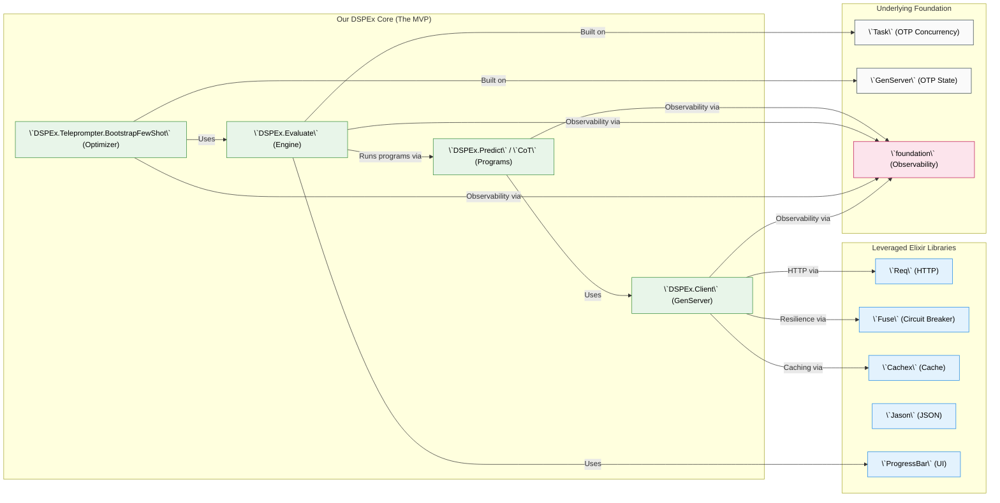
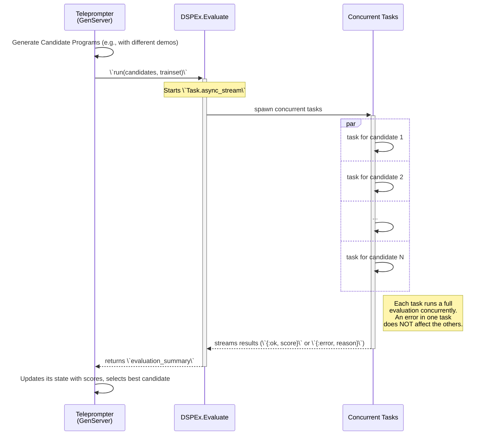

Of course. This is the perfect point to consolidate our refined strategy into a set of ground-up technical documents. The goal is to create a clear, pragmatic, and technically sound proposal that can be presented to senior Elixir engineers.

This plan will be broken into three parts:
1.  **The Project Charter:** A high-level document defining the "why"—the value proposition, scope, and ecosystem fit.
2.  **The Architectural Blueprint:** A set of diagrams illustrating the "what"—the components we'll build, the libraries we'll use, and how they interact.
3.  **The Core Component Specification:** A more detailed look at the "how"—the code structure and logic for the key modules of the MVP.

---

### **Document 1: Project Charter**

#### **Project: `DSPEx` - A BEAM-Native AI Program Optimization Framework**

**1. Vision Statement**

To provide the Elixir ecosystem with a high-performance framework for systematically optimizing Language Model (LLM) programs. `DSPEx` is not a general-purpose agent-building toolkit; it is a specialized **compiler** that uses data and metrics to find the most effective prompts and few-shot examples for a given task, leveraging the unique concurrency and fault-tolerance capabilities of the BEAM.

**2. Problem Statement**

While interacting with LLMs is becoming easier, achieving consistently high performance (accuracy, relevance, format adherence) remains a manual, unscientific process of "prompt tweaking." There is currently no tool in the Elixir ecosystem that automates the discovery of optimal prompting strategies. This forces developers to rely on intuition, leading to brittle and sub-optimal AI programs in production.

**3. Core Value Proposition**

`DSPEx` will fill this gap by providing a BEAM-native implementation of the core DSPy optimization loop. Its value is derived from four key pillars:

*   **Massively Concurrent Evaluation:** The primary bottleneck in prompt optimization is running a program against a large validation set. `DSPEx` will use `Task.async_stream` to achieve a level of I/O-bound concurrency that is fundamentally more scalable and efficient than thread-based solutions, enabling faster and larger optimization runs.
*   **Resilient, Fault-Tolerant Optimization:** Optimization jobs are long-running and vulnerable to transient network errors. By building on OTP principles, a single failed evaluation within an optimization batch will crash its own isolated process without halting the entire job, leading to dramatically more robust and reliable optimizers.
*   **A "Compiler" for Prompts:** `DSPEx` introduces a new capability to the ecosystem: treating prompts not as static strings, but as optimizable artifacts. It provides the tools to move from manual prompt engineering to a data-driven, automated compilation process.
*   **First-Class Observability:** Leveraging the `foundation` library and native `:telemetry`, every step of the execution and optimization process will be instrumented, providing deep insights into performance, cost, and behavior.

**4. Ecosystem Fit & Relationship to Other Tools**

`DSPEx` is designed to be a complementary, specialized tool, not a replacement for existing frameworks.

*   **vs. BAML Elixir Wrapper:** BAML excels at creating stable, version-controlled **interfaces** to LLMs. `DSPEx` excels at finding the optimal **logic** behind that interface. **Synergy:** Use `DSPEx` to discover the most effective prompt, then codify that "golden" prompt into a BAML contract for production stability.
*   **vs. Jido:** Jido is a powerful framework for building the **runtime and lifecycle** of stateful agents. `DSPEx` is used to optimize the core AI reasoning modules that a Jido agent would call. **Synergy:** A `DSPEx.Program` can be wrapped in a `Jido.Action` to give an agent an optimized "brain."
*   **vs. Instructor.ex:** Instructor is an excellent library for getting structured data from an LLM. **Synergy:** `DSPEx` will **use** a library like `Instructor.ex` within its `Adapter` layer to handle structured output, focusing its own efforts on optimizing the prompt that generates that output.

**5. Initial Scope (MVP)**

The first version will focus exclusively on the core "self-bootstrapping" optimization loop, which requires no direct Python interoperability.
*   **Core Execution:** A resilient `DSPEx.Predict` and `DSPEx.ChainOfThought`.
*   **Evaluation Engine:** A concurrent `DSPEx.Evaluate` module.
*   **Core Optimizer:** A BEAM-native implementation of `BootstrapFewShot`.

---

### **Document 2: Architectural Blueprint (Diagrams)**

#### **Diagram 1: Static Component & Dependency Architecture**

This diagram shows what we build versus what we leverage.



#### **Diagram 2: Dynamic Flow of a `DSPEx.Teleprompter` Optimization Step**

This sequence diagram illustrates the BEAM's concurrent power in action.



---

### **Document 3: Core Component Specification (Skeletons)**

This provides the "how" for the implementation team.

#### **`DSPEx.Client` (The Resilient API Caller)**

```elixir
defmodule DSPEx.Client do
  use GenServer

  # Public API
  def request(client_pid, messages, opts \\ %{}), do: GenServer.call(client_pid, {:request, messages, opts})

  # GenServer Implementation
  def init(opts) do
    # config: %{api_key: "...", base_url: "...", model: "..."}
    # fuse_name: atom for per-provider circuit breaker
    # cache_name: atom for per-provider cache instance
    config = Keyword.fetch!(opts, :config)
    fuse_name = :"fuse_#{opts[:name]}"
    cache_name = :"cache_#{opts[:name]}"
    Cachex.start_link(name: cache_name)
    {:ok, %{config: config, fuse_name: fuse_name, cache_name: cache_name}}
  end

  def handle_call({:request, messages, _opts}, _from, state) do
    cache_key = build_cache_key(messages, state.config)
    
    # Use Cachex for caching, with a fallback to the real API call
    response = Cachex.get_or_set(state.cache_name, cache_key, fn ->
      # Use Fuse for resilience
      Fuse.call({:default, state.fuse_name}, fn ->
        # Use Req for the HTTP call
        http_post(messages, state.config)
      end)
    end)
    
    {:reply, response, state}
  end

  defp http_post(messages, config) do
    # ... implementation using Req.post! ...
    # This function will return {:ok, body} or raise on failure,
    # which Fuse will catch and handle.
  end
end
```

#### **`DSPEx.Evaluate` (The Concurrent Engine)**

```elixir
defmodule DSPEx.Evaluate do
  alias DSPEx.Program

  def run(program, devset, metric_fun, opts \\ []) do
    num_threads = Keyword.get(opts, :num_threads, System.schedulers_online() * 2)
    pbar = ProgressBar.new(total: Enum.count(devset), title: "Evaluating")

    results =
      devset
      |> Task.async_stream(
        fn example ->
          # This is the work done by each concurrent process
          case Program.forward(program, example.inputs) do
            {:ok, prediction} ->
              score = metric_fun.(example, prediction)
              {:ok, {example, prediction, score}}
            {:error, reason} ->
              # A single failure does not stop the stream
              {:error, {example, reason}}
          end
        end,
        max_concurrency: num_threads,
        on_timeout: :kill_task
      )
      |> Stream.each(fn _ -> ProgressBar.tick(pbar) end)
      |> Enum.to_list()

    ProgressBar.done(pbar)
    
    # Process results, separating successes from failures
    # ...
    # Return an aggregated score
  end
end
```

#### **`DSPEx.Teleprompter.BootstrapFewShot` (The First Optimizer)**

```elixir
defmodule DSPEx.Teleprompter.BootstrapFewShot do
  use GenServer

  # Public API
  def compile(program, trainset, metric_fun, opts \\ []) do
    # Starts the GenServer and returns immediately, or blocks until complete
    # depending on opts.
  end

  # GenServer Implementation
  def init(_opts) do
    # state holds candidate demos, scores, etc.
    {:ok, %{candidates: []}}
  end

  def handle_cast({:compile, student, teacher, trainset, metric}, state) do
    # 1. Generate traces by running the teacher program
    # This call is blocking, but internally it's massively parallel.
    teacher_traces = DSPEx.Evaluate.run(teacher, trainset, &(&1)) # metric is identity

    # 2. Filter for successful traces and apply the real metric
    # ... logic to find high-quality demonstrations ...

    # 3. Create a new student program with the discovered demos
    optimized_student = student |> struct(%{demos: best_demos})
    
    # ... notify caller, update state ...
    {:noreply, state}
  end
end
```
