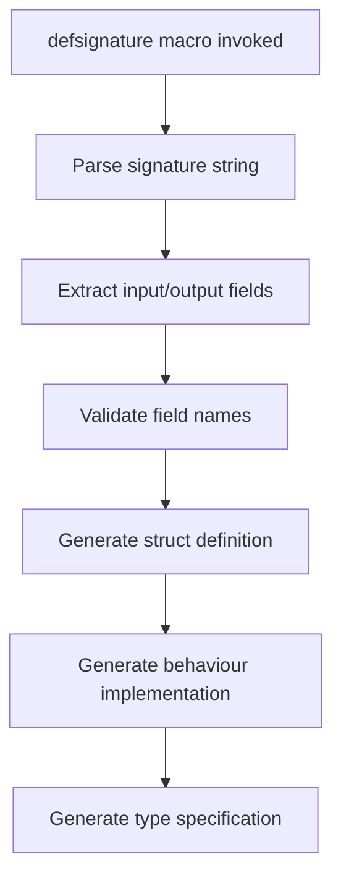
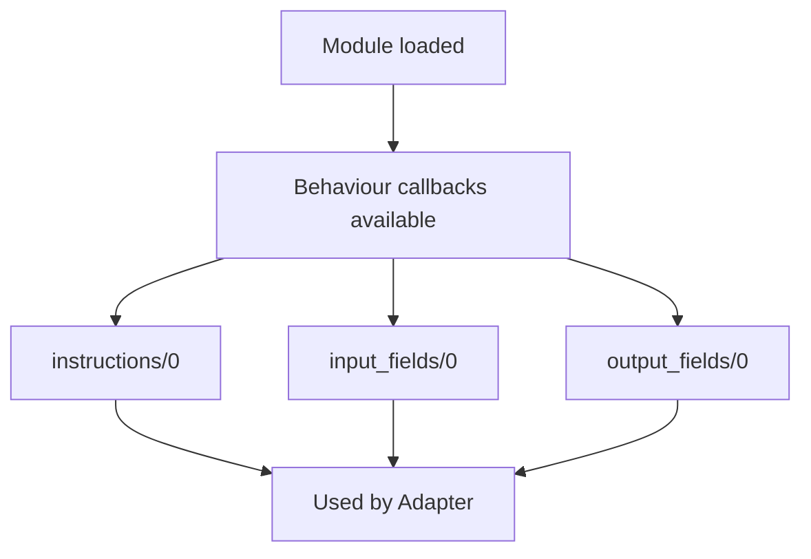

# DSPEx.Signature Technical Specification

## Overview

`DSPEx.Signature` is the foundational module that provides compile-time parsing and runtime representation of AI program contracts. It transforms string-based signature definitions into structured Elixir modules with type safety and introspection capabilities.

## Python DSPy Mapping

### Core Equivalencies

| DSPEx Component | Python DSPy Source | Lines | Purpose |
|----------------|-------------------|-------|---------|
| `use DSPEx.Signature` macro | `Signature()` constructor | `signatures/signature.py:150-180` | Module definition |
| `DSPEx.Signature.Parser` | `_parse_signature()` | `signatures/signature.py:250-280` | String parsing |
| Behaviour callbacks | Signature properties | `signatures/signature.py:85-110` | Runtime introspection |
| Field validation | `_validate_fields()` | `signatures/signature.py:300-350` | Compile-time checks |

### Specific Mappings

**Python DSPy Signature Creation:**
```python
# signatures/signature.py:150-180
class MySignature(dspy.Signature):
    """Answer questions with detailed reasoning."""
    question: str = dspy.InputField()
    answer: str = dspy.OutputField()
```

**DSPEx Equivalent:**
```elixir
defmodule MySignature do
  @moduledoc "Answer questions with detailed reasoning."
  use DSPEx.Signature, "question -> answer"
end
```

## Architecture

### Compile-Time Flow


### Runtime Flow


## Behaviour Definition

```elixir
defmodule DSPEx.Signature do
  @moduledoc """
  Defines the contract for DSPEx signature modules.
  
  Maps to Python DSPy's signature property system in 
  signatures/signature.py:85-110
  """
  
  @doc "Returns the instruction string for this signature"
  @callback instructions() :: String.t()
  
  @doc "Returns list of input field names as atoms"
  @callback input_fields() :: list(atom())
  
  @doc "Returns list of output field names as atoms" 
  @callback output_fields() :: list(atom())
  
  @doc "Returns all fields as a combined list"
  @callback fields() :: list(atom())
end
```

## Parser Implementation

### Core Parser Module
**Maps to**: `signatures/signature.py:250-280` - `_parse_signature()`

```elixir
defmodule DSPEx.Signature.Parser do
  @moduledoc false
  
  @doc """
  Parses signature string into input and output field lists.
  
  Equivalent to Python's _parse_signature() function.
  """
  @spec parse(String.t()) :: {list(atom()), list(atom())} | no_return()
  def parse(signature_string) when is_binary(signature_string) do
    signature_string
    |> String.trim()
    |> validate_format()
    |> split_signature()
    |> parse_fields()
    |> validate_fields()
  end
  
  # Validates basic format with arrow separator
  defp validate_format(str) do
    unless String.contains?(str, "->") do
      raise CompileError, 
        description: "DSPEx signature must contain '->' separator",
        file: __ENV__.file,
        line: __ENV__.line
    end
    str
  end
  
  # Splits on arrow, handles whitespace
  defp split_signature(str) do
    case String.split(str, "->", parts: 2) do
      [inputs_str, outputs_str] -> {String.trim(inputs_str), String.trim(outputs_str)}
      _ -> raise CompileError, description: "Invalid signature format"
    end
  end
  
  # Parses comma-separated field lists
  defp parse_fields({inputs_str, outputs_str}) do
    inputs = parse_field_list(inputs_str)
    outputs = parse_field_list(outputs_str)
    {inputs, outputs}
  end
  
  defp parse_field_list(""), do: []
  defp parse_field_list(str) do
    str
    |> String.split(",")
    |> Enum.map(&String.trim/1)
    |> Enum.reject(&(&1 == ""))
    |> Enum.map(&validate_field_name/1)
    |> Enum.map(&String.to_atom/1)
  end
  
  # Validates field names are valid Elixir atoms
  defp validate_field_name(name) do
    unless Regex.match?(~r/^[a-z][a-zA-Z0-9_]*$/, name) do
      raise CompileError,
        description: "Invalid field name '#{name}'. Must be valid Elixir atom.",
        file: __ENV__.file,
        line: __ENV__.line
    end
    name
  end
  
  # Validates no duplicate fields
  defp validate_fields({inputs, outputs}) do
    all_fields = inputs ++ outputs
    unique_fields = Enum.uniq(all_fields)
    
    if length(all_fields) != length(unique_fields) do
      duplicates = all_fields -- unique_fields
      raise CompileError,
        description: "Duplicate fields found: #{inspect(duplicates)}",
        file: __ENV__.file,
        line: __ENV__.line
    end
    
    {inputs, outputs}
  end
end
```

## Macro Implementation

**Maps to**: `signatures/signature.py:150-180` - Signature class creation

```elixir
defmodule DSPEx.Signature do
  @behaviour DSPEx.Signature
  
  defmacro __using__(signature_string) when is_binary(signature_string) do
    # Parse at compile time for efficiency
    {input_fields, output_fields} = DSPEx.Signature.Parser.parse(signature_string)
    all_fields = input_fields ++ output_fields
    
    quote do
      @behaviour DSPEx.Signature
      
      # Create struct with all fields, defaulting to nil
      defstruct unquote(all_fields |> Enum.map(&{&1, nil}))
      
      # Define type
      @type t :: %__MODULE__{}
      
      # Extract instructions from module doc at compile time
      @instructions (@moduledoc || "No instructions provided.")
      
      # Store field lists as module attributes for efficiency
      @input_fields unquote(input_fields)
      @output_fields unquote(output_fields)
      @all_fields unquote(all_fields)
      
      # Implement behaviour callbacks
      @impl DSPEx.Signature
      def instructions(), do: @instructions
      
      @impl DSPEx.Signature  
      def input_fields(), do: @input_fields
      
      @impl DSPEx.Signature
      def output_fields(), do: @output_fields
      
      @impl DSPEx.Signature
      def fields(), do: @all_fields
      
      # Convenience constructor
      def new(fields \\ %{}) when is_map(fields) do
        struct(__MODULE__, fields)
      end
      
      # Validation helper
      def validate_inputs(inputs) when is_map(inputs) do
        required_inputs = MapSet.new(@input_fields)
        provided_inputs = MapSet.new(Map.keys(inputs))
        
        case MapSet.difference(required_inputs, provided_inputs) do
          missing when map_size(missing) == 0 -> :ok
          missing -> {:error, {:missing_inputs, MapSet.to_list(missing)}}
        end
      end
      
      def validate_outputs(outputs) when is_map(outputs) do
        required_outputs = MapSet.new(@output_fields)
        provided_outputs = MapSet.new(Map.keys(outputs))
        
        case MapSet.difference(required_outputs, provided_outputs) do
          missing when map_size(missing) == 0 -> :ok  
          missing -> {:error, {:missing_outputs, MapSet.to_list(missing)}}
        end
      end
    end
  end
end
```

## Test Strategy

### Unit Tests

```elixir
defmodule DSPEx.SignatureTest do
  use ExUnit.Case, async: true
  
  describe "signature parsing" do
    test "parses simple input -> output" do
      assert DSPEx.Signature.Parser.parse("question -> answer") == 
        {[:question], [:answer]}
    end
    
    test "parses multiple inputs and outputs" do
      assert DSPEx.Signature.Parser.parse("question, context -> answer, confidence") ==
        {[:question, :context], [:answer, :confidence]}
    end
    
    test "handles whitespace gracefully" do
      assert DSPEx.Signature.Parser.parse("  question  ,  context  ->  answer  ") ==
        {[:question, :context], [:answer]}
    end
    
    test "raises on invalid format" do
      assert_raise CompileError, fn ->
        DSPEx.Signature.Parser.parse("invalid signature")
      end
    end
    
    test "raises on duplicate fields" do
      assert_raise CompileError, fn ->
        DSPEx.Signature.Parser.parse("question, question -> answer")
      end
    end
  end
  
  describe "generated signature modules" do
    defmodule TestSignature do
      @moduledoc "Test signature for unit testing"
      use DSPEx.Signature, "question, context -> answer, reasoning"
    end
    
    test "implements behaviour correctly" do
      assert TestSignature.instructions() == "Test signature for unit testing"
      assert TestSignature.input_fields() == [:question, :context]
      assert TestSignature.output_fields() == [:answer, :reasoning]
      assert TestSignature.fields() == [:question, :context, :answer, :reasoning]
    end
    
    test "creates valid struct" do
      sig = TestSignature.new(%{question: "What is 2+2?", context: "math"})
      assert %TestSignature{question: "What is 2+2?", context: "math"} = sig
    end
    
    test "validates inputs correctly" do
      assert TestSignature.validate_inputs(%{question: "test", context: "test"}) == :ok
      assert TestSignature.validate_inputs(%{question: "test"}) == 
        {:error, {:missing_inputs, [:context]}}
    end
  end
end
```

### Property Tests

```elixir
defmodule DSPEx.SignaturePropertyTest do
  use ExUnit.Case
  use PropCheck
  
  property "parsed signatures maintain field order" do
    forall {inputs, outputs} <- {field_list(), field_list()} do
      signature_string = "#{Enum.join(inputs, ", ")} -> #{Enum.join(outputs, ", ")}"
      {parsed_inputs, parsed_outputs} = DSPEx.Signature.Parser.parse(signature_string)
      
      Enum.map(inputs, &String.to_atom/1) == parsed_inputs and
      Enum.map(outputs, &String.to_atom/1) == parsed_outputs
    end
  end
  
  defp field_list() do
    non_empty(list(field_name()))
  end
  
  defp field_name() do
    let name <- non_empty(string()) do
      # Generate valid Elixir atom names
      "field_" <> String.replace(name, ~r/[^a-zA-Z0-9]/, "")
    end
  end
end
```

## Integration Points

### With DSPEx.Adapter
The Adapter will call signature behaviour methods:
```elixir
# In DSPEx.Adapter.Chat
def format(signature_module, inputs, demos) do
  instructions = signature_module.instructions()
  input_fields = signature_module.input_fields()
  output_fields = signature_module.output_fields()
  # ... use these for prompt formatting
end
```

### With DSPEx.Program  
Programs will reference signature modules:
```elixir
defmodule DSPEx.Predict do
  defstruct [:signature_module, :client, :adapter, demos: []]
  
  def forward(%__MODULE__{signature_module: sig_mod} = program, inputs) do
    # Validate inputs against signature
    :ok = sig_mod.validate_inputs(inputs)
    # ... proceed with execution
  end
end
```

## Performance Considerations

1. **Compile-Time Parsing**: All string parsing happens at compile time, zero runtime overhead
2. **Module Attributes**: Field lists stored as module attributes for O(1) access
3. **Struct Efficiency**: Generated structs use standard Elixir struct performance
4. **Memory Usage**: Minimal - only stores necessary field metadata

## Error Handling

1. **Compile-Time Errors**: Invalid signatures fail fast at compilation
2. **Runtime Validation**: Input/output validation with clear error messages  
3. **Type Safety**: Generated types enable dialyzer checking

This specification provides the foundation for all other DSPEx modules and can be tested in complete isolation.