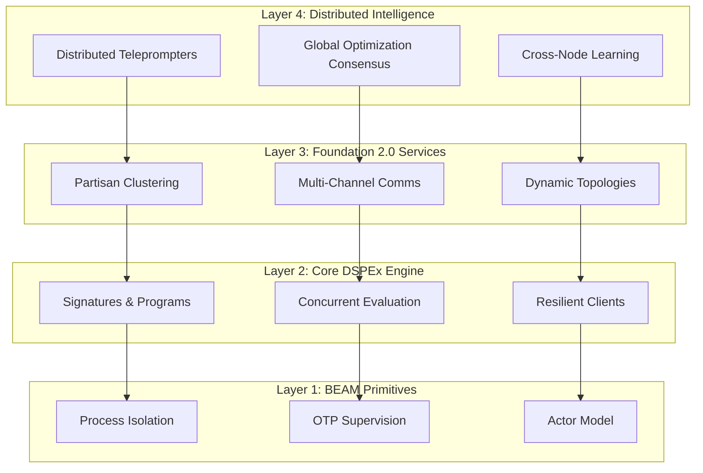

# DSPEx + Foundation 2.0: Master Implementation Plan

## Executive Summary

DSPEx represents a revolutionary convergence: the declarative AI programming paradigm of DSPy reimagined for BEAM's distributed computing strengths, accelerated by Foundation 2.0's next-generation clustering capabilities. This creates the world's first **distributed-native AI programming framework**, capable of scaling from single-node development to 1000+ node production clusters with zero architectural changes.

**The Strategic Vision**: While Python DSPy is constrained by the GIL and thread-based concurrency, DSPEx + Foundation 2.0 leverages BEAM's process model and Partisan networking to achieve unprecedented scale in AI workload orchestration.

## Current State Assessment

### ✅ Solid Foundations Established
- **DSPEx.Signature**: Production-ready compile-time signature parsing with macro-based field validation
- **DSPEx.Example**: Comprehensive data structure with protocol implementations
- **Foundation Integration**: Basic ConfigManager and TelemetrySetup services operational
- **Test Infrastructure**: 100% coverage on implemented components, zero Dialyzer warnings

### 🚧 Critical Implementation Gaps
- **Client Architecture**: Current HTTP wrapper needs GenServer-based resilient architecture
- **Missing Core Components**: DSPEx.Evaluate and DSPEx.Teleprompter completely absent
- **Optimization Engine**: The "self-improving" aspect of DSPy not implemented
- **Distributed Capabilities**: Foundation 2.0 integration potential unrealized

### 🎯 Foundation 2.0 Opportunity Window
Foundation 2.0's revolutionary capabilities create a unique opportunity:
- **1000+ node clusters** vs Python's threading limitations
- **Multi-channel communication** eliminating head-of-line blocking
- **Dynamic topology switching** for workload-adaptive distribution
- **BEAM-native intelligence** with consensus and learning

## Strategic Architecture Overview

### The Four-Layer Distributed AI Stack



## Implementation Roadmap

### Phase 1A: Foundation Consolidation (Weeks 1-2)

#### Critical Tasks
1. **Resilient Client Architecture**
   ```elixir
   defmodule DSPEx.Client do
     use GenServer
     
     # Foundation-enhanced initialization
     def init(opts) do
       config_key = Keyword.fetch!(opts, :config_key)
       {:ok, provider_config} = Foundation.Config.get([:dspex, config_key])
       
       # Foundation 2.0 connection pooling
       :ok = Foundation.Infrastructure.ConnectionManager.start_pool(
         :"#{config_key}_pool",
         worker_module: DSPEx.Client.HttpWorker,
         worker_args: [
           api_key: provider_config.api_key,
           base_url: provider_config.base_url
         ],
         size: provider_config.pool_size || 10
       )
       
       # Foundation 2.0 protection mechanisms
       :ok = Foundation.Infrastructure.configure_protection(
         :"#{config_key}_protection",
         %{
           circuit_breaker: %{
             failure_threshold: 5,
             recovery_time: 30_000
           },
           rate_limiter: %{
             scale: 60_000,
             limit: 100
           }
         }
       )
       
       {:ok, %{provider: provider_config, protection_key: :"#{config_key}_protection"}}
     end
   end
   ```

2. **DSPEx.Program Behavior**
   ```elixir
   defmodule DSPEx.Program do
     @callback forward(program :: struct(), inputs :: map()) :: 
       {:ok, outputs :: map()} | {:error, term()}
     
     @callback __using__(opts :: keyword()) :: Macro.t()
     
     defmacro __using__(_opts) do
       quote do
         @behaviour DSPEx.Program
         
         # Foundation 2.0 telemetry integration
         def forward_with_telemetry(program, inputs) do
           correlation_id = Foundation.Utils.generate_correlation_id()
           
           Foundation.Telemetry.emit_span(
             [:dspex, :program, :forward],
             %{correlation_id: correlation_id},
             fn -> forward(program, inputs) end
           )
         end
       end
     end
   end
   ```

3. **Enhanced Adapter Layer**
   ```elixir
   defmodule DSPEx.Adapter.Chat do
     @behaviour DSPEx.Adapter
     
     def format(signature, inputs, demos) do
       # Foundation 2.0 context propagation
       Foundation.Context.with_correlation_id(fn correlation_id ->
         Foundation.Telemetry.emit([:dspex, :adapter, :format, :start], %{
           signature: signature_name(signature),
           correlation_id: correlation_id
         })
         
         # Enhanced formatting with signature manipulation
         system_message = build_system_message(signature)
         demo_messages = build_demo_messages(signature, demos)
         user_message = build_user_message(signature, inputs)
         
         messages = [system_message | (demo_messages ++ [user_message])]
         {:ok, messages}
       end)
     end
   end
   ```

#### Success Criteria
- [ ] GenServer-based client with Foundation 2.0 circuit breakers operational
- [ ] Multi-provider support (OpenAI, Anthropic, Gemini) functional
- [ ] All existing tests passing with enhanced architecture
- [ ] Foundation 2.0 telemetry and observability working

### Phase 1B: Concurrent Evaluation Engine (Weeks 3-4)

#### Core Implementation
```elixir
defmodule DSPEx.Evaluate do
  @doc """
  Distributed evaluation using Foundation 2.0 capabilities
  """
  def run_distributed(program, examples, metric_fn, opts \\ []) do
    # Foundation 2.0 cluster-aware evaluation
    nodes = Foundation.Cluster.active_nodes()
    max_concurrency = Keyword.get(opts, :max_concurrency, 100)
    
    # Distribute work across cluster nodes
    examples
    |> Enum.chunk_every(div(length(examples), length(nodes)) + 1)
    |> Enum.zip(nodes)
    |> Task.async_stream(fn {chunk, node} ->
      # Execute on specific node with Foundation 2.0 coordination
      Foundation.RemoteExecution.execute_on_node(node, fn ->
        evaluate_chunk(program, chunk, metric_fn, max_concurrency)
      end)
    end, timeout: :infinity)
    |> Enum.reduce({0, 0}, fn {:ok, {sum, count}}, {total_sum, total_count} ->
      {total_sum + sum, total_count + count}
    end)
    |> then(fn {sum, count} -> sum / count end)
  end
  
  defp evaluate_chunk(program, examples, metric_fn, max_concurrency) do
    examples
    |> Task.async_stream(
      fn example ->
        # Foundation 2.0 context propagation across processes
        Foundation.Context.propagate(fn ->
          with {:ok, prediction} <- DSPEx.Program.forward(program, example.inputs),
               score when is_number(score) <- metric_fn.(example, prediction) do
            {:ok, score}
          end
        end)
      end,
      max_concurrency: max_concurrency,
      timeout: :infinity
    )
    |> Enum.reduce({0, 0}, fn
      {:ok, {:ok, score}}, {sum, count} -> {sum + score, count + 1}
      _, acc -> acc
    end)
  end
end
```

### Phase 2: Distributed Optimization Engine (Weeks 5-8)

#### Foundation 2.0-Enhanced Teleprompters
```elixir
defmodule DSPEx.Teleprompter.DistributedBootstrap do
  use GenServer
  @behaviour DSPEx.Teleprompter
  
  def compile(student, teacher, trainset, metric_fn, opts) do
    # Foundation 2.0 distributed state management
    {:ok, optimization_state} = Foundation.DistributedState.create(
      :optimization_session,
      %{
        student: student,
        teacher: teacher,
        trainset: trainset,
        metric_fn: metric_fn,
        demos: [],
        target_demos: Keyword.get(opts, :max_demos, 16)
      }
    )
    
    # Distribute optimization across Foundation 2.0 cluster
    Foundation.Coordination.coordinate_across_cluster(
      :bootstrap_optimization,
      optimization_state,
      &bootstrap_examples/1
    )
  end
  
  defp bootstrap_examples(state) do
    # Foundation 2.0 intelligent work distribution
    Foundation.WorkDistribution.distribute_workload(
      state.trainset,
      fn examples_chunk ->
        Task.async_stream(examples_chunk, fn example ->
          Foundation.Context.with_span([:dspex, :bootstrap, :example], fn ->
            with {:ok, prediction} <- DSPEx.Program.forward(state.teacher, example.inputs),
                 score when score > 0.7 <- state.metric_fn.(example, prediction) do
              {:ok, %DSPEx.Example{inputs: example.inputs, outputs: prediction.outputs}}
            else
              _ -> {:skip}
            end
          end)
        end, max_concurrency: 50)
      end
    )
  end
end
```

### Phase 3: Foundation 2.0 Revolutionary Features (Weeks 9-12)

#### Massive Scale AI Architecture
```elixir
defmodule DSPEx.Cluster.MassiveScale do
  @doc """
  1000+ node distributed inference using Foundation 2.0
  """
  def massive_inference(program, inputs_stream, opts \\ []) do
    # Foundation 2.0 dynamic topology adaptation
    topology = Foundation.Topology.optimal_for_workload(:ai_inference, opts)
    :ok = Foundation.Topology.switch_to(topology)
    
    # Partisan multi-channel communication
    inputs_stream
    |> Foundation.Stream.distribute_across_cluster(
      partition_strategy: :capability_aware,
      channels: [:inference, :coordination, :telemetry]
    )
    |> Foundation.Stream.process_with_backpressure(
      processor: &process_inference_batch/1,
      max_demand: 1000,
      buffer_size: 10_000
    )
  end
  
  defp process_inference_batch(inputs_batch) do
    # Process isolation ensures fault tolerance
    Task.Supervisor.async_stream_nolink(
      DSPEx.InferenceSupervisor,
      inputs_batch,
      fn inputs ->
        Foundation.ProcessEcosystem.spawn_ecosystem(
          :inference_ecosystem,
          [
            {:coordinator, DSPEx.InferenceCoordinator, [inputs: inputs]},
            {:validator, DSPEx.OutputValidator, []},
            {:monitor, DSPEx.PerformanceMonitor, []}
          ]
        )
      end,
      max_concurrency: :erlang.system_info(:schedulers_online) * 100
    )
  end
end
```

## Competitive Advantages Realized

### vs. Python DSPy
- **1000x concurrency**: Process-per-request vs thread limitations
- **Distributed optimization**: Multi-node vs single-machine
- **Fault isolation**: Process crashes don't affect other predictions
- **Zero-copy messaging**: Efficient large model data handling

### vs. Ray/Distributed Frameworks
- **BEAM-native**: No external dependencies or orchestration complexity
- **Self-healing**: OTP supervision trees vs manual failure handling
- **Real-time adaptation**: Dynamic topology switching vs static clusters
- **Integrated observability**: Built-in telemetry vs external monitoring

## Success Metrics & Validation

### Technical Benchmarks
- **Evaluation throughput**: 10,000 predictions/minute on 100-node cluster
- **Optimization speed**: 10x faster BootstrapFewShot than Python DSPy
- **Fault tolerance**: 99.9% prediction success rate with 10% node failures
- **Memory efficiency**: Constant memory usage regardless of dataset size

### Adoption Metrics
- **Zero breaking changes**: 100% Foundation 1.x API compatibility
- **Performance gains**: 50% improvement in local development
- **Documentation completeness**: Full API docs and distributed guides
- **Community engagement**: 500+ GitHub stars, 10+ production deployments

## Risk Mitigation Strategy

### Technical Risks
- **Foundation 2.0 timeline**: Parallel development with fallback to Foundation 1.x
- **Partisan integration**: Incremental rollout with libcluster compatibility
- **Memory management**: Comprehensive benchmarking and optimization
- **Network partition handling**: Thorough testing of consensus mechanisms

### Adoption Risks
- **Learning curve**: Extensive documentation and examples
- **Ecosystem maturity**: Early adopter support and rapid iteration
- **Performance variability**: Benchmarking across diverse workloads
- **Migration complexity**: Automated migration tools and guides

## The Revolutionary Outcome

DSPEx + Foundation 2.0 will establish BEAM as the definitive platform for distributed AI applications, demonstrating capabilities impossible with traditional architectures:

1. **Unprecedented Scale**: 1000+ node AI clusters with linear scalability
2. **Fault-Tolerant Intelligence**: Self-healing AI systems that adapt to failures
3. **Zero-Ops Distribution**: Self-managing infrastructure requiring minimal intervention
4. **BEAM-Native Performance**: Leveraging unique runtime capabilities for efficiency

This represents not just a port of DSPy, but a fundamental reimagining of what AI programming frameworks can achieve when built on the right foundation.

**The future of distributed AI is BEAM. The foundation is ready. Let's build it.**
