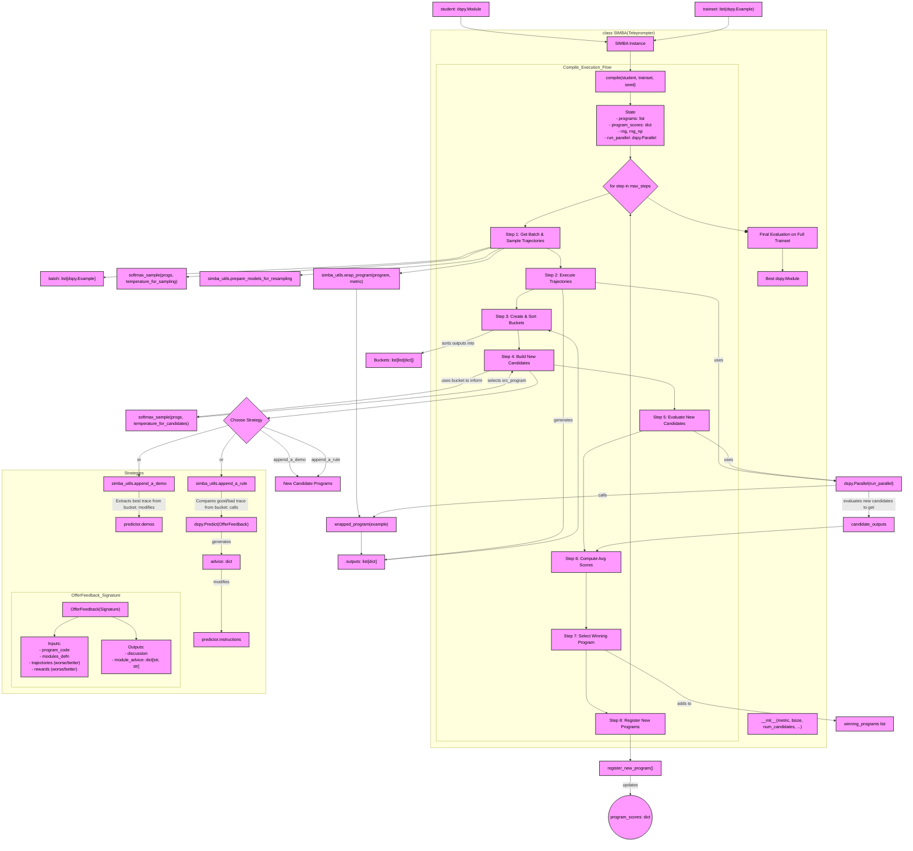

This is a great request. Based on the provided codebase, here is a detailed Mermaid diagram that illustrates the `SIMBA` (Stochastic Introspective Mini-Batch Ascent) optimizer as a monolithic entity, showing its core components, control flow, and connections to other parts of the system down to the function and variable level.

### Diagram Explanation

This diagram visualizes the `SIMBA` teleprompter's `compile` method, which is its main entry point for optimizing a DSPy program (`student`). The process is iterative and can be broken down into several key stages:

1.  **Initialization**: The `compile` method starts by initializing its state, including a pool of `programs` (starting with the initial `student`), a `program_scores` tracker, and a parallel executor.

2.  **Main Optimization Loop**: The process iterates for `max_steps`. Each step is a mini-batch ascent.
    *   **Step 1: Trajectory Sampling**: For each example in the current mini-batch, SIMBA samples multiple "trajectories." It prepares slightly different Language Models (LMs) using `prepare_models_for_resampling` and selects a program from its pool using `softmax_sample` based on past performance. Each program is then wrapped using `wrap_program` to ensure its execution is scored by the provided `metric`.
    *   **Step 2: Parallel Execution**: The generated program-example pairs are executed in parallel using `dspy.Parallel`. This step generates a rich set of traces and scores.
    *   **Step 3: Introspection (Bucketing)**: The results are grouped into "buckets," one for each unique training example. These buckets, containing both successful and unsuccessful trajectories, are sorted to identify the most informative examples for learning.
    *   **Step 4: Candidate Generation**: SIMBA generates new candidate programs. It first selects a high-performing "source" program from its pool (again, via `softmax_sample`). Then, it randomly chooses a strategy (`append_a_demo` or `append_a_rule`) and applies it to an informative bucket, modifying the source program to create a new candidate.
        *   The `append_a_demo` strategy extracts a successful trace from the bucket and adds it as a few-shot example.
        *   The `append_a_rule` strategy uses the `OfferFeedback` signature to compare a good and a bad trajectory, generating a natural language "rule" (advice) that gets appended to a predictor's instructions.
    *   **Steps 5-8: Evaluation & Selection**: The newly generated candidate programs are evaluated on the same mini-batch. The best-performing one is added to a list of `winning_programs`. All new candidates and their scores are registered back into the main program pool, improving the diversity and quality of options for the next iteration.

3.  **Final Evaluation**: After all optimization steps are complete, SIMBA performs a final, comprehensive evaluation of all "winning" programs on the entire training set to select and return the single best-performing program.

This entire process enables SIMBA to iteratively refine a DSPy program by exploring different prompt structures (demos and instructions) and using introspection to learn from its successes and failures on a mini-batch basis.

---

### Mermaid Diagram Code

