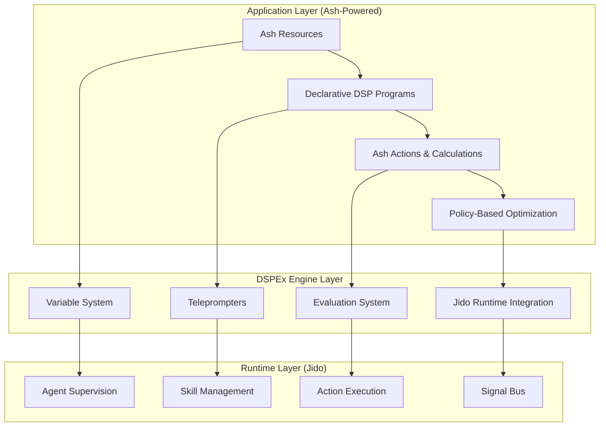
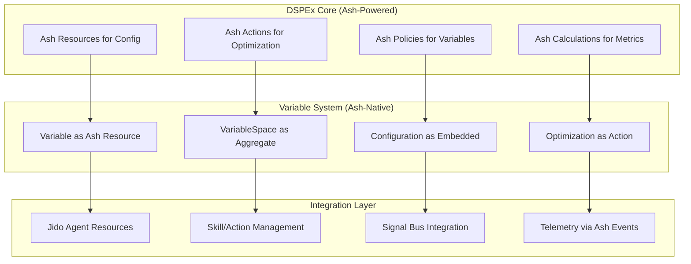

# Ash Framework Integration Analysis for DSPEx

## Executive Summary

After analyzing the extensive DSPEx integration documentation, variable system designs, and Jido integration proposals, this document evaluates two approaches for integrating Ash Framework into the DSPEx ecosystem:

1. **"Build on Top" Approach**: Ash as a higher-level declarative framework sitting above DSPEx
2. **"Build In Now" Approach**: Ash as a first-class citizen integrated into DSPEx's core architecture

**Recommendation**: **Hybrid approach with strategic timing** - Begin with core Ash Resource modeling for configuration management (Build In Now for foundations), then expand to full declarative framework capabilities (Build on Top for applications).

## Context: Current DSPEx Landscape Analysis

### 🎯 **Completed Foundation (Strong)**
- **Core SIMBA Algorithm**: Fully functional optimization teleprompter
- **11 Integration Documents**: 1,400+ pages of comprehensive blueprints
- **Variable System Design**: Revolutionary universal parameter optimization
- **Testing Infrastructure**: Mox-based with MockHelpers

### 🔄 **Active Development Areas**
- **Variable System Implementation**: Two competing approaches (Cursor vs Claude Code)
- **7 Missing Integration Documents**: RETRIEVE, TELEPROMPT, STREAMING, etc.
- **Jido Integration Strategy**: Runtime evolution from standalone to agent-based architecture

### 🚀 **Strategic Innovation Opportunities**
- **Universal Variable Optimization**: Auto-discovery of optimal adapter/module combinations
- **Jido Runtime Integration**: DSPEx as "compiler", Jido as robust runtime engine
- **BAML-Inspired Static Analysis**: Compile-time safety and IDE integration

## Ash Framework Integration Approaches

### Approach 1: "Build on Top" - Ash as Higher-Level Framework

#### Architecture Overview



#### Implementation Strategy

**Phase 1: Declarative Program Definition**
```elixir
defmodule MyApp.Resources.DSPProgram do
  use Ash.Resource,
    domain: MyApp.Domain,
    data_layer: Ash.DataLayer.Ets  # Or Mnesia for persistence

  attributes do
    uuid_primary_key :id
    attribute :name, :string, allow_nil?: false
    attribute :description, :string
    
    # DSPEx configuration as embedded resources
    attribute :signature_config, MyApp.Types.SignatureConfig
    attribute :variable_config, MyApp.Types.VariableConfig
    attribute :optimization_settings, MyApp.Types.OptimizationSettings
  end

  relationships do
    has_many :optimization_runs, MyApp.Resources.OptimizationRun
    has_many :evaluations, MyApp.Resources.Evaluation
    belongs_to :template, MyApp.Resources.ProgramTemplate
  end

  actions do
    defaults [:create, :read, :update, :destroy]
    
    create :from_template do
      argument :template_id, :uuid, allow_nil?: false
      argument :overrides, :map, default: %{}
    end
    
    update :optimize do
      argument :training_data, {:array, :map}, allow_nil?: false
      argument :metric_function, :string, allow_nil?: false
      argument :teleprompter, :atom, default: :simba
    end
  end

  calculations do
    calculate :current_performance, :decimal, expr(
      # Complex calculation using evaluation history
      fragment("SELECT AVG(score) FROM evaluations WHERE program_id = ?", id)
    )
    
    calculate :optimization_status, :atom do
      # Real-time optimization status
      MyApp.Calculations.OptimizationStatus
    end
  end

  policies do
    policy always() do
      authorize_if always()
    end
  end

  changes do
    change after_action(&trigger_optimization/3), on: [:optimize]
    change after_action(&invalidate_cache/3), on: [:update]
  end

  defp trigger_optimization(changeset, record, _context) do
    # Async optimization using DSPEx
    Task.Supervisor.start_child(MyApp.TaskSupervisor, fn ->
      DSPEx.Teleprompter.SIMBA.compile(
        convert_to_dspex_program(record),
        changeset.arguments.training_data,
        resolve_metric_function(changeset.arguments.metric_function)
      )
    end)
    
    {:ok, record}
  end
end
```

**Phase 2: Advanced Declarative Features**
```elixir
defmodule MyApp.Resources.OptimizationPipeline do
  use Ash.Resource,
    domain: MyApp.Domain

  attributes do
    uuid_primary_key :id
    attribute :name, :string
    attribute :stages, {:array, MyApp.Types.PipelineStage}
    attribute :parallel_execution, :boolean, default: false
    attribute :auto_retry, :boolean, default: true
  end

  actions do
    action :execute_pipeline, :map do
      argument :input_programs, {:array, :uuid}
      argument :execution_options, :map, default: %{}
      
      run MyApp.Actions.ExecutePipeline
    end
    
    action :analyze_performance, :map do
      run MyApp.Actions.AnalyzePerformance
    end
  end

  preparations do
    prepare MyApp.Preparations.ValidatePipeline
    prepare MyApp.Preparations.CheckResourceAvailability
  end
end
```

#### Benefits of "Build on Top"
1. **Rapid Application Development**: Declarative resources eliminate boilerplate
2. **Rich Query Interface**: Ash's query capabilities for optimization history, analysis
3. **Policy-Based Security**: Fine-grained access control for optimization resources
4. **Real-time Features**: Built-in PubSub for optimization status updates
5. **API Generation**: Automatic REST/GraphQL APIs for DSP program management
6. **Data Validation**: Comprehensive validation with detailed error messages

#### Challenges of "Build on Top"
1. **Additional Layer Complexity**: Another abstraction to learn and maintain
2. **Performance Overhead**: Additional indirection for simple operations
3. **Limited Integration**: Ash features may not map cleanly to DSPEx concepts
4. **Migration Complexity**: Existing DSPEx code needs significant refactoring

---

### Approach 2: "Build In Now" - Ash as First-Class Citizen

#### Architecture Overview



#### Core Implementation

**DSPEx Variable as Ash Resource**
```elixir
defmodule DSPEx.Variable do
  use Ash.Resource,
    domain: DSPEx.Domain,
    data_layer: Ash.DataLayer.Ets

  attributes do
    uuid_primary_key :id
    attribute :name, :atom, allow_nil?: false
    attribute :type, DSPEx.Types.VariableType, allow_nil?: false
    attribute :default_value, :union, types: [
      :string, :integer, :float, :boolean, :atom, :map
    ]
    attribute :constraints, DSPEx.Types.VariableConstraints
    attribute :description, :string
    attribute :metadata, :map, default: %{}
  end

  relationships do
    belongs_to :variable_space, DSPEx.VariableSpace
    has_many :configurations, DSPEx.VariableConfiguration
    has_many :evaluations, DSPEx.VariableEvaluation
  end

  validations do
    validate match(:type, ~r/^(float|integer|choice|module|boolean)$/), 
      message: "must be a valid variable type"
    
    validate DSPEx.Validations.ConstraintsMatchType,
      attributes: [:type, :constraints]
      
    validate DSPEx.Validations.DefaultValueMatchesConstraints,
      attributes: [:default_value, :constraints, :type]
  end

  actions do
    defaults [:create, :read, :update, :destroy]
    
    action :sample_value, DSPEx.Types.VariableValue do
      argument :strategy, :atom, default: :uniform
      argument :bias_data, :map, default: %{}
      
      run DSPEx.Actions.SampleVariableValue
    end
    
    action :validate_value, :boolean do
      argument :value, :union, types: [:string, :integer, :float, :boolean, :atom]
      
      run DSPEx.Actions.ValidateVariableValue
    end
  end

  calculations do
    calculate :sample_history, {:array, :map} do
      # Recent sampling history for this variable
      DSPEx.Calculations.SampleHistory
    end
    
    calculate :performance_correlation, :float do
      # Correlation between this variable's values and overall performance
      DSPEx.Calculations.PerformanceCorrelation
    end
  end

  policies do
    policy always() do
      authorize_if always()  # For now - would add real policies later
    end
  end
end
```

**DSPEx Program Integration**
```elixir
defmodule DSPEx.Program do
  use Ash.Resource,
    domain: DSPEx.Domain

  attributes do
    uuid_primary_key :id
    attribute :signature, DSPEx.Types.Signature
    attribute :examples, {:array, DSPEx.Types.Example}, default: []
    attribute :variable_config, :map, default: %{}
    attribute :optimization_metadata, :map, default: %{}
  end

  relationships do
    belongs_to :variable_space, DSPEx.VariableSpace
    has_many :optimization_runs, DSPEx.OptimizationRun
  end

  actions do
    action :forward, DSPEx.Types.Output do
      argument :inputs, :map, allow_nil?: false
      argument :opts, :map, default: %{}
      
      run DSPEx.Actions.Forward
    end
    
    action :optimize, DSPEx.Program do
      argument :training_data, {:array, :map}, allow_nil?: false
      argument :metric_fn, :string, allow_nil?: false
      argument :teleprompter, :atom, default: :simba
      argument :variable_optimization, :boolean, default: true
      
      run DSPEx.Actions.Optimize
    end
  end

  calculations do
    calculate :current_performance, :float do
      DSPEx.Calculations.CurrentPerformance
    end
    
    calculate :variable_importance, {:array, :map} do
      DSPEx.Calculations.VariableImportance
    end
  end
end
```

**Variable Space as Ash Aggregate**
```elixir
defmodule DSPEx.VariableSpace do
  use Ash.Resource,
    domain: DSPEx.Domain

  attributes do
    uuid_primary_key :id
    attribute :name, :string
    attribute :dependencies, :map, default: %{}
    attribute :constraints, {:array, :map}, default: []
    attribute :optimization_hints, :map, default: %{}
  end

  relationships do
    has_many :variables, DSPEx.Variable
    has_many :configurations, DSPEx.VariableConfiguration
  end

  actions do
    action :generate_configuration, DSPEx.VariableConfiguration do
      argument :strategy, :atom, default: :random
      argument :constraints, :map, default: %{}
      
      run DSPEx.Actions.GenerateConfiguration
    end
    
    action :validate_configuration, :boolean do
      argument :configuration, :map, allow_nil?: false
      
      run DSPEx.Actions.ValidateConfiguration
    end
  end

  calculations do
    calculate :search_space_size, :integer do
      DSPEx.Calculations.SearchSpaceSize
    end
    
    calculate :optimization_feasibility, :float do
      DSPEx.Calculations.OptimizationFeasibility
    end
  end
end
```

#### Integration with Variable System
```elixir
defmodule DSPEx.Actions.Optimize do
  use Ash.Resource.Actions.Implementation

  def run(input, opts, context) do
    program = input.resource
    
    # Use Ash queries to load related data
    program_with_space = 
      program
      |> Ash.load!(:variable_space)
      |> Ash.load!(variable_space: :variables)
    
    # Variable-aware optimization using Ash resources
    case program_with_space.variable_space do
      nil ->
        # Standard optimization without variables
        standard_optimize(program, input.arguments, opts)
        
      variable_space ->
        # Variable-aware optimization
        variable_aware_optimize(program, variable_space, input.arguments, opts)
    end
  end

  defp variable_aware_optimize(program, variable_space, args, opts) do
    # Generate candidate configurations using Ash actions
    configurations = 
      1..args.num_candidates
      |> Enum.map(fn _ ->
        DSPEx.VariableSpace.generate_configuration!(variable_space, 
          strategy: :smart_sampling
        )
      end)
    
    # Evaluate configurations in parallel
    evaluated_configs = 
      configurations
      |> Task.async_stream(fn config ->
        evaluate_configuration(program, config, args.training_data, args.metric_fn)
      end, max_concurrency: 4)
      |> Enum.map(fn {:ok, result} -> result end)
    
    # Select best configuration and update program
    best_config = select_best_configuration(evaluated_configs)
    
    # Update program using Ash update action
    DSPEx.Program.update!(program, %{
      variable_config: best_config.configuration,
      optimization_metadata: best_config.metadata
    })
  end
end
```

#### Benefits of "Build In Now"
1. **Native Integration**: Variable system naturally leverages Ash's data modeling
2. **Consistent API**: All DSPEx operations follow Ash patterns
3. **Advanced Querying**: Rich queries across variables, configurations, optimizations
4. **Built-in Validation**: Comprehensive constraint validation with clear errors
5. **Change Tracking**: Automatic audit trails for all optimization changes
6. **Policy Integration**: Fine-grained access control throughout the system
7. **Event System**: Ash's built-in notifications for optimization events

#### Challenges of "Build In Now"
1. **Learning Curve**: Team needs Ash expertise from day one
2. **Architectural Complexity**: More complex core architecture
3. **Performance Considerations**: Ash overhead for simple operations
4. **Migration Risk**: Significant refactoring of existing DSPEx code
5. **Dependency Weight**: Heavy framework dependency in core system

---

## Critical Analysis: Innovation vs Overengineering

### 🚀 **High Innovation, Manageable Risk**

#### Variable System + Ash Resources
**Innovation**: Using Ash resources for variable definition enables:
- **Declarative variable constraints** with built-in validation
- **Rich querying** of optimization history and variable performance
- **Policy-based access control** for variable modifications
- **Automatic API generation** for variable management

**Risk Mitigation**: Start with simple Ash resources, gradually add complexity

#### Jido Integration Strategy  
**Innovation**: The architectural insight from Jido docs is brilliant:
- **DSPEx as "compiler"** optimizing Jido agent configurations
- **Jido as "runtime"** handling execution, state, supervision
- **Clean separation of concerns** - optimization vs execution

**Risk**: Well-contained since Jido integration can be phased

### ⚖️ **High Innovation, Higher Risk**

#### BAML-Inspired Static Analysis
**Innovation**: Compile-time validation and IDE integration:
```elixir
defmodule DSPEx.StaticAnalysis do
  def validate_program(program) do
    # Static analysis using Ash resource introspection
    program
    |> validate_signature_compatibility()
    |> validate_variable_constraints()
    |> validate_optimization_feasibility()
  end
end
```

**Risk**: Significant complexity for uncertain user demand

#### Full Declarative Framework (Build on Top)
**Innovation**: Complete declarative DSP programming:
```elixir
defmodule MyApp.DSP do
  use DSPEx.Framework
  
  program :qa_system do
    signature MySignatures.QuestionAnswering
    variables do
      choice :adapter, [:json, :markdown]
      float :temperature, range: {0.1, 1.5}
    end
    optimize_with :simba, examples: @training_data
  end
end
```

**Risk**: May be overengineering for many use cases

### ⚠️ **Potential Overengineering**

#### Complete DSPy Feature Parity
The 18 integration documents may be excessive - focus on user-driven demand:
- **Tier 1 (Essential)**: RETRIEVE, TELEPROMPT, STREAMING  
- **Tier 2 (Valuable)**: DATASETS, UTILS
- **Tier 3 (Nice-to-have)**: EXPERIMENTAL, PROPOSE

## Recommended Hybrid Approach

### Phase 1: Strategic Foundation (Months 1-2)
**"Build In Now" for Core Infrastructure**

```elixir
# Start with Ash resources for configuration management
defmodule DSPEx.Configuration do
  use Ash.Resource, domain: DSPEx.Domain
  
  # Model program configurations as Ash resources
  # Leverage Ash validation, queries, policies
  # Keep existing DSPEx.Program API intact
end

defmodule DSPEx.Variable do
  use Ash.Resource, domain: DSPEx.Domain
  
  # Core variable system as Ash resource
  # Rich constraint validation
  # Performance tracking via calculations
end
```

**Benefits**:
- Immediate improvement in configuration management
- Foundation for advanced features
- Minimal disruption to existing code
- Team learns Ash incrementally

### Phase 2: Enhanced Integration (Months 3-4)  
**Expand Ash Integration into Variable System**

```elixir
defmodule DSPEx.Program do
  # Gradually migrate to Ash-backed program representation
  # Maintain backward compatibility
  # Add variable optimization via Ash actions
end
```

### Phase 3: Application Framework (Months 5-6)
**"Build on Top" for Advanced Applications**

```elixir
defmodule DSPEx.Framework do
  # Higher-level declarative macros
  # Built on proven Ash+DSPEx foundation
  # Optional for users who want declarative experience
end
```

### Phase 4: Ecosystem Completion (Months 7+)
**Complete Integration Based on User Feedback**

- Full Jido runtime integration
- BAML-inspired static analysis (if user demand exists)
- Advanced declarative features (based on usage patterns)

## Integration with Variable System Design

The Variable system we designed earlier fits naturally with Ash:

```elixir
# Variable definition becomes an Ash resource
variable = DSPEx.Variable.create!(%{
  name: :adapter,
  type: :choice,
  constraints: %{choices: [:json_tool, :markdown_tool]}
})

# Variable spaces become Ash aggregates
space = DSPEx.VariableSpace.create!(%{name: "program_optimization"})
DSPEx.VariableSpace.add_variable!(space, variable)

# Optimization becomes an Ash action with rich querying
results = DSPEx.Program.optimize!(program, 
  training_data: data,
  metric_fn: &my_metric/2,
  variable_optimization: true
)

# Query optimization history with Ash
recent_optimizations = 
  DSPEx.OptimizationRun
  |> Ash.Query.filter(program_id == ^program.id)
  |> Ash.Query.sort(inserted_at: :desc)
  |> Ash.Query.limit(10)
  |> Ash.read!()
```

## Conclusion

**Recommended Strategy**: **Hybrid approach with Ash as a strategic foundation**

1. **Start with "Build In Now"** for configuration and variable management
2. **Maintain existing DSPEx APIs** during transition
3. **Add "Build on Top"** declarative features based on user demand
4. **Leverage Ash's strengths** (validation, queries, policies) for complex optimization scenarios
5. **Keep escape hatches** for users who prefer direct DSPEx APIs

This approach provides the benefits of both strategies while managing risk through incremental adoption. Ash's resource modeling is particularly well-suited for the complex configuration and variable management that DSPEx requires, while the declarative framework capabilities can be added as the ecosystem matures.

The key insight is that Ash doesn't need to be all-or-nothing - its resource and domain modeling can provide immediate value for DSPEx's configuration complexity, while the full framework features can be optional additions for users who want a more declarative experience.