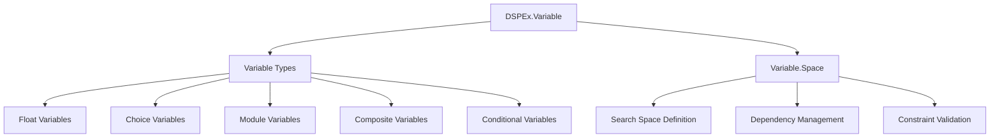
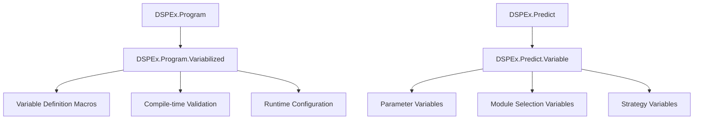
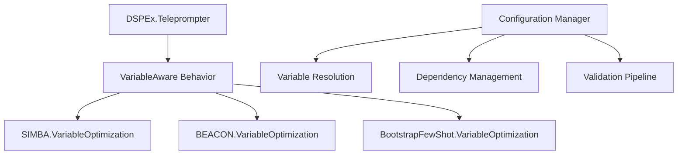
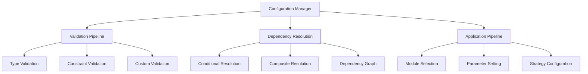
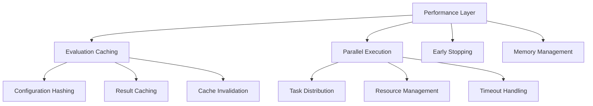
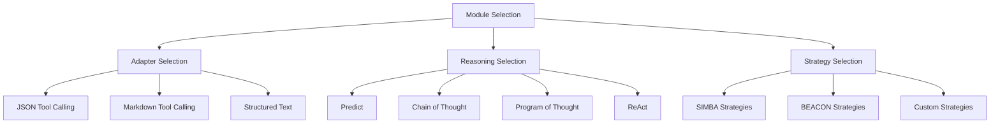
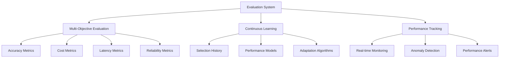

# DSPEx Variable System Technical Architecture

## Architecture Overview

The DSPEx Variable System represents a comprehensive framework for automatic parameter optimization that decouples parameter definition from optimization algorithms. This architecture enables any optimizer to tune any discrete parameter, fulfilling the vision articulated by the DSPy community for intelligent module and parameter selection.

### Core Architectural Principles

1. **Separation of Concerns**: Variable definitions are separate from optimization logic
2. **Optimizer Agnostic**: Any optimizer can work with any variable type
3. **Type Safety**: Compile-time and runtime validation of parameter configurations
4. **Performance Optimized**: Caching, parallelization, and early stopping built-in
5. **Extensible**: New variable types and optimizers integrate seamlessly

## System Components

### 1. Variable Definition Layer



#### 1.1 Variable Type System

```elixir
# Core variable structure
defmodule DSPEx.Variable do
  @type variable_type :: :float | :integer | :choice | :module | :struct | :boolean | :conditional | :composite

  defstruct [
    :name,                    # Unique identifier
    :type,                    # Variable type from @type above
    :default,                 # Default value
    :constraints,             # Type-specific constraints
    :description,             # Human-readable description
    :dependencies,            # Variable dependencies
    :metadata,                # Additional metadata
    :validation_fn,           # Custom validation function
    :transform_fn            # Value transformation function
  ]
end
```

#### 1.2 Variable Space Management

```elixir
defmodule DSPEx.Variable.Space do
  defstruct [
    :variables,               # Map: variable_name => Variable
    :dependencies,            # Dependency graph
    :constraints,             # Cross-variable constraints
    :metadata,                # Space-level metadata
    :validation_rules,        # Validation rule set
    :optimization_hints      # Hints for optimizers
  ]

  # Key operations
  def new(variables \\ [])
  def add_variable(space, variable)
  def remove_variable(space, variable_name)
  def add_dependency(space, from_var, to_var, condition)
  def validate_space(space)
  def get_search_dimensions(space)
end
```

### 2. Program Integration Layer



#### 2.1 Program Enhancement

```elixir
defmodule DSPEx.Program.Variabilized do
  @moduledoc """
  Extends any DSPEx program with variable definition capabilities
  """

  defmacro __using__(_opts) do
    quote do
      import DSPEx.Variable
      
      Module.register_attribute(__MODULE__, :variables, accumulate: true)
      
      @before_compile DSPEx.Program.Variabilized
      
      # Variable definition macro
      defmacro variable(name, type, opts \\ []) do
        quote do
          @variables {unquote(name), unquote(type), unquote(opts)}
        end
      end
    end
  end

  defmacro __before_compile__(env) do
    variables = Module.get_attribute(env.module, :variables, [])
    
    quote do
      def __variables__ do
        unquote(variables)
        |> Enum.map(fn {name, type, opts} ->
          DSPEx.Variable.new(name, type, opts)
        end)
      end
      
      def variable_space do
        DSPEx.Variable.Space.new(__variables__())
      end
      
      def with_variable_config(config) do
        %{__struct__: __MODULE__, variable_config: config}
      end
    end
  end
end
```

### 3. Optimizer Integration Layer



#### 3.1 Universal Optimizer Interface

```elixir
defmodule DSPEx.Teleprompter.VariableAware do
  @callback run_variable_optimization(
    program :: DSPEx.Program.t(),
    training_data :: list(),
    metric_fn :: function(),
    context :: map(),
    opts :: keyword()
  ) :: {:ok, DSPEx.Program.t(), map()} | {:error, term()}

  defmacro __using__(_opts) do
    quote do
      @behaviour DSPEx.Teleprompter.VariableAware
      
      def compile_with_variables(program, training_data, metric_fn, opts \\ []) do
        case extract_variable_space(program, opts) do
          %{variables: variables} when map_size(variables) == 0 ->
            # No variables, use standard optimization
            compile(program, training_data, metric_fn, opts)
            
          variable_space ->
            # Variable-aware optimization
            context = create_optimization_context(variable_space, opts)
            run_variable_optimization(program, training_data, metric_fn, context, opts)
        end
      end
      
      # Implement in each optimizer
      def run_variable_optimization(program, training_data, metric_fn, context, opts) do
        raise "Must implement run_variable_optimization/5"
      end
      
      defoverridable [run_variable_optimization: 5]
    end
  end
end
```

### 4. Configuration Management Layer



#### 4.1 Configuration Validation Pipeline

```elixir
defmodule DSPEx.Variable.ValidationPipeline do
  @moduledoc """
  Multi-stage validation pipeline for variable configurations
  """

  def validate_configuration(config, variable_space) do
    config
    |> validate_required_variables(variable_space)
    |> validate_variable_types(variable_space)
    |> validate_constraints(variable_space)
    |> validate_dependencies(variable_space)
    |> validate_custom_rules(variable_space)
  end

  defp validate_required_variables(config, variable_space) do
    required = get_required_variables(variable_space)
    missing = required -- Map.keys(config)
    
    if length(missing) > 0 do
      {:error, {:missing_variables, missing}}
    else
      {:ok, config}
    end
  end

  defp validate_variable_types({:ok, config}, variable_space) do
    validation_results = 
      config
      |> Enum.map(fn {name, value} ->
        variable = variable_space.variables[name]
        validate_single_variable_type(variable, value)
      end)
    
    case Enum.find(validation_results, fn result -> match?({:error, _}, result) end) do
      nil -> {:ok, config}
      error -> error
    end
  end

  defp validate_constraints({:ok, config}, variable_space) do
    constraint_results =
      config
      |> Enum.map(fn {name, value} ->
        variable = variable_space.variables[name]
        validate_variable_constraints(variable, value)
      end)
    
    case Enum.find(constraint_results, fn result -> match?({:error, _}, result) end) do
      nil -> {:ok, config}
      error -> error
    end
  end
end
```

### 5. Performance Optimization Layer



#### 5.1 Intelligent Caching System

```elixir
defmodule DSPEx.Variable.CachingSystem do
  @moduledoc """
  Intelligent caching for variable configuration evaluations
  """

  defstruct [
    :cache_table,             # ETS table for fast access
    :hash_function,           # Configuration hashing function
    :ttl_seconds,             # Time-to-live for cache entries
    :max_entries,             # Maximum cache size
    :hit_counter,             # Cache hit statistics
    :miss_counter            # Cache miss statistics
  ]

  def new(opts \\ []) do
    cache_table = :ets.new(:variable_cache, [
      :set, 
      :public, 
      {:read_concurrency, true},
      {:write_concurrency, true}
    ])
    
    %__MODULE__{
      cache_table: cache_table,
      hash_function: Keyword.get(opts, :hash_function, &default_hash/1),
      ttl_seconds: Keyword.get(opts, :ttl_seconds, 3600),
      max_entries: Keyword.get(opts, :max_entries, 10_000),
      hit_counter: :counters.new(1, []),
      miss_counter: :counters.new(1, [])
    }
  end

  def get_cached_evaluation(cache, configuration) do
    config_hash = cache.hash_function.(configuration)
    
    case :ets.lookup(cache.cache_table, config_hash) do
      [{^config_hash, result, timestamp}] ->
        if fresh_entry?(timestamp, cache.ttl_seconds) do
          :counters.add(cache.hit_counter, 1, 1)
          {:hit, result}
        else
          :ets.delete(cache.cache_table, config_hash)
          :counters.add(cache.miss_counter, 1, 1)
          :miss
        end
      
      [] ->
        :counters.add(cache.miss_counter, 1, 1)
        :miss
    end
  end

  def cache_evaluation(cache, configuration, result) do
    config_hash = cache.hash_function.(configuration)
    timestamp = System.system_time(:second)
    
    # Implement LRU eviction if at capacity
    if :ets.info(cache.cache_table, :size) >= cache.max_entries do
      evict_oldest_entry(cache.cache_table)
    end
    
    :ets.insert(cache.cache_table, {config_hash, result, timestamp})
  end

  defp fresh_entry?(timestamp, ttl_seconds) do
    System.system_time(:second) - timestamp < ttl_seconds
  end
end
```

#### 5.2 Parallel Evaluation Engine

```elixir
defmodule DSPEx.Variable.ParallelEvaluator do
  @moduledoc """
  Parallel evaluation engine for variable configurations with resource management
  """

  def evaluate_configurations_parallel(configurations, evaluation_fn, opts \\ []) do
    max_concurrency = determine_optimal_concurrency(opts)
    timeout = Keyword.get(opts, :timeout, 30_000)
    
    configurations
    |> chunk_configurations(max_concurrency)
    |> Enum.flat_map(fn chunk ->
      evaluate_chunk_parallel(chunk, evaluation_fn, timeout)
    end)
  end

  defp determine_optimal_concurrency(opts) do
    user_specified = Keyword.get(opts, :max_concurrency)
    system_schedulers = System.schedulers_online()
    memory_constraint = estimate_memory_constraint()
    
    case user_specified do
      nil -> min(system_schedulers * 2, memory_constraint)
      concurrency when is_integer(concurrency) -> 
        min(concurrency, system_schedulers * 4)
    end
  end

  defp evaluate_chunk_parallel(configurations, evaluation_fn, timeout) do
    configurations
    |> Task.async_stream(
      evaluation_fn,
      max_concurrency: length(configurations),
      timeout: timeout,
      on_timeout: :kill_task
    )
    |> Enum.map(fn
      {:ok, result} -> result
      {:exit, :timeout} -> %{error: :timeout, configuration: nil}
      {:exit, reason} -> %{error: reason, configuration: nil}
    end)
    |> Enum.reject(fn result -> result.configuration == nil end)
  end
end
```

### 6. Module Selection Framework



#### 6.1 Intelligent Module Selector

```elixir
defmodule DSPEx.Module.IntelligentSelector do
  @moduledoc """
  AI-driven module selection based on task analysis and empirical evaluation
  """

  defstruct [
    :selection_history,       # History of selections and outcomes
    :performance_models,      # ML models for performance prediction
    :task_analyzers,          # Task analysis functions
    :selection_strategies,    # Selection strategy functions
    :feedback_loop           # Continuous learning system
  ]

  def select_optimal_modules(program, context, constraints \\ %{}) do
    # Analyze task requirements
    task_analysis = analyze_task_requirements(program, context)
    
    # Get candidate modules for each selection type
    adapter_candidates = get_adapter_candidates(task_analysis, constraints)
    reasoning_candidates = get_reasoning_candidates(task_analysis, constraints)
    
    # Generate configuration combinations
    configurations = generate_module_combinations(
      adapter_candidates, 
      reasoning_candidates
    )
    
    # Score configurations using multiple criteria
    scored_configurations = score_configurations(
      configurations, 
      task_analysis, 
      constraints
    )
    
    # Select best configuration
    select_best_configuration(scored_configurations)
  end

  defp analyze_task_requirements(program, context) do
    %{
      input_complexity: analyze_input_complexity(program.signature.inputs),
      output_complexity: analyze_output_complexity(program.signature.outputs),
      reasoning_required: requires_reasoning?(program, context),
      computational_elements: has_computational_elements?(program),
      structured_outputs: requires_structured_outputs?(program),
      performance_requirements: extract_performance_requirements(context),
      domain: infer_task_domain(program, context)
    }
  end

  defp score_configurations(configurations, task_analysis, constraints) do
    configurations
    |> Enum.map(fn config ->
      score = calculate_configuration_score(config, task_analysis, constraints)
      Map.put(config, :score, score)
    end)
    |> Enum.sort_by(fn config -> config.score end, :desc)
  end

  defp calculate_configuration_score(config, task_analysis, constraints) do
    # Multi-dimensional scoring
    accuracy_score = predict_accuracy_score(config, task_analysis)
    performance_score = predict_performance_score(config, task_analysis)
    cost_score = calculate_cost_score(config, constraints)
    reliability_score = calculate_reliability_score(config)
    
    # Weighted combination
    weights = %{accuracy: 0.4, performance: 0.25, cost: 0.2, reliability: 0.15}
    
    weights.accuracy * accuracy_score +
    weights.performance * performance_score +
    weights.cost * cost_score +
    weights.reliability * reliability_score
  end
end
```

### 7. Evaluation and Feedback System



#### 7.1 Multi-Objective Evaluation Framework

```elixir
defmodule DSPEx.Variable.MultiObjectiveEvaluator do
  @moduledoc """
  Comprehensive evaluation system supporting multiple optimization objectives
  """

  @default_objectives [:accuracy, :cost, :latency, :reliability, :interpretability]

  def evaluate_configuration(program, training_data, metric_fn, configuration, opts \\ []) do
    objectives = Keyword.get(opts, :objectives, @default_objectives)
    
    # Apply configuration to program
    configured_program = apply_configuration(program, configuration)
    
    # Run evaluation for each objective
    objective_scores = 
      objectives
      |> Task.async_stream(fn objective ->
        {objective, evaluate_single_objective(
          configured_program, training_data, metric_fn, objective, opts
        )}
      end, max_concurrency: 4)
      |> Enum.into(%{}, fn {:ok, {obj, score}} -> {obj, score} end)
    
    # Calculate composite scores
    composite_score = calculate_composite_score(objective_scores, opts)
    pareto_rank = calculate_pareto_rank(objective_scores, opts)
    
    %{
      configuration: configuration,
      objective_scores: objective_scores,
      composite_score: composite_score,
      pareto_rank: pareto_rank,
      evaluation_metadata: extract_evaluation_metadata(configured_program)
    }
  end

  defp evaluate_single_objective(program, training_data, metric_fn, objective, opts) do
    case objective do
      :accuracy -> 
        evaluate_accuracy(program, training_data, metric_fn, opts)
      :cost -> 
        evaluate_cost(program, training_data, opts)
      :latency -> 
        evaluate_latency(program, training_data, opts)
      :reliability -> 
        evaluate_reliability(program, training_data, opts)
      :interpretability -> 
        evaluate_interpretability(program, opts)
    end
  end

  defp evaluate_accuracy(program, training_data, metric_fn, opts) do
    sample_size = min(Keyword.get(opts, :accuracy_sample_size, 10), length(training_data))
    sample_data = Enum.take_random(training_data, sample_size)
    
    results = Enum.map(sample_data, fn example ->
      try do
        output = program.forward(example.inputs)
        metric_fn.(output, example.outputs)
      rescue
        _ -> 0.0
      end
    end)
    
    Enum.sum(results) / length(results)
  end

  defp evaluate_cost(program, training_data, opts) do
    # Estimate cost based on token usage and model pricing
    sample_size = min(3, length(training_data))
    sample_data = Enum.take_random(training_data, sample_size)
    
    total_cost = Enum.reduce(sample_data, 0.0, fn example, acc ->
      estimated_tokens = estimate_token_usage(program, example.inputs)
      model_cost = get_model_cost_per_token(program.model, program.provider)
      acc + (estimated_tokens * model_cost)
    end)
    
    # Return inverse cost (higher score = lower cost)
    1.0 / (total_cost / sample_size + 0.001)
  end

  defp evaluate_latency(program, training_data, opts) do
    sample_size = min(3, length(training_data))
    sample_data = Enum.take_random(training_data, sample_size)
    
    latencies = Enum.map(sample_data, fn example ->
      {time_microseconds, _result} = :timer.tc(fn ->
        program.forward(example.inputs)
      end)
      time_microseconds / 1000  # Convert to milliseconds
    end)
    
    average_latency = Enum.sum(latencies) / length(latencies)
    
    # Return inverse latency (higher score = lower latency)
    1.0 / (average_latency + 1.0)
  end
end
```

## Implementation Roadmap

### Phase 1: Foundation (Weeks 1-3)
- [ ] Implement core Variable system
- [ ] Create Variable.Space management
- [ ] Build validation pipeline
- [ ] Add basic caching system

### Phase 2: Program Integration (Weeks 4-6)
- [ ] Implement Program.Variabilized mixin
- [ ] Create configuration management
- [ ] Add variable-aware program execution
- [ ] Build dependency resolution

### Phase 3: Optimizer Integration (Weeks 7-10)
- [ ] Implement VariableAware behavior
- [ ] Add SIMBA variable optimization
- [ ] Create BEACON variable integration
- [ ] Build BootstrapFewShot variable support

### Phase 4: Module Selection (Weeks 11-13)
- [ ] Implement intelligent module selector
- [ ] Create adapter selection framework
- [ ] Build reasoning module selection
- [ ] Add strategy selection capabilities

### Phase 5: Performance & Evaluation (Weeks 14-16)
- [ ] Implement parallel evaluation engine
- [ ] Create multi-objective evaluation
- [ ] Add continuous learning system
- [ ] Build performance monitoring

### Phase 6: Testing & Documentation (Weeks 17-18)
- [ ] Comprehensive integration testing
- [ ] Performance benchmarking
- [ ] Complete documentation
- [ ] Example implementations

## Quality Metrics

### Technical Quality
- **Test Coverage**: >95% line coverage
- **Performance**: <20% overhead for variable optimization
- **Memory Usage**: <50MB additional memory for variable system
- **Concurrent Safety**: Thread-safe operations throughout

### User Experience Quality
- **API Simplicity**: Converting parameters to variables requires <5 lines
- **Documentation**: Complete examples for all variable types
- **Error Messages**: Clear, actionable error messages
- **Migration Path**: Existing programs work without modification

### Optimization Quality
- **Effectiveness**: 10-30% improvement over manual configuration
- **Efficiency**: Convergence within 50% of brute force evaluation count
- **Robustness**: Consistent results across different problem domains
- **Scalability**: Linear scaling with number of variables

This technical architecture provides a comprehensive foundation for implementing the Variable abstraction system in DSPEx, enabling the automatic optimization of discrete parameters across all optimizers and modules.