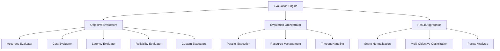

# DSPEx Automatic Evaluation and Selection System

## Overview

This document details the comprehensive automatic evaluation and selection system for DSPEx variable configurations. The system addresses the core challenge of intelligently discovering optimal configurations across multiple dimensions (accuracy, cost, latency, reliability) while continuously learning and adapting to improve future selections.

## System Architecture

### 1. Multi-Dimensional Evaluation Engine



#### 1.1 Core Evaluation Framework

```elixir
defmodule DSPEx.Evaluation.Engine do
  @moduledoc """
  Core evaluation engine for multi-dimensional assessment of variable configurations
  """

  defstruct [
    :evaluators,              # Map of objective => evaluator module
    :evaluation_cache,        # Cache for expensive evaluations
    :resource_manager,        # Resource allocation and management
    :result_aggregator,       # Multi-objective result aggregation
    :learning_system         # Continuous learning from evaluations
  ]

  @default_evaluators %{
    accuracy: DSPEx.Evaluation.AccuracyEvaluator,
    cost: DSPEx.Evaluation.CostEvaluator,
    latency: DSPEx.Evaluation.LatencyEvaluator,
    reliability: DSPEx.Evaluation.ReliabilityEvaluator,
    interpretability: DSPEx.Evaluation.InterpretabilityEvaluator,
    robustness: DSPEx.Evaluation.RobustnessEvaluator
  }

  def new(opts \\ []) do
    evaluators = Keyword.get(opts, :evaluators, @default_evaluators)
    
    %__MODULE__{
      evaluators: evaluators,
      evaluation_cache: DSPEx.Evaluation.Cache.new(opts),
      resource_manager: DSPEx.Evaluation.ResourceManager.new(opts),
      result_aggregator: DSPEx.Evaluation.ResultAggregator.new(opts),
      learning_system: DSPEx.Evaluation.LearningSystem.new(opts)
    }
  end

  def evaluate_configurations(engine, configurations, program, training_data, metric_fn, opts \\ []) do
    objectives = Keyword.get(opts, :objectives, Map.keys(engine.evaluators))
    
    # Parallel evaluation of all configurations
    evaluated_configs = 
      configurations
      |> DSPEx.Evaluation.ParallelExecutor.evaluate_parallel(fn config ->
        evaluate_single_configuration(engine, config, program, training_data, metric_fn, objectives, opts)
      end, opts)
    
    # Aggregate and analyze results
    aggregated_results = engine.result_aggregator.aggregate_results(evaluated_configs, opts)
    
    # Update learning system
    engine.learning_system.update_from_evaluations(evaluated_configs)
    
    aggregated_results
  end

  defp evaluate_single_configuration(engine, config, program, training_data, metric_fn, objectives, opts) do
    # Check cache first
    cache_key = generate_cache_key(config, program, objectives)
    
    case DSPEx.Evaluation.Cache.get(engine.evaluation_cache, cache_key) do
      {:hit, cached_result} -> 
        cached_result
      
      :miss ->
        # Perform evaluation
        result = perform_configuration_evaluation(engine, config, program, training_data, metric_fn, objectives, opts)
        
        # Cache result
        DSPEx.Evaluation.Cache.put(engine.evaluation_cache, cache_key, result)
        
        result
    end
  end

  defp perform_configuration_evaluation(engine, config, program, training_data, metric_fn, objectives, opts) do
    # Apply configuration to program
    configured_program = DSPEx.Variable.ConfigurationManager.apply_variable_configuration(program, config)
    
    # Evaluate each objective
    objective_results = 
      objectives
      |> Task.async_stream(fn objective ->
        evaluator = engine.evaluators[objective]
        
        result = evaluator.evaluate(configured_program, training_data, metric_fn, opts)
        {objective, result}
      end, max_concurrency: 4, timeout: 30_000)
      |> Enum.into(%{}, fn {:ok, {obj, result}} -> {obj, result} end)
    
    # Calculate metadata
    evaluation_metadata = extract_evaluation_metadata(configured_program, objective_results)
    
    %{
      configuration: config,
      objective_scores: objective_results,
      metadata: evaluation_metadata,
      timestamp: System.system_time(:second)
    }
  end
end
```

### 2. Specialized Evaluators

#### 2.1 Accuracy Evaluator

```elixir
defmodule DSPEx.Evaluation.AccuracyEvaluator do
  @moduledoc """
  Comprehensive accuracy evaluation with statistical analysis
  """

  @behaviour DSPEx.Evaluation.Evaluator

  def evaluate(program, training_data, metric_fn, opts \\ []) do
    sample_strategy = Keyword.get(opts, :accuracy_sampling, :stratified)
    sample_size = determine_sample_size(training_data, opts)
    confidence_level = Keyword.get(opts, :confidence_level, 0.95)
    
    # Sample data according to strategy
    sample_data = sample_training_data(training_data, sample_size, sample_strategy)
    
    # Perform evaluations with error handling
    evaluation_results = 
      sample_data
      |> Enum.map(fn example ->
        evaluate_single_example(program, example, metric_fn)
      end)
    
    # Calculate accuracy statistics
    successful_evaluations = Enum.filter(evaluation_results, fn result -> result.status == :success end)
    
    if length(successful_evaluations) == 0 do
      %{score: 0.0, confidence_interval: {0.0, 0.0}, error_rate: 1.0, metadata: %{error: :all_evaluations_failed}}
    else
      scores = Enum.map(successful_evaluations, fn result -> result.score end)
      
      %{
        score: Enum.sum(scores) / length(scores),
        confidence_interval: calculate_confidence_interval(scores, confidence_level),
        error_rate: (length(evaluation_results) - length(successful_evaluations)) / length(evaluation_results),
        sample_size: length(evaluation_results),
        variance: calculate_variance(scores),
        metadata: %{
          evaluation_count: length(evaluation_results),
          success_count: length(successful_evaluations),
          sample_strategy: sample_strategy
        }
      }
    end
  end

  defp evaluate_single_example(program, example, metric_fn) do
    try do
      start_time = System.monotonic_time(:microsecond)
      output = program.forward(example.inputs)
      end_time = System.monotonic_time(:microsecond)
      
      score = metric_fn.(output, example.outputs)
      
      %{
        status: :success,
        score: score,
        latency_microseconds: end_time - start_time,
        output: output
      }
    rescue
      error ->
        %{
          status: :error,
          error: error,
          score: 0.0
        }
    end
  end

  defp sample_training_data(training_data, sample_size, :random) do
    Enum.take_random(training_data, sample_size)
  end

  defp sample_training_data(training_data, sample_size, :stratified) do
    # Implement stratified sampling if training data has labels/categories
    # For now, fall back to random sampling
    Enum.take_random(training_data, sample_size)
  end

  defp calculate_confidence_interval(scores, confidence_level) do
    n = length(scores)
    mean = Enum.sum(scores) / n
    std_dev = :math.sqrt(calculate_variance(scores))
    
    # Use t-distribution for small samples
    t_value = get_t_value(confidence_level, n - 1)
    margin_of_error = t_value * std_dev / :math.sqrt(n)
    
    {mean - margin_of_error, mean + margin_of_error}
  end

  defp calculate_variance(scores) do
    n = length(scores)
    mean = Enum.sum(scores) / n
    
    sum_squared_diffs = 
      scores
      |> Enum.map(fn score -> :math.pow(score - mean, 2) end)
      |> Enum.sum()
    
    sum_squared_diffs / (n - 1)
  end
end
```

#### 2.2 Cost Evaluator

```elixir
defmodule DSPEx.Evaluation.CostEvaluator do
  @moduledoc """
  Comprehensive cost evaluation including token usage, API costs, and computational resources
  """

  @behaviour DSPEx.Evaluation.Evaluator

  # Cost per 1K tokens for different models (as of 2024)
  @model_costs %{
    "gpt-4" => %{input: 0.03, output: 0.06},
    "gpt-3.5-turbo" => %{input: 0.001, output: 0.002},
    "claude-3-opus" => %{input: 0.015, output: 0.075},
    "claude-3-sonnet" => %{input: 0.003, output: 0.015},
    "gemini-pro" => %{input: 0.00025, output: 0.0005}
  }

  def evaluate(program, training_data, _metric_fn, opts \\ []) do
    sample_size = Keyword.get(opts, :cost_sample_size, 3)
    sample_data = Enum.take_random(training_data, sample_size)
    
    # Evaluate cost components
    cost_breakdown = 
      sample_data
      |> Enum.map(fn example ->
        evaluate_example_cost(program, example, opts)
      end)
    
    # Calculate average costs
    avg_token_cost = calculate_average_token_cost(cost_breakdown)
    avg_computational_cost = calculate_average_computational_cost(cost_breakdown)
    avg_latency_cost = calculate_average_latency_cost(cost_breakdown)
    
    total_avg_cost = avg_token_cost + avg_computational_cost + avg_latency_cost
    
    %{
      score: 1.0 / (total_avg_cost + 0.001),  # Higher score = lower cost
      cost_breakdown: %{
        token_cost: avg_token_cost,
        computational_cost: avg_computational_cost,
        latency_cost: avg_latency_cost,
        total_cost: total_avg_cost
      },
      cost_per_example: total_avg_cost,
      metadata: %{
        sample_size: sample_size,
        model: get_program_model(program),
        provider: get_program_provider(program)
      }
    }
  end

  defp evaluate_example_cost(program, example, opts) do
    model = get_program_model(program)
    provider = get_program_provider(program)
    
    # Estimate token usage
    input_tokens = estimate_input_tokens(program, example.inputs)
    output_tokens = estimate_output_tokens(program, example.inputs)
    
    # Calculate token costs
    token_cost = calculate_token_cost(model, input_tokens, output_tokens)
    
    # Estimate computational cost (for local processing, tool calling, etc.)
    computational_cost = estimate_computational_cost(program, example)
    
    # Estimate latency cost (opportunity cost of waiting)
    latency_cost = estimate_latency_cost(program, example, opts)
    
    %{
      token_cost: token_cost,
      computational_cost: computational_cost,
      latency_cost: latency_cost,
      input_tokens: input_tokens,
      output_tokens: output_tokens
    }
  end

  defp calculate_token_cost(model, input_tokens, output_tokens) do
    case @model_costs[model] do
      nil -> 0.01  # Default cost for unknown models
      costs ->
        (input_tokens / 1000.0 * costs.input) + (output_tokens / 1000.0 * costs.output)
    end
  end

  defp estimate_input_tokens(program, inputs) do
    # Rough estimation based on signature and inputs
    signature_tokens = estimate_signature_tokens(program.signature)
    input_content_tokens = estimate_content_tokens(inputs)
    
    signature_tokens + input_content_tokens
  end

  defp estimate_output_tokens(program, inputs) do
    # Estimate based on expected output complexity
    output_fields = program.signature.outputs
    base_tokens = map_size(output_fields) * 10  # Base tokens per field
    
    # Adjust based on reasoning strategy
    reasoning_multiplier = case get_program_reasoning_strategy(program) do
      :predict -> 1.0
      :chain_of_thought -> 3.0
      :program_of_thought -> 5.0
      :react -> 7.0
      _ -> 2.0
    end
    
    round(base_tokens * reasoning_multiplier)
  end
end
```

#### 2.3 Reliability Evaluator

```elixir
defmodule DSPEx.Evaluation.ReliabilityEvaluator do
  @moduledoc """
  Evaluates configuration reliability through stress testing and error analysis
  """

  @behaviour DSPEx.Evaluation.Evaluator

  def evaluate(program, training_data, metric_fn, opts \\ []) do
    reliability_tests = [
      {:consistency_test, &run_consistency_test/4},
      {:stress_test, &run_stress_test/4},
      {:error_recovery_test, &run_error_recovery_test/4},
      {:edge_case_test, &run_edge_case_test/4}
    ]
    
    test_results = 
      reliability_tests
      |> Enum.map(fn {test_name, test_fn} ->
        result = test_fn.(program, training_data, metric_fn, opts)
        {test_name, result}
      end)
      |> Map.new()
    
    # Calculate overall reliability score
    overall_score = calculate_reliability_score(test_results)
    
    %{
      score: overall_score,
      test_results: test_results,
      metadata: %{
        tests_run: Map.keys(test_results),
        evaluation_timestamp: System.system_time(:second)
      }
    }
  end

  defp run_consistency_test(program, training_data, metric_fn, opts) do
    # Test consistency across multiple runs
    consistency_runs = Keyword.get(opts, :consistency_runs, 3)
    sample_size = min(5, length(training_data))
    sample_data = Enum.take_random(training_data, sample_size)
    
    run_results = 
      1..consistency_runs
      |> Enum.map(fn _ ->
        Enum.map(sample_data, fn example ->
          try do
            output = program.forward(example.inputs)
            score = metric_fn.(output, example.outputs)
            {:ok, score}
          rescue
            error -> {:error, error}
          end
        end)
      end)
    
    # Calculate consistency metrics
    successful_runs = Enum.filter(run_results, fn run ->
      Enum.all?(run, fn result -> match?({:ok, _}, result) end)
    end)
    
    if length(successful_runs) >= 2 do
      score_sets = 
        successful_runs
        |> Enum.map(fn run ->
          Enum.map(run, fn {:ok, score} -> score end)
        end)
      
      consistency_variance = calculate_cross_run_variance(score_sets)
      
      %{
        success_rate: length(successful_runs) / consistency_runs,
        consistency_variance: consistency_variance,
        score: 1.0 / (1.0 + consistency_variance)  # Lower variance = higher score
      }
    else
      %{
        success_rate: 0.0,
        consistency_variance: :undefined,
        score: 0.0
      }
    end
  end

  defp run_stress_test(program, training_data, metric_fn, opts) do
    # Test under various stress conditions
    stress_conditions = [
      {:high_concurrency, fn -> test_concurrent_execution(program, training_data, metric_fn, 10) end},
      {:memory_pressure, fn -> test_memory_pressure(program, training_data, metric_fn) end},
      {:timeout_pressure, fn -> test_timeout_handling(program, training_data, metric_fn) end}
    ]
    
    stress_results = 
      stress_conditions
      |> Enum.map(fn {condition, test_fn} ->
        result = test_fn.()
        {condition, result}
      end)
      |> Map.new()
    
    # Calculate stress score
    stress_scores = Enum.map(stress_results, fn {_, result} -> result.score end)
    average_stress_score = Enum.sum(stress_scores) / length(stress_scores)
    
    %{
      score: average_stress_score,
      stress_results: stress_results
    }
  end

  defp test_concurrent_execution(program, training_data, metric_fn, concurrency_level) do
    sample_data = Enum.take_random(training_data, concurrency_level)
    
    # Run concurrent evaluations
    start_time = System.monotonic_time(:millisecond)
    
    results = 
      sample_data
      |> Task.async_stream(fn example ->
        try do
          output = program.forward(example.inputs)
          score = metric_fn.(output, example.outputs)
          {:ok, score}
        rescue
          error -> {:error, error}
        end
      end, max_concurrency: concurrency_level, timeout: 30_000)
      |> Enum.to_list()
    
    end_time = System.monotonic_time(:millisecond)
    
    successful_results = Enum.count(results, fn {:ok, {:ok, _}} -> true; _ -> false end)
    success_rate = successful_results / length(results)
    
    %{
      score: success_rate,
      success_rate: success_rate,
      total_time_ms: end_time - start_time,
      concurrency_level: concurrency_level
    }
  end
end
```

### 3. Intelligent Selection System

#### 3.1 Multi-Objective Selection Engine

```elixir
defmodule DSPEx.Selection.MultiObjective do
  @moduledoc """
  Advanced multi-objective selection using Pareto optimization and preference learning
  """

  defstruct [
    :pareto_analyzer,         # Pareto frontier analysis
    :preference_learner,      # User preference learning
    :selection_strategies,    # Different selection strategies
    :decision_history        # History for continuous improvement
  ]

  def new(opts \\ []) do
    %__MODULE__{
      pareto_analyzer: DSPEx.Selection.ParetoAnalyzer.new(opts),
      preference_learner: DSPEx.Selection.PreferenceLearner.new(opts),
      selection_strategies: get_selection_strategies(opts),
      decision_history: []
    }
  end

  def select_optimal_configuration(selector, evaluated_configs, user_preferences \\ %{}, opts \\ []) do
    # Perform Pareto analysis
    pareto_results = selector.pareto_analyzer.analyze(evaluated_configs)
    
    # Apply user preferences if available
    preference_filtered = if map_size(user_preferences) > 0 do
      selector.preference_learner.apply_preferences(pareto_results, user_preferences)
    else
      pareto_results
    end
    
    # Select based on strategy
    selection_strategy = Keyword.get(opts, :selection_strategy, :balanced)
    selected_config = apply_selection_strategy(selection_strategy, preference_filtered, opts)
    
    # Update decision history
    decision_record = %{
      selected_configuration: selected_config,
      alternatives: preference_filtered,
      user_preferences: user_preferences,
      selection_strategy: selection_strategy,
      timestamp: System.system_time(:second)
    }
    
    updated_selector = %{selector | decision_history: [decision_record | selector.decision_history]}
    
    {selected_config, updated_selector}
  end

  defp apply_selection_strategy(:pareto_optimal, configs, _opts) do
    # Select from Pareto frontier
    pareto_optimal = Enum.filter(configs, fn config -> config.pareto_rank == 1 end)
    
    if length(pareto_optimal) == 1 do
      List.first(pareto_optimal)
    else
      # Among Pareto optimal, select based on balanced scoring
      Enum.max_by(pareto_optimal, fn config -> calculate_balanced_score(config) end)
    end
  end

  defp apply_selection_strategy(:balanced, configs, _opts) do
    # Balanced selection considering all objectives equally
    Enum.max_by(configs, fn config -> calculate_balanced_score(config) end)
  end

  defp apply_selection_strategy(:accuracy_focused, configs, _opts) do
    # Prioritize accuracy over other objectives
    Enum.max_by(configs, fn config -> 
      config.objective_scores[:accuracy] * 0.7 + calculate_balanced_score(config) * 0.3
    end)
  end

  defp apply_selection_strategy(:cost_focused, configs, _opts) do
    # Prioritize cost efficiency
    Enum.max_by(configs, fn config ->
      config.objective_scores[:cost] * 0.7 + calculate_balanced_score(config) * 0.3
    end)
  end

  defp apply_selection_strategy(:custom, configs, opts) do
    # Use custom selection function
    selection_fn = Keyword.get(opts, :custom_selection_fn)
    selection_fn.(configs)
  end

  defp calculate_balanced_score(config) do
    objectives = config.objective_scores
    objective_count = map_size(objectives)
    
    if objective_count == 0 do
      0.0
    else
      Enum.sum(Map.values(objectives)) / objective_count
    end
  end
end
```

#### 3.2 Pareto Analysis Engine

```elixir
defmodule DSPEx.Selection.ParetoAnalyzer do
  @moduledoc """
  Pareto frontier analysis for multi-objective optimization
  """

  def new(_opts \\ []) do
    %{
      dominance_cache: :ets.new(:dominance_cache, [:set, :public])
    }
  end

  def analyze(analyzer, evaluated_configs) do
    # Calculate Pareto dominance relationships
    configs_with_dominance = calculate_pareto_ranks(evaluated_configs)
    
    # Identify Pareto frontier
    pareto_frontier = Enum.filter(configs_with_dominance, fn config -> config.pareto_rank == 1 end)
    
    # Calculate additional Pareto metrics
    configs_with_metrics = Enum.map(configs_with_dominance, fn config ->
      Map.merge(config, %{
        dominance_count: count_dominated_solutions(config, evaluated_configs),
        crowding_distance: calculate_crowding_distance(config, configs_with_dominance)
      })
    end)
    
    %{
      configurations: configs_with_metrics,
      pareto_frontier: pareto_frontier,
      pareto_metrics: calculate_pareto_metrics(configs_with_metrics)
    }
  end

  defp calculate_pareto_ranks(configs) do
    # Implement fast non-dominated sorting algorithm (NSGA-II style)
    n = length(configs)
    
    # Initialize dominance data
    dominance_data = 
      configs
      |> Enum.with_index()
      |> Enum.map(fn {config, index} ->
        {index, %{
          config: config,
          dominated_by: [],
          dominates: [],
          domination_count: 0
        }}
      end)
      |> Map.new()
    
    # Calculate dominance relationships
    for i <- 0..(n-1), j <- (i+1)..(n-1) do
      config_i = dominance_data[i].config
      config_j = dominance_data[j].config
      
      case compare_dominance(config_i, config_j) do
        :i_dominates_j ->
          dominance_data = update_dominance(dominance_data, i, j)
        :j_dominates_i ->
          dominance_data = update_dominance(dominance_data, j, i)
        :non_dominated ->
          # No dominance relationship
          dominance_data
      end
    end
    
    # Assign Pareto ranks
    assign_pareto_ranks(dominance_data)
  end

  defp compare_dominance(config_a, config_b) do
    objectives_a = config_a.objective_scores
    objectives_b = config_b.objective_scores
    
    # Compare each objective (assuming higher is better for all)
    comparisons = 
      Map.keys(objectives_a)
      |> Enum.map(fn objective ->
        score_a = objectives_a[objective]
        score_b = objectives_b[objective]
        
        cond do
          score_a > score_b -> :a_better
          score_b > score_a -> :b_better
          true -> :equal
        end
      end)
    
    a_better_count = Enum.count(comparisons, fn comp -> comp == :a_better end)
    b_better_count = Enum.count(comparisons, fn comp -> comp == :b_better end)
    equal_count = Enum.count(comparisons, fn comp -> comp == :equal end)
    
    cond do
      a_better_count > 0 and b_better_count == 0 -> :i_dominates_j
      b_better_count > 0 and a_better_count == 0 -> :j_dominates_i
      true -> :non_dominated
    end
  end

  defp calculate_crowding_distance(config, all_configs) do
    # Calculate crowding distance for diversity preservation
    objectives = Map.keys(config.objective_scores)
    
    objective_distances = 
      objectives
      |> Enum.map(fn objective ->
        calculate_objective_crowding_distance(config, all_configs, objective)
      end)
    
    Enum.sum(objective_distances)
  end

  defp calculate_objective_crowding_distance(config, all_configs, objective) do
    # Sort configs by this objective value
    sorted_configs = Enum.sort_by(all_configs, fn c -> c.objective_scores[objective] end)
    
    # Find position of current config
    config_index = Enum.find_index(sorted_configs, fn c -> c == config end)
    
    cond do
      config_index == 0 or config_index == length(sorted_configs) - 1 ->
        # Boundary solutions get infinite distance (represented as large number)
        1000.0
      
      true ->
        # Calculate distance to neighbors
        prev_score = Enum.at(sorted_configs, config_index - 1).objective_scores[objective]
        next_score = Enum.at(sorted_configs, config_index + 1).objective_scores[objective]
        objective_range = get_objective_range(sorted_configs, objective)
        
        if objective_range > 0 do
          (next_score - prev_score) / objective_range
        else
          0.0
        end
    end
  end
end
```

### 4. Continuous Learning System

#### 4.1 Performance Prediction Model

```elixir
defmodule DSPEx.Learning.PerformancePrediction do
  @moduledoc """
  Machine learning system to predict configuration performance based on historical data
  """

  defstruct [
    :feature_extractors,      # Feature extraction functions
    :prediction_models,       # ML models for each objective
    :training_data,          # Historical evaluation data
    :model_performance,      # Model accuracy tracking
    :update_scheduler       # Automatic model retraining
  ]

  def new(opts \\ []) do
    %__MODULE__{
      feature_extractors: get_feature_extractors(opts),
      prediction_models: initialize_prediction_models(opts),
      training_data: [],
      model_performance: %{},
      update_scheduler: initialize_update_scheduler(opts)
    }
  end

  def predict_configuration_performance(learner, configuration, program_context) do
    # Extract features from configuration and context
    features = extract_features(learner, configuration, program_context)
    
    # Make predictions for each objective
    predictions = 
      learner.prediction_models
      |> Enum.map(fn {objective, model} ->
        prediction = make_prediction(model, features)
        {objective, prediction}
      end)
      |> Map.new()
    
    # Calculate confidence intervals
    confidence_intervals = calculate_prediction_confidence(learner, features, predictions)
    
    %{
      predictions: predictions,
      confidence_intervals: confidence_intervals,
      feature_importance: calculate_feature_importance(learner, features),
      model_confidence: get_model_confidence(learner, features)
    }
  end

  def update_from_evaluation(learner, configuration, program_context, actual_results) do
    # Extract features
    features = extract_features(learner, configuration, program_context)
    
    # Create training example
    training_example = %{
      features: features,
      targets: actual_results.objective_scores,
      configuration: configuration,
      context: program_context,
      timestamp: System.system_time(:second)
    }
    
    # Add to training data
    updated_training_data = [training_example | learner.training_data]
    
    # Check if model retraining is needed
    updated_learner = %{learner | training_data: updated_training_data}
    
    if should_retrain_models?(updated_learner) do
      retrain_models(updated_learner)
    else
      updated_learner
    end
  end

  defp extract_features(learner, configuration, program_context) do
    # Apply all feature extractors
    learner.feature_extractors
    |> Enum.flat_map(fn extractor ->
      extractor.(configuration, program_context)
    end)
    |> Enum.into(%{})
  end

  defp get_feature_extractors(_opts) do
    [
      &extract_configuration_features/2,
      &extract_program_features/2,
      &extract_task_features/2,
      &extract_interaction_features/2
    ]
  end

  defp extract_configuration_features(configuration, _context) do
    [
      # Variable type distributions
      variable_type_counts: count_variable_types(configuration),
      
      # Module selections
      selected_adapter: get_selected_module(configuration, :adapter),
      selected_reasoning: get_selected_module(configuration, :reasoning_module),
      
      # Parameter values
      temperature: Map.get(configuration, :temperature, 0.7),
      max_tokens: Map.get(configuration, :max_tokens, 1000),
      
      # Configuration complexity
      config_complexity: calculate_configuration_complexity(configuration)
    ]
  end

  defp extract_program_features(_configuration, program_context) do
    [
      # Signature complexity
      input_field_count: count_signature_fields(program_context.signature.inputs),
      output_field_count: count_signature_fields(program_context.signature.outputs),
      
      # Field types
      field_type_distribution: analyze_field_types(program_context.signature),
      
      # Program type
      program_type: infer_program_type(program_context)
    ]
  end

  defp extract_task_features(_configuration, program_context) do
    [
      # Task characteristics inferred from training data
      task_complexity: estimate_task_complexity(program_context.training_data),
      domain: infer_task_domain(program_context),
      
      # Data characteristics
      training_data_size: length(program_context.training_data || []),
      input_diversity: calculate_input_diversity(program_context.training_data),
      
      # Performance requirements
      latency_sensitive: is_latency_sensitive?(program_context),
      cost_sensitive: is_cost_sensitive?(program_context)
    ]
  end
end
```

#### 4.2 Adaptive Selection Strategy

```elixir
defmodule DSPEx.Learning.AdaptiveStrategy do
  @moduledoc """
  Adaptive selection strategy that learns from user feedback and performance outcomes
  """

  defstruct [
    :user_preference_model,   # Model of user preferences
    :performance_history,     # History of configuration performances
    :adaptation_rules,        # Rules for strategy adaptation
    :feedback_processor      # User feedback processing
  ]

  def new(opts \\ []) do
    %__MODULE__{
      user_preference_model: initialize_preference_model(opts),
      performance_history: [],
      adaptation_rules: get_adaptation_rules(opts),
      feedback_processor: DSPEx.Learning.FeedbackProcessor.new(opts)
    }
  end

  def adapt_selection_strategy(adaptive_strategy, evaluation_results, user_feedback \\ nil) do
    # Process user feedback if available
    updated_strategy = if user_feedback do
      process_user_feedback(adaptive_strategy, evaluation_results, user_feedback)
    else
      adaptive_strategy
    end
    
    # Update performance history
    updated_strategy = update_performance_history(updated_strategy, evaluation_results)
    
    # Apply adaptation rules
    apply_adaptation_rules(updated_strategy)
  end

  defp process_user_feedback(strategy, evaluation_results, feedback) do
    # Update user preference model
    updated_preference_model = 
      strategy.feedback_processor.process_feedback(
        strategy.user_preference_model,
        evaluation_results,
        feedback
      )
    
    %{strategy | user_preference_model: updated_preference_model}
  end

  defp update_performance_history(strategy, evaluation_results) do
    # Add new performance data
    performance_entry = %{
      results: evaluation_results,
      timestamp: System.system_time(:second),
      context: extract_context_info(evaluation_results)
    }
    
    # Keep limited history to prevent unbounded growth
    max_history = 1000
    updated_history = [performance_entry | strategy.performance_history]
      |> Enum.take(max_history)
    
    %{strategy | performance_history: updated_history}
  end

  defp apply_adaptation_rules(strategy) do
    # Apply each adaptation rule
    strategy.adaptation_rules
    |> Enum.reduce(strategy, fn rule, acc_strategy ->
      rule.(acc_strategy)
    end)
  end

  defp get_adaptation_rules(_opts) do
    [
      &adapt_to_performance_trends/1,
      &adapt_to_user_patterns/1,
      &adapt_to_domain_specifics/1,
      &adapt_to_resource_constraints/1
    ]
  end

  defp adapt_to_performance_trends(strategy) do
    recent_performance = Enum.take(strategy.performance_history, 10)
    
    if length(recent_performance) >= 5 do
      # Analyze trends in recent performance
      accuracy_trend = analyze_objective_trend(recent_performance, :accuracy)
      cost_trend = analyze_objective_trend(recent_performance, :cost)
      
      # Adjust strategy based on trends
      cond do
        accuracy_trend == :declining ->
          # Increase focus on accuracy
          increase_objective_weight(strategy, :accuracy, 0.1)
          
        cost_trend == :increasing ->
          # Increase focus on cost efficiency
          increase_objective_weight(strategy, :cost, 0.1)
          
        true ->
          strategy
      end
    else
      strategy
    end
  end
end
```

### 5. Integration and Usage Examples

#### 5.1 Complete Evaluation Pipeline

```elixir
defmodule DSPEx.AutoEvaluation.Pipeline do
  @moduledoc """
  Complete pipeline for automatic evaluation and selection
  """

  def run_complete_evaluation(program, training_data, metric_fn, opts \\ []) do
    # Initialize evaluation engine
    evaluation_engine = DSPEx.Evaluation.Engine.new(opts)
    
    # Initialize selection system
    selection_system = DSPEx.Selection.MultiObjective.new(opts)
    
    # Initialize learning system
    learning_system = DSPEx.Learning.AdaptiveStrategy.new(opts)
    
    # Generate candidate configurations
    configurations = generate_candidate_configurations(program, opts)
    
    # Evaluate all configurations
    evaluation_results = DSPEx.Evaluation.Engine.evaluate_configurations(
      evaluation_engine,
      configurations,
      program,
      training_data,
      metric_fn,
      opts
    )
    
    # Select optimal configuration
    {selected_config, updated_selection_system} = 
      DSPEx.Selection.MultiObjective.select_optimal_configuration(
        selection_system,
        evaluation_results,
        Keyword.get(opts, :user_preferences, %{}),
        opts
      )
    
    # Update learning system
    updated_learning_system = DSPEx.Learning.AdaptiveStrategy.adapt_selection_strategy(
      learning_system,
      evaluation_results
    )
    
    # Apply selected configuration
    optimized_program = DSPEx.Variable.ConfigurationManager.apply_variable_configuration(
      program,
      selected_config.configuration
    )
    
    {:ok, optimized_program, %{
      selected_configuration: selected_config,
      all_evaluations: evaluation_results,
      selection_system: updated_selection_system,
      learning_system: updated_learning_system
    }}
  end

  defp generate_candidate_configurations(program, opts) do
    variable_space = program.variable_space()
    
    # Use multiple generation strategies
    systematic_configs = generate_systematic_configurations(variable_space, opts)
    random_configs = generate_random_configurations(variable_space, opts)
    learned_configs = generate_learned_configurations(variable_space, opts)
    
    (systematic_configs ++ random_configs ++ learned_configs)
    |> Enum.uniq()
    |> Enum.take(Keyword.get(opts, :max_configurations, 20))
  end
end
```

## Usage Examples

### Basic Usage

```elixir
# Simple automatic evaluation and selection
program = DSPEx.Predict.new(MySignature)
  |> DSPEx.Variable.define(:adapter, choices: [:json_tool, :markdown_tool])
  |> DSPEx.Variable.define(:reasoning, choices: [:predict, :chain_of_thought])

{:ok, optimized_program, results} = DSPEx.AutoEvaluation.Pipeline.run_complete_evaluation(
  program,
  training_data,
  &my_metric_function/2
)

IO.inspect(results.selected_configuration)
```

### Advanced Multi-Objective Optimization

```elixir
# Multi-objective optimization with custom preferences
{:ok, optimized_program, results} = DSPEx.AutoEvaluation.Pipeline.run_complete_evaluation(
  program,
  training_data,
  &my_metric_function/2,
  objectives: [:accuracy, :cost, :latency, :reliability],
  user_preferences: %{
    accuracy: %{weight: 0.4, minimum: 0.8},
    cost: %{weight: 0.3, maximum: 0.05},
    latency: %{weight: 0.2, maximum: 2000},
    reliability: %{weight: 0.1, minimum: 0.9}
  },
  selection_strategy: :pareto_optimal
)
```

<function_calls>
<invoke name="TodoWrite">
<parameter name="todos">[{"id": "design_variable_abstraction", "content": "Design DSPEx.Variable abstraction for decoupled parameter optimization", "status": "completed", "priority": "high"}, {"id": "create_adapter_selection_framework", "content": "Design framework for automatic adapter/module selection (JSON vs MD, Predict vs CoT vs PoT)", "status": "completed", "priority": "high"}, {"id": "create_optimizer_integration_plan", "content": "Design how all optimizers can tune all discrete parameters automatically", "status": "completed", "priority": "high"}, {"id": "document_technical_architecture", "content": "Create comprehensive technical documentation for the Variable-based optimization system", "status": "completed", "priority": "medium"}, {"id": "design_evaluation_framework", "content": "Design automatic evaluation and selection system for different configurations", "status": "completed", "priority": "medium"}]