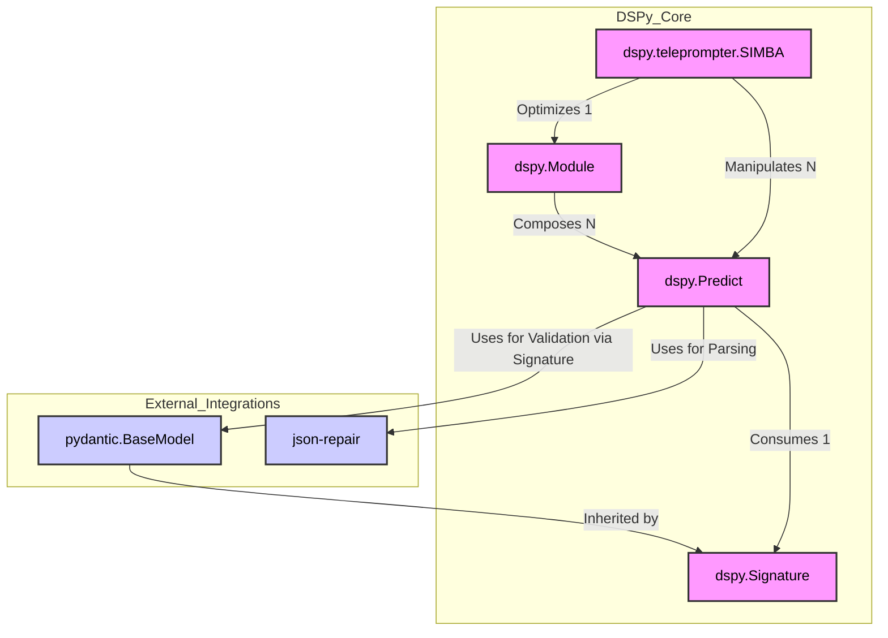
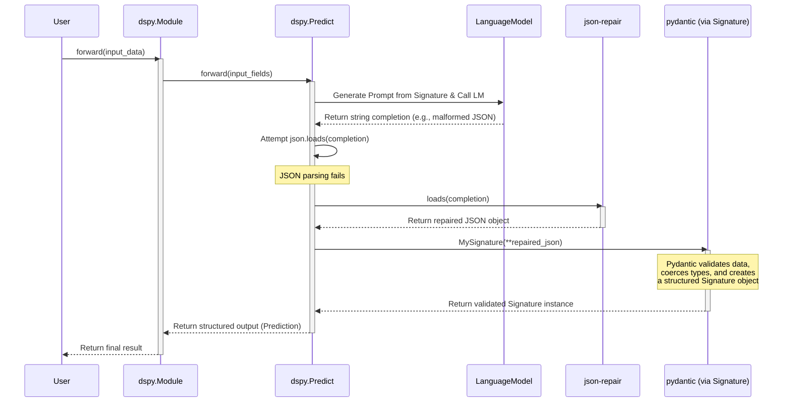
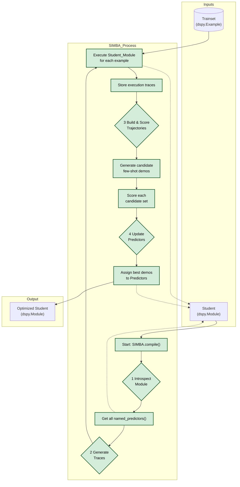

Of course. Here is a comprehensive technical document and a series of Mermaid diagrams breaking down the major components of the DSPy codebase, focusing on their integration and coupling as requested.

---

## DSPy Core Component Integration Analysis

**Version:** DSPy `v2.4.3` (as of mid-2024)
**Scope:** This document analyzes the core architectural components of DSPy, focusing on `Signature`, `Module`, `Predict`, and the `SIMBA` teleprompter. It specifically details the integration of `pydantic` and `json-repair` and intentionally excludes the `dspy.retrieve` module.

### 1. Overview

DSPy (Declarative Self-improving Language Programs) is a framework for programming—not just prompting—language models (LMs). Its architecture is designed around a few key abstractions that allow for the composition, evaluation, and optimization of complex LM-based pipelines. Understanding the coupling between these components is crucial for extending the framework or debugging its behavior.

This analysis will proceed by defining each core component and then illustrating its connections to others, both internal and external.

### 2. Core Components & External Integrations

#### 2.1. Core DSPy Components

*   **`dspy.Signature`**: The foundational I/O contract. It declaratively defines the inputs and outputs of a single LM call, including their names, types, and descriptions. This is the schema for prompting.
*   **`dspy.Predict`**: The primary execution primitive. It is a stateful module that takes a `Signature`, connects to a configured Language Model (LM), and handles the logic of generating a prompt, making the API call, and parsing the output.
*   **`dspy.Module`**: The compositional unit. Analogous to a `torch.nn.Module`, a `dspy.Module` is a container for `dspy.Predict` modules and other `dspy.Module`s. It defines the control flow (the `forward` method) for how these primitives are chained together to solve a larger task.
*   **`dspy.teleprompter.SIMBA`**: A "Simple Instruction and Metaprompt-Based Optimizer". `SIMBA` is a teleprompter responsible for optimizing the prompts of a `dspy.Module`. Specifically, it finds the best few-shot demonstrations for each `Predict` module within a program by analyzing training data trajectories.

#### 2.2. Key External Integrations

*   **`pydantic`**: A data validation and settings management library using Python type annotations. In DSPy, it is critical for defining structured and typed signatures.
*   **`json-repair`**: A library to fix broken or malformed JSON. This is used as a fallback mechanism when an LM fails to produce perfectly structured JSON output.

### 3. Integration & Coupling Analysis

We will now examine how these components are coupled, starting from the most fundamental element, the `Signature`.

#### 3.1. `dspy.Signature`: The Pydantic Foundation

The `dspy.Signature` class is the most deeply integrated component with `pydantic`. The coupling is not merely compositional; it's structural.

*   **Inheritance:** `dspy.Signature` directly inherits from `pydantic.BaseModel`.
    ```python
    # dspy/signatures/signature.py
    class Signature(pydantic.BaseModel):
        ...
    ```
*   **Purpose:** This inheritance turns every Signature you define into a Pydantic model. This provides:
    1.  **Schema Definition:** The input and output fields (`dspy.InputField`, `dspy.OutputField`) are wrappers around Pydantic's `Field` factory, allowing for metadata like descriptions (`desc=...`).
    2.  **Instantiation & Validation:** When a `Predictor` parses an LM's output, it instantiates the Signature class with the parsed data (`MySignature(**parsed_json)`). Pydantic automatically handles the validation and type coercion.

**Summary of `pydantic` Integration in `Signature`:**
*   **Count:** 1 (Direct Inheritance)
*   **Degree:** **Very High (Structural Coupling)**. The entire functionality of a Signature is built upon Pydantic's data modeling capabilities.

---

#### 3.2. `dspy.Predict`: The Execution Engine

The `Predict` module is the bridge between the declarative `Signature` and the imperative action of calling an LM.

*   **Coupling with `dspy.Signature`**: A `Predict` module is initialized with a `Signature`. It consumes the signature to:
    1.  Generate the prompt structure.
    2.  Know which fields to expect in the LM's output.
    3.  **Validate the final output using the Signature's Pydantic model.**

*   **Coupling with `pydantic` and `json-repair`**: This coupling occurs during the output parsing phase of the `forward` method. When a `Predict` module receives a string completion from the LM, it must parse it into the structured format defined by the output fields of its signature.

    The typical flow, often handled by `dspy.utils.chatbot.parse_json_output`, is:
    1.  **Attempt Standard Parsing:** Try to parse the LM's string output using Python's built-in `json.loads()`.
    2.  **Fallback to `json-repair`:** If `json.loads()` fails (e.g., due to a trailing comma, missing bracket), it calls `json_repair.loads()`. This makes the parsing process more robust to common LM errors.
    3.  **Instantiate & Validate with `pydantic`:** Once a valid JSON object is obtained, it is passed as keyword arguments to the `Signature`'s constructor (e.g., `self.signature(**parsed_json)`). Pydantic then takes over, validating the data against the defined fields and types.

**Summary of Integrations in `Predict`:**
*   **`dspy.Signature`:** 1 (Composition). A `Predict` instance holds a reference to a `Signature` instance.
*   **`json-repair`:** 1 (Functional Call). Used as a fallback during output parsing.
*   **`pydantic`:** 1 (Functional Call). Used implicitly by instantiating the `Signature` class for output validation.
*   **Degree:** **High (Functional & Compositional Coupling)**. `Predict`'s core purpose is to execute a `Signature`, and its robustness depends directly on `json-repair` and `pydantic`.

---

#### 3.3. `dspy.Module`: The Compositional Layer

A `dspy.Module` orchestrates calls to its child components, which are typically `dspy.Predict` instances or other `dspy.Module`s.

*   **Coupling with `dspy.Predict`**: The primary relationship is composition. A `dspy.Module` (like `dspy.ChainOfThought`) declares `Predict` modules as class members in its `__init__` method.
    ```python
    # Example: dspy.ChainOfThought
    class ChainOfThought(dspy.Module):
        def __init__(self, signature):
            super().__init__()
            self.generate_rationale = dspy.Predict(RationaleSignature)
            self.generate_answer = dspy.Predict(signature)
    ```
*   In its `forward` method, the module defines the control flow by calling these predictors in sequence, often passing the output of one as the input to the next.
*   **Coupling with External Libraries**: A `dspy.Module` has **no direct coupling** with `pydantic` or `json-repair`. It delegates the responsibility of parsing and validation to its child `Predict` modules. This is a key design principle: separation of concerns. The `Module` handles logic and flow, while the `Predictor` handles interaction and parsing.

**Summary of Integrations in `Module`:**
*   **`dspy.Predict`:** N (Composition). A module can contain any number of predictors.
*   **Degree:** **Medium (Orchestration & Composition)**. The `Module` depends on the `Predict` interface but not its internal implementation details.

---

#### 3.4. `dspy.teleprompter.SIMBA`: The Optimizer

`SIMBA`'s role is to optimize a `dspy.Module` by finding effective few-shot demonstrations for its internal `Predict` modules.

*   **Coupling with `dspy.Module`**: `SIMBA.compile(student, ...)` takes a `student` module as its primary input. It interacts with the module in two ways:
    1.  **Introspection:** It calls `student.named_predictors()` to get a list of all `Predict` modules that need to be optimized.
    2.  **Execution:** It repeatedly calls the `student` module with different inputs from the `trainset` to generate "traces" or trajectories of execution.

*   **Coupling with `dspy.Predict`**: `SIMBA` directly manipulates the state of the `Predict` modules it finds. For each predictor, it generates and tests different sets of demonstrations, ultimately assigning the best-performing set to the predictor's `demos` attribute.

*   **Coupling with `dspy.Example`**: `SIMBA` heavily uses `dspy.Example` objects from the `trainset` both to run the student module and to select candidates for the few-shot demonstrations.

*   **Coupling with External Libraries**: Like `dspy.Module`, `SIMBA` has **no direct coupling** with `pydantic` or `json-repair`. It operates at a higher level of abstraction, treating the student module's execution as a black box that produces a result. The low-level parsing is handled within the `Predict` modules during these executions.

**Summary of Integrations in `SIMBA`:**
*   **`dspy.Module`:** 1 (Orchestration). It takes a module to compile.
*   **`dspy.Predict`:** N (Manipulation). It finds and updates all predictors within the target module.
*   **Degree:** **High (Orchestration & State Manipulation)**. `SIMBA`'s entire purpose is to introspect and modify the state of a `Module` and its child `Predictor`s.

### 4. Mermaid Diagrams

#### Diagram 1: High-Level Component Coupling

This diagram shows the primary relationships and dependencies between the core components.



---

#### Diagram 2: The Prediction Lifecycle (Focus on `pydantic` & `json-repair`)

This sequence diagram illustrates the detailed flow when a `dspy.Module`'s `forward` method is called, highlighting the exact points of integration.



#### Diagram 3: The `SIMBA` Optimization Lifecycle

This diagram shows how `SIMBA` orchestrates the optimization process, treating the student module as a black box for execution while directly manipulating its predictors.


